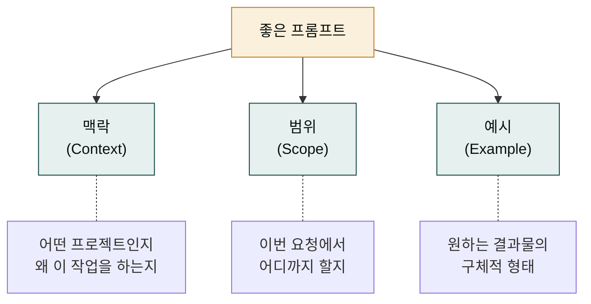
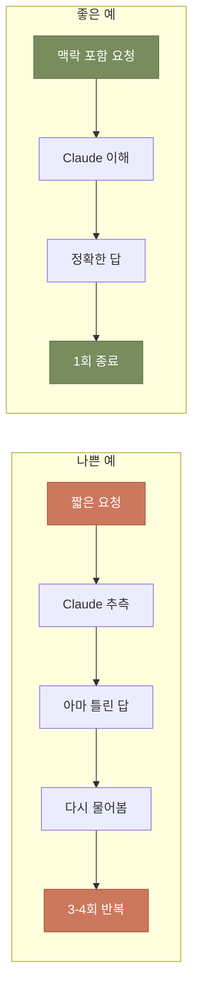
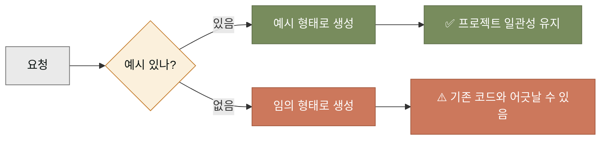
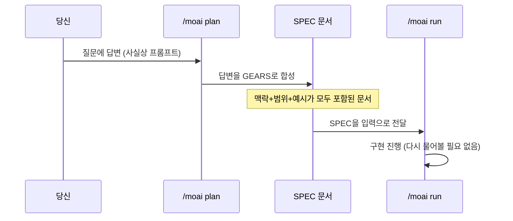

## 왜 '프롬프트 잘 쓰기'가 중요한가

같은 도구라도 누가 쓰느냐에 따라 결과가 다릅니다. Claude도 마찬가지입니다. 같은 코드베이스에서 같은 Claude를 써도, 어떤 사용자는 한 번에 원하는 결과를 받고 어떤 사용자는 서너 번 다시 묻습니다. 이 차이의 상당 부분은 '요청을 어떻게 썼는가'에서 옵니다.

데스크탑 앱에서는 잦은 대화를 주고받아도 괜찮습니다. 하지만 CLI에서 사이클을 돌릴 때는 한 번의 요청이 한 사이클의 입력이 됩니다. 요청이 모호하면 사이클 전체가 흔들립니다. 그래서 CLI 환경에서는 프롬프트의 품질이 더 중요합니다. 이 페이지는 그 품질을 올리는 세 가지 축을 다룹니다.

## 세 가지 축 — 맥락, 범위, 예시

좋은 프롬프트는 세 가지 요소로 이루어집니다. 이 중 하나라도 빠지면 Claude가 헤매게 됩니다.



- **맥락(Context)** — 이 작업이 왜 필요한지, 어떤 프로젝트의 일부인지. Claude는 맥락 없이는 '적당한' 답을 주지만, 맥락이 있으면 '맞는' 답을 줍니다.
- **범위(Scope)** — 이번 요청에서 어디까지 다룰지. "인증 기능 추가"는 너무 넓고, "로그인 함수의 비밀번호 검증 로직 추가"는 적당합니다.
- **예시(Example)** — 원하는 결과물의 형태. 입력-출력 예시, 비슷한 다른 함수의 이름, 테스트 케이스의 형태 등.

세 요소가 모두 들어가면 Claude가 "아, 이거군" 하고 한 번에 가는 경우가 많아집니다.

## 축 1 — 맥락 주기

Claude는 대화의 맥락을 기본적으로 유지합니다. 하지만 긴 세션에서는 맥락이 흐려질 수 있고, 새 세션에서는 맥락이 아예 없습니다. 명시적으로 맥락을 짚어주면 Claude가 헤매지 않습니다.

나쁜 예와 좋은 예를 비교해 봅시다.

```
# 나쁜 예 — 맥락 없음
> 사용자 입력을 검증하는 코드 짜줘

# 좋은 예 — 맥락 포함
> 우리 프로젝트 moai-first-cycle은 회원 가입 기능을 만들고 있어.
> 방금 SPEC-USER-001로 로그인 함수를 만들었는데, 그 앞단계인
> 회원 가입 입력 폼의 검증 로직이 필요해. 이메일 형식, 비밀번호
> 길이(8자 이상), 이름 길이(2-30자)를 검증해야 해.
```

좋은 예가 길어 보이지만, 한 번 쓰면 한 번에 갑니다. 나쁜 예는 짧지만 "이메일도요?", "비밀번호 제한은요?"처럼 여러 번 다시 묻게 만듭니다. 총 글자 수는 좋은 예가 더 적은 경우가 많습니다.



## 축 2 — 범위 한정

프롬프트가 넓으면 Claude도 넓게 대답합니다. "인증 기능 전체 만들어줘"라고 하면 여러 파일을 한 번에 고치려 합니다. 이것은 CLI 사이클에 부적합합니다. 사이클은 한 번에 하나의 SPEC, 하나의 마일스톤을 다루도록 설계되었기 때문입니다.

범위를 한정하는 표현을 씁시다.

- **"이번 요청에서는 X만, Y는 다음에"** — 명시적으로 이번에 할 것과 하지 않을 것을 나눕니다.
- **"처음에는 A 함수만, B는 이후에"** — 우선순위를 줍니다.
- **"테스트는 먼저 세 개만"** — 개수를 한정합니다.

```
> 로그인 함수를 만들어줘. 이번 요청에서는:
> 1. 이메일/비밀번호 입력 받기
> 2. 비밀번호 해싱 (bcrypt 사용)
> 3. 데이터베이스 사용자 조회
>
> 다음 사이클에서 할 것:
> - 세션 토큰 발급
> - 로그인 실패 시도 제한
>
> 지금은 위 1-3만 해줘.
```

이런 식으로 범위를 한정하면 Claude가 한 번에 할 일이 명확해지고, 사이클이 깔끔하게 진행됩니다.

## 축 3 — 예시 활용

예시는 프롬프트에서 가장 강력한 축입니다. Claude에게 '이런 형태'를 보여주면 그 형태를 따라 만듭니다. 예시 없이 "적당히 만들어줘"라고 하면 Claude가 임의 형태로 만듭니다.



특히 프로젝트에 이미 비슷한 패턴이 있으면 그것을 예시로 줍니다.

```
> 새 UserService 클래스를 만들어줘. 형태는 기존 OrderService 클래스를
> 참고해줘. 생성자에서 repository를 주입받고, 메서드는 all/find/save 패턴.
>
> 입력 예시:
>   user = UserService.create(email='a@b.com', password='secret')
>
> 출력 예시:
>   user.id 는 정수, user.email 은 입력값
```

이렇게 하면 Claude가 기존 OrderService의 스타일을 그대로 따라 만듭니다. 프로젝트 전체의 일관성이 유지됩니다.

## SPEC 안에서 프롬프트 활용

지금까지는 Claude에게 직접 치는 프롬프트를 다뤘습니다. MoAI 사이클에서는 `/moai plan` 명령을 칠 때 답변하는 것 자체가 프롬프트입니다. plan 단계의 질문에 정확하게 답하면, 그 답이 SPEC 문서로 합성되어 run 단계의 맥락이 됩니다.



이 그림이 보여주듯, plan 단계의 답변이 곧 프롬프트입니다. 그러니까 plan 단계에서 맥락·범위·예시를 풍부하게 주면, run 단계는 거의 다시 물어볼 일이 없습니다. MoAI 사이클의 프롬프트는 '한 번 쓰고 사이클 전체가 소비하는' 형태입니다.

## 일상에서 자주 쓰는 프롬프트 패턴

자주 반복되는 상황별 패턴을 정리합니다.

| 상황 | 패턴 | 예시 |
|------|------|------|
| 새 함수 추가 | 맥락+입출력 예시 | "UserService에 resetPassword 추가. 입력: 이메일. 출력: bool. 기존 updatePassword 패턴 참고" |
| 버그 수정 | 재현 단계+예상 결과 | "로그인 시 비밀번호에 특수문자 있으면 실패. 재현: 'a!b@c' 로 로그인. 예상: 성공이어야 함" |
| 리팩터링 | 현재 구조+목표 구조 | "현재 if-else 5단계. switch-case로 변경하되, 기존 동작은 그대로 유지" |
| 테스트 작성 | 커버리지 대상+예외 케이스 | "auth 패키지의 login 함수. 정상/잘못된 비번/존재하지 않는 이메일 세 케이스" |

이 패턴들을 익혀두면 매번 "어떻게 쓰지"를 고민하는 시간이 사라집니다.

## 다음 단계

프롬프트의 품질을 올렸으면, 다음은 [토큰과 비용](./tokens-cost.md)에서 그 프롬프트가 소비하는 자원을 어떻게 관리하는지를 봅니다. 좋은 프롬프트도 비용이 들고, 비용을 관리하면 더 많은 사이클을 돌릴 수 있습니다.

---

### Sources

- Claude Code 프롬프팅 가이드: <https://code.claude.com/docs/en/prompting>
- MoAI plan 단계 질문 패턴: <https://adk.mo.ai.kr/ko/workflow-commands/moai-plan/>
- Anthropic 프롬프트 엔지니어링: <https://docs.anthropic.com/en/docs/build-with-claude/prompt-engineering/overview>
