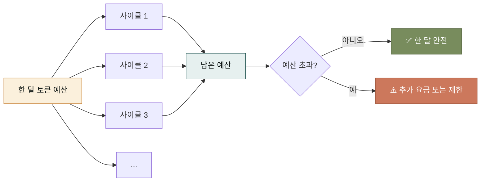
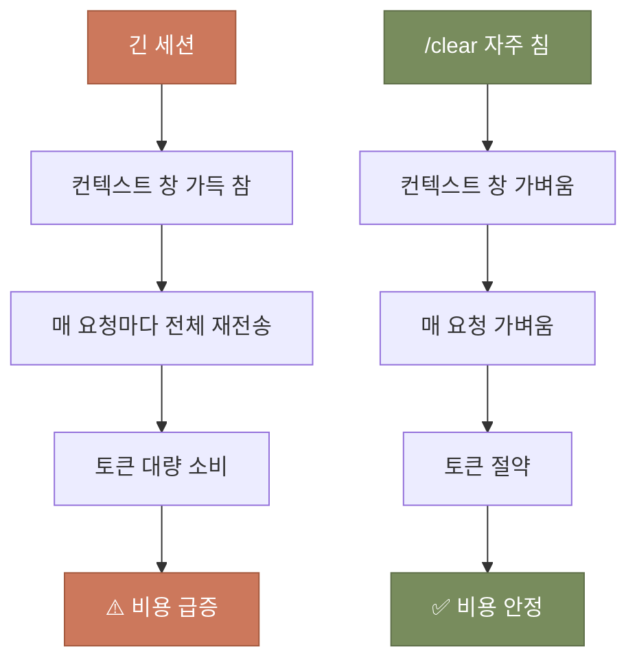
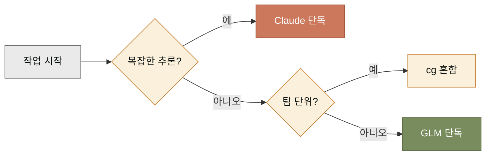
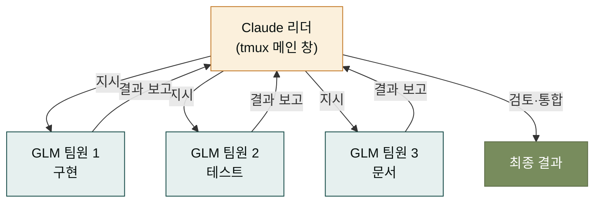

## 토큰이 무엇인가 — 식사 바우처 비유

Claude를 쓸 때 드는 비용은 '토큰' 단위로 측정됩니다. 토큰은 한마디로 식당의 바우처와 비슷합니다. 한 달에 일정 개수의 바우처를 받고, 한 번 식사에 바우처를 몇 장 씁니다. 요리가 복잡할수록(긴 요청, 많은 파일) 더 많은 바우처가 듭니다. 바우처가 다 떨어지면 한 달이 지나 재충전될 때까지 더 못 먹습니다.

토큰도 같습니다. 한 달에 정해진 양(또는 종량제)을 쓰고, 한 번 대화에 토큰을 소비합니다. 요청 길이가 길고 참조 파일이 많을수록 더 많은 토큰이 듭니다. 한도를 초과하면 추가 요금이 들거나 사용이 제한됩니다. 그래서 토큰을 의식하며 쓰는 것이 중요합니다.



이 페이지에서는 토큰 예산 안에서 가능한 한 많은 사이클을 돌리는 세 가지 전략을 다룹니다 — 컨텍스트 창 관리, GLM 백엔드 전환, cg 모드 활용.

## 전략 1 — 컨텍스트 창 관리

토큰 소비의 가장 큰 원인은 '컨텍스트 창'에 쌓인 대화 내용입니다. 긴 세션에서 수십 번의 대화를 주고받으면 컨텍스트 창이 꽉 차고, 그 후 매 요청마다 그 전체를 읽어들여 토큰이 크게 소모됩니다. 그래서 `/clear`를 자주 치는 것이 가장 효과적인 비용 절감입니다.



구체적으로 어떤 습관이 도움인지 정리합니다.

- **사이클 사이에 무조건 `/clear`** — plan 끝나고 run 시작 전, run 끝나고 sync 시작 전. 이것만 지켜도 토큰 소모가 크게 줄어듭니다.
- **큰 파일을 읽을 때 offset/limit 사용** — 전체 파일을 읽지 말고 필요한 부분만. Claude Code의 Read 도구는 offset과 limit 파라미터를 지원합니다.
- **프롬프트에서 맥락 압축** — "내가 아까 말한 그거" 대신 한 줄로 요약해서 다시 쓰기. Claude가 기억에 의존하게 두지 않습니다.
- **여러 질문을 한 번에 묶기** — 자잘한 질문을 열 번 치는 것보다, 관련 질문을 묶어 한 번에 치는 것이 토큰이 적게 듭니다.

## 전략 2 — GLM 백엔드 전환

Claude는 강력하지만 비용이 비쌉니다. 그래서 MoAI는 **GLM**(Zhipu AI의 모델)이라는 대안 백엔드를 지원합니다. GLM은 Claude보다 토큰당 단가가 훨씬 낮고, 구현·테스트 작성 같은 반복 작업에서는 품질이 충분합니다. Claude는 설계·보안·복잡한 추론에, GLM은 구현·테스트·문서 작성에 나눠 쓰면 전체 비용을 크게 줄일 수 있습니다.

```bash
# GLM 단독 모드 — 모든 작업을 GLM로
moai glm

# cg 모드 — Claude가 리더, GLM이 팀원 (tmux 기반)
moai cg
```

`moai glm`은 Claude 없이 GLM만 씁니다. 가장 저렴하지만 복잡한 추론이 필요하면 한계가 있습니다. `moai cg`는 Claude가 리더로 전체 흐름을 잡고, GLM 팀원이 구현 작업을 병렬로 처리하는 혼합 모드입니다. 둘 다 tmux 환경에서 동작합니다.

```mermaid
flowchart TD
    subgraph Claude 단독
        A1["모든 작업을 Claude로"] --> A2["품질 최고"]
        A2 --> A3["비용 최고"]
    end
    subgraph cg 혼합
        B1["Claude 리더 + GLM 팀원"] --> B2["품질 충분"]
        B2 --> B3["비용 30-40% 절감"]
    end
    subgraph GLM 단독
        C1["모든 작업을 GLM로"] --> C2["품질 보통"]
        C2 --> C3["비용 60-70% 절감"]
    end

    style A1 fill:#cc785c,stroke:#a45a3f,color:#FFFFFF
    style A3 fill:#cc785c,stroke:#a45a3f,color:#FFFFFF
    style B1 fill:#fbf0dc,stroke:#c47b2a,color:#09110f
    style B3 fill:#fbf0dc,stroke:#c47b2a,color:#09110f
    style C1 fill:#788C5D,stroke:#5F6F4A,color:#FFFFFF
    style C3 fill:#788C5D,stroke:#5F6F4A,color:#FFFFFF
```



## 언제 어느 백엔드를?

백엔드 선택은 작업 종류에 따라 달라집니다. 모든 작업에 같은 백엔드를 쓰는 것은 비효율적입니다.

| 작업 종류 | 추천 백엔드 | 이유 |
|----------|------------|------|
| 설계·아키텍처 결정 | Claude | 깊은 추론 필요 |
| 보안 검토 | Claude | 보안 훈련 강점 |
| 복잡한 디버깅 | Claude | 다단계 추론 필요 |
| 일반 구현 | GLM | 품질 충분, 비용 저렴 |
| 테스트 작성 | GLM | 반복적 작업 |
| 문서 생성 | GLM | 패턴화된 작업 |



이 결정 트리를 매 작업마다 의식하면, 비용을 극적으로 줄일 수 있습니다. 예를 들어 한 달 예산의 70%를 구현·테스트에 쓰고 있었다면, 그 부분을 GLM로 돌리면 60-70% 절감이 가능합니다. 절감한 예산으로 더 많은 설계 사이클을 Claude와 돌릴 수 있습니다.

## cg 모드 — Claude + GLM 협업

`moai cg` 모드는 Claude와 GLM이 한 팀으로 일하는 형태입니다. Claude가 리더로 전체 흐름을 잡고, GLM 팀원들이 구현을 담당합니다. tmux 세션 위에서 동작하며, 리더와 팀원이 각각의 창에서 작업합니다.



cg 모드의 장점은 병렬 처리입니다. 직렬로 하면 한 시간 걸릴 작업이 세 팀원이 병렬로 하면 20분으로 줄어듭니다. 단점은 tmux 사용법을 알아야 하고, 팀원 간 파일 충돌을 조심해야 한다는 것입니다. 이것은 [레퍼런스 섹션](../reference/_index.md)에서 자세히 다룹니다.

## 비용 추적

비용을 의식하려면 측정해야 합니다. Claude Code는 `/cost` 명령으로 현재 세션의 토큰 사용량을 보여줍니다. MoAI는 `moai cost` 명령으로 한 달 사용량을 추적합니다.

```bash
# 현재 세션 비용
claude
> /cost

# 한 달 사용량 요약
moai cost --month

# SPEC별 토큰 소비
moai cost --by-spec
```

이 명령들을 주간 정리 동선에 넣어두면, 비용 추세를 잡을 수 있습니다. 특정 SPEC이 예상보다 토큰을 많이 쓰고 있으면 그 원인을 분석해 다음 사이클을 개선합니다.

## 다음 단계

비용을 관리하는 법을 알았으니, [문제 해결](./debugging.md)에서 사이클이 막혔을 때 어디서 원인을 찾는지를 봅니다. 막힌 사이클을 빨리 푸는 것도 비용 절감의 일부입니다.

---

### Sources

- MoAI 다중 LLM 가이드: <https://adk.mo.ai.kr/ko/multi-llm/>
- MoAI 비용 최적화 원본 문서: <https://adk.mo.ai.kr/ko/cost-optimization/>
- Claude Code 비용 추적: <https://code.claude.com/docs/en/costs>
