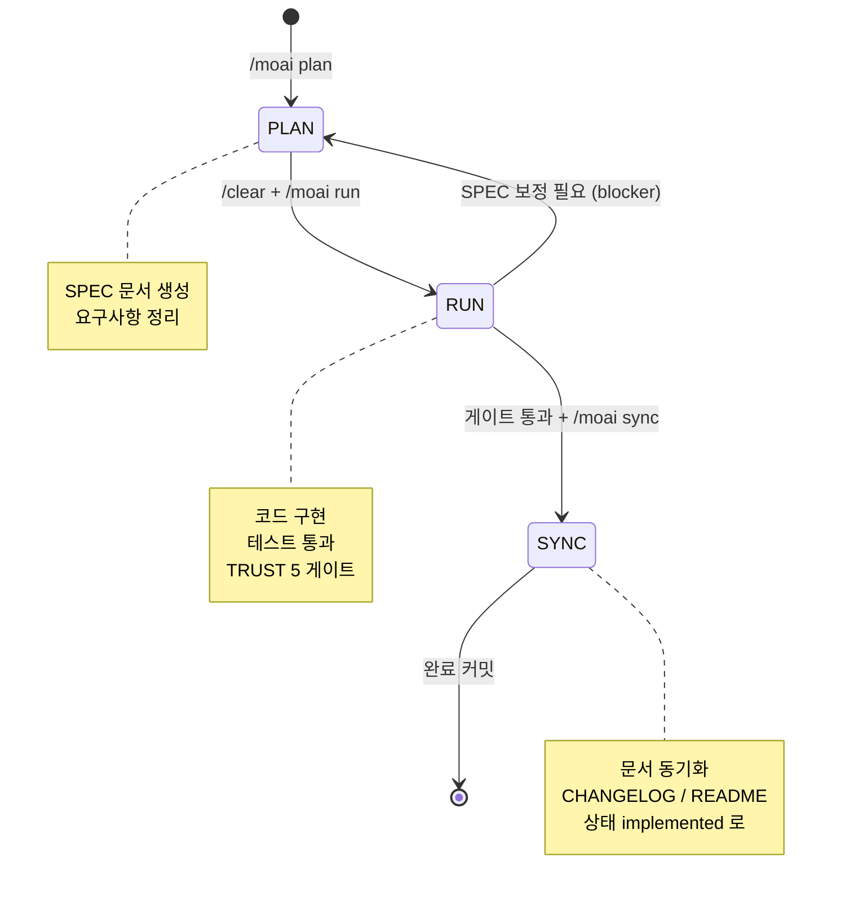
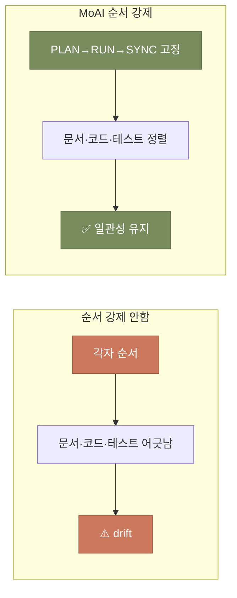
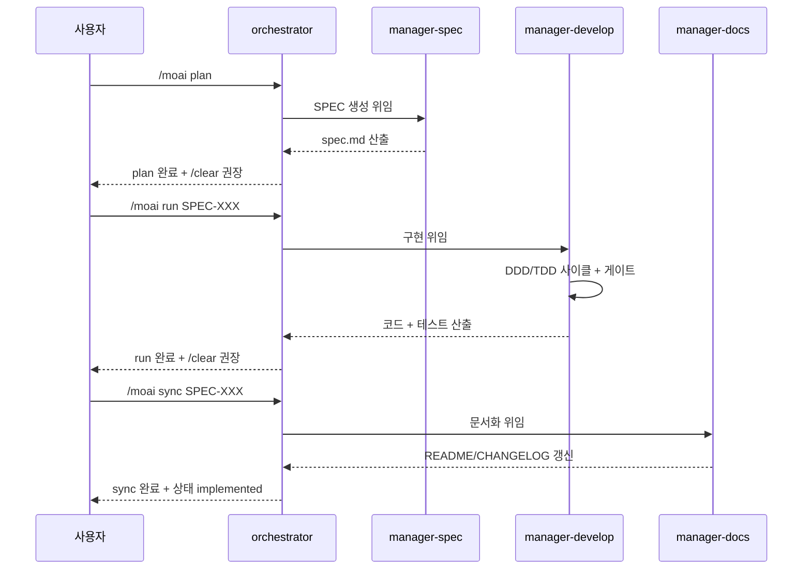

## MoAI-ADK 섹션이 다루는 것

이 섹션은 MoAI-ADK의 핵심인 **개발 사이클 기계**를 본격적으로 다룹니다. 앞의 세 섹션(시작하기·핵심 개념·일상 사용)에서 사이클을 돌려보고, 개념을 익히고, 일상 패턴을 잡았습니다. 이제 그 사이클 자체를 열어봅니다. 사이클이 왜 세 단계인지, 각 단계가 내부적으로 어떻게 작동하는지, 그리고 데스크탑 환경과 CLI 환경이 어떻게 연결되는지를 다룹니다.

왜 사이클 내부를 알아야 할까요? 일상 사용자는 사이클을 '그냥 쓰면 되는 것'으로 취급해도 됩니다. 하지만 사이클이 막혔을 때, 더 큰 프로젝트로 넘어갈 때, 또는 데스크탑과 CLI를 함께 쓸 때 — 사이클의 내부 이해가 필요해집니다. 이 섹션은 그 '다음 단계'를 위한 자료입니다.

## SPEC 라이프사이클 상태 기계

MoAI-ADK의 핵심은 SPEC 문서의 **상태 기계**입니다. SPEC은 한 단계에서 다음 단계로 옮겨가며, 각 단계에서 허용된 작업만 할 수 있습니다. 이 강제가 사이클의 일관성을 만듭니다.

이 상태 기계의 핵심은 **단방향 흐름**입니다. PLAN → RUN → SYNC 순서를 건너뛰거나 거꾸로 갈 수 없습니다. 예외는 RUN → PLAN으로 돌아가는 경우뿐인데, 이것은 구현 중 SPEC 보정이 필요할 때뿐입니다 (blocker report). 그 외에는 정해진 순서를 따라야 합니다.

## 왜 단방향인가 — 요리 완성 과정 비유

요리 완성 과정을 떠올려 봅시다. 레시피 확인(PLAN) → 조리(RUN) → 플레이팅(SYNC) 순서를 거꾸로 할 수 없습니다. 플레이팅을 먼저 하면 뭘 담을지 모르고, 조리를 먼저 하면 뭘 만들지 모릅니다. 순서가 있어야 각 단계가 의미를 가집니다.

소프트웨어 개발도 같습니다. SPEC 없이 구현하면 뭘 만들지 모릅니다. 구현 없이 문서화하면 실제 코드와 어긋납니다. 그래서 순서를 강제하는 것이 품질의 기본입니다. MoAI-ADK의 상태 기계는 이 순서를 기계적으로 강제합니다.

## 각 단계의 내부 동작

세 단계의 내부를 잠깐 엽니다. 자세한 내용은 각각의 페이지에서 다루고, 여기서는 한눈에 보는 흐름만 잡습니다.

- **PLAN** — `/moai plan` 명령이 manager-spec 에이전트를 부릅니다. 이 에이전트는 사용자에게 GEARS 질문을 던지고, 답을 모아 `.moai/specs/SPEC-XXX-001/spec.md`를 만듭니다. 결과물은 요구사항 문서 + plan.md + acceptance.md 세 개입니다.
- **RUN** — `/moai run` 명령이 manager-develop 에이전트를 부릅니다. 이 에이전트는 SPEC을 읽고 DDD 또는 TDD로 구현합니다. 사이클 중간에 TRUST 5 게이트가 자동 작동해 품질을 검증합니다.
- **SYNC** — `/moai sync` 명령이 manager-docs 에이전트를 부릅니다. 이 에이전트는 구현 결과를 README·CHANGELOG·API 문서에 반영하고, SPEC의 상태를 `implemented`로 바꿉니다.

각 단계를 전문화된 에이전트가 담당하는 것이 중요합니다. 한 에이전트가 모든 단계를 하면 책임이 섞이고 품질이 떨어집니다. 에이전트 분업은 사이클의 일관성을 지키는 핵심 설계입니다.

## 이 섹션의 구성

이 MoAI-ADK 섹션은 다음 페이지로 구성되어 있습니다.

| 순서 | 페이지 | 다루는 질문 |
|------|--------|------------|
| 1 | [데스크탑↔CLI 브리지](./bridge.md) | 데스크탑 플러그인과 CLI 바이너리는 어떻게 연결되는가? |
| 2 | [워크플로우 명령어](./workflow-commands.md) | /moai plan, run, sync 명령의 내부 동작은? |
| 3 | [품질 명령어](./quality-commands.md) | /moai gate, review, loop 같은 품질 도구는? |

[브리지 페이지](./bridge.md)는 이 섹션의 핵심입니다. 여기서 "데스크탑에서 플러그인으로 시작 → CLI에서 바이너리로 심화"라는 내러티브와 moai-code의 Tier 1~3 표를 다룹니다. 두 환경을 같이 쓰는 분들에게 특히 중요한 자료입니다.

## 다음 단계

[데스크탑↔CLI 브리지](./bridge.md)부터 시작합시다. 이 브리지 페이지는 데스크탑 Code 섹션과 CLI MoAI-ADK 섹션을 잇는 다리이자, 이 사이트 전체 IA의 두 축이 어떻게 연결되는지를 보여주는 자리입니다.

---

### Sources

- MoAI-ADK 워크플로우 명령어: <https://adk.mo.ai.kr/ko/workflow-commands/>
- MoAI 사이클 구조: <https://adk.mo.ai.kr/ko/core-concepts/spec-based-dev/>
- SPEC 라이프사이클 가이드: <https://adk.mo.ai.kr/ko/contributing/>
