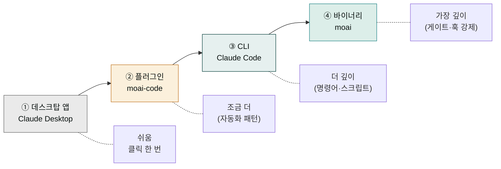
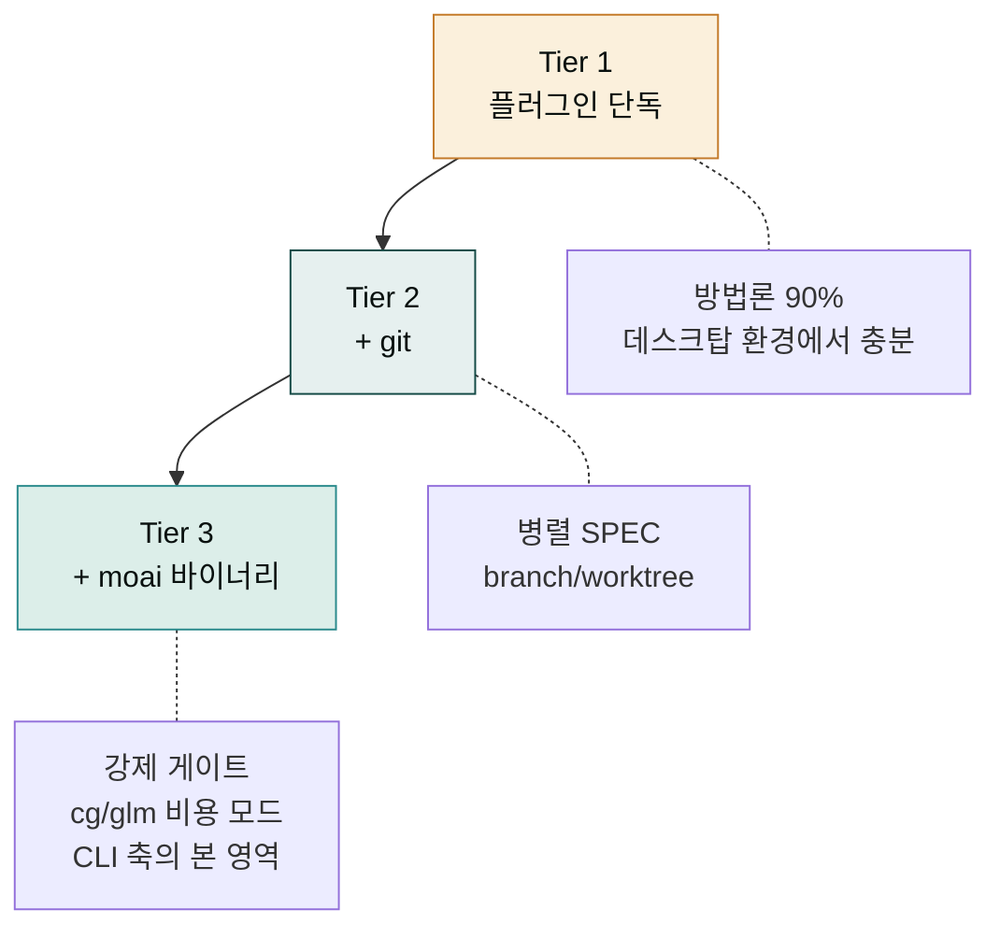
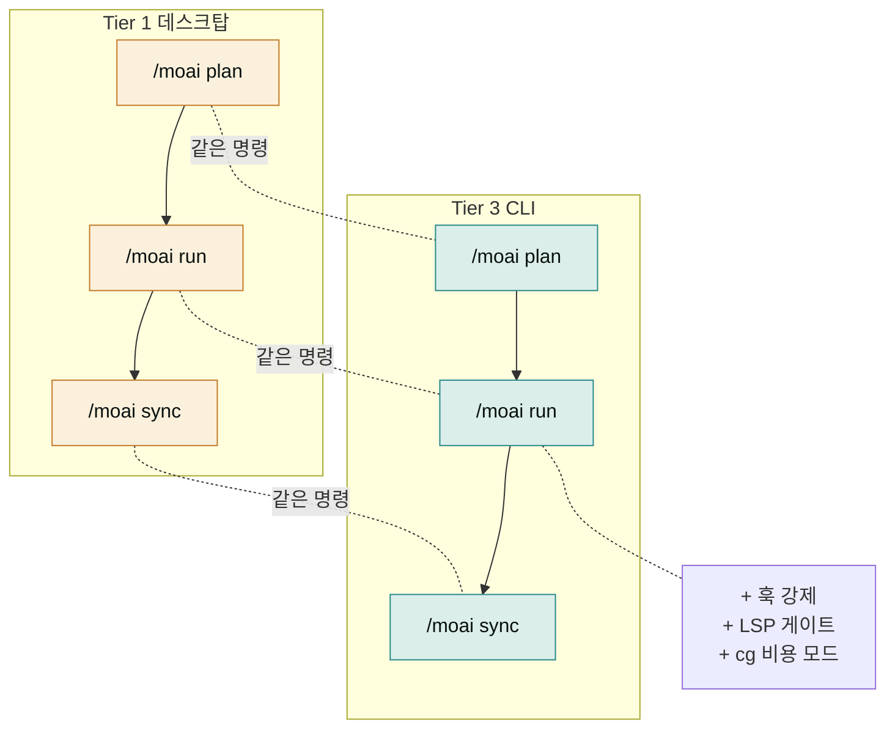
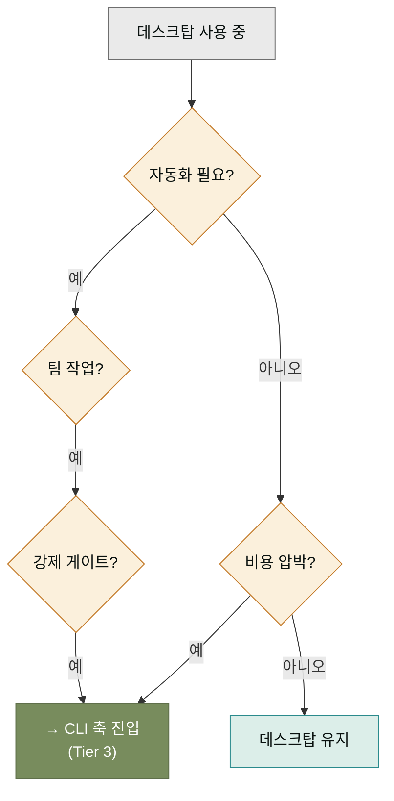
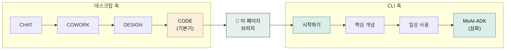

## 두 환경을 잇는 다리

이 사이트의 두 축 — 데스크탑 축과 CLI 축 — 은 서로 다른 사용자를 위한 별개의 경로가 아닙니다. 한 사용자가 두 환경을 모두 쓸 수도 있고, 한 프로젝트가 두 환경에 걸쳐 진행되기도 합니다. 이 페이지는 두 축을 잇는 다리를 놓습니다. **데스크탑에서 플러그인으로 시작**한 사용자가 **CLI에서 바이너리로 심화**로 넘어가는 동선을 다루고, 그 중간에 moai-code가 제공하는 Tier 1~3 능력 표를 놓습니다.

왜 이 다리가 필요할까요? 두 환경을 각각 쓰는 법은 익혔어도, 언제 어떻게 넘어가야 할지를 모르면 둘 다 반쪽짜리로 쓰게 됩니다. 데스크탑에서 편하게 쓰다가 CLI로 넘어와야 할 때를 모르거나, CLI에 익숙한 분이 굳이 데스크탑 플러그인을 쓸 필요를 느끼지 못하는 식입니다. 이 페이지는 그 판단 기준을 제공합니다.

## 학습 곡선으로 본 두 환경

데스크탑과 CLI는 학습 곡선이 다릅니다. 데스크탑은 진입 장벽이 낮고, CLI는 더 많은 것을 할 수 있지만 진입 장벽이 있습니다. 두 환경은 단계별로 연결되도록 설계되었습니다.

이 흐름에서 **데스크탑에서 플러그인으로 시작**하는 것이 ①→② 단계이고, **CLI에서 바이너리로 심화**하는 것이 ③→④ 단계입니다. 각 단계는 앞 단계 위에 올라가는 형태이지, 앞 단계를 대체하지 않습니다. 데스크탑 사용자가 CLI로 넘어가도 데스크탑 앱이 사라지지 않듯이.

## moai-code의 Tier 1~3 능력 표

이 다리의 핵심은 moai-code 플러그인이 정의하는 **Tier 1~3 능력 표**입니다. moai-code는 데스크탑 Claude 환경에서 쓰는 플러그인이지만, 그 능력이 고정되어 있지 않습니다. 설치된 도구에 따라 세 단계로 능력이 확장됩니다. 이 표가 데스크탑 환경과 CLI 환경을 이어주는 핵심 사양입니다.

| Tier | 필요 도구 | 능력 | 대략적 방법론 커버리지 |
|------|---------|------|----------------------|
| **Tier 1** | 플러그인 단독 (moai-code만 설치) | `/moai:plan→run→sync` 워크플로우 + SPEC 템플릿 + 13개 명령 | 약 90% |
| **Tier 2** | Tier 1 + git CLI | branch/worktree 흐름 (git CLI로 병렬 SPEC 진행) | Tier 1 + 병렬 진행 |
| **Tier 3** | Tier 2 + moai 바이너리 | 네이티브 훅 강제 (품질 게이트·Stop 훅) + LSP 진단 게이트 + 세션 레지스트리 + cg/glm 비용 모드 | Tier 2 + 강제 게이트 |

이 표의 의미는 명확합니다. 데스크탑 환경에서 moai-code만 설치해도 방법론의 90%를 쓸 수 있습니다 (Tier 1). git CLI가 추가되면 병렬로 여러 SPEC을 진행할 수 있습니다 (Tier 2). 그리고 moai 바이너리까지 더하면 품질 게이트·LSP 진단·cg/glm 비용 모드가 강제됩니다 (Tier 3) — 이 Tier 3가 바로 CLI 축이 다루는 본 영역입니다.

## 두 환경이 같은 사이클을 공유한다

중요한 점은, Tier 1 데스크탑 환경이든 Tier 3 CLI 환경이든 **같은 `/moai plan → run → sync` 사이클을 공유**한다는 것입니다. 사이클의 형태는 같고, 강제의 강도만 다릅니다.

같은 명령, 같은 사이클, 같은 SPEC 문서 형식. 그러므로 데스크탑에서 시작한 프로젝트를 CLI로 가져와서 그대로 이어서 할 수 있습니다. `.moai/specs/` 디렉토리와 SPEC 파일은 환경을 가리지 않습니다. 이 호환성이 "데스크탑에서 플러그인으로 시작 → CLI에서 바이너리로 심화"라는 흐름을 가능하게 만듭니다.

## 언제 CLI로 넘어가야 하나

데스크탑 Tier 1~2에서 CLI Tier 3로 넘어가는 시점은 사용자마다 다릅니다. 하지만 대체로 다음 신호가 보이면 넘어갈 때입니다.

- **같은 작업을 매일 반복하고 있다** — 자동화 스크립트로 묶으면 시간이 크게 줄어드는 신호.
- **팀 단위로 작업해야 한다** — branch/worktree 흐름이 필요한 시점.
- **강제 품질 게이트가 필요하다** — "이번엔 게이트 껐다"를 못하게 만들어야 할 때.
- **비용 최적화가 중요하다** — cg/glm 모드를 써서 60-70% 비용을 줄여야 할 때.

반대의 경우도 있습니다. CLI에 익숙한 분이 굳이 데스크탑으로 내려올 필요가 있을 때. 그것은 주로 비개발자 팀원과 협업할 때입니다. 데스크탑 앱이 비개발자에게 더 친숙하기 때문입니다. 두 환경은 경쟁이 아니라 보완재입니다.

## 사이트 IA에서 이 페이지의 자리

이 페이지는 이 사이트 전체 정보 구조(IA)에서 특별한 자리에 있습니다. 두 축(데스크탑·CLI)을 잇는 유일한 다리이기 때문입니다. 데스크탑 Code 섹션을 읽고 온 독자는 이 페이지에서 "아, 그 다음이 CLI 축이구나"를 잡고, CLI 축을 읽고 있는 독자는 이 페이지에서 "이전 단계가 데스크탑이었구나"를 잡습니다.

이 다리가 있어서 두 축이 별개의 섹션이 아니라 한 학습 경로의 두 단계가 됩니다. 이것이 이 사이트가 "두 축을 1차 분기축으로 승격시키면서도, 그 사이에 다리를 놓는다"는 IA 설계의 구체적 표현입니다.

## 다음 단계

이제 다리를 건넜습니다. 다음은 [워크플로우 명령어](./workflow-commands.md)에서 `/moai plan`, `/moai run`, `/moai sync`의 내부 동작을 더 깊이 봅니다. 일상 사용 섹션에서 매일 쓰던 명령이 내부적으로 어떻게 작동하는지 알면, 문제가 생겼을 때 더 빨리 원인을 잡을 수 있습니다.

---

### Sources

- moai-code Tier 1~3 능력 표 (원천): `.moai/specs/SPEC-MOC-BOOTSTRAP-DESKTOP-001/spec.md` REQ-BD-008
- 데스크탑 Code 섹션: [`/code/`](../../../code/)
- MoAI-ADK 워크플로우 명령어: <https://adk.mo.ai.kr/ko/workflow-commands/>
- 플러그인 패밀리 설계 문서: `.moai/docs/plugin-family-design/`
