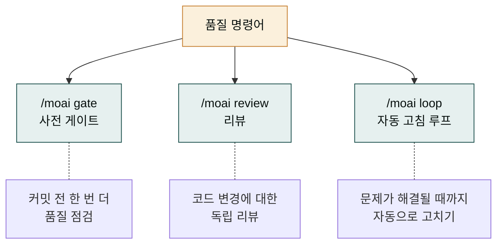
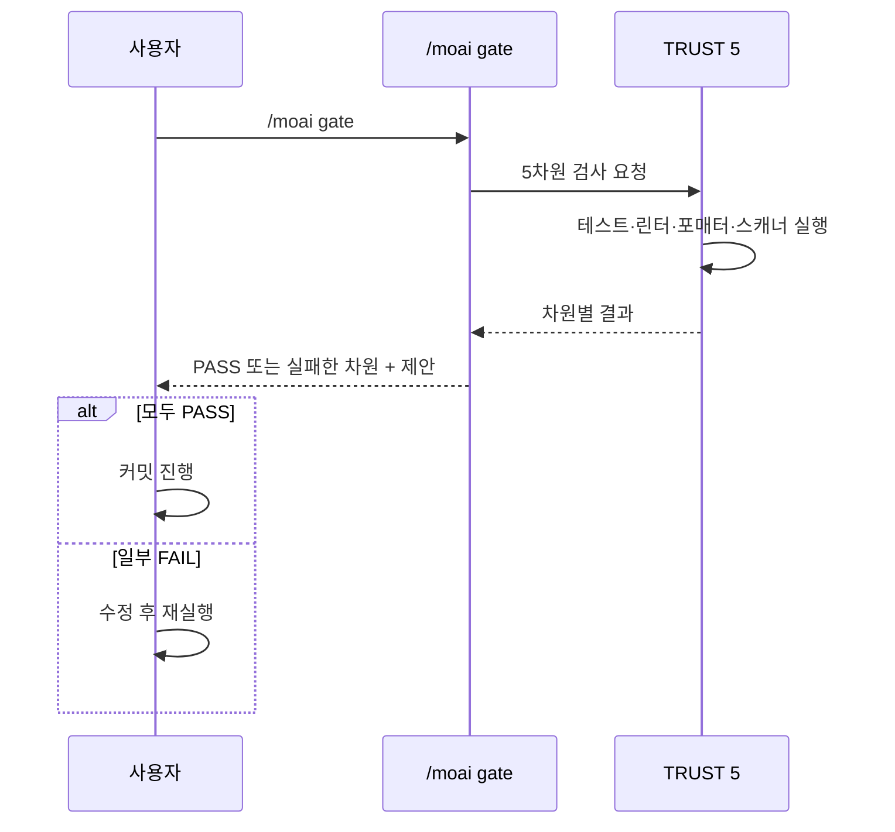
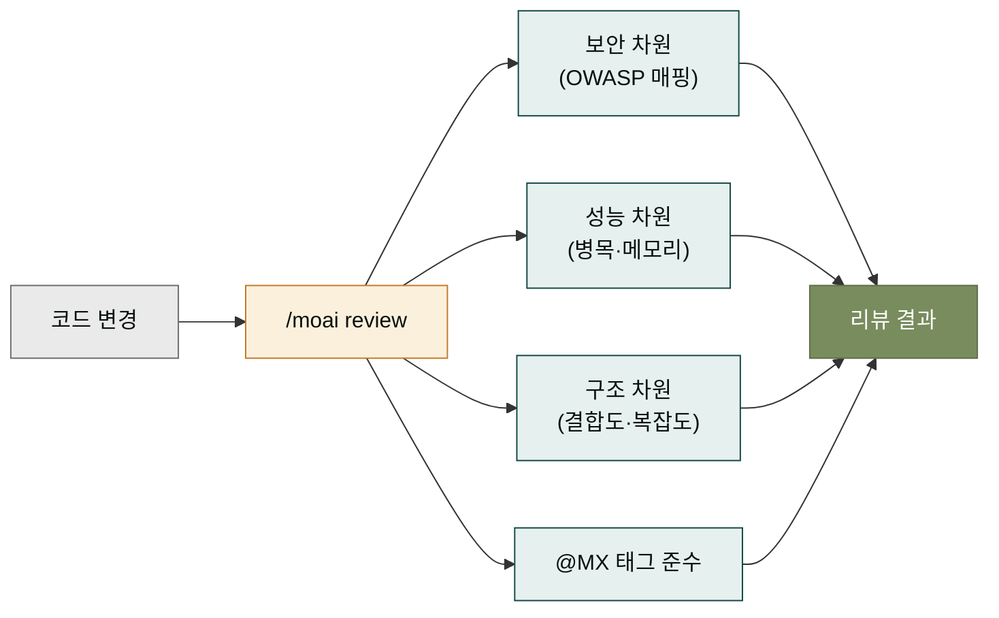
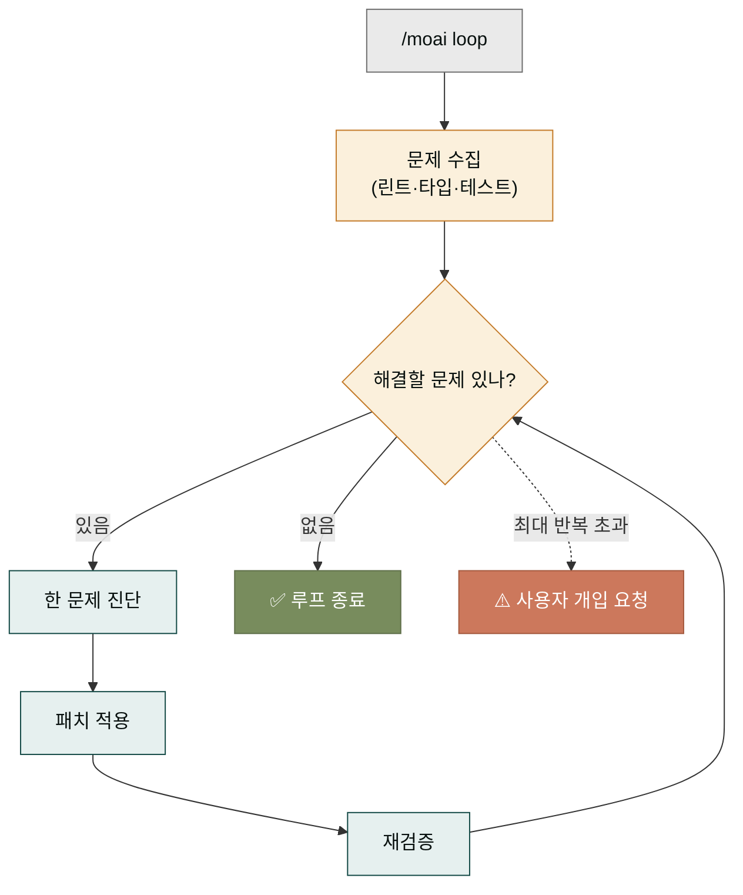
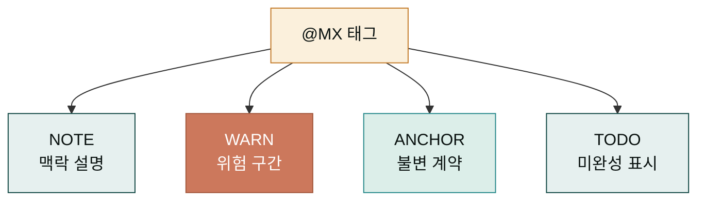
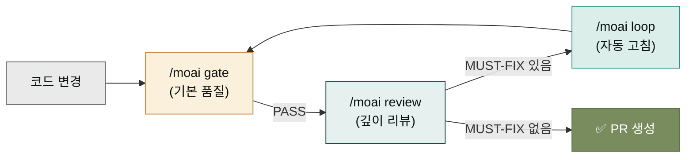

## 사이클 외의 품질 도구

`/moai plan → run → sync` 사이클이 MoAI의 핵심이지만, 사이클 외부에도 품질을 다루는 명령어들이 있습니다. 사이클 자체가 품질 게이트를 내장하고 있지만, 때로는 사이클과 별개로 품질을 점검하거나 강제하고 싶을 때가 있습니다. 이 페이지는 그런 사이클 외 품질 도구들을 다룹니다.

왜 사이클 외 도구가 필요할까요? 사이클은 한 번 돌면 끝나지만, 코드베이스는 사이클 밖에서도 계속 변합니다. 다른 팀원이 커밋한 코드, 외부 라이브러리 업데이트, 갑작스러운 버그 리포트 — 사이클 밖에서 품질을 점검할 도구가 필요합니다.

## 세 가지 품질 명령어

대표적인 품질 명령어 세 가지를 다룹니다. 각 명령은 서로 다른 시점, 서로 다른 목적으로 쓰입니다.

- **/moai gate** — 커밋 전에 한 번 더 품질을 점검합니다. 사이클의 TRUST 5 게이트와 비슷하지만, 사이클 밖에서 수동으로 부릅니다.
- **/moai review** — 코드 변경 사항에 대해 독립적인 리뷰를 받습니다. 보안·성능·구조 측면을 봅니다.
- **/moai loop** — 품질 문제가 해결될 때까지 자동으로 고치는 루프를 돌립니다. 리포트된 린트 에러, 타입 에러 등을 잡을 때 씁니다.

## /moai gate — 사전 품질 게이트

`/moai gate`를 치면 현재 작업 트리의 상태를 TRUST 5 다섯 차원으로 검사합니다. 이것은 커밋 전에 "이대로 커밋해도 괜찮은가"를 한 번 더 확인하는 단계입니다.

게이트는 병렬로 다섯 차원을 검사합니다. 각 차원의 검증은 독립적이므로 동시에 실행되어 빠릅니다. 모두 PASS면 커밋해도 좋고, 하나라도 FAIL이면 어느 차원에서 무엇이 문제인지 알려줍니다.

자주 쓰는 패턴은 `git commit` 직전에 `/moai gate`를 치는 것입니다. 커밋하기 전에 게이트가 닫혀 있으면 수정이 쉽지만, 커밋 후에 게이트가 닫히면 수정사항을 또 커밋해야 합니다. "게이트를 먼저 보고 커밋"이 습관이 되면 깨끗한 커밋 히스토리가 유지됩니다.

## /moai review — 독립 코드 리뷰

`/moai review`는 코드 변경 사항을 독립적인 시각에서 리뷰합니다. 이것은 사이클의 manager-develop이 스스로 작성한 코드를 자기 평가하는 것과 달리, 별도의 리뷰 에이전트가 보안·성능·구조를 봅니다.

리뷰 결과는 "MUST-FIX / SHOULD-FIX / NICE-TO-HAVE" 세 단계로 분류됩니다. MUST-FIX는 반드시 고쳐야 할 문제, SHOULD-FIX는 권장, NICE-TO-HAVE는 선택입니다. 이 분류가 있으면 무엇을 먼저 고칠지 우선순위가 잡힙니다.

리뷰는 보통 PR(풀 리퀘스트) 생성 전에 한 번 합니다. 로컬에서 코드를 다 고쳤을 때 `/moai review`를 치면, 다른 팀원이 리뷰하기 전에 자주 지적받는 문제를 미리 잡을 수 있습니다. PR 리뷰의 왕복을 줄이는 효과가 큽니다.

## /moai loop — 자동 고침 루프

`/moai loop`는 품질 문제가 해결될 때까지 자동으로 코드를 고치는 루프를 돌립니다. 발견된 린트 에러, 타입 에러, 테스트 실패를 하나씩 잡아 고치고, 다시 검증하고, 모두 통과할 때까지 반복합니다.

이 루프는 기계적으로 잡을 수 있는 문제(린트 규칙 위반, 타입 불일치, 단순한 테스트 실패)에 효과적입니다. 반면 의미론적 실패(데이터 레이스, 데드락, 비즈니스 로직 오류)는 자동 고침이 위험하므로, 루프가 잡지 않고 사용자에게 알립니다.

루프는 최대 반복 횟수(일반적으로 3~5회)가 있습니다. 이를 초과하면 더 이상 자동 고침을 시도하지 않고 사용자에게 개입을 요청합니다. 이 안전장치가 루프가 무한히 도는 것을 막습니다.

## @MX 태그 — 품질 맥락의 표식

`/moai review`와 `/moai loop`는 `@MX` 태그라는 코드 주석 표식을 활용합니다. `@MX:NOTE`, `@MX:WARN`, `@MX:ANCHOR`, `@MX:TODO` 네 종류가 있고, 각각 코드의 맥락을 표시합니다.

이 태그들은 코드를 읽는 다음 사람(또는 다음 사이클의 에이전트)에게 맥락을 전달합니다. `@MX:WARN`이 붙은 코드는 "조심해서 다뤄야 할 구간"이라는 신호이고, `@MX:ANCHOR`는 "이 계약은 변경 시 다른 곳도 같이 바꿔야 함"을 표시합니다. 이 태그들이 있으면 리뷰와 루프가 코드를 더 정확하게 이해합니다.

## 세 명령의 조합 패턴

세 품질 명령은 단독으로도 쓰이지만, 조합하면 더 강력합니다. 자주 쓰는 조합 패턴을 소개합니다.

이 패턴은 "코드 변경 → gate로 기본 확인 → review로 깊이 확인 → 문제 있으면 loop로 자동 고침 → 다시 gate"의 흐름입니다. 이 흐름을 한 번 익히면 PR을 내기 전 자동으로 품질을 높이는 동선이 잡힙니다.

## 품질 명령과 사이클의 관계

품질 명령은 사이클을 대체하지 않습니다. 사이클이 기본이고, 품질 명령은 사이클 밖에서 보조하는 역할입니다. 이 관계를 이해하면 "사이클을 안 돌고 품질 명령만 써도 되나?" 같은 질문에 답할 수 있습니다 — 아니, 사이클이 먼저입니다.

| 상황 | 추천 명령 |
|------|---------|
| 사이클 진행 중 | 사이클 자체의 TRUST 5 게이트에 의존 |
| 커밋 전 빠른 점검 | `/moai gate` |
| PR 생성 전 깊이 리뷰 | `/moai review` |
| 린트·타입 에러 다수 | `/moai loop` |
| 사이클 밖 긴급 수정 | 사이클을 새로 열어 (새 SPEC) 진행 |

## 다음 단계

이것으로 MoAI-ADK 섹션을 마쳤습니다. 다음은 [레퍼런스 섹션](../reference/_index.md)에서 CLI 명령어 전체 색인과 고급 주제를 봅니다. 레퍼런스는 앞의 네 섹션에서 다룬 내용의 사전 형태 요약이므로, 필요할 때마다 찾아 보는 용도로 씁니다.

---

### Sources

- MoAI 품질 명령어 원본: <https://adk.mo.ai.kr/ko/quality-commands/>
- @MX 태그 프로토콜: <https://adk.mo.ai.kr/ko/contributing/>
- TRUST 5 게이트 상세: <https://adk.mo.ai.kr/ko/core-concepts/trust-5/>
- OWASP Top 10: <https://owasp.org/www-project-top-ten/>
