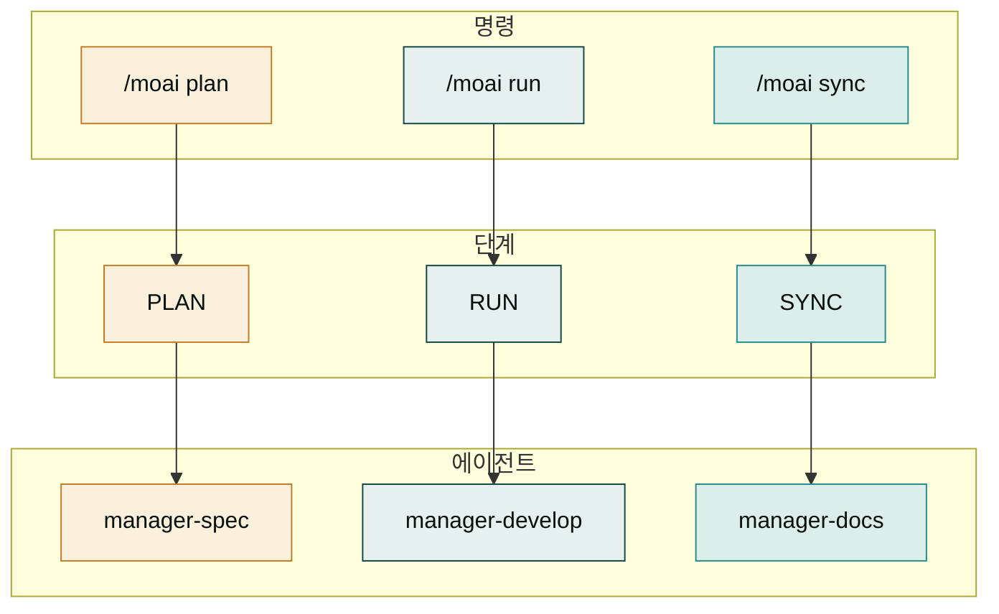
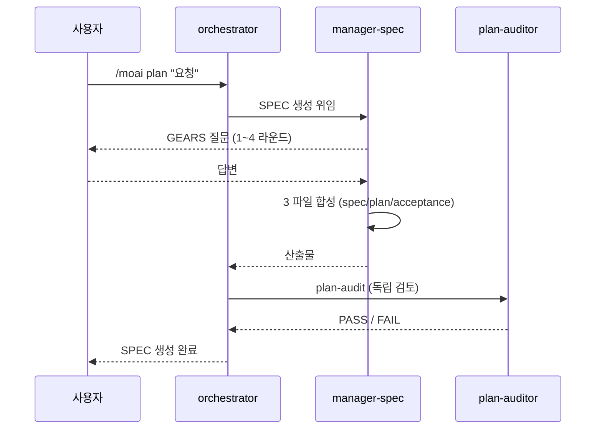
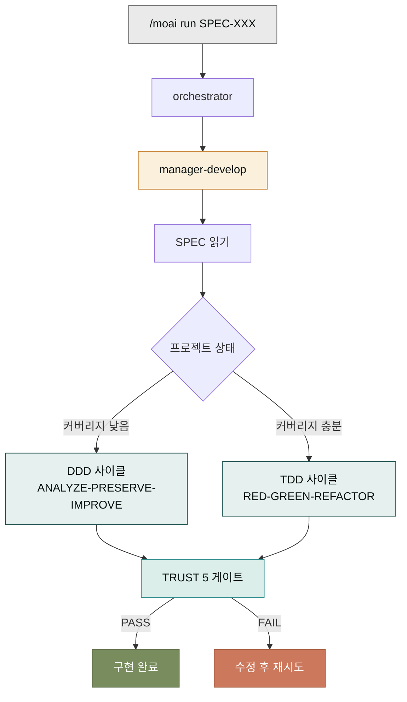
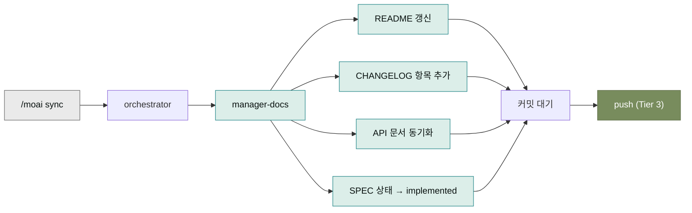
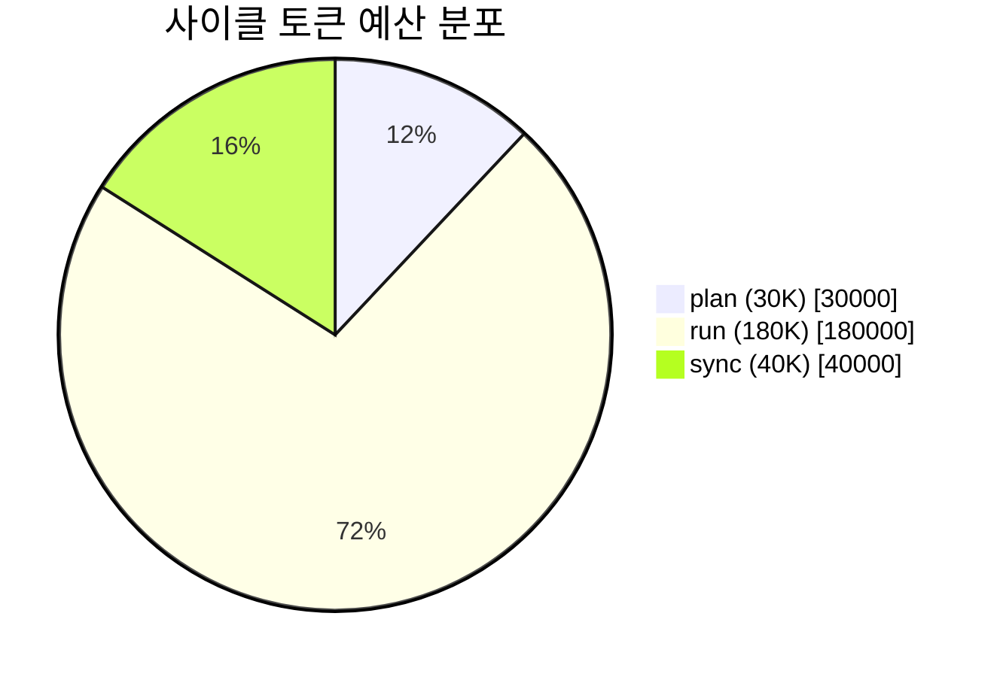

## 일상에서 쓰던 명령을 다시 열어보기

[일상 사용 섹션](../daily/_index.md)에서 매일 치는 `/moai plan`, `/moai run`, `/moai sync` 명령을 다루었습니다. 이 페이지에서는 그 명령들을 다시 열어봅니다. 명령 하나를 칠 때 내부적으로 무슨 일이 일어나는지, 어떤 에이전트가 어떤 산출물을 만드는지를 알면, 사이클이 막혔을 때 원인을 더 빨리 잡을 수 있습니다.

왜 내부를 알아야 할까요? 일상에서는 그냥 쓰면 됩니다. 하지만 사이클이 예상보다 오래 걸리거나, 결과물이 이상하거나, 다음 단계로 안 넘어갈 때 — 내부를 모르면 매뉴얼만 뒤지게 됩니다. 내부를 알면 "아, 지금 run 단계의 manager-develop이 SPEC을 읽고 있으니 시간이 걸리는구나"라고 상황을 이해할 수 있습니다.

## 세 명령의 대응 관계

세 명령은 세 단계와 1:1로 대응합니다. 각 명령은 그 단계를 담당하는 전문 에이전트를 부릅니다.



이 대응이 중요한 이유는, 각 에이전트가 하는 일이 완전히 다르기 때문입니다. manager-spec은 요구사항을 문서로 합성하고, manager-develop은 그 문서를 읽고 코드를 짜며, manager-docs은 코드를 문서로 다시 합성합니다. 한 에이전트가 세 단계를 다 하면 책임이 섞입니다. 그래서 MoAI는 세 에이전트로 분업합니다.

## /moai plan — 요구사항을 SPEC으로

`/moai plan "<요청>"`을 치면 orchestrator가 manager-spec 에이전트를 부릅니다. 이 에이전트는 사용자에게 GEARS 질문을 여러 라운드 던집니다. 질문에 답하다 보면 요구사항이 정리되고, 마지막에 `.moai/specs/SPEC-XXX-001/spec.md`와 `plan.md`, `acceptance.md` 세 파일이 만들어집니다.



중간에 **plan-auditor**라는 독립 에이전트가 SPEC을 검토합니다. 이것은 manager-spec이 만든 SPEC을 그대로 믿지 않고, 독립적인 시각에서 다시 보는 단계입니다. 편향을 막기 위한 안전망입니다. plan-auditor가 PASS하면 다음 단계로, FAIL이면 SPEC을 다시 다듬습니다.

이 단계의 토큰 예산은 약 30,000 토큰입니다. 오래 걸리지 않지만, 끝나면 반드시 `/clear`를 쳐서 컨텍스트를 비우는 것이 권장됩니다 — 그래야 다음 run 단계가 깨끗한 컨텍스트에서 시작합니다.

## /moai run — SPEC을 코드로

`/moai run SPEC-XXX-001`을 치면 orchestrator가 manager-develop 에이전트를 부릅니다. 이 에이전트는 SPEC을 읽고, 프로젝트 상태(테스트 커버리지, 기존 코드 양)를 보고 DDD 또는 TDD를 선택해 구현에 들어갭니다.



이 단계의 토큰 예산은 약 180,000 토큰으로, 세 단계 중 가장 큽니다. 그만큼 시간도 가장 오래 걸립니다. 구현 도중 TRUST 5 게이트가 자동 작동해 각 차원을 검증하고, 한 차원이라도 FAIL이면 수정 후 재시도합니다.

run 단계에서는 "blocker report"가 발생할 수 있습니다. 이것은 SPEC이 모호하거나, 범위가 너무 넓거나, 사용자 결정이 필요할 때 manager-develop이 반환하는 보고서입니다. blocker를 받으면 사용자(당신)가 결정하고, 그 결정을 넣어 다시 run을 진행합니다.

## /moai sync — 코드를 문서로

`/moai sync SPEC-XXX-001`을 치면 orchestrator가 manager-docs 에이전트를 부릅니다. 이 에이전트는 구현 결과를 문서에 반영합니다. README, CHANGELOG, API 문서를 최신화하고, SPEC의 상태를 `implemented`로 바꿉니다.



sync 단계는 토큰 예산이 약 40,000 토큰으로 가장 작습니다. 그 이유는 대부분의 작업이 앞선 run 단계의 산출물을 재사용하기 때문입니다. 새로운 창작보다는 정리와 동기화가 주된 작업입니다.

## 사이클 토큰 예산 총합

세 단계의 토큰 예산을 합치면 한 사이클에 약 250,000 토큰이 듭니다. 이 숫자를 알면 "한 달에 몇 사이클을 돌릴 수 있는가"를 가늠할 수 있습니다.

| 단계 | 토큰 예산 | 주요 산출물 |
|------|----------|------------|
| plan | ~30,000 | SPEC 3파일 (spec.md, plan.md, acceptance.md) |
| run | ~180,000 | 코드 + 테스트 |
| sync | ~40,000 | README/CHANGELOG 갱신 + SPEC 상태 implemented |
| **총합** | **~250,000** | 한 사이클 |



run이 72%를 차지합니다. 그래서 [비용 절감](../daily/tokens-cost.md)을 할 때도 run 단계를 GLM으로 돌리는 것이 가장 큰 효과를 냅니다. plan과 sync는 비중이 작아 절감 효과가 제한적입니다.

## 사이클 사이의 `/clear` — 왜 중요한가

각 단계 사이에 `/clear`를 치는 것이 강력히 권장됩니다. 그 이유는 각 단계가 독립된 컨텍스트에서 작업할 때 가장 품질이 좋기 때문입니다.

```mermaid
flowchart LR
    subgraph /clear 치는 경우 (권장)
        A1["plan<br/>(30K)"] -->|clear| A2["run<br/>(180K)"]
        A2 -->|clear| A3["sync<br/>(40K)"]
    end
    subgraph /clear 안 치는 경우 (비권장)
        B1["plan<br/>(30K)"] --> B2["run<br/>(누적 210K)"]
        B2 --> B3["sync<br/>(누적 250K+)"]
    end

    style A1 fill:#788C5D,stroke:#5F6F4A,color:#FFFFFF
    style A2 fill:#788C5D,stroke:#5F6F4A,color:#FFFFFF
    style A3 fill:#788C5D,stroke:#5F6F4A,color:#FFFFFF
    style B1 fill:#cc785c,stroke:#a45a3f,color:#FFFFFF
    style B2 fill:#cc785c,stroke:#a45a3f,color:#FFFFFF
    style B3 fill:#cc785c,stroke:#a45a3f,color:#FFFFFF
```

`/clear`를 안 치면 각 단계의 토큰이 누적됩니다. 컨텍스트 창이 가득 차면 Claude의 응답 품질이 떨어지고, 결국 한 사이클의 품질이 무너집니다. `/clear`는 "이전 단계의 탐색적 사고를 버리고, 산출물만 가지고 다음 단계로 간다"는 원칙의 실행 도구입니다.

## 다음 단계

워크플로우 명령의 내부를 알았으니, [품질 명령어](./quality-commands.md)에서 `/moai gate`, `/moai review`, `/moai loop` 같은 품질 도구의 내부를 봅니다. 이 도구들은 사이클 밖에서 품질을 보조하는 역할을 합니다.

---

### Sources

- MoAI 워크플로우 명령어 원본: <https://adk.mo.ai.kr/ko/workflow-commands/moai-run/>
- MoAI plan 단계: <https://adk.mo.ai.kr/ko/workflow-commands/moai-plan/>
- MoAI sync 단계: <https://adk.mo.ai.kr/ko/workflow-commands/moai-sync/>
- 에이전트 카탈로그: <https://adk.mo.ai.kr/ko/contributing/>
