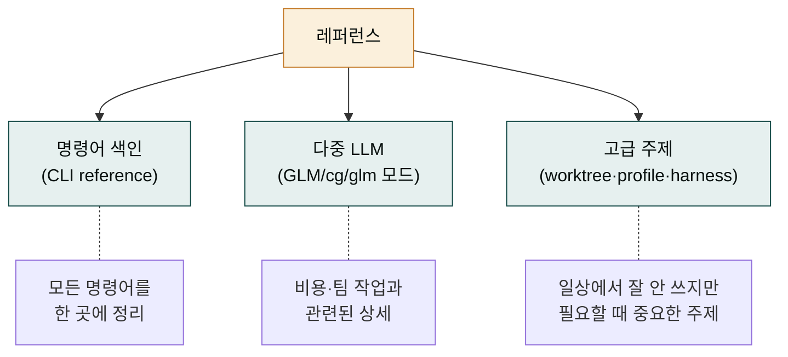

## 레퍼런스 섹션의 성격

앞의 네 섹션(시작하기·핵심 개념·일상 사용·MoAI-ADK)은 "읽고 나면 이해하는" 학습 자료였습니다. 이 레퍼런스 섹션은 성격이 다릅니다. "필요할 때 찾아 보는" 사전입니다. 처음부터 끝까지 읽을 필요 없이, 특정 명령이 궁금할 때, 특정 상황에 부닥쳤을 때 해당 페이지를 찾아가는 형태입니다.

왜 학습 자료와 사전을 분리할까요? 학습 자료는 맥락이 중요해서 순서대로 읽어야 하고, 사전은 정확성이 중요해서 빠르게 찾을 수 있어야 합니다. 두 성격을 한 페이지에 섞으면 학습자는 사전 항목에 지치고, 검색자는 학습 서사에 질립니다. 분리가 양쪽을 다 편하게 만듭니다.

## 레퍼런스의 세 갈래

이 레퍼런스 섹션은 세 갈래로 나뉩니다. 각각 자주 찾는 주제를 다룹니다.

- **명령어 색인** — `claude`, `moai` 명령의 전체 서브커맨드를 표로 정리합니다. "이런 명령이 있었나?" 할 때 찾아 보는 자리.
- **다중 LLM** — GLM 단독 모드, cg 혼합 모드, glm 백엔드 전환을 깊이 다룹니다. 일상 사용 섹션에서 가볍게 다룬 것의 심화.
- **고급 주제** — worktree(병렬 SPEC 진행), profile(사용자 환경 설정), harness(학습 서브시스템 관리)를 다룹니다.

## 언제 이 섹션을 보나

레퍼런스를 자주 찾게 되는 상황을 정리합니다.

- **특정 명령의 정확한 문법이 기억 안 날 때** — `moai spec list`인지 `moai list spec`인지 헷갈리면 [CLI 명령어 색인](./cli-reference.md)을 봅니다.
- **비용을 크게 줄여야 할 때** — [다중 LLM 안내](./multi-llm.md)에서 GLM/cg 모드 전환 상세를 봅니다.
- **팀과 병렬로 작업해야 할 때** — [고급 주제](./advanced.md)에서 worktree 사용법을 봅니다.
- **특정 에러 메시지를 만났을 때** — [일상 사용의 문제 해결](../daily/debugging.md)을 먼저 보고, 거기에 없으면 레퍼런스를 봅니다.

## 학습 자료와의 관계

레퍼런스는 학습 자료를 대체하지 않습니다. 학습 자료가 먼저이고, 레퍼런스는 그 보조입니다.

| 상황 | 어디로 |
|------|--------|
| 왜 이런 명령이 있는지 알고 싶다 | 핵심 개념 섹션 |
| 매일 어떻게 쓰는지 알고 싶다 | 일상 사용 섹션 |
| 사이클 내부가 궁금하다 | MoAI-ADK 섹션 |
| 특정 명령의 정확한 형태가 궁금하다 | **레퍼런스 (이 섹션)** |
| 특정 상황에서 뭘 해야 하나 | 일상 사용의 문제 해결 |

레퍼런스는 "왜"를 설명하지 않습니다. 그것은 학습 자료의 몫입니다. 레퍼런스는 "무엇"과 "어떻게"에 집중합니다.

## 다음 단계

[CLI 명령어 색인](./cli-reference.md)부터 시작합시다. 명령어를 한눈에 보는 자리이고, 다른 페이지로 갈 때도 참조로 쓸 수 있습니다.

---

### Sources

- MoAI CLI 레퍼런스 원본: <https://adk.mo.ai.kr/ko/getting-started/cli/>
- MoAI 고급 주제 원본: <https://adk.mo.ai.kr/ko/advanced/>
- Claude Code CLI 레퍼런스: <https://code.claude.com/docs/en/cli>
