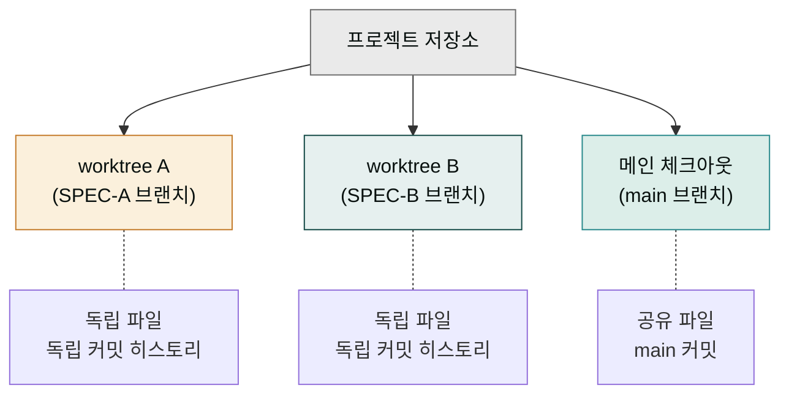
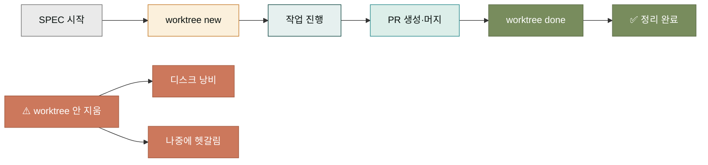
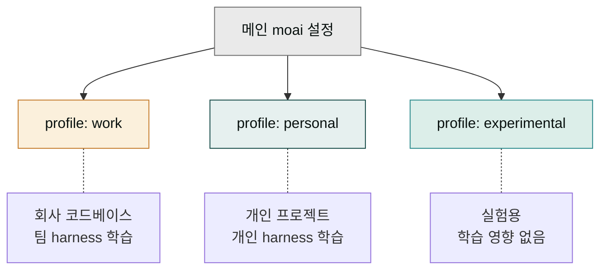
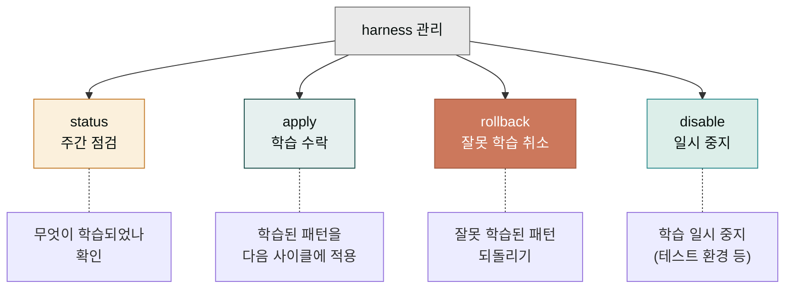

## '고급'이라는 말의 의미

이 페이지에서 다루는 주제는 '고급'이라고 부르지만, 어려워서가 아니라 **빈도가 낮아서** 고급입니다. 일상 사용자는 평생 안 써도 되지만, 팀 작업을 하거나 큰 프로젝트를 진행하면 언젠가는 마주치는 주제들입니다. 미리 알아두면 막혔을 때 당황하지 않습니다.

이 페이지는 세 가지 주제를 다룹니다 — worktree(병렬 SPEC 진행), profile(환경 관리), harness(학습 서브시스템 제어). 각각 독립된 절로 되어 있어 필요한 부분만 찾아 읽어도 됩니다.

## 주제 1 — worktree로 병렬 SPEC 진행

한 프로젝트에서 두 개 이상의 SPEC을 동시에 진행해야 할 때가 있습니다. 예를 들어 인증 기능(SPEC-A)과 결제 기능(SPEC-B)을 동시에 개발해야 할 때. 이때 한 브랜치에서 두 SPEC을 섞어 작업하면 커밋 히스토리가 꼬이고 코드 충돌이 잦아집니다.

worktree는 이것을 해결하는 git의 기능입니다. 같은 저장소의 여러 작업 디렉토리를 만들어, 각 디렉토리에서 독립된 브랜치 작업을 할 수 있게 합니다. MoAI는 이것을 `moai worktree` 명령으로 감쌌습니다.

```bash
# SPEC-A용 worktree 생성
moai worktree new SPEC-A-001

# SPEC-B용 worktree 생성 (별도 디렉토리)
moai worktree new SPEC-B-001

# 각 worktree에서 독립 작업
moai worktree switch SPEC-A-001   # A 작업 디렉토리로 이동
moai worktree switch SPEC-B-001   # B 작업 디렉토리로 이동

# 완료 후 정리
moai worktree done SPEC-A-001     # PR 머지 후 정리
```



worktree의 장점은 컨텍스트 전환 비용이 적다는 것입니다. 브랜치를 바꿀 때마다 파일 전체가 바뀌는 것이 아니라, 디렉토리 자체가 다르므로 각 작업의 '상태'가 그대로 보존됩니다. 한 worktree에서 작업하다가 다른 worktree로 넘어가도, 이전 worktree의 작업 상태는 그대로 있습니다.

## worktree 사용 시 주의점

worktree는 강력하지만 남용하면 관리가 어렵습니다. 몇 가지 주의점을 짚습니다.

- **동시에 3개 이상은 피하기** — 사람의 인지 능력으로 3개 이상의 동시 SPEC을 관리하면 실수가 늘어납니다.
- **worktree는 PR 머지 후 즉시 정리** — `moai worktree done`으로 안 지우면 디스크가 쌓이고 잊혀집니다.
- **각 worktree에서 `moai init` 불필요** — 메인 저장소의 `.moai/` 설정이 공유됩니다.



## 주제 2 — profile 환경 관리

`moai profile`은 사용자 환경을 여러 개로 분리해 관리하는 기능입니다. 예를 들어 '업무용'과 '개인용' 프로필을 나눠, 업무용에서는 회사 코드베이스와 팀 설정을, 개인용에서는 개인 프로젝트와 취향 설정을 쓸 수 있습니다.

```bash
# 프로필 목록
moai profile list

# 새 프로필 생성
moai profile new work        # 업무용
moai profile new personal    # 개인용

# 프로필 활성화 (이후 moai/cc 명령이 이 프로필로 동작)
moai profile use work

# 현재 프로필 확인
moai profile current
```

프로필이 필요한 상황은 다음과 같습니다.

- **회사와 개인 프로젝트를 같은 컴퓨터에서** — 설정 충돌 방지
- **여러 팀에 소속** — 팀별로 다른 harness 학습, 다른 품질 기준
- **테스트 환경 격리** — 새 도구를 시도할 때 본 프로필에 영향 안 주게



프로필 전환은 빠르지만, 한 프로필에서 다른 프로필로 넘어갈 때 컨텍스트 창은 초기화됩니다. 그래서 프로필은 큰 단위(업무/개인)로 나누고, 한 번 켜면 한 작업 세션을 통째로 그 프로필에서 진행하는 것이 자연스럽습니다.

## 주제 3 — harness 학습 서브시스템 제어

[핵심 개념의 하네스 페이지](../concepts/harness.md)에서 하네스가 사용자 패턴을 학습한다고 했습니다. 이 절에서는 그 학습을 사용자가 직접 제어하는 방법을 다룹니다.

```bash
# 학습 상태 확인
moai harness status

# 학습된 패턴 적용 (다음 사이클부터)
moai harness apply

# 학습 롤백 (최근 학습 취소)
moai harness rollback

# 학습 서브시스템 일시 중지
moai harness disable

# 다시 켜기
moai harness enable
```

이 명령들을 쓰는 대표적 상황은 다음과 같습니다.



- **status로 주간 점검** — 매주 한 번씩 무엇이 학습되었는지 확인. 잘못된 것이 있으면 rollback.
- **잘못 학습 감지 시 rollback** — "내가 한 번 pytest 안 썼다고 평생 pytest 안 쓴다고 학습하지 마" 같은 경우.
- **테스트 환경에서 disable** — 일시적으로 학습을 끄고 깨끗한 상태에서 테스트.
- **apply는 기본이 자동** — 특별한 이유가 없다면 자동 적용을 두고 수동 apply는 거의 안 씁니다.

## 세 주제의 공통점 — 자주 안 써도 알아야

이 세 주제의 공통점은 "자주 안 써도 필요할 때 반드시 알아야"라는 것입니다. 일상에서는 안 쓰다가, 어느 날 팀 작업이 필요해지거나(worktree), 환경이 꼬여서(profile), harness가 이상하게 학습해서(harness rollback) 갑자기 필요해집니다.

이 페이지를 북마크해 두고, 그때마다 다시 보는 동선이 좋습니다. 일상에서 외울 필요는 없지만, "이런 기능이 있었지" 정도의 인지만 있어도 막혔을 때 빠르게 찾을 수 있습니다.

## 다음 단계

이것으로 CLI 축의 모든 섹션을 마쳤습니다. 다시 [CLI 축 첫 페이지](../_index.md)로 돌아가 전체 동선을 한 번 더 훑거나, [데스크탑↔CLI 브리지](../moai-adk/bridge.md)에서 두 축의 관계를 다시 보는 것도 좋습니다. CLI 축을 모두 읽었다면, 이제 일상에 도구를 쓸 준비가 된 것입니다.

---

### Sources

- MoAI worktree 가이드: <https://adk.mo.ai.kr/ko/worktree/>
- MoAI 고급 주제 원본: <https://adk.mo.ai.kr/ko/advanced/>
- MoAI harness 명령어: <https://adk.mo.ai.kr/ko/workflow-commands/moai-harness/>
- git worktree 공식 문서: <https://git-scm.com/docs/git-worktree>
