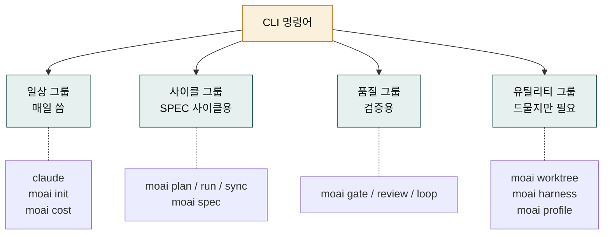
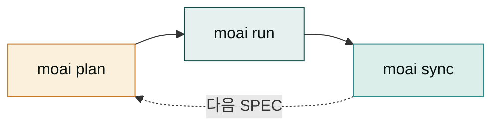
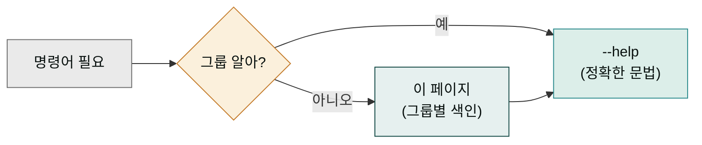

## 명령어를 그룹으로 정리하는 이유

`claude`와 `moai` 명령어를 합치면 서브커맨드가 수십 개입니다. 이것을 알파벳 순으로 나열하면 찾기 쉽지만, 용도는 파악하기 어렵습니다. "내가 지금 뭘 하려고 하는데 어느 명령을 써야 하지"라는 질문에 알파벳 순 색인은 답을 못 줍니다.

그래서 이 페이지는 명령어를 **용도별 그룹**으로 정리합니다. 알파벳 순은 `--help` 출력로 보면 되고, 이 페이지에서는 "이런 일을 할 때 이 명령"이라는 대응을 잡습니다. 그룹별로 먼저 보고, 그룹 안에서 정확한 명령을 찾는 동선입니다.

## 네 가지 명령어 그룹

CLI 명령은 크게 네 그룹으로 나뉩니다. 각 그룹은 용도와 빈도가 다릅니다.



- **일상 그룹** — 매일 켜고 끄는 명령. 가장 자주 씁니다.
- **사이클 그룹** — SPEC 사이클을 도는 명령. 새 기능을 만들 때마다.
- **품질 그룹** — 사이클 밖에서 품질을 검증하는 명령.
- **유틸리티 그룹** — 자주 안 쓰지만 필요할 때 찾는 명령.

## 일상 그룹

| 명령 | 용도 | 자주 쓰는 형태 |
|------|------|---------------|
| `claude` | Claude Code 세션 시작 | `claude` (그냥 실행) |
| `claude --version` | 버전 확인 | 설치 직후 검증 |
| `claude -p "<prompt>"` | 한 번 질문하고 종료 | 스크립트용 |
| `moai init` | 현재 디렉토리에 .moai/ 생성 | 프로젝트 시작 시 1회 |
| `moai cost` | 토큰 비용 요약 | 주간 정리 |
| `moai cost --by-spec` | SPEC별 비용 | 어느 SPEC이 비용을 많이 먹나 |
| `moai doctor` | 환경 점검 | 이상 있을 때 |

이 그룹은 매일 쓰므로, 명령어가 손에 익으면서 자연스럽게 외워집니다. `claude`와 `moai init`은 가장 자주 치는 두 명령입니다.

## 사이클 그룹

| 명령 | 용도 | 산출물 |
|------|------|--------|
| `moai plan "<요청>"` | SPEC 생성 | `.moai/specs/SPEC-XXX-001/{spec,plan,acceptance}.md` |
| `moai run SPEC-XXX` | SPEC 구현 | 코드 + 테스트 |
| `moai sync SPEC-XXX` | 문서 동기화 | README/CHANGELOG 갱신 |
| `moai spec list` | SPEC 목록 | 진행 중/완료 SPEC 표시 |
| `moai spec show SPEC-XXX` | SPEC 상세 보기 | SPEC 내용 출력 |
| `moai spec audit` | SPEC 정적 검증 | 린트 결과 |



사이클 그룹은 [MoAI-ADK 섹션](../moai-adk/_index.md)에서 깊이 다룬 세 명령(plan·run·sync)과 SPEC 관리 명령을 묶은 것입니다. 이 그룹의 명령들은 항상 SPEC ID를 인자로 받으므로, `moai spec list`로 현재 SPEC ID를 먼저 확인하는 습관이 도움됩니다.

## 품질 그룹

| 명령 | 용도 | 언제 |
|------|------|------|
| `moai gate` | TRUST 5 게이트 수동 실행 | 커밋 전 |
| `moai review` | 코드 리뷰 | PR 생성 전 |
| `moai review --security` | 보안 중점 리뷰 | 보안-sensitive 변경 시 |
| `moai loop` | 자동 고침 루프 | 린트/타입 에러 다수 |
| `moai mx` | @MX 태그 자동 생성 | 프로젝트 세팅 시 |

이 그룹은 [품질 명령어 페이지](../moai-adk/quality-commands.md)에서 다룬 명령들입니다. 사이클과 별개로, 필요할 때 수동으로 부릅니다.

## 유틸리티 그룹

| 명령 | 용도 | 빈도 |
|------|------|------|
| `moai worktree new SPEC-XXX` | 병렬 작업용 worktree 생성 | 팀 작업 시 |
| `moai worktree list` | worktree 목록 | 정기 점검 |
| `moai worktree done SPEC-XXX` | worktree 정리 | PR 머지 후 |
| `moai harness status` | 학습 서브시스템 상태 | 주간 정리 |
| `moai harness apply` | 학습된 패턴 적용 | 확인 후 |
| `moai harness rollback` | 학습 롤백 | 잘못 학습 시 |
| `moai profile` | 사용자 프로필 관리 | 환경 변경 시 |
| `moai feedback` | 이슈 리포트 | 버그 발견 시 |

유틸리티 그룹은 자주 안 쓰지만, 필요할 때 꼭 알아야 합니다. 특히 `moai feedback`은 도구 자체에 문제가 있을 때 공식 이슈 리포트 채널이므로 기억해 둘 가치가 있습니다.

## 명령어 도움말

각 명령어에는 `--help` 플래그가 있습니다. 정확한 문법이 기억 안 날 때 즉시 치면 됩니다.

```bash
moai --help                    # 최상위 도움말
moai spec --help               # spec 서브커맨드 도움말
moai spec list --help          # spec list의 세부 옵션
moai plan --help               # plan의 모든 플래그
```

`--help`는 항상 최신입니다. 이 색인 페이지보다 정확합니다. 그래서 이 페이지는 "어떤 그룹에 무슨 명령이 있나"를 잡는 용도로 쓰고, 정확한 문법은 `--help`로 확인하는 동선이 권장됩니다.



## 다음 단계

[다중 LLM 안내](./multi-llm.md)에서 GLM/cg/glm 모드의 상세를 다룹니다. 일상 사용 섹션에서 가볍게 다룬 것의 심화 버전입니다.

---

### Sources

- MoAI CLI 레퍼런스 원본: <https://adk.mo.ai.kr/ko/getting-started/cli/>
- Claude Code CLI 가이드: <https://code.claude.com/docs/en/cli>
- MoAI 유틸리티 명령어: <https://adk.mo.ai.kr/ko/utility-commands/>
