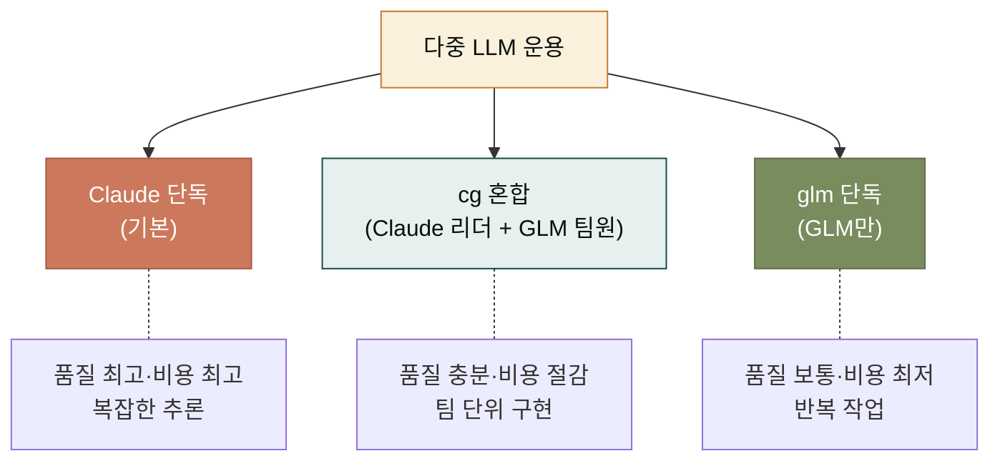
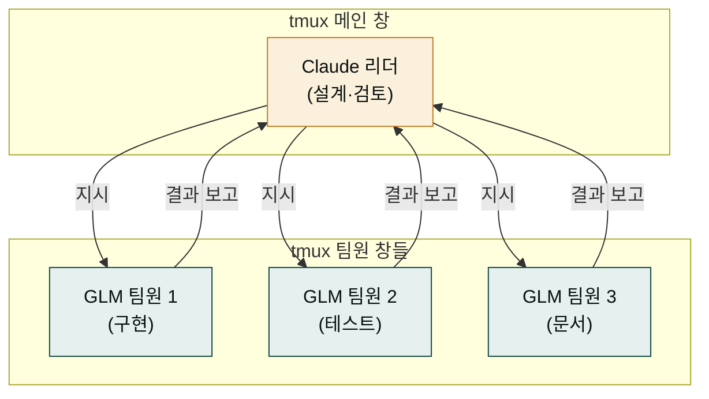
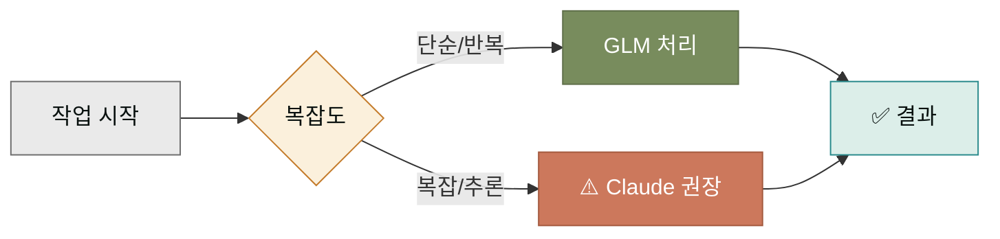
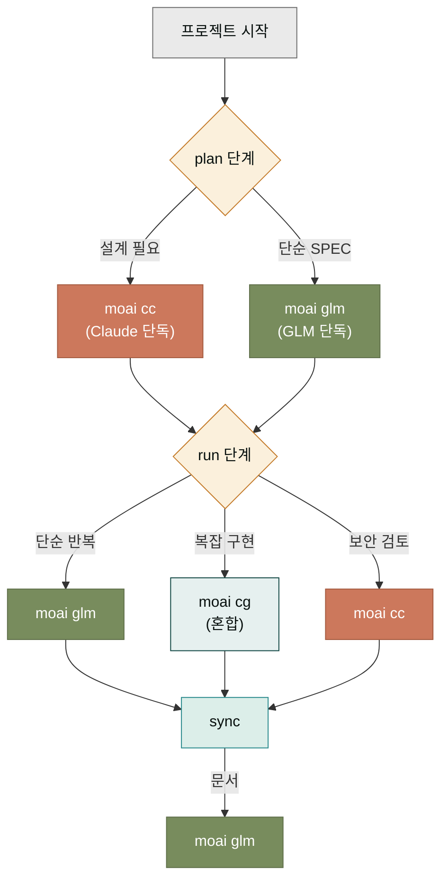

## 왜 다중 LLM인가

하나의 LLM만 쓰면 단순하지만 비용이 비쌉니다. Claude는 품질이 뛰어나지만 토큰당 단가가 높고, 복잡한 추론이 필요 없는 반복 작업에까지 Claude를 쓰면 한 달 예산이 금방 바닥납니다. 그래서 MoAI는 Claude와 GLM(Zhipu AI)을 상황에 따라 갈라 쓰는 다중 LLM 전략을 지원합니다.

이것은 단순한 비용 절감이 아니라 작업의 성격에 맞추는 전략입니다. Claude는 깊은 추론·보안 분석·설계 결정에 강하고, GLM은 구현·테스트·문서 작성 같은 패턴화된 작업에 충분한 품질을 더 낮은 비용으로 제공합니다. 두 모델의 강점을 작업 종류에 따라 배합하는 것이 이 페이지의 주제입니다.

## 세 가지 운용 모드

MoAI는 세 가지 운용 모드를 지원합니다. 일상 사용 섹션에서 가볍게 소개했고, 여기서는 각 모드의 상세를 다룹니다.



각 모드는 켜는 방법과 어울리는 상황이 다릅니다. 표로 정리하면 다음과 같습니다.

| 모드 | 켜는 명령 | 어울리는 작업 | 예상 비용 절감 |
|------|---------|------------|---------------|
| Claude 단독 | `claude` 또는 `moai cc` | 설계·보안·복잡한 추론 | 0% (기준) |
| cg 혼합 | `moai cg` (tmux 필요) | 팀 단위 구현·문서 작성 | 30-40% |
| glm 단독 | `moai glm` | 테스트 작성·단순 구현 | 60-70% |

## 모드 1 — Claude 단독 (moai cc)

가장 기본 모드입니다. `moai cc`를 치면 Claude Code 세션이 켜지고, 모든 작업을 Claude로 처리합니다. 품질은 가장 좋지만 비용도 가장 높습니다.

```bash
moai cc                # 기본 — Claude Code 세션 시작
moai cc -p work        # 프로필 'work'로 시작 (예: 업무용 환경)
```

어울리는 상황은 다음과 같습니다.

- **설계·아키텍처 결정** — 다단계 추론이 필요
- **보안 리뷰** — Claude의 보안 훈련 강점 활용
- **복잡한 디버깅** — 여러 가설을 세우고 검증해야 하는 문제
- **새 프로젝트 초기 설계** — 향후 방향성에 큰 영향

이 모드는 가장 단순하지만 비용이 가장 높으므로, 작업 종류가 복잡한 추론이 아닐 때는 다른 모드로 전환하는 것이 좋습니다.

## 모드 2 — cg 혼합 (moai cg)

`moai cg`는 Claude와 GLM이 한 팀으로 일하는 혼합 모드입니다. Claude가 리더로 전체 흐름을 잡고, GLM 팀원들이 구현을 담당합니다. tmux 환경에서 동작하며, 리더와 팀원이 각각의 tmux 창에서 작업합니다.

```bash
tmux new-session -s moai-cg    # tmux 세션 먼저 생성
moai cg                        # 그 안에서 cg 모드 시작
```



cg 모드의 강점은 병렬 처리입니다. 직렬로 하면 1시간 걸릴 구현·테스트·문서 작업을 세 팀원이 병렬로 하면 20분으로 줄어듭니다. Claude가 검토하는 단계만 직렬로 남아 있어, 전체 사이클이 빨라집니다.

cg 모드를 쓸 때 주의할 점은 **파일 충돌**입니다. 여러 팀원이 같은 파일을 동시에 고치면 충돌이 납니다. 그래서 팀원마다 담당 파일 영역을 나누는 것이 중요합니다. MoAI는 이것을 자동으로 조정하긴 하지만, 사용자가 명시적으로 영역을 나눠 주면 더 안전합니다.

## 모드 3 — glm 단독 (moai glm)

`moai glm`은 Claude 없이 GLM만 쓰는 모드입니다. 가장 저렴하지만, 복잡한 추론에서는 한계가 있습니다. 반복적이고 패턴화된 작업에 어울립니다.

```bash
moai glm                # GLM 단독 모드
```



glm 단독은 특히 다음 작업에 어울립니다.

- **테스트 코드 작성** — 이미 있는 함수의 테스트 케이스를 여러 개 만들 때
- **단순한 구현** — 비슷한 패턴의 CRUD 함수, 보일러플레이트 코드
- **문서 자동 생성** — 코드에서 API 문서 추출, docstring 작성
- **코드 포매팅·정리** — 린트 에러 수정, import 정렬

반면 다음 작업에는 부적합합니다.

- **아키텍처 설계** — GLM의 추론 깊이가 부족
- **보안 분석** — Claude의 보안 훈련이 필요
- **복잡한 디버깅** — 다단계 가설 검증이 어려움

## 백엔드 전환의 시점

세 모드를 언제 전환하는가가 비용 최적화의 핵심입니다. 한 프로젝트 안에서도 작업 종류에 따라 모드를 바꿀 수 있습니다.



이 그림처럼, 한 사이클 안에서도 단계마다 모드를 바꾸는 것이 이상적입니다. 하지만 매번 모드를 바꾸는 것이 귀찮다면, 한 프로젝트는 한 모드로 통일해도 됩니다 — 비용 절감 효과만 조금 줄어들 뿐, 품질이 무너지지는 않습니다.

## 비용 추적과 모드 선택

모드 선택은 비용 추적과 함께 해야 합니다. `moai cost`로 한 달 사용량을 보고, 어느 작업에 비용이 몰려 있는지 파악하면, 그 작업을 더 저렴한 모드로 돌릴 수 있습니다.

```bash
moai cost --month            # 이번 달 요약
moai cost --by-spec          # SPEC별 비용
moai cost --by-mode          # 모드별 비용 (cc/cg/glm)
```

`moai cost --by-mode`를 보면 cc 모드가 70%, cg가 20%, glm이 10%처럼 나올 수 있습니다. 이때 cc의 절반을 cg로 옮기면 전체 비용이 30% 정도 줄어듭니다. 이런 식의 점진적 전환이 현실적입니다.

## 다음 단계

[고급 주제](./advanced.md)에서 worktree(병렬 SPEC 진행), profile(환경 관리), harness(학습 서브시스템)를 다룹니다. cg 모드의 파일 충돌 관리와 함께 자주 찾는 주제입니다.

---

### Sources

- MoAI 다중 LLM 원본 문서: <https://adk.mo.ai.kr/ko/multi-llm/>
- MoAI 비용 최적화 가이드: <https://adk.mo.ai.kr/ko/cost-optimization/>
- GLM (Zhipu AI) 소개: <https://www.zhipuai.cn/>
