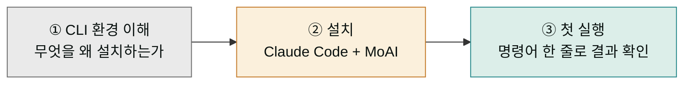
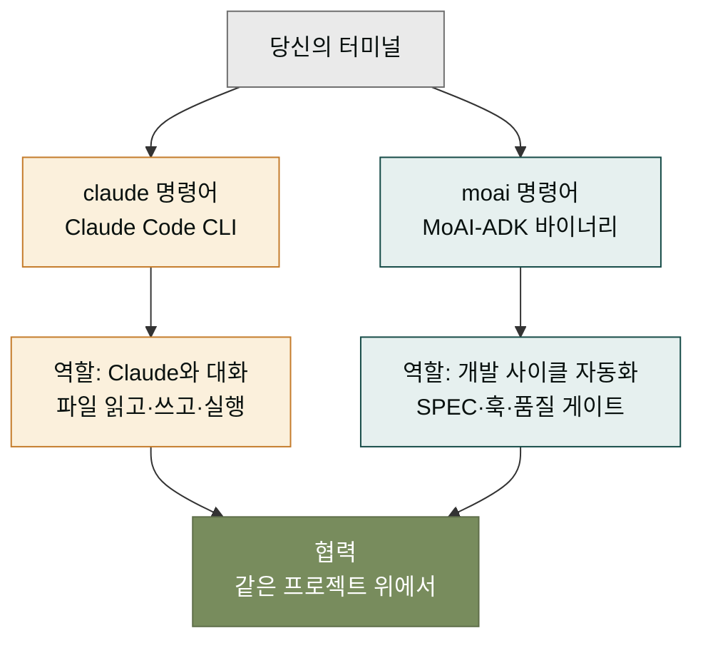

## CLI 시작하기 섹션에서 다루는 것

이 섹션은 CLI 축의 첫 발을 내딛는 분들을 위한 안내입니다. "터미널에서 Claude를 부른다"는 말이 처음에는 낯설게 들릴 수 있습니다. 데스크탑 앱에서 클릭 한 번이면 끝나던 일을 굳이 키보드로 쳐야 할 이유가 있을까 의문이 들기도 합니다. 이 섹션은 그 의문에 답하면서, 실제로 한 번 설치하고 실행해 보는 것까지 마무리합니다.

CLI 환경의 가치는 한마디로 **"반복 가능하고, 기록으로 남고, 자동화할 수 있는"** 작업 흐름에 있습니다. 데스크탑 앱은 한 번의 클릭이 편리하지만, 같은 작업을 스무 번 반복하거나 다른 팀원과 절차를 공유해야 할 때는 한계가 옵니다. CLI는 명령어가 곧 문서이고 기록이며, 더 나아가 자동화 스크립트의 재료가 됩니다. MoAI-ADK는 이 CLI 환경 위에서 동작하는 개발 사이클 프레임워크입니다.

## 이 섹션의 학습 동선

이 섹션을 마치면 다음이 가능해집니다. 세 단계는 순서대로 진행하는 것을 권합니다.

- **CLI 환경 이해** — 왜 두 가지 도구(Claude Code CLI와 MoAI-ADK 바이너리)를 설치하는지, 각각 무슨 역할인지.
- **설치** — 실제로 터미널에서 설치 명령을 실행하고, 버전 확인까지 마치는 과정.
- **첫 실행** — `claude` 한 줄로 대화를 시작하고, `moai` 한 줄로 프로젝트를 세팅하는 실습.

## 두 도구의 역할 분담

이 섹션을 이해하는 열쇠는 **두 도구가 하는 일이 다르다**는 점을 명확히 아는 것입니다. 같은 CLI 환경에 있지만, 둘은 담당 층이 다릅니다. 이 둘의 관계를 먼저 잡고 가면 이후 섹션의 모든 명령어가 헷갈리지 않습니다.

**Claude Code CLI**는 Claude와 대화하는 층입니다. `claude` 명령어를 치면 Claude가 프로젝트 파일을 읽고, 코드를 수정하고, 명령을 실행해 결과를 돌려줍니다. 데스크탑 앱이 하던 일을 터미널에서 그대로 하는 셈입니다. 이 층만 있어도 코딩 보조 도구로 충분히 쓸 수 있습니다.

**MoAI-ADK 바이너리**는 그 위에 올라가는 개발 사이클 자동화 층입니다. `moai` 명령어는 SPEC 문서를 만들고, 구현 단계를 품질 게이트로 검증하며, 훅 스크립트로 작업 흐름을 강제합니다. Claude Code가 "손"이라면, MoAI-ADK는 "작업 절차서"에 가깝습니다. 절차서 없이도 손은 움직이지만, 절차서가 있으면 매번 같은 품질이 나옵니다.

## 두 가지 진입 경로

이미 사용 중인 환경에 따라 진입 경로가 두 가지로 갈립니다. 어느 쪽이 본인에게 해당하는지 확인한 뒤, 알맞은 설치 페이지로 들어가세요.

- **처음부터 시작** — Claude Code CLI도, MoAI-ADK 바이너리도 없는 상태. [설치하기](./install.md) 페이지에서 두 도구를 한 번에 설치합니다.
- **데스크탑 플러그인에서 넘어오는 경우** — 이미 moai-code 플러그인을 Claude Desktop에 설치해 쓰고 있고, 이제 바이너리를 더하는 상태. [설치하기](./install.md) 페이지 중 moai 바이너리 추가 부분만 진행하면 됩니다.

두 경로 모두 [첫 SPEC 실행](./first-spec.md) 페이지에서 하나로 합쳐져, 첫 번째 SPEC 문서를 만들고 `/moai plan → run → sync` 사이클을 한 번 돌리는 실습으로 마무리됩니다.

## 이 섹션이 다루지 않는 것

이 섹션은 "처음 깔고 켜 보는 것"까지 다룹니다. 다음 주제는 뒤의 다른 섹션에서 다루므로 여기서는 가볍게 언급만 하고 넘어갑니다.

- **SPEC·DDD·TRUST 5의 설계 철학** — 핵심 개념 섹션에서 왜 그런 구조인지 깊이 다룹니다.
- **명령어 전체 색인** — 레퍼런스 섹션에서 한 번에 정리합니다.
- **비용 최적화** — GLM 백엔드나 cg 모드 등 비용 절감 전략은 레퍼런스 섹션의 multi-llm 페이지에서 다룹니다.

## 다음 단계

[설치하기](./install.md) 페이지로 이동해 두 도구를 실제로 깔아 보세요. 이미 설치를 마친 상태라면 [첫 SPEC 실행](./first-spec.md)으로 곧바로 넘어가도 됩니다.

---

### Sources

- Claude Code 공식 설치 가이드: <https://code.claude.com/docs/en/setup>
- MoAI-ADK 빠른 시작 원본 문서: <https://adk.mo.ai.kr/ko/getting-started/quickstart/>
- Claude Code CLI 개요: <https://code.claude.com/docs/en/cli>
