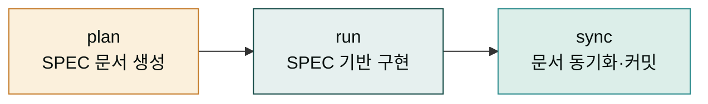
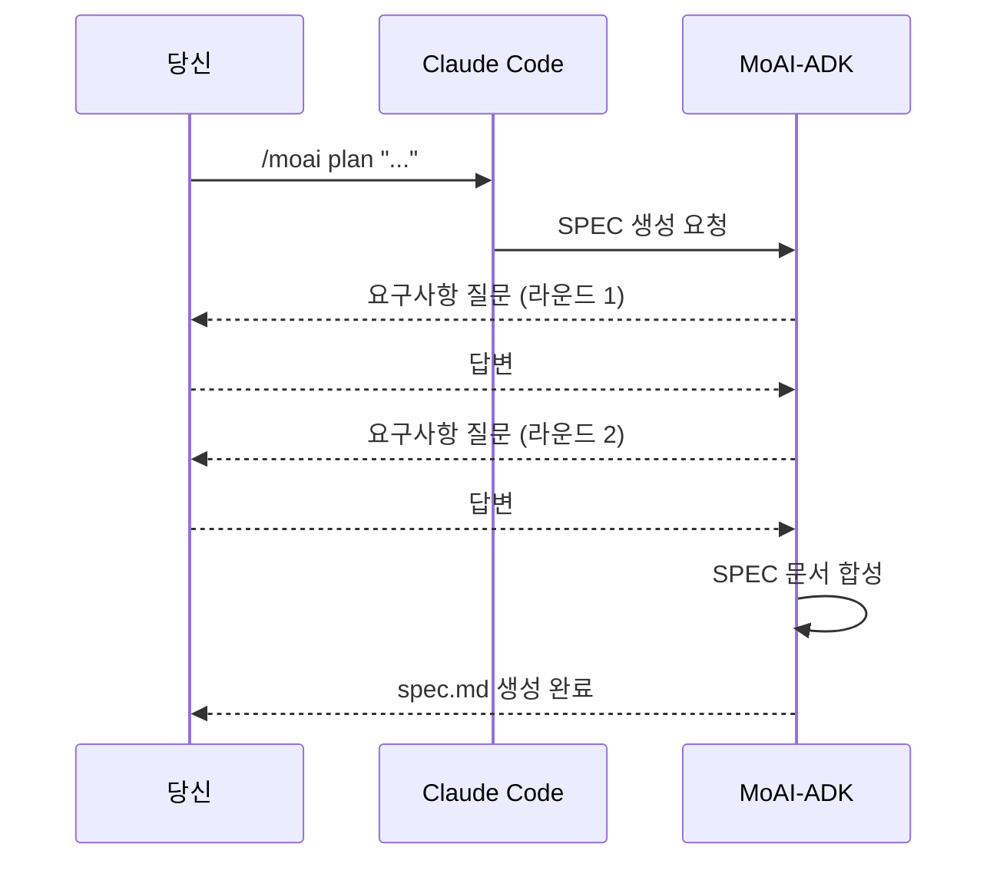

## 이 페이지에서 할 일

이 페이지에서는 MoAI-ADK의 핵심 개발 사이클을 아주 작은 규모로 한 번 완주합니다. 큰 프로젝트가 아니라 "Hello world를 출력하는 함수 하나" 정도의 작은 과제를 들고, 그것을 SPEC으로 정의하고, 구현하고, 문서화까지 마무리합니다. 사이클을 한 번 돌고 나면 이후 모든 MoAI 명령어가 "아, 그 흐름의 일부구나" 하고 자리 잡습니다.

왜 이렇게 작은 규모로 시작할까요? MoAI-ADK는 구조화된 개발 사이클을 강제하는 프레임워크입니다. 이 구조가 처음에는 번거롭게 느껴질 수 있습니다. 하지만 한 번이라도 사이클을 완주해 보면, 그 번거로움이 왜 붙었는지 — 그리고 어떤 상황에서 그것이 큰 힘이 되는지 — 를 몸으로 알게 됩니다. 처음부터 큰 규모로 들어가면 구조의 혜택보다 절차의 무게만 느껴지므로, 가벼운 시작이 중요합니다.

## 사이클 한눈에 보기

이 페이지에서 돌릴 사이클은 다음 세 단계입니다. 각 단계는 하나의 명령어와 짝을 이룹니다.



`/moai plan`은 무엇을 만들지 문서로 정의합니다. `/moai run`은 그 문서를 읽고 구현합니다. `/moai sync`는 구현된 결과물의 문서를 정리합니다. 이 세 단계는 [MoAI-ADK 섹션](../moai-adk/_index.md)에서 더 깊이 다루고, 여기서는 명령어 한 번씩만 쳐 보는 가벼운 버전을 돌립니다.

## 준비 — 작업 디렉토리 만들기

먼저 빈 작업 디렉토리를 만듭니다. 기존 프로젝트에 섞이지 않도록, 이 실습만을 위한 별도 디렉토리에서 진행합니다.

```bash
mkdir moai-first-cycle && cd moai-first-cycle
moai init
```

`moai init`을 실행하면 현재 디렉토리에 `.moai/` 폴더가 생깁니다. 이 안에 SPEC 문서·설정·훈련 데이터가 차곡차곡 쌓입니다. 폴더가 생겼는지 확인합시다.

```bash
ls -la .moai/
```

`.moai/` 디렉토리가 보이면 준비 끝입니다. 이 상태에서 Claude Code를 불러도 되고, 다음 단계처럼 바로 SPEC 생성으로 넘어가도 됩니다.

## 단계 1 — `/moai plan` 으로 SPEC 만들기

이제 무엇을 만들지 정의합시다. 이번 실습의 과제는 "문자열을 받아 Hello, {이름}! 형태로 반환하는 함수"로 하겠습니다. 아주 작지만 SPEC 사이클을 돌리기엔 충분한 과제입니다. 터미널에 다음을 칩니다.

```bash
claude
```

Claude Code 프롬프트가 뜨면 그 안에서 MoAI 명령어를 칩니다.

```
> /moai plan "사용자 이름을 받아 인사말을 반환하는 함수 추가"
```

이 명령을 치면 MoAI가 몇 가지 질문을 던집니다. 어떤 언어로 만들 것인지, 함수 이름은 무엇으로 할지, 테스트는 어떻게 검증할지 등입니다. 이 질문에 답하다 보면 자연스럽게 요구사항이 정리됩니다. 모든 질문에 답하면 `.moai/specs/SPEC-XXX-001/spec.md` 파일이 생성됩니다. 이 파일이 곧 SPEC 문서입니다.



SPEC 문서가 생성되면 내용을 한 번 읽어보세요. "내가 아까 말한 게 이렇게 정리됐구나" 하고 실감하게 됩니다. 이 정리된 문서가 다음 단계의 입력이 됩니다.

## 단계 2 — `/moai run` 으로 구현하기

SPEC 문서가 있으면, 그 문서를 읽고 코드를 구현합니다. 같은 Claude Code 세션에서 다음을 칩니다.

```
> /moai run SPEC-XXX-001
```

`SPEC-XXX-001` 자리에는 방금 생성된 실제 SPEC ID를 넣습니다. 이 명령을 치면 MoAI-ADK가 SPEC을 읽고, 정해진 방법론(DDD 또는 TDD)에 따라 구현에 들어갑니다. 작은 과제이므로 금방 끝납니다. 구현이 끝나면 함수 코드와 테스트 코드가 프로젝트에 추가되어 있을 것입니다.

이 단계에서 MoAI는 SPEC에 적힌 요구사항을 한 줄씩 검증합니다. 요구사항에 맞지 않는 구현은 거절되고, 맞는 구현만 남습니다. 이것이 "구조가 강제하는 품질"입니다. 단순 Hello world에서는 체감이 적지만, 규모가 커질수록 이 검증층의 가치가 뚜렷해집니다.

## 단계 3 — `/moai sync` 로 문서 정리하기

구현이 끝나면 결과물의 문서를 정리합니다. 같은 세션에서 다음을 칩니다.

```
> /moai sync SPEC-XXX-001
```

이 명령은 README, CHANGELOG, API 문서 등을 현재 상태에 맞게 갱신합니다. 구현 중에 잊혀진 문서가 다시 최신화되고, 다음 사람이 이 프로젝트를 볼 때 최신 정보를 볼 수 있게 됩니다. sync가 끝나면 `.moai/specs/SPEC-XXX-001/progress.md`에 사이클 완료 기록이 남습니다.

## 사이클 완료 확인

세 단계를 모두 마쳤다면 상태를 점검합시다. 다음 항목이 모두 성립하면 첫 사이클은 성공입니다.

- `.moai/specs/SPEC-XXX-001/spec.md` 존재 (plan의 산출물)
- 함수 코드와 테스트 코드가 구현되어 있음 (run의 산출물)
- README 또는 CHANGELOG가 최신 상태 (sync의 산출물)
- `progress.md`에 세 단계 완료 기록 존재

이 네 가지가 잡혀 있으면, MoAI의 핵심 사이클을 한 번 경험한 것입니다. 축하합니다 — 이 경험이 다음 모든 페이지의 기준점이 됩니다.

## 다음 단계

이제 사이클을 한 번 돌렸으니, 그 사이클이 왜 이런 구조인지 설계 철학을 읽을 준비가 되었습니다. [핵심 개념 섹션](../concepts/_index.md)에서 SPEC·DDD·TRUST 5가 무슨 일을 하는지, 그리고 왜 그것이 도움이 되는지를 다룹니다. 사이클의 형태를 먼저 체감했으니, 이제 그 형태가 왜 이런지 이해하는 것이 훨씬 수월할 것입니다.

---

### Sources

- MoAI-ADK 빠른 시작 원본 문서: <https://adk.mo.ai.kr/ko/getting-started/quickstart/>
- MoAI 워크플로우 명령어 원본 문서: <https://adk.mo.ai.kr/ko/workflow-commands/>
- SPEC 기반 개발 개념: <https://adk.mo.ai.kr/ko/core-concepts/spec-based-dev/>
