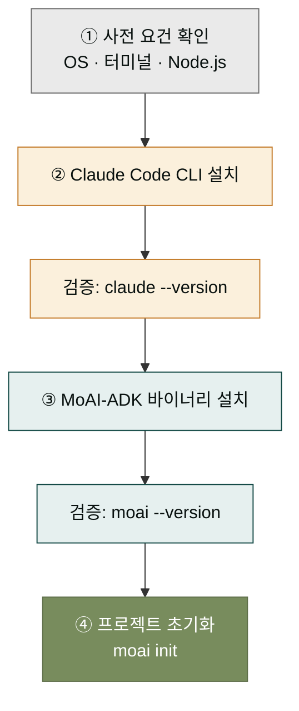

## 설치 전 알아둘 것

이 페이지에서는 두 도구를 차례로 설치합니다. 먼저 **Claude Code CLI**(이하 `claude`)를 깔아 Claude와 대화할 수 있는 기반을 만들고, 그 위에 **MoAI-ADK 바이너리**(이하 `moai`)를 더해 개발 사이클 자동화 층을 올립니다. 두 도구는 독립적으로도 동작하지만 함께 쓸 때 본래의 설계 의도가 발휘됩니다.

설치 전에 시스템 요건을 먼저 확인합시다. 다음 조건이 갖춰져 있어야 설치가 막히지 않습니다.

- 운영체제: macOS 12+, 주요 Linux 배포판(Ubuntu 22.04+, Fedora 38+ 권장), 또는 Windows 10/11
- 터미널: 기본 터미널 앱(macOS Terminal, Linux GNOME Terminal, Windows Terminal 등)
- 인터넷 연결: 설치 시점에만 필요, 실행은 오프라인도 부분 가능
- (옵션) Node.js 18+: 일부 확장 기능 사용 시 필요

이 요건은 최소 기준이며, 더 최신 버전일수록 호환성이 좋습니다. Windows의 경우 WSL2를 거치는 경로를 더 권장하지만, 이 페이지에서는 네이티브 설치 경로까지 함께 다룹니다.

## 설치 흐름 개요

설치는 단순히 명령어를 치는 것으로 끝나지 않습니다. 각 단계에서 "이 단계가 왜 필요한지, 끝나면 무슨 상태가 되는지"를 확인하면서 진행합시다. 아래 다이어그램은 전체 흐름을 한눈에 보여줍니다.



각 상자의 검증 단계는 "이 단계가 끝났는지"를 판별하는 신호입니다. 검증 명령이 버전 번호를 돌려주지 않으면 다음 단계로 넘어가지 마세요 — 설치가 끝나지 않은 상태에서 다음 단계로 가면 실패 원인을 추적하기 어렵습니다.

## 단계 1 — Claude Code CLI 설치

Claude Code CLI는 공식 설치 스크립트로 설치합니다. 터미널을 열고 다음 명령어를 실행합니다.

```bash
# macOS / Linux
curl -fsSL https://claude.ai/install.sh | bash

# Windows (PowerShell)
irm https://claude.ai/install.ps1 | iex
```

설치가 끝나면 터미널을 새로 다시 열거나 셸 설정을 다시 읽어 들입니다. 그 다음 아래 명령어로 설치를 검증합니다.

```bash
claude --version
```

버전 번호(예: `claude 2.1.x`)가 출력되면 Claude Code CLI 설치는 끝입니다. 처음 한 번은 `claude` 명령어를 실행해 Claude 계정 로그인을 마쳐야 합니다. 브라우저가 열리고 인증 절차가 진행되며, 끝나면 터미널로 돌아와 대화가 가능해집니다.

## 단계 2 — MoAI-ADK 바이너리 설치

Claude Code CLI 위에 MoAI-ADK 자동화 층을 더합니다. 공식 설치 스크립트를 사용합니다.

```bash
# macOS / Linux
curl -fsSL https://moai-adk.dev/install.sh | bash

# Windows (PowerShell)
irm https://moai-adk.dev/install.ps1 | iex
```

설치 후 터미널을 새로 열고 버전을 확인합니다.

```bash
moai --version
```

버전이 출력되면 MoAI-ADK 바이너리 설치도 끝입니다. 이 상태에서 `moai init`을 한 번 실행하면 현재 디렉토리에 MoAI 설정 파일(`.moai/` 디렉토리)이 생성됩니다. 이 디렉토리가 앞으로 SPEC 문서·품질 게이트·훅 설정이 담기는 작업 공간이 됩니다.

## 단계 3 — 플러그인 연동 (옵션)

데스크탑에서 moai-code 플러그인을 이미 쓰고 있었다면, 이제 CLI 환경까지 플러그인이 자동으로 인식됩니다. 플러그인이 Claude Code와 같은 디렉토리(`~/.claude/plugins/`)에 설치되어 있으면, 터미널에서도 같은 스킬·명령어가 작동합니다.

새로 설치하는 분은 플러그인을 먼저 설치할 필요가 없습니다. MoAI-ADK 바이너리만 있어도 핵심 개발 사이클은 그대로 동작합니다. 플러그인은 데스크탑 앱 사용자를 위한 추가층이며, CLI 사용자에게는 필수가 아닙니다. 두 환경의 관계는 MoAI-ADK 섹션의 [브리지 내러티브](../moai-adk/bridge.md)에서 자세히 다룹니다.

## 검증 체크리스트

설치가 끝났다면 아래 항목을 한 번씩 점검합시다. 한 항목이라도 실패하면 뒤의 실습이 막히므로, 반드시 모든 항목이 통과한 상태에서 다음 페이지로 넘어가야 합니다.


세 검증이 모두 통과하면, 이 터미널 환경은 이후 모든 CLI 섹션 페이지의 실습을 따라갈 준비가 된 것입니다.

## 자주 발생하는 문제

설치 중 자주 만나는 문제와 해법을 정리합니다. 더 자세한 트러블슈팅은 뒤의 레퍼런스 섹션에서 다룹니다.

- **명령어를 찾을 수 없다는 오류** — 설치 후 터미널을 새로 열지 않은 경우가 가장 흔합니다. 새 터미널을 열거나 `source ~/.zshrc` / `source ~/.bashrc`를 실행하세요.
- **`claude` 로그인이 안 됨** — 브라우저가 자동으로 열리지 않으면, 터미널에 표시되는 URL을 직접 복사해 브라우저에 붙여넣으세요.
- **Windows에서 스크립트 실행 차단** — PowerShell 실행 정책이 기본 제한되어 있을 수 있습니다. `Set-ExecutionPolicy -Scope CurrentUser RemoteSigned`로 현재 사용자 범위에서 풀 수 있습니다.
- **회사 네트워크에서 설치 스크립트 차단** — 프록시 환경변수(`HTTPS_PROXY`) 설정이 필요할 수 있습니다. 네트워크 관리자에게 확인하세요.

## 다음 단계

설치가 끝났다면 [첫 SPEC 실행](./first-spec.md)에서 실제로 한 번 사이클을 돌려봅니다. 처음부터 끝까지 한 번 돌려보는 것이 MoAI-ADK의 흐름을 익히는 가장 빠른 길입니다.

---

### Sources

- Claude Code 공식 설치 가이드: <https://code.claude.com/docs/en/setup>
- MoAI-ADK 설치 원본 문서: <https://adk.mo.ai.kr/ko/getting-started/installation/>
- Windows 환경 가이드: <https://adk.mo.ai.kr/ko/getting-started/windows-guide/>
