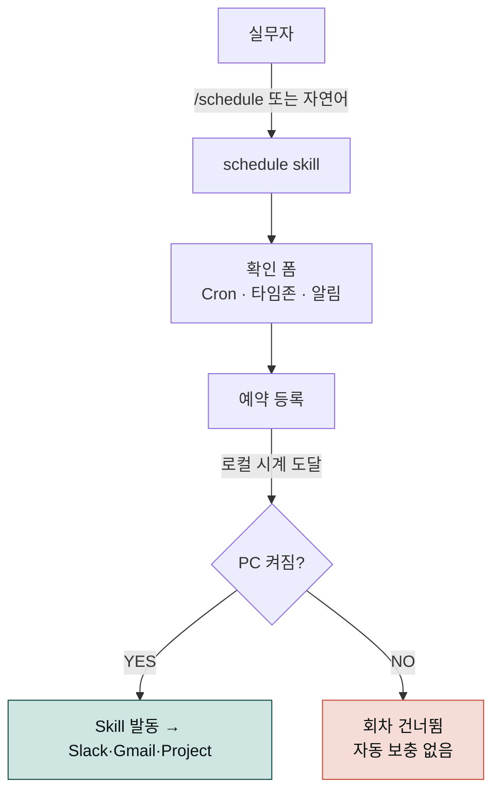
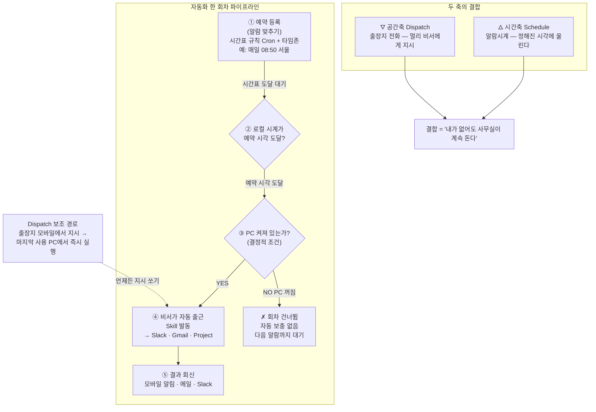
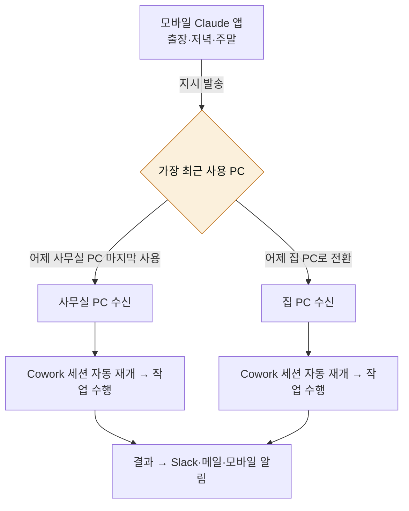
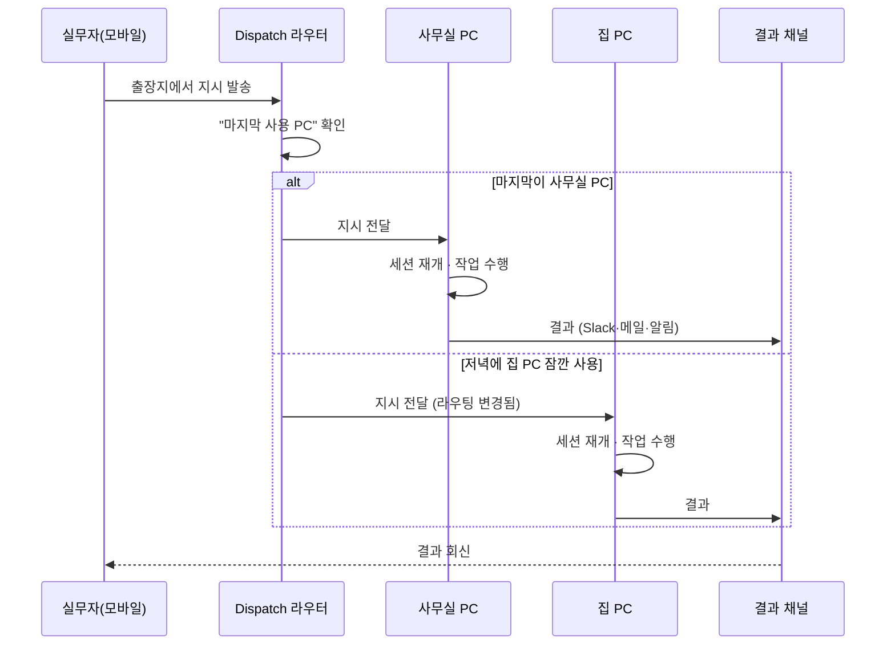
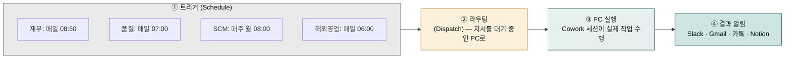
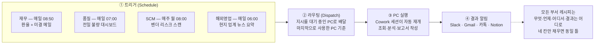
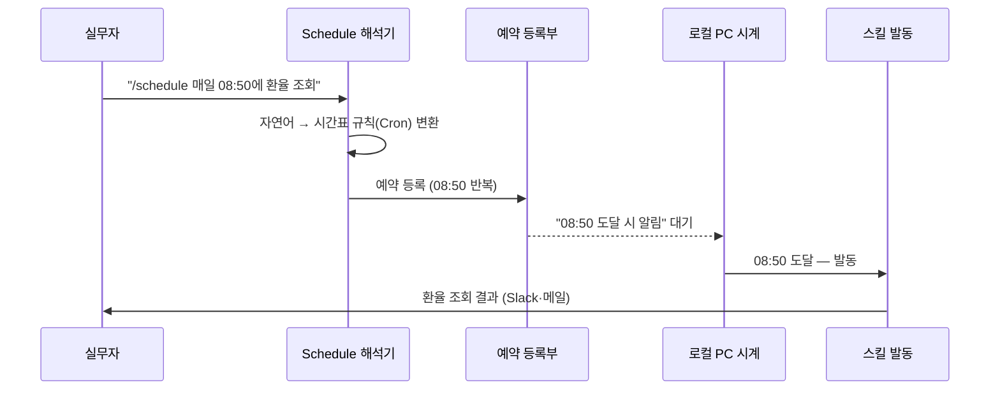
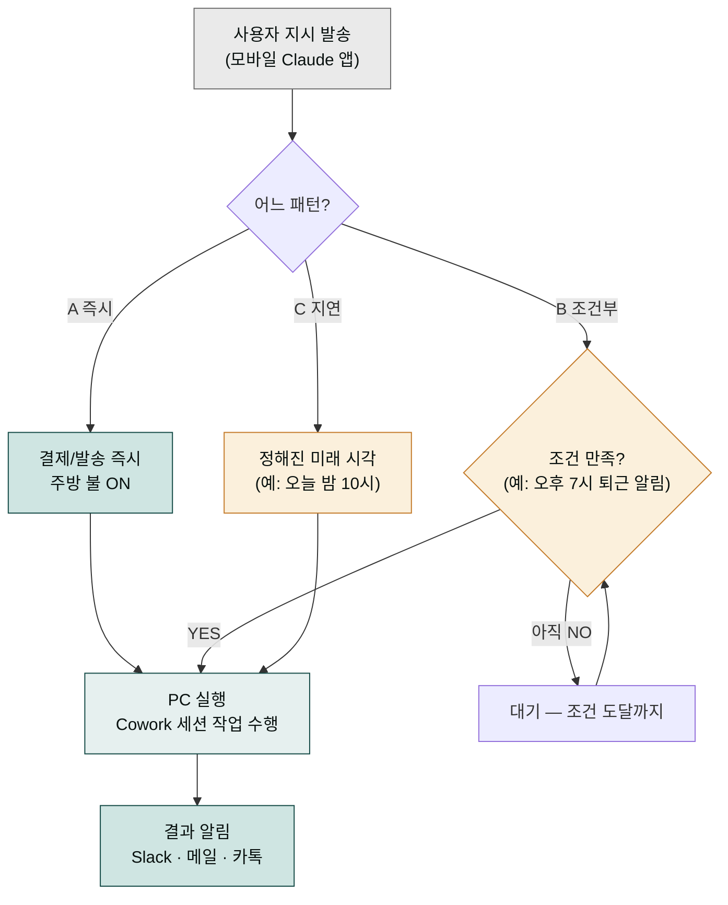

> Schedule은 **시간의 자동화**, Dispatch는 **공간의 확장**입니다. 둘을 결합하면 "내가 자리에 없어도 내 AI 직원은 계속 일하는" 상태가 만들어집니다.

현장에서 검증된 레시피를 본부별로 정리합니다.

## 기본 원리: 시간축과 공간축을 합쳐 "사람 없이 도는 사무실" 만들기

Schedule과 Dispatch는 각각 다른 축의 자동화를 담당합니다. Schedule은 **시간의 자동화**로 "정해진 시각에 알람이 울리면 작업을 시작한다"는 역할을 맡고, Dispatch는 **공간의 확장**으로 "내가 자리에 없어도 멀리 있는 PC로 지시를 보낸다"는 역할을 맡습니다. 둘을 합치면 비로소 "내가 잠들거나 출장을 가도 사무실이 계속 돌아간다"는 상태가 만들어집니다. 한쪽만 있으면 부족합니다 — Schedule만 있으면 자리 비운 시간엔 실행을 시작할 수 없고, Dispatch만 있으면 매번 손으로 지시를 쳐야 합니다.

집 안의 두 가지 장치에 비유하면 원리가 분명해집니다. Schedule은 **매일 같은 시간에 울리는 알람시계**입니다 — 내가 자고 있어도 아침 8시 50분이 되면 울립니다. Dispatch는 **출장지에서 사무실 비서에게 거는 전화**입니다 — 내가 부산에 있어도 서울 비서에게 "환율 확인해줘"라고 지시를 내릴 수 있습니다. 이 둘이 합쳐지면, 알람이 울린 직후 비서가 스스로 일어나 출근해 환율을 확인하고, 나는 출장지에서 전화로 추가 지시를 던집니다. 즉 알람(Schedule)이 울릴 때 비서(Dispatch 수신 PC)가 사무실에 대기하고 있어야, 비로소 "내가 없어도 사무실이 돈다"는 자동화 한 조각이 완성됩니다.

아래 흐름도는 Schedule 한 회차가 시작될 때 "PC가 켜져 있는가"가 결정적 조건임을 보여줍니다. 알람은 울리되(PC 시각 도달), 사무실 문이 잠겨 있으면(PC 꺼짐) 비서는 일할 수 없습니다 — 그 회차는 건너뛰어지고, 다음 알람까지 기다립니다. 이것이 "PC를 항상 켜두어라"는 운영 수칙이 존재하는 이유입니다.





## Schedule — 예약을 걸 때 알아야 할 기본 용어

Schedule을 등록하려면 예약의 뼈대가 되는 몇 가지 용어를 먼저 짚고 넘어가야 합니다. 이 용어들이 등록 폼의 항목이기 때문입니다. **Cron**(크론)은 "매일 아침 8시 50분에 울려라"처럼 반복 시각을 적어두는 시간표 규칙입니다. 한 번 정해두면 내가 매번 알람을 다시 맞출 필요 없이 같은 패턴으로 계속 반복됩니다. **타임존**(시간대)은 "어느 나라 시계를 기준으로 볼 것인가"입니다 — 서울 시계로 8시 50분인 것과 런던 시계로 8시 50분인 것은 실제 시각이 9시간 다릅니다. 해외 출장이 잦은 사람이 이것을 헷갈리면 예약이 엉뚱한 시각에 울립니다.

외부 서비스 연결도 한 가지 알아둘 것이 있습니다. Schedule이 Slack이나 Gmail 같은 **외부 MCP**(프로그램끼리 연결해주는 다리)에 처음 접근할 때, 시스템은 "이 앱이 회원님의 Slack에 접근해도 됩니까?"라고 한 번 물어봅니다. 이것이 **최초 1회 승인**입니다. 스마트폰에서 새 앱을 처음 깔았을 때 "사진 접근을 허용하시겠습니까?"라고 묻는 창과 같은 원리입니다. 한 번 허락하면 그다음부터는 다시 묻지 않고 자동으로 연결됩니다.

### Schedule 핵심 팩트

- **호출 방법** — `/schedule` 슬래시 명령 또는 자연어 ("매일 아침 8시에 X 실행해줘")
- **시간 기준** — 로컬 PC 시계 (UTC 아님). 서머타임 구간 주의
- **실행 조건** — PC 켜짐 + Cowork 실행 중. 꺼진 PC는 회차 스킵
- **외부 MCP 쓰기** — 최초 1회 명시적 승인 필요

## Dispatch — 모바일에서 PC로 지시 쏘기



### Dispatch 라우팅 원리: "가장 최근에 문을 연 사무실"로 배달된다

Dispatch는 사용자가 보낸 지시가 어느 PC로 갈지 **"가장 마지막으로 사용한 PC"**를 기준으로 정합니다. 우체부 비유로 이해하면 쉽습니다. 매일 아침 집에서 나와 사무실로 출근하면 우체부는 "이 사람의 활동 거점이 지금 사무실이구나"라고 판단해 우편물을 사무실로 배달합니다. 그런데 퇴근길에 집 PC를 잠깐 켜서 메일만 확인하고 가면, 우체부는 "아, 지금은 집에서 일하는구나"라고 착각해 다음 우편물을 집으로 보냅니다. 이것이 "집 PC를 저녁에 잠깐 열면 라우팅이 집으로 넘어간다"는 현상의 원인입니다.

이 원리를 모르면 사용자는 규칙을 기계적으로 외우기만 하고, 막상 현장에서는 "왜 내 야간 보고서가 사무실 PC가 아니라 집 PC로 갔지?" 하고 당황하게 됩니다. 중요한 야간 배치 작업을 사무실 PC에서 돌려야 한다면, 저녁에는 아예 집 PC의 문을 열지 않는 것이 가장 확실한 예방책입니다. 아래 시퀀스는 지시가 발송되는 순간부터 결과 알림이 돌아오기까지, "마지막 사용 PC"가 어떻게 라우팅을 결정하는지를 시간 순서로 보여줍니다.



### 현장 규칙 3가지

1. **작업받을 PC를 마지막으로 사용한 상태로 두고 나가기** — Dispatch는 "마지막으로 사용한 PC"로 라우팅되므로, 출근할 때 사무실 PC로 일하고 퇴근할 때 집 PC를 켜지 말아야 사무실 PC가 야간 지시를 받습니다.
2. **집 PC를 잠깐 열면 라우팅이 집 PC로 넘어감** — 저녁에 집 PC로 메일만 확인해도 라우팅이 바뀝니다. 중요한 야간 배치가 있으면 집 PC를 아예 켜지 마세요.
3. **출장 전 사무실 PC 대기 상태 확인** — 절전 모드·자동 종료 스케줄·Windows Update 재부팅을 모두 해제해야 합니다.


**제약** — Pro·Max·Team·Enterprise 플랜, PC 켜짐, 네트워크 연결 필수. **원격 부팅(WOL)은 지원하지 않습니다.**


## 본부별 레시피
## 부서별 레시피는 달라 보여도 한 줄의 흐름을 따른다

재무·품질·SCM·해외영업 레시피를 나란히 놓고 보면 부서마다 다루는 내용이 전혀 달라 보입니다. 환율을 확인하는 재무팀, 불량 데이터를 모으는 품질팀, 벤더 리스크를 훑는 SCM팀, 해외 뉴스를 번역하는 해외영업팀. 하지만 이 네 레시피는 겉보기에만 다를 뿐, 모두 같은 한 줄의 흐름을 통과합니다. 바로 **트리거(시작 알람) → 라우팅(지시를 어느 PC로 보낼지 정함) → PC 실행(Cowork 세션이 실제 작업) → 결과 알림(Slack·메일·카톡으로 보고)** 이라는 네 단계입니다. 패스트푸드점 주방 디스플레이를 떠올리면 이해가 쉽습니다. 주문표는 햄버거·샐러드·커피 등 메뉴마다 내용이 다르지만, 모두 같은 주방 라인을 통과합니다 — 주문 접수(트리거) → 주방 표시(라우팅) → 조리(PC 실행) → 픽업 알림(결과 알림). 부서별 레시피도 부서명만 다를 뿐, 그 아래 흐르는 자동화 파이프라인은 하나입니다.

이 통찰을 알면 레시피를 외울 필요가 없습니다. "이 부서는 무엇을, 언제, 어디서 확인하고, 결과를 어디로 받나" 네 칸만 채우면, 어떤 부서든 같은 틀에 넣어 새 레시피를 만들 수 있습니다. 아래 흐름도는 네 부서의 레시피가 같은 파이프라인을 통과하는 모양을 보여줍니다.





### 재무

| 유형 | 시점 | 내용 |
|---|---|---|
| Schedule | 매일 08:50 | 환율 (KRW/USD·JPY·EUR) 조회 + 미결 메일 분류 → Slack `#finance-daily` |
| Dispatch | 출장 중 | 월마감 긴급 확인 — "이번 달 미결 전표 현황 확인해서 경영진 보고 초안 써줘" |

### 품질

| 유형 | 시점 | 내용 |
|---|---|---|
| Schedule | 매일 07:00 | 전일 불량 대시보드 → HTML 리포트 → 공장장 Gmail |
| Dispatch | 해외 공장 방문 중 | "해외공장 이번 주 불량 이슈 Top 3 정리하고 원인 분석해줘" |

### SCM

| 유형 | 시점 | 내용 |
|---|---|---|
| Schedule | 매주 월 08:00 | 벤더 리스크 스캔 (뉴스·주가·공시) → Notion |
| Dispatch | 항공 이동 중 | 발주 승인 초안 — "A벤더 5월 발주 품목 확인하고 결재 초안 써줘" |

### 해외영업

| 유형 | 시점 | 내용 |
|---|---|---|
| Schedule | 매일 06:00 | 현지 (미국·유럽·동남아) 업계 뉴스 요약 |
| Dispatch | 국내 출장 중 | 법인 이슈 브리프 — "베트남 법인 지난주 이슈 Top 5 정리해줘" |

## 실전 등록 예시
## 자연어 한 줄이 어떻게 예약으로 바뀌는가

아래 터미널 예시를 보면 `/schedule` 뒤에 "매일 08:50에 다음을 실행해줘"라는 자연어 지시가 바로 이어집니다. 초보자는 이 한 줄이 어떻게 예약으로 변환되는지 의아합니다. Cron(반복 시각을 적는 시간표 규칙) 표현식을 쓰지도 않았고, 복잡한 설정 폼을 건드리지도 않았는데 "매일 08:50"이 정확히 해석되니까요. 이유는 Schedule이 사용자의 자연어를 뒤에서 자동으로 네 단계로 쪼개기 때문입니다.

호텔 모닝콜에 비유하면 원리가 보입니다. 손님이 프런트에 "내일 아침 8시 50분에 깨워주세요"라고 한마디하면, 프런트 직원은 그 말을 (1) 시간표에 적고 (2) 예약 시스템에 입력하고 (3) 해당 시각까지 기다렸다가 (4) 객실 전화를 울립니다. 손님은 한마디만 했지만 뒤에서 네 단계가 자동으로 돌아갑니다. Schedule도 똑같습니다. 사용자의 자연어 한 줄이 (1) 시간표 규칙(Cron)으로 변환되고 (2) 예약으로 등록되어 (3) 로컬 PC 시계가 그 시각에 도달할 때까지 대기하다가 (4) 스킬을 발동시킵니다. 즉 "매일 08:50에 환율 확인"이라는 한 줄이 뒤에서는 정확한 시간표 → 예약 → 대기 → 발동의 흐름으로 해석되는 것입니다.

아래 시퀀스는 자연어 지시가 입력되는 순간부터 스킬이 발동되기까지, Schedule이 내부적으로 거치는 네 단계를 시간 순서로 보여줍니다.



### 재무 — 매일 아침 환율·미결 메일


> /schedule

매일 08:50에 다음을 실행해줘:
1. 네이버 금융에서 KRW/USD, KRW/JPY, KRW/EUR 환율 조회
2. Gmail에서 어제 이후 안 읽은 이메일 중 "결제·인보이스·정산" 키워드 포함 메일 분류
3. Slack #finance-daily 채널에 환율 + 미결 메일 목록 전송
4. 전날 대비 환율 변동이 ±1% 이상이면 "경고" 표시


### 품질 — 불량 대시보드


> /schedule

매일 07:00에 다음을 실행해줘:
1. D:/QMS/daily_inspection.xlsx에서 어제자 불량 데이터 추출
2. 생산라인별 불량률 집계, 임계치(2%) 초과 라인 강조
3. HTML 리포트를 90_Output/YYYY-MM-DD-quality.html로 저장
4. 공장장(factory@company.com) Gmail로 HTML 첨부 발송


### 해외영업 — 조기 뉴스 브리핑


> /schedule

매일 06:00에 다음을 실행해줘:
1. WebSearch로 "반도체 산업 어제자 주요 뉴스" 검색 (미국·유럽 소스 우선)
2. 주요 기사 5개 선별하여 한국어로 3줄 요약
3. 요약을 Notion "일일 해외 브리핑" 페이지에 오늘 날짜로 추가
4. 카카오톡 나에게 보내기로 Notion URL 푸시


## Dispatch 활용 패턴
## 세 가지 패턴은 "언제 불을 켜느냐"만 다르다

아래 패턴 A·B·C 세 터미널 예시가 연달아 나옵니다. 초보자는 세 가지가 무엇이 다른지 한눈에 잡히지 않아 "언제 어느 패턴을 쓰나"를 헷갈립니다. 핵심은 세 패턴이 모두 같은 축 위에 있다는 점입니다 — 바로 **지시를 언제 실행하느냐**라는 타이밍의 스펙트럼입니다. 패턴 A는 "지금 당장", 패턴 B는 "어떤 조건이 맞을 때", 패턴 C는 "정해진 미래 시각"입니다. 세 가지 모두 같은 주방으로 주문이 들어가지만, 주방 불이 언제 켜지는지만 다릅니다.

배달앱의 주문 버튼 세 종류에 비유하면 명확해집니다. (A) "지금 바로 주문"은 결제 즉시 주방 불이 켜져 조리가 시작됩니다. (B) "도착 예정시간 30분 전이면 조리 시작"은 어떤 조건이 맞을 때 비로소 불이 켜집니다. (C) "저녁 7시에 조리 시작"은 정해진 미래 시각에 불이 켜집니다. 세 버튼 모두 같은 주방으로 가지만 "언제 불이 켜지는가"만 다릅니다. Dispatch 패턴도 같습니다 — 즉시·조건부·지연은 타이밍만 다른 세 가지 주문 버튼입니다. 급하면 A, 상황이 맞을 때만 움직이면 B, 약속된 시각에 돌리면 C를 고르면 됩니다.

아래 흐름도는 같은 지시가 세 패턴에 따라 "언제 실행 단계로 넘어가는지"를 한눈에 비교합니다.



Dispatch는 모바일 Claude 앱에서 이렇게 생깁니다.

### 패턴 A — 즉시 실행


> 사무실 PC에서 지금 다음 작업을 실행해줘:
> D:/Sales/Q1_report.xlsx를 분석해서 임원 요약 PPT 5장을 만들어
> 90_Output/IR/Q1-summary.pptx로 저장. 완료되면 카톡으로 알려줘.


### 패턴 B — 조건부 실행


> 집 PC에 지시 — 오후 7시 이후 퇴근 알림이 뜨면
> 내일 아침 회의 자료를 취합해서 이메일 초안을 준비해둬.
> 실제 발송은 내일 아침 내가 확인한 뒤 수동으로 하겠다.


### 패턴 C — 지연 실행


> 사무실 PC에서 오늘 밤 10시에 실행:
> Downloads 폴더의 어제 이후 파일을 Project_YYYY-MM 폴더로 분류하고
> 30일 이상 안 쓴 파일은 Archive로 이동해줘.


## 운영 체크리스트

### 도입 전

```
[ ] Cowork 이용 플랜 확인 (Pro·Max·Team·Enterprise)
[ ] 각 PC에 Claude Desktop 설치 + 로그인
[ ] 모바일 Claude 앱 설치 + 동일 계정 로그인
[ ] 절전·자동종료·Windows Update 재부팅 스케줄 해제
```

### 도입 직후

```
[ ] Schedule 첫 회차를 "수동" 빈도로 등록하여 동작 확인
[ ] Dispatch 테스트 — 모바일에서 "테스트" 지시 → PC 수신 확인
[ ] 결과 채널 (Slack·Gmail·카톡) 알림 동작 확인
[ ] 외부 MCP 쓰기 승인 (최초 1회)
```

### 운영 중

```
[ ] 매주 월요일 Schedule 실행 로그 점검
[ ] PC 재부팅·세션 종료 후 Cowork 자동 실행 여부 확인
[ ] 서머타임 전환일 직후 일정 수동 점검
[ ] 보안 — 외부 MCP 토큰 만료 시점 기록
```

## 한계와 대안

| 한계 | 대안 |
|---|---|
| 원격 부팅 불가 | PC를 상시 가동 또는 BIOS WOL + 네트워크 장비 연동 (자체 구성) |
| PC 꺼짐 시 회차 스킵 | 중요 일정은 사내 서버 + Cowork Team 플랜 고려 |
| 모바일에서 직접 실행 불가 | Dispatch는 "지시 전송"만 담당 — PC가 실제 실행 |
| 서머타임 자동 조정 없음 | 전환 주간에 한해 수동 시간 조정 |

## 다음 읽을거리

- [예약 작업 기본](/cowork/schedule/)
- [스킬 체이닝 가이드](/cookbook/skill-chaining/)

---

### Sources
- [Claude Docs — Scheduled Tasks](https://docs.claude.com/en/docs/claude-cowork/scheduled-tasks)
- [modu-ai/cowork-plugins](https://github.com/modu-ai/cowork-plugins)
