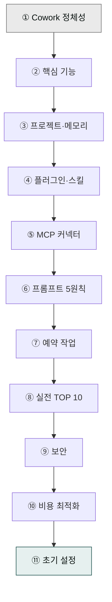
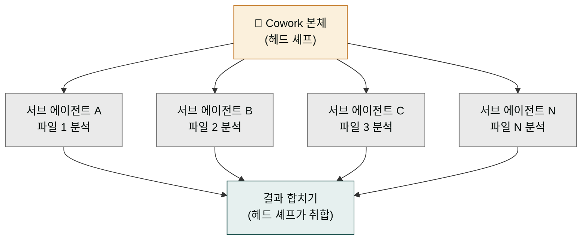
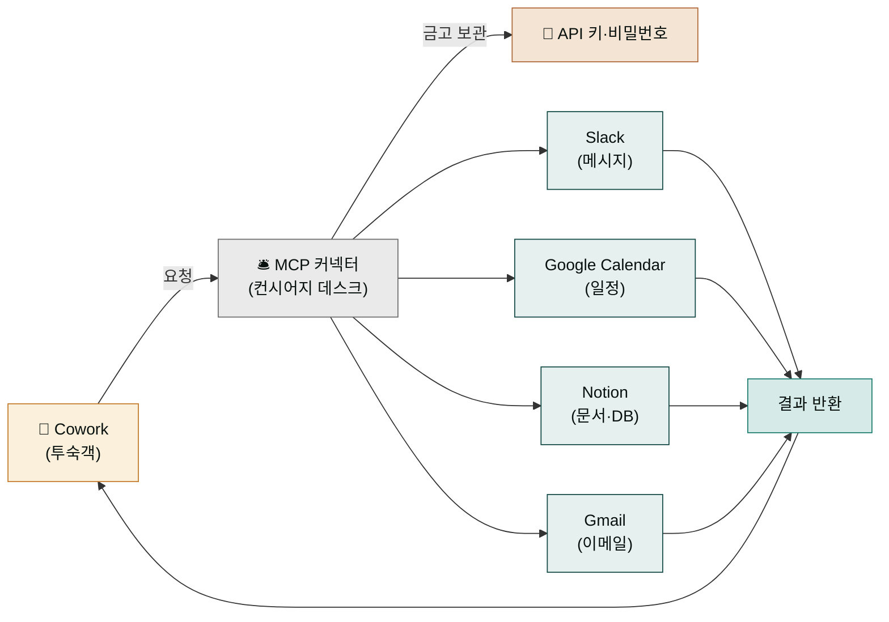
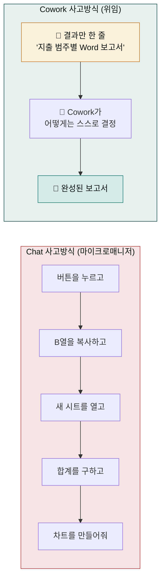

> Claude Cowork의 모든 핵심 기능을 한 번에 정리합니다. 실무 투입 전 이 페이지 한 장만 훑어도 충분합니다.



검증된 11개 영역 — 정체성·기능·프로젝트·플러그인·MCP·프롬프트·스케줄·실전 사례·보안·비용·초기 설정 — 을 순서대로 다룹니다.

## 1. Cowork란 무엇인가

Claude Cowork는 Claude Desktop에서 작동하는 **에이전틱 AI 작업 플랫폼**입니다. Claude Code의 에이전틱 아키텍처를 그대로 가져왔지만 코딩이 아닌 **지식 업무(knowledge work)** 에 최적화된 사용자 경험을 얹었습니다.

### Chat 모드와의 핵심 차이

| 구분 | Chat 모드 | Cowork 모드 |
|---|---|---|
| 상호작용 방식 | 일방적 질문 → 답변 | 자율적 작업 세션 |
| 사용자 역할 | 매 단계 직접 지시 | 최종 결과만 설명 |
| 파일 접근 | 제한적 | 읽기·쓰기·삭제 |
| 외부 도구 | 제한적 | MCP 커넥터 연동 |


Cowork는 2026-01-30 리서치 프리뷰로 공개된 뒤 **2026-02 macOS/Windows 정식 출시(GA)** 되었습니다. **Pro / Max / Team / Enterprise** 플랜에서 이용 가능합니다.


### 6가지 기본 기능

- [로컬 파일 접근](/cowork/first-task/)
- [컴퓨터 제어](/cowork/computer-use/)
- [문서 자동 생성](../../plugins/moai-office/)
- [예약 작업](/cowork/schedule/)
- [프로젝트 메모리](/cowork/projects-memory/)
- [플러그인·MCP](/cowork/plugins/)

## 2. 핵심 기능 네 가지

**다단계 작업 자동 실행.** 복잡한 업무를 Cowork가 스스로 계획·분해·실행합니다. 사용자는 최종 목표만 제시하면 됩니다.

**파일·폴더 접근.** Cowork 인터페이스 하단의 "Work in a Folder" 버튼으로 폴더를 지정하면, 그 폴더 안에서 파일 읽기·쓰기·삭제 권한이 부여됩니다.

**컴퓨터 제어 (Computer Use).** 데스크톱 앱 실행, 웹 양식 작성, 데이터 추출을 자동화합니다. 동작 우선순위는 고정되어 있습니다.

```
① MCP 커넥터 → ② Chrome 확장 → ③ Computer Use
```

API 기반 커넥터가 가장 빠르고 안정적이며, Computer Use는 최후 수단입니다.

**병렬 처리 (Sub-agents).** 여러 파일·작업을 서브 에이전트로 분산 실행합니다. 체감 성능 차이:

| 작업 | 순차 처리 | 병렬 처리 |
|---|---|---|
| 10개 파일 분석 | 약 30분 | 약 4분 |

### 서브 에이전트: 한꺼번에 여러 일을 동시에 돌리는 이유

서브 에이전트(sub-agent)는 Cowork가 본체에서 하나 더 파생해낸 보조 작업자입니다. 쉽게 말해 식당 주방에 비유할 수 있습니다. 주문이 10개 들어왔을 때 요리사 1명이 한 접시씩 차례로 만들면 30분이 걸립니다(순차). 하지만 요리사 10명이 각자 한 접시씩 동시에 만들면 4분이면 전부 나옵니다(병렬). Cowork가 헤드 셰프라면 서브 에이전트는 보조 요리사들입니다. 헤드 셰프가 "이 파일은 네가, 저 파일은 네가" 하고 일을 쪼개 나눠주면, 보조 요리사들이 각자 동시에 처리해서 전체가 훨씬 빨리 끝납니다.

여기서 "순차"와 "병렬"의 차이가 바로 30분과 4분의 격차로 나타납니다. 순차는 한 일이 끝나야 다음 일을 시작하는 방식이고, 병렬은 여러 일을 같은 시간대에 동시에 진행하는 방식입니다. 파일 10개를 분석할 때 Cowork 본체가 서브 에이전트 10개를 띄워 각각 한 파일씩 맡기면, 가장 오래 걸리는 한 파일의 시간만큼만 소모되어 전체가 빨라집니다. 사용자가 의식할 것은 없습니다 — Cowork가 알아서 일을 쪼개고 나눠줍니다.



## 3. 프로젝트와 메모리

### 프로젝트 개념

관련 작업을 한 곳에 모은 **독립 작업공간**입니다. 자체 파일·지시사항·메모리를 가지며, 반복 업무나 장기 실행 작업에 최적입니다.

설정 순서:

1. **새 프로젝트 생성** — Cowork 탭 → "새 프로젝트" 버튼 클릭.
2. **이름·저장 위치 지정** — 프로젝트명은 한글도 가능하지만 슬러그처럼 짧게 유지하세요.
3. **지시사항 추가 (선택)** — 프로젝트별 맞춤 규칙을 CLAUDE.md에 적거나 전역 지시사항에 저장합니다.
4. **참고 파일 첨부 (선택)** — 브랜드 가이드, 템플릿, 스타일 시트 등을 프로젝트 폴더에 넣어둡니다.

### 메모리 3단 구조

| 메커니즘 | 적용 범위 | 설명 |
|---|---|---|
| 전역 지시사항 | 모든 세션 | Settings → Cowork에서 설정. 200줄 이내 유지 |
| CLAUDE.md | 프로젝트·폴더 단위 | 매 세션 시작 시 자동 로드. 영구 규칙 |
| Auto Memory | 프로젝트 내 | 사용자 선호·수정 이력을 자동 학습 |


전역 지시사항은 200줄을 넘기지 마세요. 길수록 토큰이 낭비되고 준수율이 떨어집니다. 프로젝트별 세부 규칙은 CLAUDE.md로 내리세요.


## 4. 플러그인·스킬 생태계

### 플러그인 = 스킬 + 커넥터 + 서브 에이전트 패키지

`cowork-plugins`는 이 패키지 모델을 따라 만들어진 28개 공식 플러그인(178 스킬) 저장소입니다.

설치 순서:

1. **마켓플레이스 추가** — Cowork → **사용자 지정(Customize)** → **개인 플러그인(Plugins)** → "+" → URL 입력: `modu-ai/cowork-plugins`
2. **플러그인 선택·설치** — 목록에서 필요한 플러그인에 "Add plugin" 버튼을 누릅니다.

### 스킬 vs 플러그인

| 구분 | 스킬 | 플러그인 |
|---|---|---|
| 위치 | 프로젝트 폴더 내부 | Claude 마켓플레이스 |
| 설치 | 폴더 선택만으로 즉시 사용 | 별도 설치 필요 |
| 커스텀 | `SKILL.md` 직접 수정 | **사용자 지정(Customize)** 버튼으로 편집 |
| 공유 | `.skill` 파일 복사 | `.plugin` 파일 배포 |

## 5. MCP 커넥터 통합

### MCP 커넥터: 외부 서비스에 안전하게 닿는 컨시어지 데스크

MCP(Model Context Protocol) 커넥터는 Cowork가 외부 서비스에 접근하는 **유일한 공식 통로**입니다. "엔드포인트", "OAuth 인증" 같은 단어가 어렵게 들리지만 호텔 컨시어지 데스크에 비유하면 한눈에 들어옵니다. Cowork는 호텔 투숙객이고, MCP 커넥터는 컨시어지 데스크입니다.

투숙객이 주방·세탁실·예약팀을 직접 돌아다니며 부탁하지 않듯, Cowork도 Slack 서버·Google 캘린더·Notion 데이터베이스 같은 외부 서비스에 직접 들어가지 않습니다. 대신 컨시어지에게 "Slack 메시지 좀 읽어줘", "캘린더 다음 주 회의 정리해줘"라고 말하면, 컨시어지가 각 부서(서비스)에 안전하게 연결해 줍니다. 이때 API 키와 비밀번호는 컨시어지 금고에 안전하게 보관되어, 투숙객(Cowork)이 직접 들고 다니지 않아도 됩니다. 이것이 "유일한 공식 통로"라는 말의 의미입니다 — 임의로 외부 서비스에 접근하는 게 아니라, 정해진 통로를 통해서만, 안전하게 접근한다는 뜻입니다.

OAuth(오스) 인증은 이 컨시어지 데스크에 투숙객 신원을 확인시켜 주는 절차입니다. 브라우저가 열리면 "이 서비스에 접근해도 됩니까?"라고 묻고, 승인 버튼을 누르면 그다음부터는 매번 묻지 않고 자동으로 연결됩니다. 한 번 승인하면 다시 묻지 않으니, 일상에서는 OAuth가 무엇인지 의식할 필요가 없습니다.



설정 순서:

1. **사용자 지정(Customize) → 커넥터(Connectors)** — "+" 버튼 클릭.
2. **커넥터명·URL 입력** — `https://mcp.example.com` 형태의 MCP 엔드포인트.
3. **OAuth 인증** — 필요 시 브라우저가 열리며 승인합니다. 이후 "Add" 클릭.

### 실무 연동 5선

| 서비스 | 용도 | 예시 프롬프트 |
|---|---|---|
| Slack | 메시지 읽기·보내기 | `#marketing 채널의 이번 주 주요 논의 정리해줘` |
| Google Calendar | 일정 관리 | `다음 주 회의 요약하고 준비 자료 만들어줘` |
| Notion | 문서·DB 관리 | `프로젝트 Notion 페이지를 업데이트해줘` |
| Google Drive | 파일 검색·관리 | `드라이브에서 Q1 보고서 찾아 요약해줘` |
| Gmail | 이메일 읽기·작성 | `안 읽은 중요 메일 정리하고 답장 초안 써줘` |

## 6. 프롬프트 5원칙

공개된 프롬프트 원칙. 다섯 개 모두 "결과"와 "위임"이라는 두 축으로 수렵합니다.

### 결과 지향과 위임: Cowork 모드로 사고방식을 바꾸기

이 페이지에서 초보자가 가장 먼저 바꿔야 할 습관은 **어떻게 할지**를 지시하는 대신 **무엇을 원하는지**만 말하는 것입니다. 다섯 원칙은 결국 이 한 가지 전환을 두 축으로 설명합니다 — "결과 지향"은 무엇을 원하는지(결과)만 말하라는 것이고, "위임 마인드셋"은 그 뒤의 어떻게는 Cowork에게 맡기라는 것입니다.

동료에게 메신저를 남기는 상황을 떠올려 보세요. 부하직원에게 "버튼을 누르고, B열을 복사하고, 새 시트를 열고, 합계를 구하고, 차트를 만들어줘"라며 단계를 일일이 지시하는 건 Chat 시절의 사고방식입니다(마이크로매니저). 반면 능력 있는 동료에게 "지출 범주별 Word 보고서를 만들어줘, 요약과 상위 5개 항목 표를 포함해서"라고 **결과만 남겨두고** 커피를 마시러 가는 것이 Cowork 시절의 사고방식입니다(위임). 핵심은 상대가 무엇을 원하는지만 알면 어떻게는 스스로 찾는다는 점입니다. Cowork는 그 능력 있는 동료입니다.



### 원칙 1 — 결과 지향

단계별 조작 명령은 Chat 시절의 유산입니다. Cowork에서는 목표만 쓰세요.


> ❌ "파일을 열어 B열을 복사한 뒤 새 시트에 붙여넣고 합계를 구한 다음 차트를 만들어줘"

> ✅ "이 스프레드시트를 분석해서 지출 범주별 Word 보고서를 만들어줘.
     요약과 상위 5개 항목 테이블을 포함해"


### 원칙 2 — 구체성


> ❌ "내 파일 봐줘"
> ✅ "~/Documents/sales_2026.xlsx 파일을 분석해줘"

> ❌ "템플릿 사용해줘"
> ✅ "template_v3.docx 양식 사용해줘"


### 원칙 3 — 참고 자료 직접 연결

문서 내용을 요약해 붙여넣지 말고 **파일 경로나 URL**을 제시하세요. Cowork가 실제 콘텐츠를 직접 읽습니다.

### 원칙 4 — 출력 형식·위치 명시


> Q1 매출 데이터를 분석해서:
  1. Excel 피벗 테이블로 월별·제품별 정리
  2. 주요 인사이트 3가지를 포함한 Word 보고서
  3. 경영진 발표용 PPT 5장

결과물은 90_Output 폴더에 저장해줘


### 원칙 5 — 위임 마인드셋


"Cowork는 왕복 대화가 아니라 동료에게 메시지를 남기는 것 같은 느낌입니다." — Reddit 사용자 후기


한 번의 명확한 지시 → 완료까지 기다리기. 단계별 가이드보다 목표를 설명하세요. 자세한 프롬프트 기법은 [스킬 체이닝 가이드](/cookbook/skill-chaining/)에서 이어집니다.

## 7. 예약 작업 (Schedule)

설정은 3단계입니다.

1. **`/schedule` 입력** — 작업 중 슬래시 명령으로 시작합니다.
2. **빈도 선택** — 시간별 / 일일 / 주간 / 평일 / 수동 중 하나.
3. **프롬프트 확정** — Cowork가 제시한 최적화 안을 검토하고 승인합니다.

### 추천 시나리오 6선

| 시나리오 | 빈도 | 출력 |
|---|---|---|
| 일일 경제 브리핑 | 매일 오전 | HTML 리포트 |
| 주간 KPI 리포트 | 매주 금요일 | PPT 슬라이드 |
| 이메일 정리 | 매일 | 중요도별 요약 |
| 다운로드 정리 | 매주 | 날짜·프로젝트별 폴더 |
| 회의 준비 | 캘린더 연동 | 어젠다·자료 |
| 경쟁사 모니터링 | 매주 | 변화 요약 리포트 |


**기준은 로컬 PC 시계입니다 (UTC 아님).** 서머타임 변경 시 일정이 한 시간 밀릴 수 있습니다. PC가 꺼져 있거나 Cowork가 닫혀 있으면 해당 회차는 건너뜁니다 (자동 보충 없음).


## 8. 실전 활용 TOP 10

| # | 활용 사례 | 난이도 |
|---|---|---|
| 1 | 파일 자동 분류 | 초급 |
| 2 | 자동 보고서 (주간 회의·월간 성과·KPI 대시보드) | 초급 |
| 3 | 대량 콘텐츠 생성 (채용공고·이메일·블로그) | 중급 |
| 4 | 데이터 정제 (중복 제거·형식 통일) | 초급 |
| 5 | 멀티채널 SEO 콘텐츠 (블로그+SNS 동시) | 중급 |
| 6 | 풀스택 IR 덱 (docx → pptx 동시 생성) | 고급 |
| 7 | 계약서 검토 (위험 조항 식별) | 중급 |
| 8 | 정부지원사업 계획서 (심사 기준 최적화) | 고급 |
| 9 | CRM + 이메일 자동화 (세그먼트별 맞춤) | 고급 |
| 10 | AI 이미지 + 카드뉴스 (Higgsfield → 인스타) | 중급 |


**실사용자 후기** — "Cowork 설치 후 2시간 만에 채용공고 14개, Q1 마케팅 전략 (예산 배분 포함), 파트너 이메일 47개, 웹사이트 카피 3개를 완료했습니다."


## 9. 보안 — 하지 말아야 할 일

### 모호한 삭제 요청 금지

실제 사례 — 한 사용자가 "폴더 정리해줘"라고 요청했더니 Cowork가 기가바이트 단위 데이터를 삭제한 사건이 있었습니다. 삭제 작업은 반드시 구체적으로 지정하세요.

### 보안 체크리스트

```
[ ] 민감 데이터 폴더는 작업 폴더에서 제외
[ ] 첫 실행은 중요하지 않은 샘플 데이터로 테스트
[ ] 파일 삭제 작업은 구체적으로 지정 (`*.tmp`, `old_*` 등)
[ ] 중요 파일은 작업 전 별도 백업
[ ] 금융 앱 (뱅킹·거래소)에서 Computer Use 금지
[ ] API 키·비밀번호는 환경변수 또는 별도 파일로 관리
```

자세한 가이드는 [안전하게 사용하기](/cowork/safety/) 페이지를 참고하세요.

## 10. 비용 최적화 6선

Cowork는 Chat보다 토큰 사용량이 많습니다. 아래 6가지 전략으로 절감할 수 있습니다.

| 전략 | 설명 | 절감 효과 |
|---|---|---|
| 배치 처리 | 관련 작업을 한 번에 묶기 | 높음 |
| 간단한 작업은 Chat | 단순 질의응답은 Chat 사용 | 높음 |
| MCP 커넥터 우선 | Computer Use 대신 API 기반 커넥터 | 높음 |
| 파일 범위 지정 | 큰 파일은 필요 부분만 선택 읽기 | 중간 |
| 전역 지시사항 간결화 | 200줄 이내 유지 | 중간 |
| 프로젝트 분리 | 무관한 컨텍스트 로딩 방지 | 낮음 |

## 11. 초기 설정 체크리스트

### Step 1 — 기본 환경

```
[ ] Claude Desktop 최신 버전 설치
[ ] Pro·Max 플랜 활성화 확인
[ ] Cowork 탭 접근 가능 확인
```

### Step 2 — 프로젝트 구성

```
[ ] 메인 작업 폴더 생성·선택
[ ] 전역 지시사항 설정 (Settings → Cowork)
[ ] CLAUDE.md 작성 (프로젝트 규칙)
[ ] 폴더 구조 정리 (Input / Output / Scratch)
```

### Step 3 — 확장 기능

```
[ ] 필요 플러그인 설치 (cowork-plugins 마켓플레이스)
[ ] MCP 커넥터 연결 (Slack / Drive / Notion 등)
[ ] Chrome 확장 설치 (웹 자동화 필요 시)
[ ] 권한 검증·테스트
```

### Step 4 — 보안·백업

```
[ ] 민감 데이터 폴더 격리
[ ] 파일 삭제 작업 테스트
[ ] 정기 백업 구성
```

## 다음 읽을거리

- [자동화 레시피](../automation-recipes/)
- [스킬 체이닝 가이드](/cookbook/skill-chaining/)

---

### Sources
- [modu-ai/cowork-plugins](https://github.com/modu-ai/cowork-plugins)
- [Claude Docs — Cowork](https://docs.claude.com/en/docs/claude-cowork/overview)
- [Anthropic — Claude Agent SDK](https://www.anthropic.com/claude-code)
