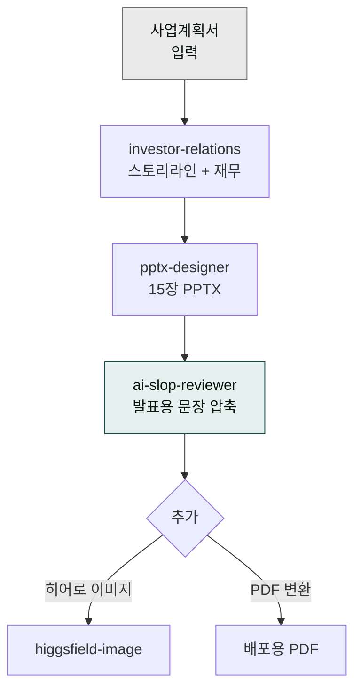
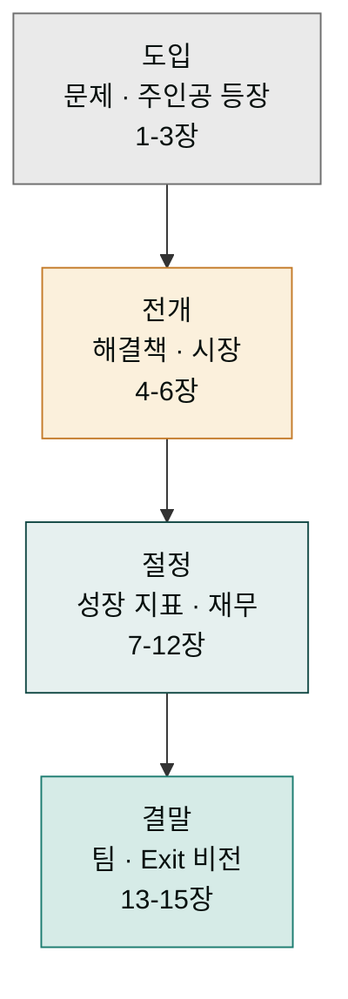
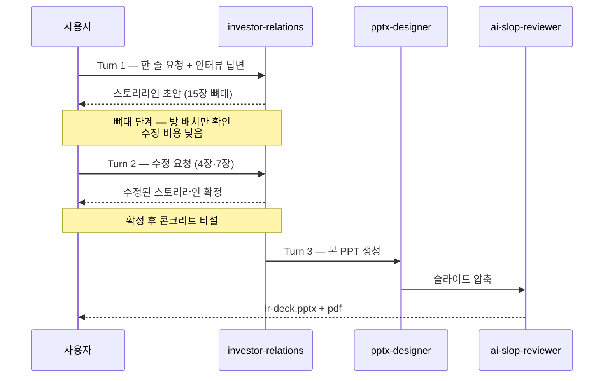
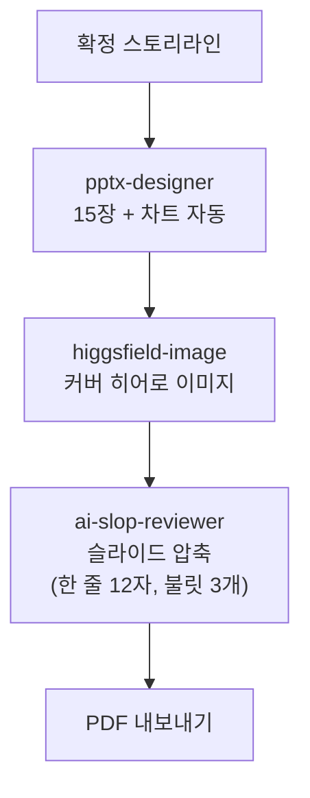

> **목표** — 사업계획서 내용을 받아 투자자 앞에서 15분 안에 끝낼 수 있는 **15장 PPT 피칭 덱**을 만듭니다.



## IR 덱이란, 왜 스킬을 엮는가

IR 덱(Investor Relations Deck)은 투자자에게 보여주는 발표 자료, 즉 사업을 한 장 한 장 슬라이드로 풀어 "왜 이 회사에 투자해야 하는가"를 설득하는 문서입니다. 사업계획서가 '글로 쓴 보고서'라면, IR 덱은 그 내용을 무대 위에서 직접 발표하는 '공연 대본'입니다. Seed·Series A 같은 투자 라운드(자금을 한 번에 크게 모으는 단계)를 통과하려면 이 덱이 필수입니다.

그런데 IR 덱 하나를 만들겠다고 "덱 만들어줘" 한 줄을 던지면 결과가 엉뚱하게 나옵니다. 이유는 IR 덱이 **세 가지 전혀 다른 전문 영역**을 하나로 합친 산출물이기 때문입니다. 연극 한 편을 만드는 것에 비유하면 이해가 쉽습니다.

- **`investor-relations` — 극작가.** 재무 숫자와 밸류에이션(기업 가치 평가), 설득 스토리라인을 설계합니다. "어떤 장면 순서로 이야기를 전개할지, 각 장에 어떤 숫자를 올릴지" 대본을 씁니다.
- **`pptx-designer` — 무대 미술가.** 그 대본을 무대 위 15개 장면(슬라이드)으로 시각화합니다. 폰트, 여백, 차트, 색 배합을 다룹니다. 글을 잘 쓴다고 무대 세트를 잘 만드는 게 아니듯, 재무를 잘한다고 디자인까지 잘하는 건 아닙니다.
- **`ai-slop-reviewer` — 대사 연기 코치.** 만들어진 문장에서 기계 티(AI가 쓴 듯한 딱딱한 어투)를 솎아내고, 사람이 무대에서 직접 말하는 듯한 발화로 바꿉니다. 발표용 문장은 짧고 자연스러워야 듣는 투자자가 귀에 꽂힙니다.

한 사람이 극작·무대 미술·연기 코칭을 다 잘할 수 없듯, 하나의 스킬도 세 역할을 동시에 소화하지 못합니다. 그래서 각 전문가(스킬)를 차례로 부르는 파이프라인, 즉 **체인**으로 조립합니다. 도메인(내용 기획) → 포맷(문서 생성) → 품질(문장 다듬기) 순서로 흘러가는 이 흐름은 [스킬 체인 설계 3원칙](/cookbook/skill-chaining/#체인-설계-3원칙)과 같은 맥락입니다.

## 대상 독자

Seed·Series A·B 투자 유치를 준비하는 스타트업 창업가.

## 사전 준비

- 플러그인: `moai-business`, `moai-office`, `moai-core:ai-slop-reviewer`
- (선택) `moai-media` — 히어로 이미지·아이콘 커스텀
- 입력: 사업계획서(DOCX 또는 텍스트), **시리즈 단계**(Seed / Series A / B), **목표 조달액**, **밸류에이션 가정**

## 스킬 체인

```
investor-relations → pptx-designer → ai-slop-reviewer
```

- `investor-relations` — 재무 모델·밸류에이션·스토리라인
- `pptx-designer` — Pretendard + 명조 한국형 PPT 코드
- `ai-slop-reviewer` — 발표용 문장 다듬기(짧고 자연스럽게)

## 15장 표준 구조

15장이라는 숫자는 임의가 아닙니다. 투자자가 "이 회사에 돈을 걸 만한가"를 판단하는 심사 논리가 **하나의 이야기 arc**로 펼쳐지도록 설계된 틀입니다. 영화 시놉시스에 비유하면, 관객(투자자)이 영화에 투자할지 결정하려면 도입(문제·주인공 등장) → 전개(해결책·시장 크기) → 절정(성장 지표·재무) → 결말(팀·Exit 비전)의 흐름이 있어야 합니다. 15장 표는 그 장(章) 목록이지, 빈칸을 채우는 게 목표가 아닙니다.

표 아래의 전문 용어들은 투자와 SaaS(구독형 소프트웨어 비즈니스)에서 쓰는 기본 단어들입니다. 처음 보더라도 두려워하지 마세요 — 간단히 정리하면 이렇습니다.

- **TAM / SAM / SOM** — 시장 크기를 세 단계로 자름. TAM(전체 시장) → SAM(우리가 노릴 수 있는 시장) → SOM(당장 확보할 수 있는 현실적 시장).
- **CAC / LTV** — 고객 1명을 데려오는 데 드는 비용(CAC)과, 그 고객이 이탈하기 전까지 가져다주는 수익(LTV). LTV가 CAC보다 3배 이상 커야 건강합니다.
- **MRR / MoM** — 월간 반복 수입(MRR, 매월 들어오는 고정 매출)과, 전월 대비 성장률(MoM).
- **2×2 포지셔닝** — 경쟁사를 두 축(예: 가격 vs 기능)으로 가로세로 배치해 우리 자리를 보여주는 표.



| # | 슬라이드 | 핵심 |
|---|---|---|
| 1 | 커버 | 서비스명 + 한 줄 카피 |
| 2 | 문제 | 고객 Pain 3가지 |
| 3 | 솔루션 | 우리 제품이 어떻게 해결하는가 |
| 4 | 데모 | 스크린샷·영상 캡처 |
| 5 | 시장 | TAM/SAM/SOM |
| 6 | 비즈니스 모델 | 단가·CAC·LTV |
| 7 | 경쟁 | 2×2 포지셔닝 |
| 8 | 성장 지표 | MRR·MoM·리텐션 |
| 9 | Go-to-Market | 채널·캠페인 |
| 10 | 로드맵 | 12-18개월 마일스톤 |
| 11 | 팀 | 대표·핵심 인력 |
| 12 | 재무 추정 | 3년 매출·손익 |
| 13 | 이번 라운드 | 조달액·밸류·용도 |
| 14 | Exit·비전 | 5년 뒤 모습 |
| 15 | Thank You | 연락처 |

## 사용 방식 — 한 줄 요청 (패턴 2: 멀티턴 대화)

> **사용자가 6단계를 순차 호출하지 않습니다.** 짧은 한 줄로 시작 → 시스템이 인터뷰 후 스토리라인 초안 제시 → 사용자 검토·수정 → PPT·이미지·PDF 자동 생성. ([4가지 사용 패턴 - 패턴 2](/cowork/patterns/#패턴-2--멀티턴-대화-multi-turn-dialog))

### 사용자 입력


> 시리즈 A IR 덱 15장 만들고 싶어


### 시스템 인터뷰 (AskUserQuestion)

1. **사업계획서 첨부** (DOCX) 또는 한 줄 비즈니스 설명
2. **시리즈·조달 목표**: Seed / Series A / B (기본 15장) · 조달액 · 프리머니 밸류
3. **타깃 투자자**: 엔젤 · VC · 전략적 투자자
4. **차트·이미지 자동 포함**: 예/아니오 (시장·재무 차트 + 히어로 이미지)
5. **출력 형식**: PPTX (기본 + PDF 자동 내보내기)

### 왜 한 번에 만들지 않고 세 번에 나누는가

이 레시피의 핵심은 **PPT를 바로 만들지 않고, 먼저 뼈대(스토리라인)만 검토한 뒤 본 생성에 들어간다**는 점입니다. 건축에 비유하면 명확합니다. 뼈대 도면(스토리라인 초안)을 보고 방 배치를 고치는 것은 종이 위의 선 하나를 지우면 됩니다. 하지만 콘크리트를 부은 뒤(본 PPT를 생성한 뒤) 벽 위치가 마음에 안 들어 고치려면 벽을 허물고 다시 부어야 합니다.

15장 PPT를 한 번에 생성하면 토큰(컴퓨터가 한 번에 처리하는 텍스트 분량의 단위)과 시간이 크게 듭니다. 흐름이 어긋났다는 걸 알게 된 뒤 전체를 다시 만들면 그 비용이 두 배로 떨어집니다. 반면 뼈대 단계에서 "4장에 SaaS 매출 모델 추가", "7장에 자문단 한 줄 추가" 같은 수정을 하면, 고쳐야 할 게 한 장의 문장 수정으로 끝납니다. 그래서 세 번(Turn)으로 나눕니다.



### Turn 1 — 스토리라인 초안

시스템이 **15장 스토리라인 + 각 장 핵심 메시지(1문장)** 를 먼저 제시. 사용자는 본문 작성 전에 스토리 흐름을 검토.

### Turn 2 — 사용자 수정 요청


> Slide 4(BM)에 SaaS 매출 모델 추가하고, Slide 7(팀)에 자문단 1장 추가해줘


시스템이 스토리라인 수정 → 사용자 확정.

### Turn 3 — 본 PPT 생성 (자동)



### 산출물

- `90_Output/ir-deck.pptx` — 15장 본 PPT (16:9, Pretendard, 본문 18pt)
- `90_Output/ir-deck.pdf` — 투자자 공유용
- 5·12장 차트 자동 (recharts 스타일)
- 히어로 이미지 (브랜드 컬러 자동 매핑)

### 변형 시나리오

| 한 줄 요청 | 결과 |
|---|---|
| "Seed 라운드 5장 짧게 만들어줘" | 5장 압축 버전 (Pitch deck format) |
| "Series B 25장 본격 IR" | 25장 디테일 버전 + 재무 모델 5장 |
| "투자자 1대1 미팅용 10장" | 1대1 톤 + Q&A 슬라이드 |

## 자주 겪는 이슈


**이슈 1 — 문장이 여전히 길다.**
`pptx-designer`가 DOCX 원문을 그대로 복사하는 경우가 있습니다. 반드시 **압축 지시**를 한 번 더 하세요.



**이슈 2 — 폰트가 기본 Calibri 로 나온다.**
Pretendard가 시스템에 없으면 Calibri로 폴백됩니다. 배포 전 "Pretendard 임베드" 또는 PDF로 전환하세요.



**이슈 3 — 재무 차트가 어색하다.**
`pptx-designer`가 그리는 기본 차트보다 **엑셀에서 그린 차트를 캡처해 이미지로 삽입**하는 편이 더 예쁩니다. 필요하면 `xlsx-creator`로 추정표를 먼저 만드세요.


## 응용 변형

- **투자자별 맞춤** — 심사역이 특정 산업 포커스라면 2·5·7장을 해당 산업 용어로 다시 쓰세요.
- **원페이저** — 15장 요약본을 `docx-generator`로 A4 한 장 티저로 먼저 뿌리면 미팅 약속이 잘 잡힙니다.

---

### Sources
- [modu-ai/cowork-plugins › moai-business](https://github.com/modu-ai/cowork-plugins)
- [Sequoia Capital — Pitch Deck Template](https://www.sequoiacap.com/article/writing-a-business-plan/)
