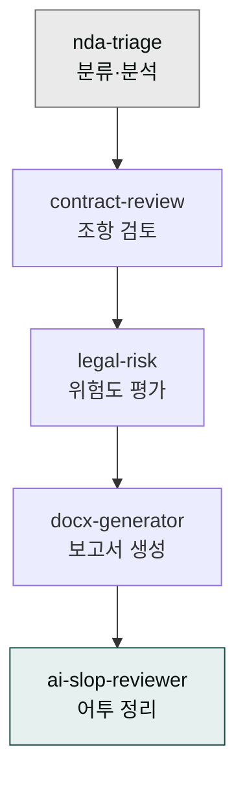
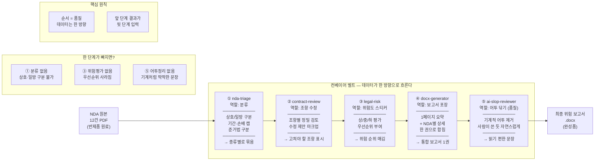
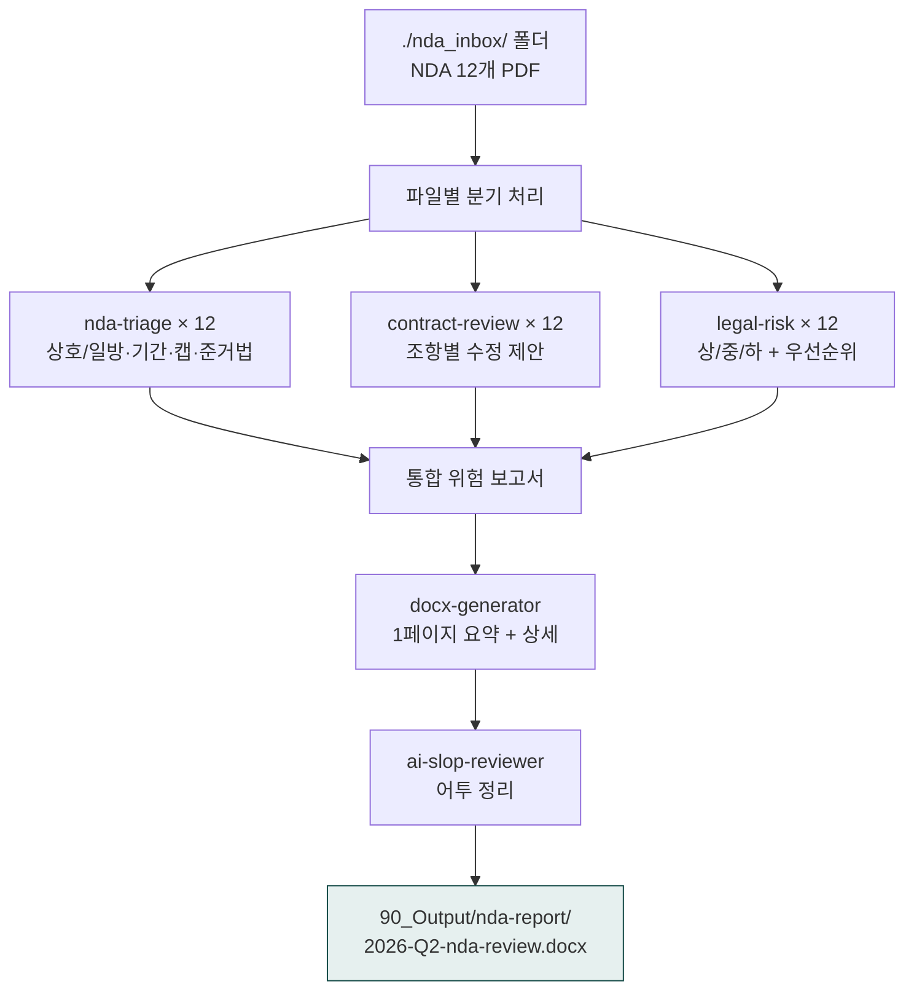

> **목표** — `./nda_inbox/` 폴더의 NDA PDF 12건을 분류·검토하고, 건별 위험도(상/중/하)와 수정 제안이 들어간 위험 보고서를 docx로 생성합니다.



## 대상 독자

스타트업 법무팀(인하우스 1-3명), 법무법인 어소시에이트, 사업개발 PM이 NDA를 자체 검토할 때.

## 사전 준비

- 플러그인: `moai-legal`, `moai-office`, `moai-core:ai-slop-reviewer`
- 입력: `./nda_inbox/` 폴더(NDA PDF 다수), 회사명·핵심 영업비밀 카테고리
- 산출물 위치: `./90_Output/nda-report/`

## 왜 다섯 단계인가 — 조립 라인으로 이해하기

NDA 검토를 한 번에 끝내는 스킬이 하나가 아니라 다섯 스킬로 나뉘어 있다는 점이 처음엔 낯설게 느껴집니다. 하지만 공장 조립 라인을 떠올리면 이유가 명확해집니다. NDA라는 반제품 원료가 컨베이어 벨트를 타고 5개의 작업대를 차례로 통과합니다. 첫 작업대(nda-triage)에서 종류별로 분류하고, 둘째(contract-review)에서 문제 조항을 뜯어고치고, 셋째(legal-risk)에서 위험도 스티커를 붙이고, 넷째(docx-generator)에서 보고서로 포장하고, 다섯째(ai-slop-reviewer)에서 마지막 품질 검사로 기계 어투를 닦아냅니다.

한 작업대를 건너뛰면 불량품이 나오는 것과 같습니다. 분류(triage) 없이 검토하면 상호·일방 NDA를 구분하지 못하고, 위험 평가(legal-risk) 없이 보고서를 만들면 우선순위가 사라지고, 마지막 어투 정리(ai-slop-reviewer)를 빼면 보고서가 기계가 쓴 것처럼 딱딱해집니다. 각 단계는 앞 단계의 결과를 입력으로 받아 한 단계 더 가공하는 구조입니다. 이렇게 역할을 나누면 한 스킬이 모든 일을 억지로 처리할 때보다 각 단계의 품질이 훨씬 높아집니다.

파이프라인(한 방향으로 흘러가는 작업 연결선)이라는 말이 여기서 나옵니다. 데이터가 첫 스킬에서 마지막 스킬까지 한쪽 방향으로만 흐르고, 중간에 뒤로 돌아가지 않습니다. 그래서 순서가 곧 품질입니다.

```mermaid
flowchart LR
    R["NDA 원본<br/>(반제품 원료)"] --> S1["① nda-triage<br/>분류"]
    S1 --> S2["② contract-review<br/>조항 수정"]
    S2 --> S3["③ legal-risk<br/>위험도 스티커"]
    S3 --> S4["④ docx-generator<br/>보고서 포장"]
    S4 --> S5["⑤ ai-slop-reviewer<br/>어투 닦기"]
    S5 --> O["최종 위험 보고서"]

    style R fill:#eaeaea,stroke:#6e6e6e,color:#09110f
    style S1 fill:#fbf0dc,stroke:#c47b2a,color:#09110f
    style S2 fill:#fbf0dc,stroke:#c47b2a,color:#09110f
    style S3 fill:#fbf0dc,stroke:#c47b2a,color:#09110f
    style S4 fill:#fbf0dc,stroke:#c47b2a,color:#09110f
    style S5 fill:#fbf0dc,stroke:#c47b2a,color:#09110f
    style O fill:#e6f0ef,stroke:#144a46,color:#09110f
```





## 스킬 체인

```
nda-triage → contract-review → legal-risk → docx-generator → ai-slop-reviewer
```

| 단계 | 스킬 | 역할 |
|---|---|---|
| 1 | `nda-triage` | 분류 — 상호/일방, 기간, 손해배상 캡, 준거법 |
| 2 | `contract-review` | 조항별 정밀 검토, 수정 제안 마크업 |
| 3 | `legal-risk` | 종합 위험도 평가 (상/중/하), 우선순위 부여 |
| 4 | `docx-generator` | 위험 보고서 docx 생성 |
| 5 | `ai-slop-reviewer` | 보고서 어투 정리 |

## 사용 방식 — 한 줄 요청 (패턴 3: 배치 처리)

> **위험한 안티 패턴**: 사용자가 모든 옵션(회사명·영업비밀·5단계 스킬·저장 경로·면책 문구)을 매번 직접 작성하는 것은 권장되지 않습니다. 시스템이 가진 자동 인터뷰 + 체이닝을 무력화합니다. ([4가지 사용 패턴 - 패턴 3](/cowork/patterns/#패턴-3--배치-처리-batch-processing))

### ✅ 올바른 한 줄 요청


> ./nda_inbox/ 폴더의 NDA 12개 위험도 검토해서 한 페이지로 정리해줘


### 시스템 인터뷰 (AskUserQuestion)

1. **회사 정보**: 회사명 + 핵심 영업비밀 3개 (한국 영업비밀보호법 §2 기준 자동 적용)
2. **보고서 형식**: 1페이지 경영진 요약 / 상세 (NDA별 1-2페이지) / 둘 다
3. **부록 포함**: 표준 NDA 템플릿 비교표 / 통계 차트 / 둘 다
4. **저장 경로** (기본: `90_Output/nda-report/`)
5. **면책 문구 자동 삽입** 여부 (기본: 예 — "본 보고서는 1차 검토 가이드이며 최종 법률자문은 변호사 검토를 거쳐야 합니다")

### 배치 처리 — 12건을 한 번에 묶어 돌리는 이유

NDA가 12건일 때 한 건씩 따로 처리하면, 매번 스킬이 켜졌다 꺼지는 대기 시간이 12번 반복됩니다. 대형 세탁소에 비유하면 한 벌씩 세탁기를 12번 도는 것과 같습니다. 대신 세탁소는 옷을 종류별로 포대에 담아 여러 기계에 동시에 돌린 뒤, 다 깨끗해진 옷을 한 묶음으로 접어 고객에게 돌려줍니다. 한 번에 여러 기계를 돌리면 전체 소요 시간이 가장 느린 한 기계 분량으로 줄어듭니다.

NDA 일괄 검토도 같은 원리입니다. nda-triage, contract-review, legal-risk 세 스킬이 각각 12건을 동시에 훑고 넘어갑니다(이런 식으로 여러 건을 한 번에 처리하는 방식을 배치 처리, 영어로 batch processing이라고 부릅니다). 그 뒤 docx-generator가 12건의 분석 결과를 한 권의 보고서로 합쳐줍니다. 분류는 분류끼리, 검토는 검토끼리 모아서 돌리기 때문에 맥락이 끊기지 않고, 마지막 통합 단계에서야 비로소 12건이 하나로 엮입니다.

왜 한 번에 한 건이 아니라 12건을 묶는 게 효율적인가를 한마디로 요약하면, "같은 종류의 일은 모아서 한 번에 하는 게 한 건씩 나눠 하는 것보다 전체 시간이 짧다"입니다. 아래 다이어그램은 12건이 세 스킬을 병렬로 통과한 뒤 통합 보고서로 합쳐지는 구조를 보여줍니다.

### 자동 체인



### 산출물

- **1페이지 경영진 요약**: 위험도 분포 차트 + Top 3 위험 NDA
- **NDA별 상세**: 1건당 1-2페이지 (분류·핵심 리스크·수정 제안)
- **부록**: 표준 NDA 템플릿 비교표 (자동)
- **자동 면책 문구** 삽입

## 자주 겪는 이슈


**이슈 1 — PDF가 10페이지를 넘으면 Read가 느림.**
대용량 NDA는 페이지 범위를 명시하세요: "이 PDF는 1-15 페이지만 검토". 자세한 파일 읽기 한도는 [제약과 한도](/cowork/constraints/)를 참고.


## 왜 "한국 영업비밀보호법 §2 기준"을 한 줄 더 써야 하는가

도량형 단위를 생각하면 이해가 쉽습니다. 미국 레시피는 파운드·온스를 쓰고 한국은 킬로그램·그램을 씁니다. 똑같이 "무게"를 잰다고 해도 단위를 맞추지 않으면 결과가 완전히 달라집니다. AI는 학습 자료의 대부분이 미국 자료이기 때문에, 따로 말해주지 않으면 미국식 trade secret(영업비밀) 기준을 기본값으로 삼습니다. 그래서 한국 법 기준을 한 줄로 명시하지 않으면 한국 회사에 맞지 않는 잣대로 NDA를 검토하게 됩니다.

한국의 영업비밀보호법(정식 명칭은 부정경쟁방지 및 영업비밀보호에 관한 법률) 제2조는 어떤 정보가 영업비밀로 보호받으려면 세 가지 요건을 모두 갖춰야 한다고 정합니다. 첫째 비밀관리성(회사가 그 정보를 비밀로 관리하려는 의사와 행위가 있어야 함), 둘째 경제성(돈이 될 만한 가치가 있어야 함), 셋째 비공지성(일반에 공개되지 않은 정보여야 함)입니다. 미국식 trade secret도 비슷한 맥락을 다루지만 요건과 판례가 달라, 한국 법의 세 요건을 빼먹으면 정작 보호받아야 할 정보가 보고서에서 빠질 수 있습니다.

그래서 "한국 영업비밀보호법 §2 기준 적용"이라는 한 줄은 계량컵을 한국 단위로 맞추는 역할을 합니다. 회사가 정한 핵심 영업비밀 3개가 이 세 요건에 들어맹는지 AI가 한국 기준으로 판단하게 만드는 스위치입니다. 이 줄이 빠지면 아래 이슈 2처럼 보호요건이 누락되는 결과로 이어집니다.


**이슈 2 — 한국 영업비밀보호법 §2 누락.**
`contract-review`가 미국식 trade secret 기준을 적용하면 한국 영업비밀보호법(부정경쟁방지 및 영업비밀보호에 관한 법률) 기준 보호요건(비밀관리성·경제성·비공지성)이 빠질 수 있습니다. 프롬프트에 "한국 영업비밀보호법 §2 기준 적용"을 명시하세요.



**이슈 3 — 면책 문구 누락.**
법률 자문이 아닌 1차 검토임을 명시하지 않으면 책임 경계가 불명확해집니다. 위 프롬프트의 "면책 문구 자동 삽입" 지시는 필수입니다.


## 응용 변형

- **계약서 일괄 검토** — `nda-triage` 대신 `contract-review` 단독으로 시작, 계약 유형별 분류 필요 시 직접 폴더로 분리
- **팀 합의 워크플로우** — 검토 후 `compliance-check`(개인정보보호법) 추가, 사내 정책 위반 여부 별도 점검
- **반복 사용** — 슬래시 명령으로 저장: `/nda-batch`로 한 번에 전체 체인 실행

## 다음 단계

- [계약서 검토](../contract-review/) — 단건 정밀 검토
- [moai-legal 플러그인](../../plugins/moai-legal/)
- [트러블슈팅](/cowork/troubleshooting/)

---

### Sources
- [modu-ai/cowork-plugins — moai-legal](https://github.com/modu-ai/cowork-plugins/tree/main/moai-legal)
- 부정경쟁방지 및 영업비밀보호에 관한 법률 (국가법령정보센터)
