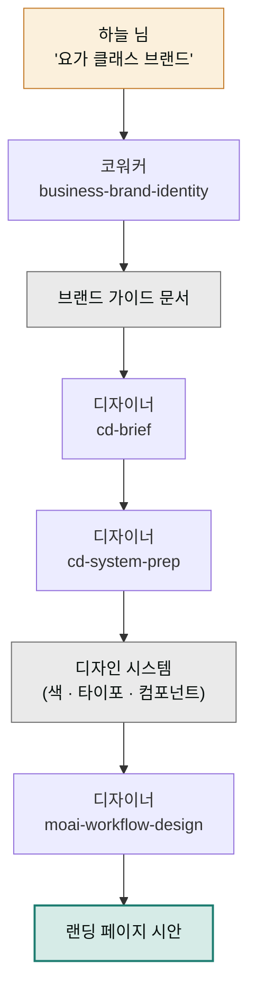

> **투입 직원** — 코워커(`moai-coworker`) → 디자이너(`moai-designer`)

## 1. 문제 상황

프리랜서 요가 강사 하늘 님은 온라인 클래스 브랜드를 만들기로 했습니다. 이름 후보는 노트에 스무 개쯤 쌓였는데 하나도 확신이 없고, 인스타그램 프로필 색은 올릴 때마다 달라지고, 클래스 신청을 받을 랜딩 페이지(방문자를 신청·구매 같은 하나의 행동으로 이끄는 단일 웹 페이지)는 시작도 못 했습니다.

디자인 외주를 알아봤지만 견적보다 먼저 막힌 건 "브랜드 방향을 문서로 달라"는 요구였습니다. 톤앤매너(브랜드가 일관되게 유지하는 말투와 분위기), 타깃, 핵심 메시지 — 이걸 정리하지 못하면 디자이너는 일을 시작할 수 없습니다. 즉 이 프로젝트의 순서는 정해져 있습니다. **말로 된 브랜드 정의가 먼저, 눈에 보이는 디자인이 나중.** 앞은 코워커, 뒤는 디자이너의 일입니다.

## 2. 투입 직원과 스킬

코워커의 `business-brand-identity`가 출발점입니다. 브랜드 이름·슬로건·톤앤매너·색상 방향까지 한 벌의 브랜드 가이드 문서로 정리해줍니다. 이 문서가 디자이너에게 넘어가면, `cd-brief`가 디자인 작업 지시서(브리프)로 번역하고, `cd-system-prep`이 색상·글꼴·간격 규칙을 묶은 디자인 시스템(모든 화면에서 재사용하는 시각 규칙 모음)을 준비합니다. `moai-domain-brand-design`이 브랜드 시각 언어를 다듬고, `moai-workflow-design`이 랜딩 페이지 시안 제작 흐름을 끌고 갑니다. 마지막으로 `cd-slop-check`가 "AI가 만든 티가 나는 어색한 디자인 문구"를 점검합니다.

| 순서 | 직원 | 스킬 | 역할 |
|------|------|------|------|
| 1 | 코워커 | `business-brand-identity` | 브랜드 가이드 (이름 · 슬로건 · 톤앤매너 · 색) |
| 2 | 디자이너 | `cd-brief` | 브랜드 가이드 → 디자인 브리프 변환 |
| 3 | 디자이너 | `cd-system-prep` + `moai-domain-brand-design` | 디자인 시스템 (색 · 타이포 · 컴포넌트) |
| 4 | 디자이너 | `moai-workflow-design` + `cd-slop-check` | 랜딩 페이지 시안 · 품질 점검 |

## 3. 진행 단계

**1단계 — 브랜드 정의.** 사업 이야기를 편하게 풀어놓으며 시작합니다.


> 직장인 대상 온라인 요가 클래스 브랜드를 만들려고 해.
> 키워드는 '퇴근 후 회복', 타깃은 30~40대 사무직.
> 브랜드 이름 후보, 슬로건, 톤앤매너, 색상 방향까지
> 브랜드 가이드 문서로 정리해줘.


코워커가 타깃의 마음 상태·경쟁 브랜드와의 차별점을 AskUserQuestion으로 좁힌 뒤 브랜드 가이드 문서를 만듭니다. 이름은 반드시 본인이 최종 선택하세요 — 상표 검색은 사람 몫입니다.

**2단계 — 디자인 브리프로 번역.** "이 브랜드 가이드로 디자인 브리프 만들어줘"라고 디자이너에게 넘깁니다. 말로 된 "차분한 회복감"이 구체적 색상값과 서체 방향으로 번역되는 단계입니다.

**3단계 — 디자인 시스템 구축.** "브리프 기준으로 디자인 시스템 준비해줘. 색상 팔레트, 제목/본문 글꼴, 버튼 스타일 포함"이라고 요청합니다. 이 시스템이 있으면 이후 어떤 화면을 만들어도 같은 브랜드로 보입니다.

**4단계 — 랜딩 시안.** 마지막 요청입니다.


> 이 디자인 시스템으로 클래스 신청 랜딩 페이지 시안 만들어줘.
> 구성: 첫 화면(핵심 약속) → 커리큘럼 → 수강 후기 → 신청 버튼.
> 완성되면 cd-slop-check로 어색한 문구 점검까지.


## 4. 결과물

- **브랜드 가이드 문서** — 이름·슬로건·톤앤매너·색상 방향 (외주를 주더라도 그대로 쓰는 기초 문서)
- **디자인 시스템** — 색상 팔레트, 타이포그래피, 버튼·카드 컴포넌트 규칙
- **랜딩 페이지 시안** — 신청 전환을 목표로 구성된 페이지
- 인스타·명함·클래스 자료에 일관되게 적용할 **시각 규칙 한 벌**

## 5. 생산성 포인트

브랜드 작업의 전형적 낭비는 "그때그때 예쁜 것 고르기"의 무한 반복입니다. 게시물마다 색을 새로 고르고, 화면마다 글꼴을 다시 고민하는 결정의 반복이, 디자인 시스템이라는 한 번의 결정으로 대체됩니다. 또 브랜드 정의 → 브리프 → 시스템 → 시안이 한 줄로 이어지므로, 외주에서 흔한 "디자이너가 브랜드 의도를 오해해 시안을 갈아엎는" 왕복이 구조적으로 줄어듭니다. 문서가 곧 다음 단계의 입력이기 때문입니다.


**잘 안 될 때 — 시안이 브랜드 가이드와 다른 분위기로 나옵니다.**
중간의 디자인 브리프가 두루뭉술하면 생기는 일입니다. 2단계 브리프에서 "차분한" 같은 형용사 대신 "채도 낮은 세이지 그린 계열, 둥근 모서리, 여백 넉넉히"처럼 눈에 보이는 말로 바꿔 달라고 요청한 뒤 3단계로 넘어가세요. 브리프가 구체적일수록 시안 재작업이 줄어듭니다.


## 6. 응용

- **리브랜딩** — 기존 브랜드 자료를 1단계 입력으로 넣고 "유지할 것과 바꿀 것을 나눠줘"로 시작하면, 신규가 아닌 **리브랜딩 진단 → 갱신** 흐름이 됩니다.
- **제품 상세페이지 통일** — 완성된 디자인 시스템을 ③번 프로젝트의 상세페이지 단계에 입력으로 넘기면, 쇼핑몰 상세페이지까지 같은 브랜드 룩으로 통일됩니다.
