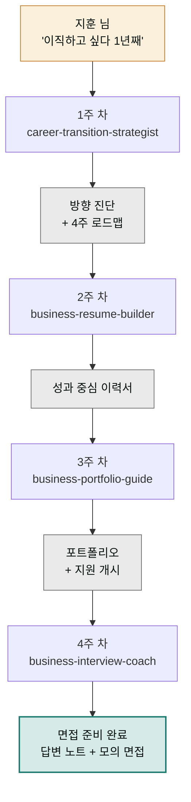

> **투입 직원** — 커리어코치(`moai-career`)

## 1. 문제 상황

중견 제조사 구매팀 7년 차 지훈 님은 1년째 "이직해야지"를 말로만 하고 있습니다. 채용 공고를 보다가 "내 경력으로 될까" 싶어 닫고, 이력서를 열었다가 2016년에 멈춘 파일을 보고 다시 닫는 패턴의 반복입니다. 문제는 의지가 아니라 **일의 크기**입니다. '이직'은 하나의 일이 아니라 방향 설정, 경력 정리, 이력서, 포트폴리오, 지원, 면접이라는 여섯 개의 일 묶음인데, 이걸 통째로 들려니 시작조차 무거운 겁니다.

그래서 이 프로젝트는 이직을 **4주짜리 프로젝트로 쪼개는 것**에서 시작합니다. 1주 차 방향과 전략, 2주 차 이력서, 3주 차 포트폴리오와 지원, 4주 차 면접 준비. 매주 산출물이 하나씩 나오니 "하고 있다"는 감각이 유지됩니다. 전 구간을 커리어코치가 함께 뜁니다.

## 2. 투입 직원과 스킬

1주 차의 엔진은 `career-transition-strategist`입니다. 지금 경력의 강점을 진단하고, 갈 수 있는 방향(동종 업계 상위 포지션 / 인접 직무 / 산업 전환)을 비교해 타깃을 좁히고, 4주 로드맵을 세웁니다. 2주 차엔 `business-resume-builder`가 "구매 업무 담당"식의 밋밋한 경력 기술을 성과 중심 문장으로 다시 씁니다. 3주 차엔 `business-portfolio-guide`가 경력직 포트폴리오 — 프로젝트별 문제·행동·성과 정리 — 를 구성합니다. 4주 차엔 `business-interview-coach`가 예상 질문과 답변 구조를 잡고 모의 면접을 돌립니다.

| 주차 | 스킬 | 산출물 |
|------|------|--------|
| 1주 | `career-transition-strategist` | 방향 진단 + 타깃 포지션 + 4주 로드맵 |
| 2주 | `business-resume-builder` | 성과 중심 이력서 · 경력기술서 |
| 3주 | `business-portfolio-guide` | 경력 포트폴리오 + 지원 시작 |
| 4주 | `business-interview-coach` | 예상 질문 답변 노트 + 모의 면접 |

## 3. 진행 단계

**1주 차 — 방향과 로드맵.** 경력을 솔직하게 풀어놓습니다.


> 이직 준비를 4주 프로젝트로 도와줘.
> 나: 중견 제조사 구매팀 7년, 원가절감 프로젝트 리드 경험,
> SAP 사용, 영어 중급. 대기업 구매직무나 SCM 쪽 생각 중.
> 방향 진단하고 주차별 계획 세워줘.


커리어코치가 강점 진단과 함께 방향별 장단(요구 역량, 경쟁 강도, 경력 인정 폭)을 비교해줍니다. 타깃을 두 개 이하로 좁히는 것이 1주 차의 성공 조건입니다.

**2주 차 — 이력서.** "타깃 포지션 기준으로 이력서 다시 써줘. '담당했다'는 전부 숫자 있는 성과 문장으로"라고 요청합니다. "연 30억 규모 자재 구매에서 협상으로 원가 7% 절감"처럼, 채용 담당자가 3초 안에 읽는 문장으로 바뀝니다. 숫자는 반드시 본인이 검증하세요 — 면접에서 다 물어봅니다.

**3주 차 — 포트폴리오와 지원.** "대표 프로젝트 3개를 문제-행동-성과 구조로 포트폴리오 만들어줘"로 무기를 하나 더 만들고, 실제 지원을 시작합니다. 지원할 공고를 붙여넣고 "이 공고에 맞춰 이력서 강조점 조정해줘"라고 공고별 맞춤도 가능합니다.

**4주 차 — 면접.** 면접이 잡히면 마지막 스킬을 투입합니다.


> 다음 주 면접이야. 공고와 내 이력서 기준으로
> 예상 질문 15개와 답변 뼈대 만들어줘.
> '왜 이직하나'랑 압박 질문은 모의 면접으로 연습하고 싶어.


## 4. 결과물

- **커리어 방향 진단서** — 강점 정리 + 타깃 포지션 근거
- **이력서·경력기술서** — 성과 문장으로 재작성, 공고별 맞춤 가능한 원본
- **경력 포트폴리오** — 대표 프로젝트 3건의 문제-행동-성과 문서
- **면접 답변 노트** — 예상 질문 15개 + 답변 뼈대 + 모의 면접 피드백
- 이직이 끝나도 남는 **자기 경력의 정리본**

## 5. 생산성 포인트

1년을 미루게 한 원인 — "어디서부터 시작하지"라는 착수 비용 — 이 4주 로드맵으로 제거되는 것이 가장 큽니다. 실무적으로는 재사용 구조가 핵심입니다. 1주 차에 정리한 경력 재료가 이력서·포트폴리오·면접 답변 세 산출물에 반복 사용되므로, 지원할 회사가 늘어도 처음부터 다시 쓰는 일이 없습니다. 공고별 맞춤도 원본 수정이 아니라 강조점 조정 요청 한 번으로 끝납니다. 탈락하더라도 다음 지원의 재료가 그대로 남는, 소모되지 않는 준비 과정이 됩니다.


**잘 안 될 때 — 이력서 성과 문장이 실제보다 부풀려집니다.**
"성과 중심으로"라는 지시가 과장으로 흐르는 경우입니다. "내가 준 사실에 없는 숫자나 역할은 만들지 말고, 근거가 약한 문장엔 [확인 필요] 표시해줘"라고 사실 경계를 정하세요. 면접에서 방어 못 할 문장은 한 줄도 남기지 않는 것이 원칙입니다. 부풀리기보다 숨은 성과를 발굴하는 질문("그 프로젝트에서 네가 없었으면 뭐가 달라졌어?")을 요청하는 편이 훨씬 유익합니다.


## 6. 응용

- **신입·주니어 버전** — 경력 진단 대신 `career-junior-onboarding`을 축으로 첫 취업 4주 플랜을 짤 수 있습니다. 포트폴리오 주차는 학교·사이드 프로젝트 정리로 대체됩니다.
- **연봉 협상 연장전** — 오퍼를 받으면 코워커의 `business-negotiation-1on1`으로 연봉 협상 시나리오(희망 연봉 근거, 양보선, 대안)를 준비해 마지막 관문까지 이어갈 수 있습니다.
