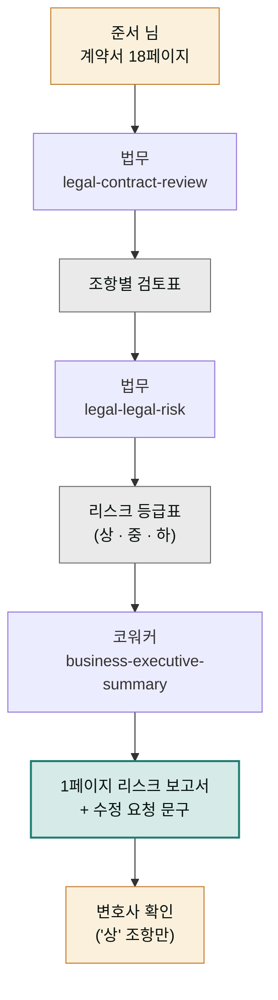

> **투입 직원** — 법무 담당(`moai-lawyer`) → 코워커(`moai-coworker`)

## 1. 문제 상황

디자인 에이전시를 운영하는 준서 님 앞에 대기업 협력사가 보낸 용역 계약서 18페이지가 놓여 있습니다. 반가운 계약인데 마음이 무겁습니다. 지난번 계약에서 "검수 완료 후 대금 지급"이라는 평범해 보이는 문구 때문에 검수가 석 달을 끌며 대금이 묶였던 기억 때문입니다. 변호사 자문을 받자니 계약 규모 대비 비용이 부담이고, 그냥 서명하자니 어느 조항이 지뢰인지 모릅니다.

준서 님에게 필요한 건 두 층의 작업입니다. 첫째, 조항 하나하나를 뜯어 **불리한 조건과 리스크를 찾아내는 검토** — 법무의 영역. 둘째, 그 검토 결과를 "그래서 서명해도 되나, 어디를 고쳐 달라고 하나"라는 **의사결정 문서**로 바꾸는 일 — 보고의 영역. 검토가 아무리 정확해도 열여덟 페이지짜리 법률 메모로는 결정을 못 내립니다.

## 2. 투입 직원과 스킬

법무 담당의 `legal-contract-review`가 계약서를 조항 단위로 검토해 불리한 조항·모호한 문구·누락된 보호 장치를 찾아냅니다. 이어서 `legal-legal-risk`가 발견된 문제를 발생 가능성과 피해 크기 기준의 리스크 등급으로 정리합니다. NDA(비밀유지계약)가 여러 건 쌓여 있다면 `legal-nda-triage`로 위험한 것부터 골라내는 선별 작업도 가능합니다. 바통을 받은 코워커는 `business-executive-summary`로 검토 결과를 1페이지 의사결정 요약으로 압축하고, 협력사에 보낼 수정 요청 문구까지 다듬습니다.

한 가지를 분명히 해두겠습니다 — 이 검토는 **변호사의 법률 자문을 대체하지 않습니다**. 어느 조항을 전문가에게 물어야 하는지 모르는 상태에서, 질문 목록을 만들어주는 사전 검토입니다.

| 순서 | 직원 | 스킬 | 역할 |
|------|------|------|------|
| 1 | 법무 | `legal-contract-review` | 조항별 검토 · 독소조항 식별 |
| 2 | 법무 | `legal-legal-risk` | 리스크 등급 분류 (가능성 × 피해) |
| 3 | 코워커 | `business-executive-summary` | 1페이지 의사결정 요약 |
| 4 | 코워커 | `general-ai-slop-reviewer` | 수정 요청 문구 어투 다듬기 |

## 3. 진행 단계

**1단계 — 조항별 검토.** 계약서와 함께 우리 쪽 사정을 알려줍니다.


> 이 용역 계약서 검토해줘. (계약서 첨부)
> 우리는 수급인(디자인 에이전시) 입장이야.
> 특히 대금 지급 조건, 검수 기한, 지식재산권 귀속,
> 손해배상 상한을 집중해서 봐줘.


법무 담당이 조항별로 "원문 → 문제점 → 우리에게 미치는 영향"을 표로 정리합니다. 지난번의 그 "검수 완료 후 지급"처럼 검수 기한이 없는 조항이 잡히는 단계입니다.

**2단계 — 리스크 등급화.** "발견된 문제를 상·중·하 리스크로 나눠줘. 상은 수정 없이는 서명 불가, 중은 수정 요청, 하는 감수 가능 기준으로"라고 요청합니다. 문제 나열이 판단 기준으로 바뀝니다.

**3단계 — 의사결정 보고서.** 코워커 차례입니다.


> 이 검토 결과를 1페이지 리스크 보고서로 만들어줘.
> 결론(서명 가능 여부) 먼저, 수정 필수 조항 3개와
> 상대에게 보낼 수정 요청 문구 초안까지.


**4단계 — 전문가 확인.** '상' 등급 조항만 추려 변호사에게 확인받습니다. 열여덟 페이지 전부가 아니라 핵심 세 조항이면 자문 범위도, 비용도 줄어듭니다.

## 4. 결과물

- **조항별 검토표** — 원문·문제점·영향이 나란히 정리된 근거 문서
- **리스크 등급표** — 서명 불가 / 수정 요청 / 감수 가능 3단 분류
- **1페이지 리스크 보고서** — 결론 우선의 의사결정 문서
- **수정 요청 문구 초안** — 협력사에 그대로 보낼 수 있는 정중한 요청문

## 5. 생산성 포인트

계약 검토의 수작업 부담은 "전체를 같은 강도로 읽어야 한다"는 데 있습니다. 이 프로젝트는 열여덟 페이지 전수 검토를 AI에 맡기고 사람의 주의력을 '상' 등급 조항 서너 개에 집중시키는 **선별 구조**로 바꿉니다. 조항 검토 → 등급화 → 보고서 → 수정 요청문이 한 흐름이라, 검토 메모를 보고서로 다시 옮겨 쓰는 이중 작업이 사라지고, 변호사 자문도 "이 계약 봐주세요"가 아니라 "이 세 조항의 이 쟁점을 봐주세요"로 좁혀져 같은 비용으로 더 깊은 답을 받게 됩니다.


**잘 안 될 때 — 검토가 일반론만 나열하고 우리 상황을 안 탑니다.**
계약서만 주고 맥락을 안 준 경우입니다. 우리 쪽 지위(수급인/도급인), 계약 금액, 과거에 당했던 문제, 절대 양보 못 하는 조건을 1단계에서 함께 주세요. "지난 계약에서 검수 지연으로 대금이 묶였다" 한 줄이 검토의 초점을 완전히 바꿉니다. 맥락 없는 검토는 교과서 요약에 그칩니다.


## 6. 응용

- **NDA 일괄 선별** — 쌓여 있는 비밀유지계약 여러 건을 `legal-nda-triage`로 한꺼번에 돌려 "즉시 서명 가능 / 검토 필요 / 위험" 3분류하면, 계약 하나가 아니라 계약 더미를 처리하는 버전이 됩니다.
- **규제 준수 점검** — 같은 구조에서 입구를 `legal-compliance-check`로 바꾸면 계약서 대신 우리 서비스 약관·마케팅 문구가 법을 지키는지 점검하는 컴플라이언스(규제 준수) 리포트가 됩니다.
