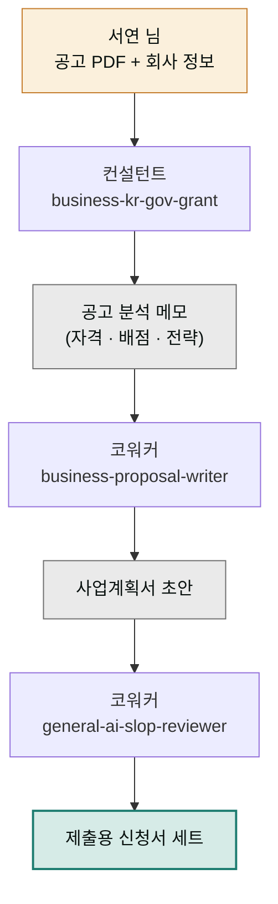

> **투입 직원** — 컨설턴트(`moai-consultant`) → 코워커(`moai-coworker`)

## 1. 문제 상황

1인 출판 스튜디오를 운영하는 서연 님은 매년 초 지원사업 공고 시즌이 두렵습니다. 창업진흥원, 콘텐츠진흥원, 지자체 공고를 훑다 보면 "우리한테 맞는 게 있긴 한가?"부터 막히고, 겨우 하나를 골라도 신청 양식 앞에서 다시 막힙니다. 사업 개요, 시장 분석, 추진 전략, 소요 예산 — 항목마다 무엇을 얼마나 써야 심사위원이 좋아하는지 알 길이 없습니다.

작년에는 마감 이틀 전에 밤을 새워 썼다가 "시장 분석 근거 부족"으로 떨어졌습니다. 문제는 글솜씨가 아니었습니다. **공고가 요구하는 평가 항목을 역으로 읽고, 각 항목에 배점만큼의 근거를 배치하는 일**을 몰랐던 겁니다. 이건 공고 해석(컨설팅)과 제안서 작성(비즈니스 문서)이라는 서로 다른 두 기술이 필요한 일입니다.

## 2. 투입 직원과 스킬

공고 해석은 컨설턴트가 맡습니다. `business-kr-gov-grant` 스킬은 한국 정부 지원사업 공고를 분석해 자격 요건·평가 기준·필수 서류를 정리하고 신청 전략을 세우는 스킬입니다. 사업 아이템 자체를 다듬어야 한다면 `business-startup-launchpad`로 사업 모델을 먼저 정리할 수 있습니다. 문장 완성은 코워커 몫입니다. `business-proposal-writer`가 평가 항목별 배점에 맞춰 제안서 본문을 쓰고, 마지막에 `general-ai-slop-reviewer`가 AI 특유의 딱딱한 어투를 걷어냅니다. 심사위원도 사람이라, 기계 냄새가 나는 문장은 감점 요인입니다.

| 순서 | 직원 | 스킬 | 역할 |
|------|------|------|------|
| 1 | 컨설턴트 | `business-kr-gov-grant` | 공고 분석 · 평가 기준 역산 · 신청 전략 |
| 2 | 컨설턴트 | `business-startup-launchpad` | (필요시) 사업 모델 정리 |
| 3 | 코워커 | `business-proposal-writer` | 평가 항목별 사업계획서 본문 작성 |
| 4 | 코워커 | `general-ai-slop-reviewer` | AI 어투 제거 · 최종 윤문 |

## 3. 진행 단계

**1단계 — 공고문을 통째로 넘기기.** 공고 PDF나 본문을 붙여넣고 시작합니다.


> 이 공고문 분석해줘. (공고 PDF 첨부)
> 우리는 1인 출판 스튜디오, 업력 3년, 작년 매출 8천만 원.
> 신청 자격이 되는지, 평가 배점이 어디에 몰려 있는지 알려줘.


컨설턴트가 자격 요건 충족 여부를 표로 정리하고, 평가 배점표를 역산해 "어느 항목에 분량과 근거를 집중해야 하는지" 전략 메모를 만듭니다.

**2단계 — 항목별 뼈대 확정.** "배점 큰 항목부터 목차와 핵심 주장 뼈대를 잡아줘"라고 요청해 골격을 먼저 확인합니다. 이 단계에서 사실관계(매출·이력·보유 자원)를 정확히 넣어줄수록 뒤 단계 품질이 올라갑니다.

**3단계 — 본문 작성.** 코워커에게 바통을 넘깁니다.


> 이 뼈대대로 사업계획서 본문 작성해줘.
> 평가 배점 비율대로 분량 배분하고, 시장 분석 항목엔
> 아까 정리한 근거 숫자를 전부 인용해줘.
> 다 쓰면 ai-slop-reviewer로 어투 다듬어줘.


**4단계 — 제출 전 점검.** "심사위원 입장에서 감점 요인 5개만 찾아줘"라고 마지막 요청을 던지면, 제출 전에 스스로 반박해보는 모의 심사가 됩니다.

## 4. 결과물

- **공고 분석 메모** — 자격 요건 체크표 + 평가 배점 역산 + 집중 공략 항목
- **사업계획서 제출본** — 평가 항목별 분량이 배점에 비례하도록 배치된 본문
- **모의 심사 결과** — 감점 예상 지점과 보완 문장
- 다음 공고 때 재사용할 수 있는 **우리 회사 기본 정보 블록**(연혁·매출·보유 역량 정리)

## 5. 생산성 포인트

수작업 신청의 가장 큰 낭비는 "공고 다시 읽기"의 반복입니다. 항목 하나 쓸 때마다 공고로 돌아가 요건을 재확인하는 왕복이 사라지고, 공고 분석 → 뼈대 → 본문이 한 흐름으로 이어집니다. 떨어진 뒤에야 알게 되던 "배점 대비 분량 불균형"을 쓰기 전에 전략으로 확정하는 것, 그리고 한 번 정리한 회사 기본 정보를 다음 공고에 그대로 재사용하는 것이 반복 제거의 핵심입니다.


**잘 안 될 때 — 계획서에 근거 없는 장밋빛 수치가 등장합니다.**
AI가 빈칸을 그럴듯한 숫자로 메꾸는 경우입니다. "네가 지어낸 숫자는 전부 [확인 필요]로 표시해줘"라고 지시해 추정과 사실을 분리하고, 매출·고객 수 같은 핵심 수치는 반드시 본인 자료로 바꿔 넣으세요. 심사에서 숫자 출처 질문은 단골입니다.


## 6. 응용

- **입찰 제안서(RFP 대응)** — 공고 대신 발주처 RFP(제안요청서)를 넣으면 같은 체인이 B2B 입찰 제안서 파이프라인이 됩니다. `business-proposal-writer`는 원래 RFP 대응이 주특기입니다.
- **은행 대출용 사업계획서** — 평가 기준을 "심사역이 보는 상환 능력"으로 바꿔 같은 흐름을 돌리고, ①번 프로젝트의 추정 손익계산서를 근거 자료로 붙이면 대출 심사용 버전이 나옵니다.
