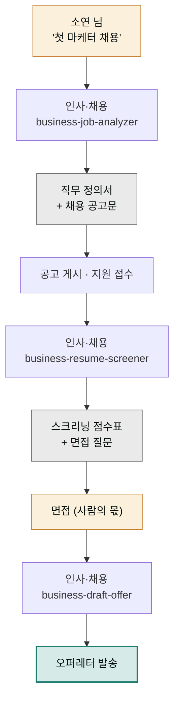

> **투입 직원** — 인사·채용 담당(`moai-recruiter`)

## 1. 문제 상황

온라인 클래스 스타트업을 운영하는 소연 님은 드디어 첫 정규직 — 콘텐츠 마케터 — 을 뽑기로 했습니다. 그런데 채용 공고를 쓰려고 앉으니 첫 줄부터 막힙니다. 다른 회사 공고를 베끼자니 우리 일과 다르고, "열정 있는 분"처럼 뭉뚱그리자니 아무나 지원할 것 같습니다. 공고를 올린 뒤가 더 걱정입니다. 이력서 수십 통을 무슨 기준으로 거를지, 합격 통보와 연봉 제안은 어떤 형식으로 해야 나중에 분쟁이 없을지 — 인사팀이 하던 일을 전부 혼자 해야 합니다.

채용의 품질은 사실 공고 이전에 결정됩니다. **이 자리에서 실제로 무슨 일을 하고, 무엇을 잘해야 성과인지를 정의하는 직무 분석**이 먼저고, 공고·스크리닝·오퍼는 그 정의에서 파생됩니다. 이 전 과정이 인사·채용 담당의 전문 영역입니다.

## 2. 투입 직원과 스킬

출발은 `business-job-analyzer`입니다. 막연한 "마케터 뽑고 싶다"를 주요 업무·필수 역량·우대 역량·성과 기준으로 구조화한 직무 정의서로 바꿔줍니다. 이 정의서가 공고문의 뼈대가 되고, 동시에 스크리닝 기준표가 됩니다. 지원서가 모이면 `business-resume-screener`가 이력서를 그 기준표에 대고 평가해 후보를 추립니다 — 기준이 먼저 있고 평가가 나중이라는 순서가 공정성의 핵심입니다. 최종 후보가 정해지면 `business-draft-offer`가 연봉·직급·입사일·조건을 담은 오퍼레터(채용 제안서)를 격식에 맞게 작성합니다. 입사 후 온보딩까지 내다본다면 `business-people-operations`가 이어받을 수 있습니다.

| 순서 | 스킬 | 역할 |
|------|------|------|
| 1 | `business-job-analyzer` | 직무 분석 · 역량 기준 정의 → 공고문 |
| 2 | `business-resume-screener` | 기준표 대비 이력서 스크리닝 |
| 3 | `business-draft-offer` | 오퍼레터 작성 |
| 4 | `business-people-operations` | (선택) 입사 준비 · 온보딩 체크리스트 |

## 3. 진행 단계

**1단계 — 직무 정의와 공고문.** 회사와 일의 실제 모습을 이야기해줍니다.


> 콘텐츠 마케터 첫 채용이야. 직무 분석부터 해줘.
> 실제로 할 일: 인스타·블로그 운영, 클래스 런칭 캠페인, 성과 리포트.
> 5인 스타트업이라 혼자 굴려야 하고, 디자인 툴 다루면 좋겠어.
> 분석 끝나면 그 기준으로 채용 공고문까지 써줘.


"열정 있는 분" 대신 "월 12건 콘텐츠를 기획부터 발행까지 혼자 완주해본 분"처럼, 하는 일이 그대로 보이는 공고가 나옵니다. 잘 쓴 공고는 그 자체로 1차 필터입니다.

**2단계 — 스크리닝 기준 고정.** 지원서를 열기 전에 "이 직무 정의서로 평가 기준표 만들어줘. 필수 3개, 우대 3개, 각 배점까지"라고 기준을 못 박습니다. 이력서를 본 뒤 기준을 만들면 인상에 끌려갑니다.

**3단계 — 이력서 스크리닝.** 지원서가 모이면 일괄로 넘깁니다.


> 지원 이력서 24건이야. (파일 첨부)
> 아까 기준표대로 평가해서 점수표 만들고,
> 면접 볼 상위 5명과 각자에게 확인할 질문 2개씩 뽑아줘.


최종 판단은 소연 님이 합니다 — 점수표는 결정을 대신하는 게 아니라 모든 지원자를 같은 잣대로 본 근거를 남기는 장치입니다.

**4단계 — 오퍼레터.** 면접이 끝나면 "최종 합격자에게 보낼 오퍼레터 써줘. 연봉 4,200, 3개월 수습, 입사일 협의"로 마무리합니다. 조건이 문서로 명확해야 입사 후 "말이 달랐다"가 없습니다.

## 4. 결과물

- **직무 정의서** — 이번 채용뿐 아니라 입사 후 평가 기준으로도 쓰이는 문서
- **채용 공고문** — 채용 플랫폼에 바로 올리는 상태
- **스크리닝 점수표** — 전 지원자를 같은 기준으로 평가한 기록
- **오퍼레터** — 조건이 명문화된 채용 제안서
- 면접별 **맞춤 확인 질문** 리스트

## 5. 생산성 포인트

혼자 채용의 최대 비용은 이력서 24통을 제각각의 기분으로 읽는 **기준 없는 반복 평가**입니다. 기준표를 먼저 고정하고 전 지원자에게 일괄 적용하는 구조로 바꾸면, 한 통씩 고민하던 24번의 판단이 "상위 5명 검토" 한 번으로 줄고, 평가 근거가 기록으로 남습니다. 직무 정의서 하나가 공고문·기준표·면접 질문·오퍼레터 네 문서의 원천이 되므로, 문서마다 처음부터 쓰는 반복도 사라집니다. 두 번째 채용부터는 정의서를 고쳐 쓰기만 하면 됩니다.


**잘 안 될 때 — 스크리닝 점수가 못 미덥습니다.**
이력서의 자기 서술을 액면대로 믿고 매긴 점수일 수 있습니다. "이력서에 근거 문장이 있는 항목만 점수 주고, 근거 없는 주장('SNS 마케팅에 능함' 등)은 '면접 확인 필요'로 분리해줘"라고 평가 규칙을 조이세요. 상위권 2~3명의 이력서는 반드시 직접 읽어 점수표와 인상이 일치하는지 교차 확인하는 것이 안전합니다.


## 6. 응용

- **평가·연봉 협상 시즌** — 채용 때 만든 직무 정의서를 기준으로 `business-performance-review`를 돌리면 입사 후 성과 평가 문서로 이어집니다. 채용-평가가 같은 기준을 쓰는 회사가 됩니다.
- **아르바이트·계약직 버전** — 같은 체인을 가볍게 돌려(직무 정의 간소화 + 근로 조건 명시 강화) 단기 채용에 쓰면, 구두 약속으로 뽑던 알바 채용에도 조건 문서가 남습니다.
