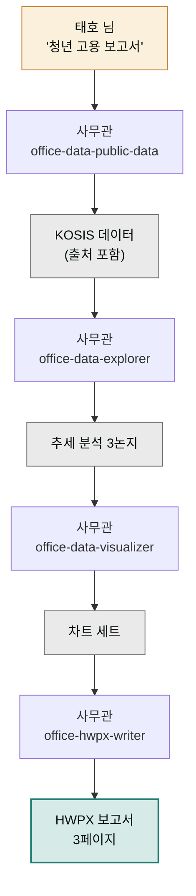

> **투입 직원** — 사무관(`moai-officer`)

## 1. 문제 상황

시청 일자리정책과에서 일하는 주무관 태호 님은 다음 주 과장 보고용으로 "관내 청년 인구·고용 동향 보고서"를 써야 합니다. 데이터는 다 공개돼 있습니다 — 통계청 KOSIS(국가통계포털), 공공데이터포털에 전부 있습니다. 문제는 그 데이터가 보고서가 되기까지의 노동입니다. 포털에서 표를 내려받고, 엑셀에서 연도별로 이어 붙이고, 그래프를 그리고, 한글(HWP) 문서에 옮겨 담고, 표 서식이 깨져서 다시 만지고.

내용을 고민하는 시간보다 **데이터를 나르는 시간**이 깁니다. 그리고 공공기관의 최종 산출물은 거의 언제나 한글 문서 — 정확히는 HWPX(한글 문서의 공개 표준 형식) — 여야 한다는 제약이 붙습니다. 데이터 수집부터 한글 문서 산출까지, 이 전 구간이 사무관 직원의 전문 영역입니다.

## 2. 투입 직원과 스킬

사무관의 `office-data-public-data`가 공공데이터포털·KOSIS 계열 데이터를 찾아 가져오는 입구입니다. 가져온 데이터는 `office-data-explorer`가 추세·비교 분석을 하고, `office-data-visualizer`가 보고서에 넣을 차트로 그립니다. 마지막 `office-hwpx-writer`가 분석 내용과 차트를 공공기관 보고서 서식(개요–현황–분석–시사점)에 맞춰 HWPX 파일로 만들어냅니다. 쿡북 공통 원칙대로 숫자·차트는 어투 검수 대상이 아니므로, 이 체인엔 ai-slop-reviewer가 없습니다 — 대신 서술형 시사점 문단이 길어지면 그 부분만 검수를 붙이면 됩니다.

| 순서 | 스킬 | 역할 |
|------|------|------|
| 1 | `office-data-public-data` | KOSIS · 공공데이터포털 데이터 수집 |
| 2 | `office-data-explorer` | 추세 분석 · 지역 비교 |
| 3 | `office-data-visualizer` | 보고서용 차트 생성 |
| 4 | `office-hwpx-writer` | HWPX(한글 문서) 보고서 산출 |

## 3. 진행 단계

**1단계 — 데이터 요청.** 어느 포털의 어느 표인지 몰라도 됩니다.


> 우리 시 청년(19~34세) 인구와 고용률 최근 5년 추이 데이터 찾아줘.
> 통계청 KOSIS 기준으로, 전국 평균과 비교할 수 있게.


사무관이 해당 통계표를 찾아 수치를 가져오고, 출처(통계표 이름·조사 기준)를 함께 남깁니다. 이 출처 표기가 공공 보고서의 생명입니다.

**2단계 — 분석.** "이 데이터에서 눈에 띄는 변화 3가지 뽑아줘. 전국 평균과 격차가 벌어지는 지점 중심으로"라고 요청하면 보고서의 뼈대 논지가 나옵니다.

**3단계 — 시각화.** "연도별 추이는 선 그래프, 전국 비교는 막대 그래프로. 보고서에 흑백 인쇄해도 구분되게"처럼 쓰임새까지 지정합니다.

**4단계 — HWPX 산출.**


> 지금까지 분석과 차트로 과장 보고용 보고서 만들어줘.
> 구성: 개요 → 현황(차트 포함) → 분석 → 시사점, 3페이지 이내.
> hwpx 파일로 저장해줘. 파일명은 '청년고용동향.hwpx'로 짧게.




## 4. 결과물

- **HWPX 보고서** — 개요·현황·분석·시사점 구성, 차트 포함, 바로 결재 올릴 수 있는 형식
- **차트 세트** — 다른 보고서·발표 자료에 재사용 가능
- **출처 정리** — 통계표 이름과 조사 기준이 붙은 데이터 근거
- 분기마다 숫자만 갱신해 다시 돌리는 **보고서 틀**

## 5. 생산성 포인트

이 프로젝트가 없애는 것은 "형식 노동"입니다. 포털 검색 → 다운로드 → 엑셀 정리 → 그래프 → 한글 붙여넣기 → 서식 수리로 이어지던 여섯 단계의 손 이동이 요청 네 번으로 접히고, 특히 마지막의 서식 수리(그래프가 밀리고 표가 깨지는 그 작업)가 통째로 사라집니다. 사람의 시간은 시사점 문단 — "그래서 우리 시는 무엇을 해야 하는가" — 이라는, 원래 주무관이 해야 할 판단에 쓰입니다. 다음 분기엔 같은 요청을 기간만 바꿔 던지면 되므로 정기 보고일수록 절약 폭이 커집니다.


**잘 안 될 때 — 원하는 통계표가 안 잡히거나 수치가 이상합니다.**
같은 주제라도 KOSIS엔 조사 방식이 다른 표가 여럿 있습니다(경제활동인구조사 vs 지역고용조사 등). "어느 통계표에서 가져왔는지 표 이름과 조사 기준을 먼저 보여줘"라고 확인한 뒤, 기관에서 관행적으로 쓰는 표가 있다면 그 이름을 직접 지정하세요. 수치 검증 전에 보고서부터 만들지 않는 것이 원칙입니다.


## 6. 응용

- **부동산·경매 리서치** — 같은 흐름에서 데이터 입구만 `office-business-real-estate-search`나 `office-finance-court-auction-search`로 바꾸면 관내 부동산 동향 보고서가 됩니다.
- **발표용 전환** — 완성된 보고서를 `office-pptx-designer`에 넘겨 "이 보고서를 5장 발표 자료로"라고 요청하면, 같은 내용의 보고회용 PPT가 나옵니다.
