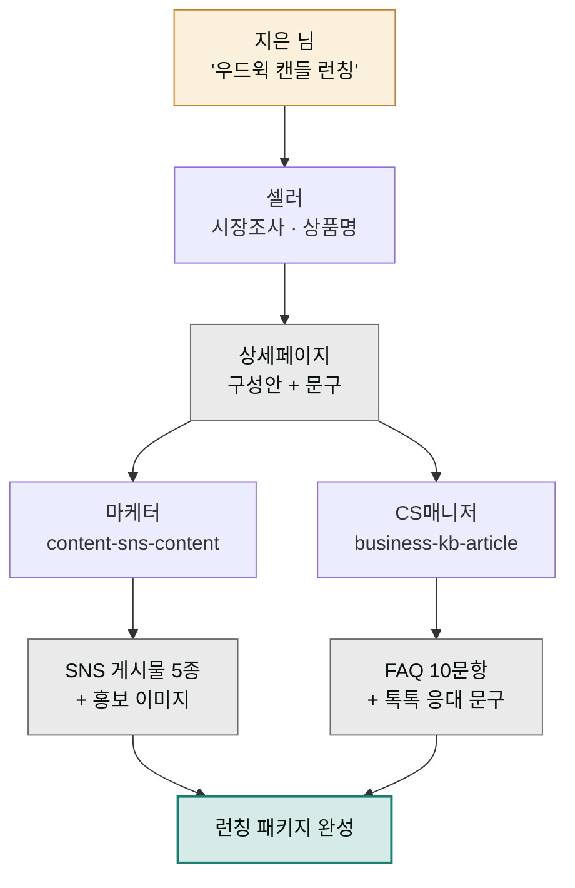

> **투입 직원** — 셀러(`moai-seller`) → 마케터(`moai-marketer`) → CS매니저(`moai-cs`)

## 1. 문제 상황

온라인에서 수제 캔들을 파는 지은 님은 다음 달 겨울 시즌 신상 '우드윅 캔들'을 스마트스토어에 올릴 계획입니다. 첫 제품 때의 기억이 아직 생생합니다. 상세페이지 문구를 사흘 밤 붙잡고, 인스타그램 홍보 글은 결국 못 올렸고, 런칭 직후엔 "심지에서 소리가 나는데 불량인가요?" 같은 문의에 하나하나 손으로 답하느라 정작 다음 제품 준비를 못 했습니다.

런칭은 사실 한 가지 일이 아니라 세 가지 일의 묶음입니다. **팔리게 만드는 일**(상세페이지), **알리는 일**(홍보 콘텐츠), **지키는 일**(고객 응대). 쇼핑몰 회사라면 MD·마케터·CS팀이 나눠 맡는 일을 지은 님은 혼자 다 하고 있었던 겁니다. 이번엔 세 명의 AI 직원에게 각자의 몫을 맡깁니다.

## 2. 투입 직원과 스킬

첫 주자는 셀러입니다. `commerce-market-research`로 경쟁 상품과 가격대를 훑고, `commerce-product-naming`으로 검색에 걸리는 상품명을 뽑고, `commerce-detail-page-planner`와 `commerce-detail-page-copy`로 상세페이지 구성안과 문구를 만듭니다. 네이버 입점 실무는 `commerce-marketplace-naver`가 챙깁니다. 두 번째 주자 마케터는 `content-sns-content`로 런칭 주간 SNS 게시물을 만들고, `media-higgsfield-image`로 홍보 이미지를 뽑습니다. 마지막 주자 CS매니저는 `business-kb-article`로 예상 문의 FAQ를 미리 만들고, `commerce-channel-message`로 톡톡·문자 응대 문구를 준비합니다. 문의가 오기 전에 답을 준비해두는 것이 런칭 CS의 핵심입니다.

| 순서 | 직원 | 스킬 | 역할 |
|------|------|------|------|
| 1 | 셀러 | `commerce-market-research` | 경쟁 상품 · 가격대 조사 |
| 2 | 셀러 | `commerce-product-naming` | 검색 최적화 상품명 |
| 3 | 셀러 | `commerce-detail-page-planner` + `commerce-detail-page-copy` | 상세페이지 구성 · 문구 |
| 4 | 마케터 | `content-sns-content` + `media-higgsfield-image` | 런칭 SNS 콘텐츠 · 이미지 |
| 5 | CS매니저 | `business-kb-article` + `commerce-channel-message` | FAQ · 채널 응대 문구 |

## 3. 진행 단계

**1단계 — 시장 조사와 상품명.** 제품 정보를 주고 셀러부터 투입합니다.


> 우드윅(나무 심지) 수제 캔들 신제품을 스마트스토어에 올릴 거야.
> 경쟁 상품 가격대랑 리뷰 불만 포인트 조사하고,
> 검색 잘 걸리는 상품명 후보 5개 뽑아줘.


**2단계 — 상세페이지.** "이 조사 결과 반영해서 상세페이지 구성안 잡고, 섹션별 문구까지 써줘"라고 이어갑니다. 경쟁 리뷰의 불만 포인트("향이 약해요")가 우리 상세페이지의 선제 답변 섹션으로 바뀌는 것이 이 체인의 묘미입니다.



**3단계 — 홍보 콘텐츠.** 마케터에게 바통을 넘깁니다.


> 이 상세페이지 내용 바탕으로 런칭 주간 인스타 게시물 5개 만들어줘.
> 티저 2개, 런칭 공지 1개, 사용 장면 2개.
> 대표 이미지는 higgsfield-image로 겨울 분위기 1:1 비율.


**4단계 — 응대 준비.** 마지막으로 CS매니저입니다. "이 제품에서 나올 만한 고객 문의 10개 뽑아서 FAQ 문서 만들고, 네이버 톡톡용 짧은 응대 문구 버전도 같이 만들어줘"라고 요청합니다. 우드윅 특유의 "타닥 소리가 나요"는 불량 문의가 아니라 제품 특징 설명 기회가 됩니다.

## 4. 결과물

- **상세페이지 세트** — 검색 최적화 상품명 + 섹션 구성안 + 판매 문구
- **SNS 런칭 콘텐츠** — 게시물 원고 5개 + 홍보 이미지
- **CS 패키지** — 예상 문의 FAQ 10문항 + 톡톡·문자 응대 템플릿
- 다음 신제품 때 그대로 재사용할 **런칭 체크리스트**

## 5. 생산성 포인트

혼자 하던 런칭의 낭비는 "역할 전환 비용"이었습니다. 상세페이지를 쓰다가 마케터 머리로, 다시 CS 머리로 갈아 끼우는 사이 앞 작업 맥락이 날아갑니다. 이 프로젝트에서는 시장 조사 결과가 상세페이지로, 상세페이지가 SNS 문구와 FAQ로 **한 번 만든 내용이 세 번 재사용**되기 때문에 같은 제품 설명을 세 번 새로 쓰는 반복이 사라집니다. 특히 CS는 문의가 온 뒤 대응하던 사후 작업에서 런칭 전에 끝나는 사전 작업으로 순서가 바뀝니다.


**잘 안 될 때 — SNS 문구가 상세페이지 톤과 따로 놉니다.**
단계 사이에 시간이 지나 맥락이 끊긴 경우입니다. 마케터 단계에서 "위 상세페이지 문구의 톤 그대로"라고 명시하거나, 상세페이지 문구 파일을 다시 첨부해 기준을 고정하세요. 브랜드 말투 규칙(해요체, 금지 표현 등)을 한 줄로 정리해두면 어느 직원에게든 재사용할 수 있습니다.


## 6. 응용

- **쿠팡 동시 런칭** — 셀러의 `commerce-marketplace-coupang`으로 같은 소재를 쿠팡 등록 규격에 맞춰 변환하면, 한 번의 조사로 두 채널 런칭이 됩니다.
- **라이브 커머스 확장** — 런칭 반응이 좋으면 `commerce-live-commerce`로 라이브 방송 큐시트(진행 대본)를 만들어, 같은 상세페이지 소재를 방송용으로 재가공할 수 있습니다.
