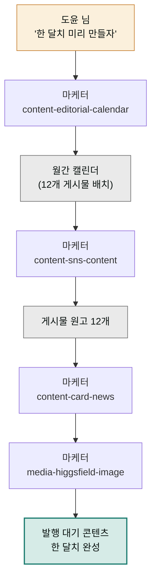

> **투입 직원** — 마케터(`moai-marketer`)

## 1. 문제 상황

동네 베이커리를 운영하는 도윤 님의 인스타그램은 전형적인 "삼일천하" 계정입니다. 의욕이 넘칠 땐 사흘 연속 올리다가, 매장이 바빠지면 2주씩 조용해집니다. 팔로워가 늘지 않는 이유를 알고는 있습니다 — 꾸준함이 없어서. 하지만 매일 아침 "오늘은 뭘 올리지?"부터 시작하는 구조에서는 꾸준할 수가 없습니다. 소재 고민, 문구 작성, 이미지 준비를 매번 처음부터 하기 때문입니다.

해법은 제작 방식을 바꾸는 겁니다. **매일 한 개씩 만드는 대신, 한 번에 한 달치를 계획하고 몰아서 만드는 것.** 콘텐츠 업계에서 배치 프로덕션(batch production, 같은 종류의 작업을 묶어 한꺼번에 처리하는 방식)이라 부르는 방법입니다. 계획–원고–이미지가 전부 마케팅 콘텐츠 업무라 이번 프로젝트는 마케터 한 명이 처음부터 끝까지 뜁니다. 직원은 하나여도 스킬은 릴레이입니다.

## 2. 투입 직원과 스킬

먼저 `content-editorial-calendar`가 한 달 발행 계획표를 짭니다. 요일별 코너(월요일 신메뉴, 수요일 비하인드, 금요일 이벤트처럼 반복되는 틀)를 정해두면 "뭘 올리지" 고민이 "이번 주 신메뉴는 뭐지"라는 쉬운 질문으로 바뀝니다. 다음으로 `content-sns-content`가 캘린더의 각 칸을 실제 게시물 원고로 채우고, 정보성 게시물은 `content-card-news`가 장표 형식(카드뉴스)으로 구성합니다. 마지막으로 `media-higgsfield-image`가 한글 텍스트가 들어간 카드뉴스 이미지를 만들어냅니다.

| 순서 | 스킬 | 역할 |
|------|------|------|
| 1 | `content-editorial-calendar` | 월간 발행 캘린더 (요일 코너 · 소재 배치) |
| 2 | `content-sns-content` | 게시물별 본문 원고 · 해시태그 |
| 3 | `content-card-news` | 정보성 게시물의 카드뉴스 구성 |
| 4 | `media-higgsfield-image` | 카드뉴스 · 대표 이미지 생성 |

## 3. 진행 단계

**1단계 — 월간 캘린더 설계.**


> 동네 베이커리 인스타 계정 한 달 콘텐츠 캘린더 짜줘.
> 주 3회(월·수·금), 코너는 신메뉴 소개 / 만드는 과정 / 손님 이야기.
> 다음 달엔 크리스마스 시즌 예약 이벤트도 있어.


마케터가 시즌 이슈(크리스마스)를 축으로 12개 게시물의 소재·형식·목표를 표로 배치합니다. 이 표가 한 달의 지도가 됩니다.

**2단계 — 원고 일괄 작성.** "이 캘린더의 12개 게시물 원고를 전부 써줘. 우리 말투는 반말 아닌 친근한 해요체, 이모지는 두 개까지"라고 한 번에 요청합니다. 하나씩 시키는 것보다 말투가 고르게 유지됩니다.

**3단계 — 카드뉴스 구성.** 정보성 소재(예: "식빵 맛있게 보관하는 법")를 골라 "이건 6장짜리 카드뉴스로 구성해줘"라고 요청하면 장표별 문구가 나옵니다.

**4단계 — 이미지 생성.** "카드뉴스 6장, higgsfield-image로 만들어줘. 따뜻한 베이지 톤, 한글 타이포 크게, 1:1 비율"로 마무리합니다.



## 4. 결과물

- **월간 콘텐츠 캘린더** — 발행일·코너·소재·형식이 정리된 한 달 지도
- **게시물 원고 12개** — 본문 + 해시태그, 복사해 붙이면 되는 상태
- **카드뉴스 세트** — 장표 문구 + 이미지
- 다음 달에도 재사용하는 **코너 틀** — 소재만 갈아 끼우면 되는 반복 구조

## 5. 생산성 포인트

가장 크게 줄어드는 건 "시작 비용"의 반복입니다. 매일 백지에서 시작하던 12번의 고민이 캘린더 설계 한 번으로 접히고, 원고 작성도 12번의 개별 작업이 아니라 한 번의 일괄 요청이 됩니다. 말투·해시태그·이미지 톤을 매번 새로 정하던 결정도 첫 요청에서 규칙으로 못 박히므로, 계정 전체의 일관성이 사람이 애쓰지 않아도 유지됩니다. 남는 시간은 콘텐츠의 원재료 — 빵 사진 찍기와 손님 이야기 수집 — 에 쓰면 됩니다.


**잘 안 될 때 — 12개 원고가 다 비슷비슷하게 읽힙니다.**
일괄 생성의 부작용입니다. 코너별로 형식을 다르게 지정하세요 — "신메뉴 코너는 첫 문장을 맛 묘사로, 비하인드 코너는 질문으로 시작, 손님 이야기는 대화 인용으로 시작"처럼 코너마다 시작 패턴을 갈라주면 반복감이 사라집니다. 그래도 밋밋하면 잘 쓴 게시물 2~3개를 예시로 첨부해 "이 결로"라고 기준을 보여주세요.


## 6. 응용

- **뉴스레터 병행** — 같은 소재를 `content-newsletter`에 넘겨 월 1회 단골 뉴스레터로 재가공하면, 한 번의 기획이 두 채널을 먹여 살립니다.
- **광고 소재 전환** — 반응이 좋았던 게시물을 `marketing-meta-ads-manager`에 넘겨 인스타 광고 소재로 전환하면, 검증된 콘텐츠만 광고비를 태우는 안전한 확장이 됩니다.
