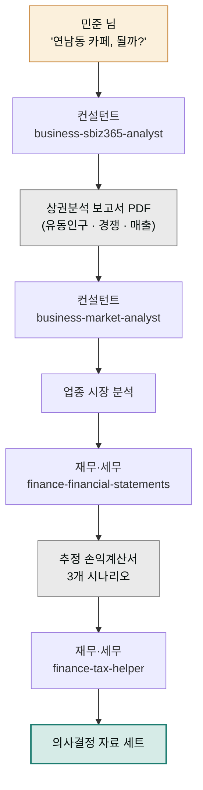

> **투입 직원** — 컨설턴트(`moai-consultant`) → 재무·세무 담당(`moai-accountant`)

## 1. 문제 상황

12년 차 직장인 민준 님은 회사 근처 골목을 지날 때마다 "여기에 카페를 열면 어떨까" 하는 생각을 합니다. 퇴직금과 모아둔 돈을 합치면 창업 자금은 얼추 됩니다. 문제는 확신입니다. 지인들은 "요즘 카페는 다 망한다"고 하고, 프랜차이즈 상담사는 "이 자리는 무조건 된다"고 합니다. 양쪽 다 근거가 감(感)이라는 점은 같습니다.

민준 님에게 필요한 건 두 가지입니다. 첫째, 그 골목의 유동인구·경쟁 점포·매출 통계 같은 **객관적인 상권 데이터**. 둘째, 그 데이터를 "월세 얼마, 예상 매출 얼마, 몇 개월 버티면 손익분기"라는 **숫자 계획**으로 바꾸는 일. 전자는 시장을 읽는 컨설팅의 영역이고 후자는 재무의 영역이라, 실제 창업 컨설팅에서도 서로 다른 전문가가 맡습니다. AI 직원도 똑같이 둘을 나눠 투입합니다.

## 2. 투입 직원과 스킬

먼저 컨설턴트가 나섭니다. `business-sbiz365-analyst` 스킬은 소상공인시장진흥공단의 상권정보 시스템(소상공인365) 데이터를 바탕으로 상권분석 보고서를 만드는 스킬입니다. 여기에 `business-market-analyst`로 카페 업종 자체의 시장 흐름을 겹쳐 보면 "이 자리"와 "이 업종" 두 축의 그림이 나옵니다. 그다음 바통은 재무·세무 담당에게 넘어갑니다. `finance-financial-statements`가 초기 투자·고정비·예상 매출을 추정 손익계산서(일정 기간의 수입과 지출을 정리한 표)로 정리하고, `finance-tax-helper`가 개인사업자 등록 시 세금 부담까지 짚어줍니다.

| 순서 | 직원 | 스킬 | 역할 |
|------|------|------|------|
| 1 | 컨설턴트 | `business-sbiz365-analyst` | 상권분석 보고서 (유동인구·경쟁 점포·업종 매출) |
| 2 | 컨설턴트 | `business-market-analyst` | 카페 업종 시장 분석 |
| 3 | 재무·세무 | `finance-financial-statements` | 추정 손익계산서·손익분기 계산 |
| 4 | 재무·세무 | `finance-tax-helper` | 사업자 형태별 세금 시뮬레이션 |

## 3. 진행 단계

**1단계 — 상권분석부터.** 후보 지역과 업종을 알려주며 시작합니다.


> 서울 마포구 연남동에 20평 카페 창업을 고민 중이야.
> 소상공인365 데이터 기준으로 상권분석 보고서 만들어줘.
> 유동인구, 경쟁 카페 수, 업종 평균 매출 꼭 넣어줘.


컨설턴트가 상권 범위·타깃 연령대 같은 빠진 맥락을 AskUserQuestion(선택지가 딸린 질문 팝업)으로 묻고, 상권분석 보고서를 PDF로 정리합니다.

**2단계 — 업종 시장 흐름 겹쳐 보기.** "카페 업종 전체의 최근 시장 흐름과 폐업률 추이를 분석해서 앞 보고서에 이어 붙여줘"라고 요청하면, 자리(상권)만 좋고 업종(시장)이 기우는 함정을 걸러낼 수 있습니다.

**3단계 — 숫자 계획으로 변환.** 이제 재무·세무 담당 차례입니다.


> 방금 상권분석 보고서 숫자를 바탕으로 추정 손익계산서 만들어줘.
> 보증금 5천, 월세 250, 인테리어 6천 기준.
> 손익분기까지 몇 개월인지, 최악/보통/최선 세 가지 시나리오로.


**4단계 — 세금까지 확인.** "개인사업자와 법인 중 어느 쪽이 유리한지 세금 기준으로 비교해줘"라고 이어 붙이면 사업자 형태 결정 자료까지 완성됩니다.

## 4. 결과물

- **상권분석 보고서 PDF** — 유동인구, 경쟁 점포 밀도, 업종 평균 매출이 담긴 근거 문서
- **추정 손익계산서** — 최악/보통/최선 3개 시나리오와 손익분기 시점
- **세금 비교표** — 개인사업자 vs 법인의 부담 차이
- 이 셋을 묶으면 배우자·투자자·은행 누구에게든 내밀 수 있는 **창업 의사결정 패키지**가 됩니다.

## 5. 생산성 포인트

혼자 했다면 상권정보 시스템에서 통계를 내려받고, 엑셀로 손익 표를 짜고, 세무 카페 글을 뒤지는 세 갈래 작업을 각각 배워가며 해야 합니다. 이 프로젝트에서는 그 세 갈래가 **요청 네 번**으로 줄고, 무엇보다 상권 데이터의 숫자가 손익 추정에 그대로 이어지기 때문에 "보고서 따로, 계산 따로"에서 생기는 옮겨 적기 오류와 반복 대조 작업이 사라집니다. 감으로 하던 결정이 시나리오 세 개짜리 숫자 비교로 바뀌는 것이 핵심입니다.


**잘 안 될 때 — 상권 데이터가 너무 두루뭉술하게 나옵니다.**
지역을 "마포구"처럼 넓게 주면 평균값만 나옵니다. "연남동 경의선숲길 북측, 반경 300m"처럼 좁혀 다시 요청하고, 그래도 데이터가 부족한 골목이면 "인접 상권 두 곳과 비교해줘"로 우회하세요. 데이터 공백 자체도 중요한 판단 재료입니다.


## 6. 응용

- **점포 이전 검증** — 이미 운영 중인 가게의 이전 후보지 2곳을 같은 체인으로 돌려 나란히 비교하면, 창업이 아니라 **이전 의사결정** 자료가 됩니다.
- **프랜차이즈 제안 검증** — 프랜차이즈 본사가 내민 예상 매출표를 1단계 상권분석 결과와 대조해달라고 요청하면, 본사 자료의 낙관 편향을 걸러내는 **역검증 도구**로 쓸 수 있습니다.
