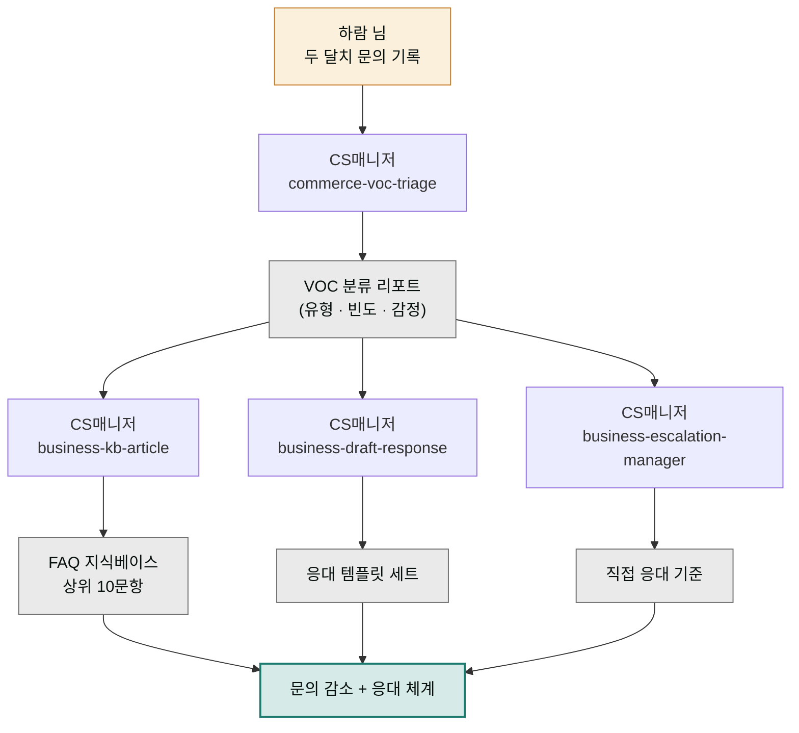

> **투입 직원** — CS매니저(`moai-cs`)

## 1. 문제 상황

반려동물 용품 쇼핑몰을 운영하는 하람 님의 하루는 문의 답장으로 시작해 문의 답장으로 끝납니다. 톡톡, 이메일, 상품 Q&A를 합치면 하루 서른 건. 그런데 가만 보면 절반 이상이 이미 답한 적 있는 질문입니다. "배송 언제 오나요", "사료 유통기한 어디 봐요", "교환은 어떻게 해요". 같은 답을 매번 새로 타이핑하면서, 정작 "이 제품 쓰고 알레르기가 생긴 것 같아요" 같은 진짜 손이 가야 할 문의는 밀립니다.

쌓인 문의 기록은 사실 보물입니다. **고객이 무엇에 걸려 넘어지는지의 데이터**이기 때문입니다. 업계에서 VOC(Voice of Customer, 고객의 소리 — 문의·불만·리뷰를 통칭)라 부르는 이 기록을 분석하면, 반복 질문은 FAQ로 만들어 문의 자체를 줄이고, 답변은 템플릿화해 응대를 빠르게 하고, 제품·페이지 개선점까지 찾을 수 있습니다. 전 과정이 CS매니저의 전문 영역입니다.

## 2. 투입 직원과 스킬

첫 단계는 `commerce-voc-triage`입니다. 흩어진 문의 기록을 유형별로 분류하고(트리아지 — 응급실처럼 심각도와 유형으로 나누는 선별 작업), 반복 빈도와 감정 강도를 집계해 "무엇부터 해결해야 하는지"의 우선순위를 만듭니다. 상위 반복 질문은 `business-kb-article`이 FAQ 문서(지식베이스 아티클)로 바꿉니다 — 고객이 읽는 버전과 상담자가 참조하는 버전을 나눠 쓸 수 있습니다. 남은 개별 응대는 `business-draft-response`가 상황별 답변 템플릿으로 준비하고, 불만이 격해진 건은 `business-escalation-manager`가 에스컬레이션(윗선 이관) 기준과 대응 절차를 잡아줍니다.

| 순서 | 스킬 | 역할 |
|------|------|------|
| 1 | `commerce-voc-triage` | 문의 분류 · 빈도 집계 · 우선순위 |
| 2 | `business-kb-article` | 반복 질문 → FAQ 지식베이스 문서 |
| 3 | `business-draft-response` | 상황별 응대 답변 템플릿 |
| 4 | `business-escalation-manager` | 격앙 건 이관 기준 · 대응 절차 |

## 3. 진행 단계

**1단계 — VOC 쏟아붓기.** 정리하지 말고 원본 그대로 넘기는 게 좋습니다.


> 최근 두 달치 고객 문의 기록이야. (내보내기 파일 첨부)
> 유형별로 분류하고, 반복 많은 순서로 순위 매겨줘.
> 화가 난 문의는 따로 표시해줘.


CS매니저가 분류표를 만듭니다. "문의의 41%가 배송 관련, 그중 절반이 '언제 오나요'"처럼 감으로 알던 것이 숫자가 됩니다.

**2단계 — FAQ 전환.** "상위 10개 반복 질문을 FAQ 문서로 만들어줘. 고객용은 쉽고 짧게, 스토어 공지에 올릴 수 있는 형식으로"라고 요청합니다. 답변 내용은 반드시 본인이 검수하세요 — 배송 정책, 교환 조건 같은 사실은 우리 가게 기준이 정답입니다.

**3단계 — 응대 템플릿.** FAQ로 못 막는 개별 문의를 위해 "환불 요청, 배송 지연 항의, 제품 하자 신고, 이 세 상황의 답변 템플릿 만들어줘. 사과-확인-안내-보상 순서로"라고 준비해둡니다.

**4단계 — 에스컬레이션 기준.** 마지막으로 "어떤 문의는 템플릿으로 답하면 안 되고 내가 직접 봐야 하는지, 기준 목록 만들어줘"라고 안전선을 긋습니다. 알레르기 같은 건강 관련 문의가 템플릿으로 처리되는 사고를 막는 장치입니다.

## 4. 결과물

- **VOC 분류 리포트** — 문의 유형·빈도·감정 강도 집계표
- **FAQ 지식베이스** — 스토어 공지·상품 페이지에 올리는 상위 10문항
- **응대 템플릿 세트** — 상황별로 복사해 쓰는 답변 문안
- **에스컬레이션 기준** — 템플릿 금지, 직접 응대해야 하는 문의 목록
- 상세페이지·정책 개선으로 이어지는 **제품 개선 힌트**

## 5. 생산성 포인트

바뀌는 것은 응대의 구조입니다. 서른 건의 문의를 서른 번 새로 쓰던 구조가, FAQ가 반복 질문을 사전에 흡수하고 → 템플릿이 개별 응대를 붙여넣기로 줄이고 → 사람은 기준에 걸린 소수 건만 직접 다루는 3층 구조로 바뀝니다. 같은 답을 다시 타이핑하는 반복이 사라질 뿐 아니라, 분류 리포트가 "배송 안내 문구를 상세페이지 위로 올리면 문의 자체가 준다" 같은 **원인 제거** 단서를 주기 때문에, 다음 달의 문의량 자체가 줄어드는 선순환이 생깁니다.


**잘 안 될 때 — FAQ를 올렸는데 같은 문의가 계속 옵니다.**
FAQ가 틀린 게 아니라 고객 눈에 안 보이는 위치에 있는 경우가 대부분입니다. 문의가 발생하는 지점(주문 완료 화면, 상품 페이지 상단, 톡톡 자동 인사말)에 해당 FAQ 답을 직접 배치해달라고 요청 문구를 다시 짜세요. "배송 문의가 계속 오는데, 고객이 주문 직후에 보게 될 안내 문구로 다시 써줘"처럼 위치를 바꾸는 재요청이 답인 경우가 많습니다.


## 6. 응용

- **리뷰 분석 버전** — 문의 대신 상품 리뷰를 같은 체인에 넣으면 별점 하락 원인 분석 → 상세페이지 보완 문구라는 리뷰 개선 파이프라인이 됩니다.
- **셀러 연계 순환** — 분류 리포트에서 나온 제품 개선 힌트를 셀러의 `commerce-detail-page-copy`에 넘겨 상세페이지를 고치면, CS 데이터가 매출 페이지를 개선하는 ③번 프로젝트와의 순환 고리가 완성됩니다.
