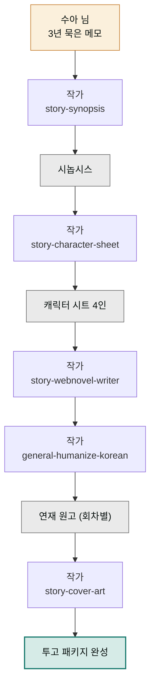

> **투입 직원** — 작가(`moai-writer`)

## 1. 문제 상황

간호사로 일하는 수아 님의 메모장에는 3년 묵은 이야기가 하나 있습니다. 회귀한 신입 간호사가 병원의 비리를 파헤치는 이야기 — 설정도, 주요 장면도, 결말도 머릿속엔 다 있습니다. 없는 건 "작품"입니다. 몇 번이나 1화를 쓰기 시작했지만 쓰다 보면 설정이 꼬이고, 인물 말투가 화마다 달라지고, 결국 "내가 뭘 쓰려던 거지"에서 멈췄습니다.

웹소설 플랫폼에 도전하려면 머릿속 이야기를 세 가지 물건으로 바꿔야 합니다. **시놉시스**(작품 전체의 줄거리 요약 — 플랫폼 투고와 방향 유지의 기준), **캐릭터 시트**(인물별 성격·말투·관계 정리표 — 화가 거듭돼도 인물이 흔들리지 않게 하는 장치), 그리고 **연재 원고**. 여기에 독자의 첫 클릭을 결정하는 표지까지. 전부 이야기 창작의 영역이라, 이번 프로젝트는 작가 직원 한 명과의 긴 협업입니다.

## 2. 투입 직원과 스킬

작가의 `story-synopsis`가 머릿속 설정을 시놉시스로 구조화하고, `story-character-sheet`가 주요 인물의 성격·말투·욕망·관계를 시트로 고정합니다. 이 두 문서가 준비되면 `story-webnovel-writer`가 회차별 연재 원고를 씁니다 — 웹소설 특유의 문법(짧은 호흡, 회차 끝 절단감, 모바일 가독성)을 아는 스킬입니다. 초고의 번역투를 걷어내는 건 `general-humanize-korean`(한국어 자연화 윤문) 몫이고, 마지막으로 `story-cover-art`가 장르 관습에 맞는 표지 시안을 준비합니다.

| 순서 | 스킬 | 역할 |
|------|------|------|
| 1 | `story-synopsis` | 시놉시스 (기승전결 · 투고용 요약) |
| 2 | `story-character-sheet` | 인물별 성격 · 말투 · 관계 시트 |
| 3 | `story-webnovel-writer` | 회차별 연재 원고 집필 |
| 4 | `general-humanize-korean` | 번역투 · AI 어투 제거 윤문 |
| 5 | `story-cover-art` | 장르 맞춤 표지 시안 |

## 3. 진행 단계

**1단계 — 이야기 쏟아내기.** 정리하지 말고 그냥 쏟아내는 게 좋습니다.


> 웹소설 준비 중이야. 메모를 그대로 줄게. (메모 붙여넣기)
> 회귀물 + 병원 배경 + 여주인공.
> 이걸 투고용 시놉시스로 정리해줘. 결말까지 포함해서.


작가가 장르 관습(회귀물 독자의 기대 요소)과 어긋나는 지점을 짚어주며 시놉시스를 세웁니다. 마음에 안 드는 전개는 이 단계에서 고치는 게 가장 쌉니다.

**2단계 — 인물 고정.** "주요 인물 4명 캐릭터 시트 만들어줘. 각자 말버릇과 절대 하지 않을 행동까지"라고 요청합니다. '절대 하지 않을 행동'이 있어야 연재 중반에 인물이 붕괴하지 않습니다.

**3단계 — 연재 집필.** 본 궤도입니다.


> 시놉시스와 캐릭터 시트 기준으로 1화 써줘.
> 회차 분량 5000자, 끝은 다음 화가 궁금해지는 절단으로.
> 초고 나오면 humanize-korean으로 문장 다듬어줘.


이후엔 "2화 써줘"의 반복입니다. 매 화 시트와 시놉시스를 기준 삼기 때문에 설정 꼬임이 구조적으로 줄어듭니다. 다만 이야기의 판단 — 이 전개가 재미있는가 — 은 끝까지 수아 님의 몫입니다.

**4단계 — 표지.** "이 작품 표지 시안 잡아줘. 로맨스판타지 플랫폼 관습에 맞게, 제목 타이포 크게"로 마무리합니다.

## 4. 결과물

- **투고용 시놉시스** — 플랫폼·공모전에 그대로 내는 작품 요약
- **캐릭터 시트** — 연재 내내 참조하는 인물 기준 문서
- **연재 원고** — 회차별 5000자 내외, 윤문 완료 상태
- **표지 시안** — 장르 관습에 맞춘 첫인상

## 5. 생산성 포인트

3년간 수아 님을 멈추게 한 건 집필력이 아니라 **기반 문서 없이 쓰기 시작한 구조**였습니다. 설정이 꼬일 때마다 앞 화를 다시 읽고 고치는 되감기 작업이, 시놉시스·캐릭터 시트라는 기준 문서 두 장으로 사라집니다. 화마다 "이 인물 말투가 뭐였지"를 뒤지던 확인 반복도 시트 참조로 대체됩니다. 매 화가 백지에서 시작하는 게 아니라 기준 문서 위에서 시작한다는 것 — 그게 완주와 포기를 가르는 차이입니다.


**잘 안 될 때 — 회차가 쌓일수록 초반 설정과 어긋납니다.**
긴 연재에서 앞부분 맥락이 대화에서 밀려나는 현상입니다. 새 회차를 시작할 때마다 시놉시스와 캐릭터 시트 파일을 다시 첨부하고 "이 두 문서가 기준"이라고 못 박으세요. 10화 단위로 "지금까지 전개를 요약하고 시놉시스와 어긋난 부분 찾아줘"라는 정합성 점검을 끼워 넣으면 어긋남을 조기에 잡을 수 있습니다.


## 6. 응용

- **웹툰 기획 전환** — 반응이 좋은 작품은 `story-webtoon-planner`와 `story-conti`로 웹툰 콘티(장면 설계도) 기획서를 만들어 2차 판권 제안 자료로 확장할 수 있습니다.
- **종이책 기획** — 같은 원고를 `book-proposal-writer`(출간 기획서)와 `book-publisher-matcher`(출판사 매칭)에 넘기면 웹 연재가 아닌 종이책 투고 트랙이 됩니다.
