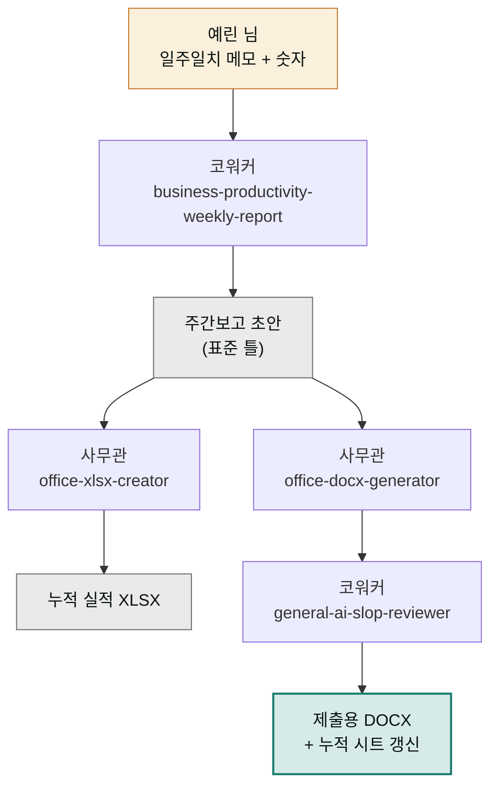

> **투입 직원** — 코워커(`moai-coworker`) → 사무관(`moai-officer`)

## 1. 문제 상황

중소 유통사 마케팅팀의 유일한 기획 담당 예린 님에게 금요일 오후는 "주간보고의 시간"입니다. 일주일치 메모와 메신저 기록을 뒤져 한 일을 복원하고, 캠페인 숫자를 엑셀에 모으고, 팀장님 취향의 보고서 형식에 맞춰 워드로 옮깁니다. 매주 똑같은 구조인데 매주 처음부터 합니다. 더 허탈한 건, 그렇게 만든 보고서가 다음 주면 아무도 다시 열지 않는다는 점입니다.

주간보고는 자동화하기 가장 좋은 문서입니다. **구조가 매주 같고, 바뀌는 건 내용뿐**이기 때문입니다. 필요한 건 두 가지 — 흩어진 업무 기록을 보고 문장으로 바꾸는 일(코워커의 영역)과, 숫자 집계와 문서 파일 산출이라는 형식 작업(사무관의 영역)입니다.

## 2. 투입 직원과 스킬

코워커의 `business-productivity-weekly-report`가 핵심 엔진입니다. 일주일치 메모·완료 목록을 던지면 "한 일 / 진행 중 / 다음 주 계획 / 이슈"의 표준 주간보고 구조로 정리해줍니다. 임원 보고 급으로 격식을 갖춰야 하면 `business-pm-weekly-report`(KPI 기반 주간 비즈니스 리뷰)로 바꿔 탈 수 있습니다. 형식 작업은 사무관 몫입니다. `office-xlsx-creator`가 주차별 실적 숫자를 누적 시트로 집계하고, `office-docx-generator`가 팀 서식에 맞는 워드 문서를 만듭니다. 문장 산출물이므로 마지막에 코워커의 `general-ai-slop-reviewer`를 한 번 태워 보고서 어투를 자연스럽게 만듭니다.

| 순서 | 직원 | 스킬 | 역할 |
|------|------|------|------|
| 1 | 코워커 | `business-productivity-weekly-report` | 메모 → 주간보고 구조화 |
| 2 | 사무관 | `office-xlsx-creator` | 주차별 실적 XLSX 누적 집계 |
| 3 | 사무관 | `office-docx-generator` | 팀 서식 DOCX 산출 |
| 4 | 코워커 | `general-ai-slop-reviewer` | 보고 문장 어투 다듬기 |

## 3. 진행 단계

**1단계 — 첫 주: 틀 만들기.** 첫 주에만 공을 들입니다.


> 주간보고 써줘. 이번 주 기록 그대로 붙일게. (메모 붙여넣기)
> 구조는 한 일 / 진행 중 / 다음 주 / 이슈 4단.
> 팀장님은 숫자 먼저 보는 스타일이라 실적 요약을 맨 위에.


나온 초안을 팀장님 피드백까지 반영해 다듬고, "이 형식을 우리 팀 주간보고 표준 틀로 기억해줘. 파일로도 저장해줘"라고 틀을 고정합니다.

**2단계 — 숫자 집계 시트.** "주차별 캠페인 실적을 누적 기록할 엑셀 시트 만들어줘. 주차·채널·집행액·전환 수 열로"라고 사무관에게 요청합니다. 이후 매주 이 시트에 한 행씩 쌓입니다.

**3단계 — 매주 금요일: 루틴 실행.** 두 번째 주부터는 이 한 번이 전부입니다.


> 주간보고 루틴 돌려줘. 이번 주 메모랑 실적 숫자야. (붙여넣기)
> 표준 틀대로 작성하고, 엑셀 시트에 이번 주 행 추가하고,
> 워드 파일로 뽑아서 ai-slop-reviewer까지 마쳐줘.


**4단계 — 월말 보너스.** 4주치가 쌓이면 "이번 달 주간보고 4건 요약해서 월간보고 초안 만들어줘"가 공짜로 따라옵니다. 누적 시트가 있기에 가능한 일입니다.

## 4. 결과물

- **주간보고 DOCX** — 팀 서식 그대로, 제출만 하면 되는 상태
- **누적 실적 XLSX** — 주차가 쌓일수록 가치가 커지는 팀의 데이터 자산
- **표준 틀 문서** — 담당자가 바뀌어도 이어지는 보고 형식
- 월말이면 덤으로 나오는 **월간보고 초안**

## 5. 생산성 포인트

핵심은 매주 하던 다섯 갈래 작업(기록 복원 → 구조 잡기 → 숫자 집계 → 문서 옮기기 → 서식 정리)이 **"메모 붙여넣고 루틴 실행" 한 단계**로 접힌다는 점입니다. 특히 사라지는 건 두 가지 반복입니다 — 매주 같은 구조를 다시 잡는 형식 반복, 그리고 지난주 파일을 열어 이어 붙이는 수작업 누적. 보고서가 일회용으로 버려지지 않고 누적 시트로 쌓여 월간보고의 재료가 된다는 것도, 수작업 시절엔 없던 구조적 이득입니다.


**잘 안 될 때 — 몇 주 지나니 표준 틀이 조금씩 달라집니다.**
대화가 길어지거나 새 세션에서 틀 기억이 흐려지는 경우입니다. 1단계에서 저장해둔 표준 틀 파일을 매주 루틴 요청에 함께 첨부하는 습관이 가장 확실합니다. "이 파일 형식과 다르면 틀린 것"이라는 기준 문서가 있으면 어긋남을 즉시 알 수 있습니다.


## 6. 응용

- **임원 버전 병행** — 같은 재료를 `business-pm-weekly-report`로도 돌려 팀용(상세)과 임원용(KPI 요약) 두 버전을 함께 뽑을 수 있습니다. 코워커의 `business-executive-summary`를 붙이면 1페이지 요약판도 나옵니다.
- **회의록 루틴 전환** — 같은 "틀 고정 → 매회 내용만 주입" 패턴을 `business-process-manager`의 회의록 정리에 적용하면 주간회의록 루틴이 됩니다. 반복 문서라면 무엇이든 이 패턴이 통합니다.
