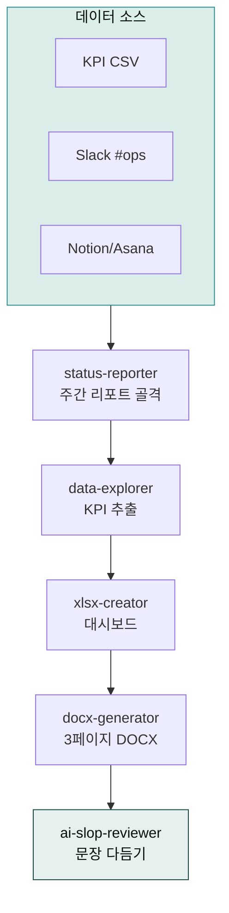
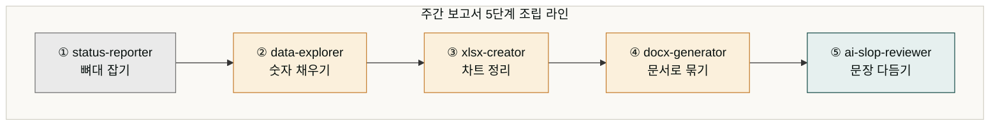
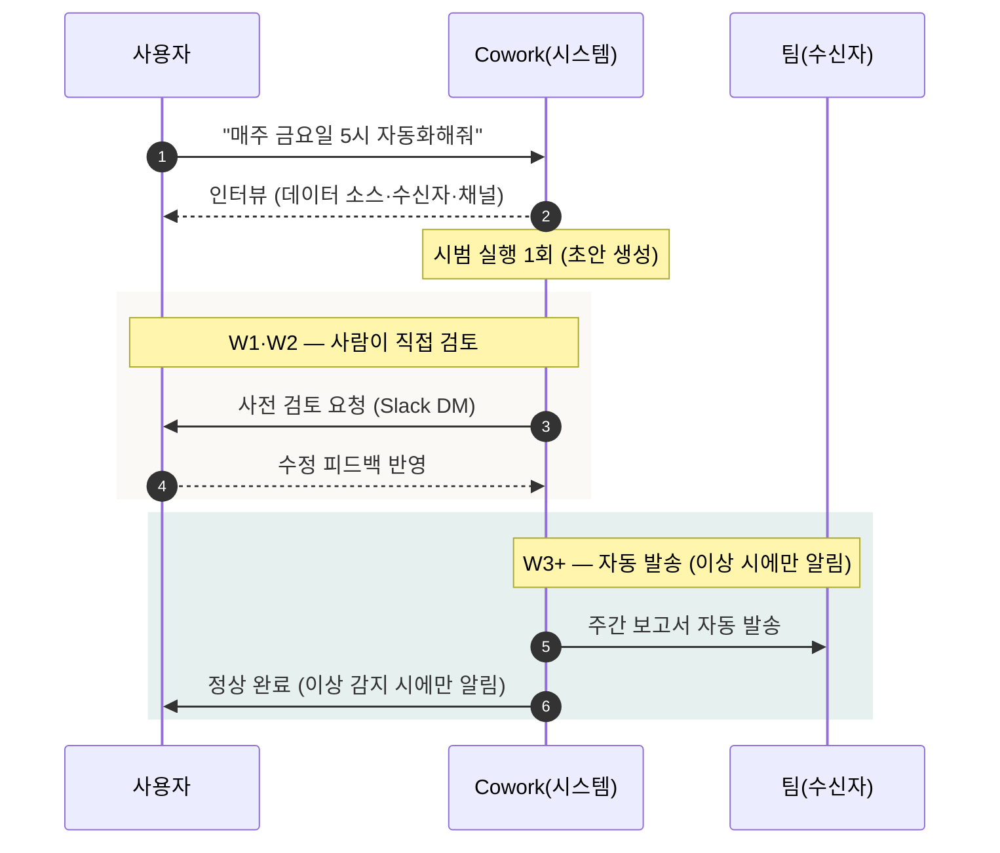
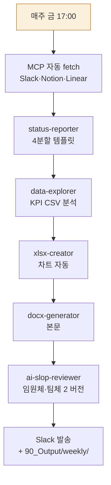

> **목표** — 매주 금요일 오후 5시에 자동으로 시작해 **KPI 대시보드 + 이슈 요약 + 다음 주 액션**까지 담긴 3페이지 DOCX를 팀 공유 폴더에 저장합니다.



## 대상 독자

운영팀·기획팀의 정기 보고를 담당하는 실무자.

## 왜 5단계인가

완성된 주간 보고서 한 부를 만드는 데 스킬이 다섯 개나 필요합니다. 이는 한 냄비 요리가 아니라 공장 조립 라인에 가깝습니다. 하나의 완성품(3페이지 보고서)을 만들기 위해 다섯 개의 작업대를 차례로 거치는 셈입니다. 첫 작업대(기획자)는 보고서 뼈대를 잡고, 둘째(데이터 분석가)는 숫자를 채워 넣고, 셋째(표 담당)는 숫자를 차트로 정리하고, 넷째(문서 편집자)는 흩어진 조각을 3페이지 보고서로 묶고, 마지막(교정 편집자)은 임원이 읽기 좋게 문장을 다듬습니다. 한 작업대가 빠지면 완성품 어딘가에 빈 칸이 남습니다.

각 스킬 이름이 영어 축약이라 의미가 바로 안 와닿을 수 있습니다. `status-reporter`는 '상태 보고 담당자', `data-explorer`는 '데이터 탐험가(원천 데이터에서 의미 있는 수치를 찾아내는 역할)', `xlsx-creator`는 '엑셀 생성기', `docx-generator`는 '워드 문서 생성기', `ai-slop-reviewer`는 'AI 특유 어투를 검수하는 편집자'로 풀어 읽으면 됩니다. 한 스킬이 다섯 역할을 모두 하면 정확도가 떨어집니다. 분야별로 특화된 스킬을 순서대로 통과시키는 편이 매주 같은 품질의 보고서를 만들어냅니다.

순서가 고정된 이유는 앞 단계의 결과물이 뒷단계의 입력이 되기 때문입니다. 뼈대가 없는 상태에서 숫자만 채워 넣으면 어디에 둘지 알 수 없고, 문장 다듬기를 데이터 분석보다 먼저 하면 나중에 숫자가 바뀔 때 문장을 또 고쳐야 합니다. 콘베이어 벨트 위의 순차 조립이라고 생각하면, 스킬 순서를 바꾸는 것은 조립 순서를 뒤섞는 것과 같습니다.

```mermaid
flowchart LR
    SRC["데이터 소스 (재료)<br/>KPI CSV · Slack #ops · Notion/Asana"]
    ST1["① 기획자<br/>status-reporter<br/>보고서 뼈대 · OKR 진행률"]
    ST2["② 데이터 분석가<br/>data-explorer<br/>숫자 채우기 · KPI 추출"]
    ST3["③ 표 담당<br/>xlsx-creator<br/>차트 정리 · 대시보드 시트"]
    ST4["④ 문서 편집자<br/>docx-generator<br/>3페이지 묶기 · 최종 보고서"]
    ST5["⑤ 교정 편집자<br/>ai-slop-reviewer<br/>문장 다듬기 · 임원체/팀체"]
    OUT["완성품<br/>주간 보고서 3페이지 DOCX"]

    SRC --> ST1 --> ST2 --> ST3 --> ST4 --> ST5 --> OUT

    subgraph seq["왜 순서가 고정인가 — 콘베이어 벨트 위 순차 조립"]
        direction LR
        R1["앞 단계 결과물이<br/>뒷단계 입력"]
        R2["뼈대 없이 숫자부터<br/>넣으면 자리 없음"]
        R3["문장 다듬기를 먼저 하면<br/>숫자 바뀔 때 다시 고쳐야"]
        R4["한 작업대 빠지면<br/>완성품에 빈 칸"]
        R1 ~~~ R2 ~~~ R3 ~~~ R4
    end

    classDef plan fill:#eaeaea,stroke:#6e6e6e,color:#09110f
    classDef build fill:#fbf0dc,stroke:#c47b2a,color:#09110f
    classDef qa fill:#e6f0ef,stroke:#144a46,color:#09110f
    classDef src fill:#dceee9,stroke:#2a8a8c,color:#09110f
    classDef out fill:#D97757,stroke:#B85C3E,color:#FFFFFF
    classDef rule fill:#788C5D,stroke:#5F6F4A,color:#FFFFFF

    class SRC src
    class ST1 plan
    class ST2,ST3,ST4 build
    class ST5 qa
    class OUT out
    class R1,R2,R3,R4 rule
```





## 사전 준비

- 플러그인: `moai-operations`, `moai-data`, `moai-office`, `moai-core:ai-slop-reviewer`
- MCP 커넥터: Slack(이슈 수집) + Notion/Asana(할 일) — [커넥터·MCP](../../cowork/connectors-mcp/) 참고
- (선택) GA4·광고 채널 데이터
- `schedule` 스킬 — 스케줄링

## 외부 데이터는 어떻게 들어오나

보고서라는 요리를 만들려면 재료가 필요합니다. 여기서 재료는 KPI 숫자, Slack 메시지, 노션 할 일 같은 데이터입니다. 그런데 이 재료들은 Cowork 바깥, Slack과 노션 같은 외부 도구에 흩어져 있습니다. 사람이 일일이 복사해올 수도 있지만 매주 금요일마다 직접 옮기는 일은 자동화의 의미가 없어집니다.

이때 쓰는 것이 MCP 커넥터입니다. MCP(모델 컨텍스트 프로토콜, Model Context Protocol)는 Claude Cowork가 외부 도구와 대화하게 해주는 표준 연결 규격입니다. 부엌의 수도관에 비유하면 이해가 쉽습니다. 보고서라는 요리를 만들려면 외부 창고(Slack 채널, 노션 데이터베이스)까지 수도관을 뻗어두는 것과 같습니다. 수도꼭지를 틀면(스케줄 시간이 되면) 재료가 저절로 흘러들어옵니다. 이렇게 외부 도구에서 데이터를 자동으로 가져오는 동작을 fetch(페치, 가져오기)라고 부릅니다. 관을 직접 깔 필요 없이 커넥터만 설치해두면, 매주 같은 시간에 데이터가 자동으로 흘러들어오고 요리사(스킬)는 가져온 재료로 요리만 하면 됩니다.

한 가지 주의점이 있습니다. 수도관은 한 번 깔면 계속 물이 나오지만 일부 외부 도구는 권한 기간 제한이 있습니다. 예를 들어 Slack은 기본 검색 권한이 14일치만 열려 있어, 그보다 오래된 메시지를 가져오려면 추가 권한이 필요합니다. 이 점은 뒤의 '자주 겪는 이슈'에서 다시 다룹니다.

## 스킬 체인

```
status-reporter → data-explorer → xlsx-creator → docx-generator → ai-slop-reviewer
```

- `status-reporter` — 주간 리포트 골격, OKR 진행률
- `data-explorer` — 로우 데이터(CSV·Slack·Notion)에서 KPI 추출
- `xlsx-creator` — KPI 대시보드 시트
- `docx-generator` — 최종 3페이지 보고서
- `ai-slop-reviewer` — 임원이 바로 읽을 수 있게 문장 다듬기

## 사용 방식 — 한 줄 요청 (패턴 4: 스케줄 자동화)

> **핵심**: 사용자가 "수동 실행 → 스케줄 등록" 2 단계로 분리하지 않습니다. 한 줄로 "매주 N요일 X시 주간보고 자동화" 요청 → 시스템이 인터뷰 후 1회 시범 실행 + 스케줄 등록까지 자동. ([4가지 사용 패턴 - 패턴 4](../../cowork/patterns/#패턴-4--스케줄-자동화-scheduled-automation))

## 왜 처음에는 사람이 검토할까

자동화인데 왜 처음 2주는 사람이 직접 확인할까 의문이 들 수 있습니다. 처음부터 완전 자율로 보내면 작은 실수가 누적되어 임원에게 잘못된 숫자가 전달될 위험이 있습니다. 이를 막기 위해 점진적으로 신뢰를 쌓는 구조로 설계되어 있습니다.

신입 직원 인수인계에 비유하면 자연스럽습니다. 매주 보고서를 맡은 새 직원에게 처음 2주는 부장이 직접 확인합니다. "이렇게 썼네, 이 부분은 이렇게 고쳐"라며 패턴을 교정하는 단계가 W1(첫째 주)과 W2(둘째 주)입니다. 보고서 양식과 숫자 해석 방식이 안정되었다고 판단하면, 셋째 주부터는 알아서 보내되 이상이 있을 때만 보고하도록 풀어줍니다. 이것이 W3+ 단계입니다.

한 줄 요청은 이 전체 과정(시범 실행 1회, 2주 점검, 자동 이관)을 채용 명령 한 번에 담는 것입니다. 사용자는 "매주 금요일 오후 5시에 발송"이라는 목표만 던지면, 시스템이 먼저 필요한 정보를 물어보고(AskUserQuestion 인터뷰), 시범으로 한 번 만들어보고, 2주간 점검한 뒤 3주차부터 자동 발송으로 전환합니다.



### 사용자 입력


> 매주 금요일 오후 5시에 우리 팀 주간보고 자동 발송해줘


### 시스템 인터뷰 (AskUserQuestion)

1. **데이터 소스**: KPI CSV 폴더 / Slack 채널 / Notion DB / Linear / Asana / 자유 텍스트
2. **수신자**: 임원 (격식체) / 팀 (구어체) / 둘 다
3. **발송 채널**: Slack 채널 / 이메일 / 노션 페이지 / 파일만
4. **포함 섹션**: 이번 주 / 다음 주 / 이슈·블로커 / 도움 요청 (4분할 표준)
5. **검증 단계**: 첫 2주 검토 후 자동 발송 (기본) / 매번 검토 후 발송 / 즉시 자동

### 자동 체인 (매주 자동 반복)



### 산출물

- 매주 금 17:00 자동 발송:
  - `90_Output/weekly/주간보고-YYYYMMDD-임원.docx` (격식체)
  - `90_Output/weekly/주간보고-YYYYMMDD-팀.docx` (구어체)
  - Slack #weekly 채널 알림 (썸네일 + KPI 3개)

### 검증 흐름 (자동)

- **W1·W2**: 사용자에게 사전 검토 요청 (Slack DM)
- **W3+**: 자동 발송 (이상 감지 시 알림만)
- **데이터 소스 누락**: "지난 주 데이터 인용" 자동 fallback

## 자주 겪는 이슈


**이슈 1 — 데이터가 없는 주에 에러.**
연휴·서버 이슈로 CSV가 비면 `data-explorer`가 멈춥니다. 프롬프트에 "CSV가 비면 지난 주 데이터 인용" 분기 지시를 추가하세요.



**이슈 2 — Slack 장기 검색 토큰 부족.**
MCP 기본 검색은 14일. 그 이상은 `slack_search_public` 사용권을 확인하세요.



**이슈 3 — 숫자 형식이 제각각.**
매출·유저수 등 단위를 `xlsx-creator` 프롬프트에 "원 → 백만원, 명 → 천명"같이 고정하세요.


## 응용 변형

- **월간 보고서** — 같은 파이프라인을 "4주치 CSV" 입력으로 돌려 월간판 생성.
- **대시보드 HTML** — `data-visualizer`로 사내 공유용 단일 HTML 대시보드 추가 발행 → 이메일 링크.
- **마크다운 → HTML 변환** — `moai-content:html-report` 스킬로 마크다운 보고서를 단일 파일 HTML로 변환. 외부 의존성 0, 12-25KB 초경량 산출물.

### 마크다운 보고서 → HTML 변환


> 이번 주 주간 현황 보고서 HTML로 변환해줘.
  - 모드: status
  - 입력: /weekly/주간보고-20260510.md

체인: (기존 보고서 생성) → html-report mode=status
출력: /weekly/주간보고-20260510.html


**html-report 스킬 특징**:
- **6개 보고서 모드**: status, incident, plan, explainer, financial, pr
- **인라인 SVG + vanilla JS**: 외부 의존성 0, 12-25KB 초경량
- **한글 폰트 6종**: Pretendard(기본), Noto Serif KR, Noto Sans KR, 조선일보명조, KoPubWorld 명조, JetBrains Mono
- **인쇄 친화**: `@media print` 자동 적용, 페이지 나누기 최적화

**권장 체인**:
```
{텍스트 생성 스킬} → ai-slop-reviewer → humanize-korean → html-report mode=<X>
```

**관련 링크**:
- [SKILL.md](https://github.com/modu-ai/cowork-plugins/blob/v2.2.0/moai-content/skills/html-report/SKILL.md)
- [Thariq Shihipar "The Unreasonable Effectiveness of HTML"](https://thariq.substack.com/p/the-unreasonable-effectiveness-of)

---

### Sources
- [modu-ai/cowork-plugins › moai-operations](https://github.com/modu-ai/cowork-plugins)
- [docs.claude.com — Scheduled Tasks](https://docs.claude.com)
