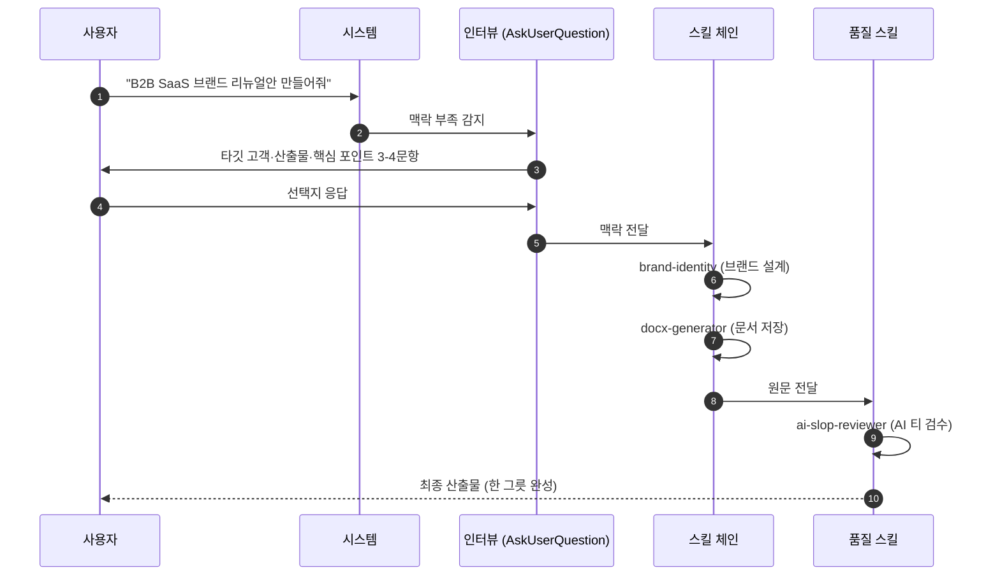
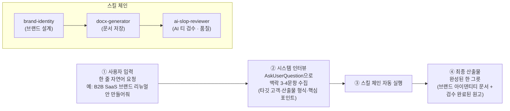
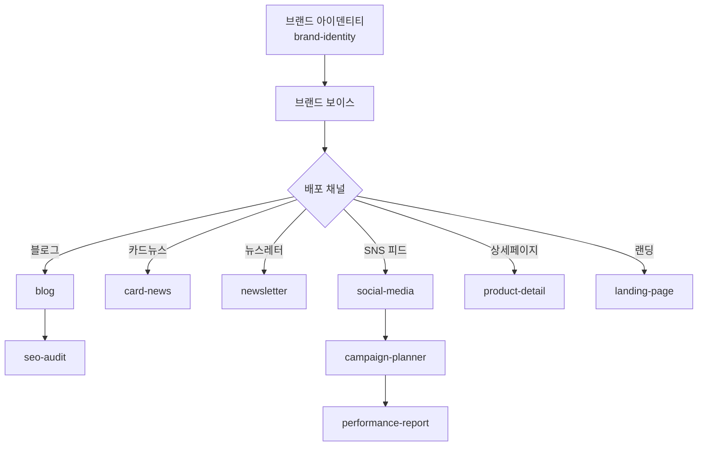
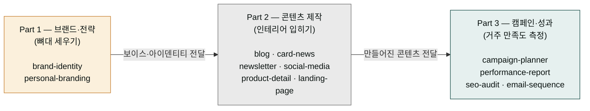
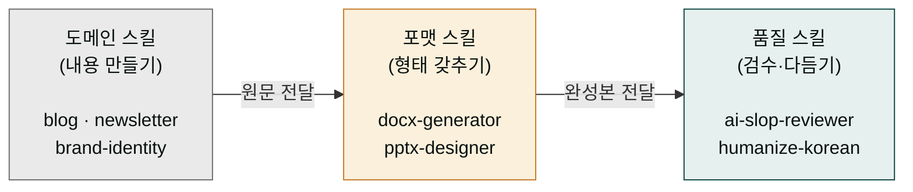

# 트랙 — 마케팅·콘텐츠

> **사용 방식**: 사용자가 짧은 한 줄 요청만 하면 시스템이 AskUserQuestion으로 맥락 수집 → 자동 체인 실행. [4가지 사용 패턴 참조](/cowork/patterns/)

브랜드 전략부터 SNS 운영, 상세페이지 전환율, SEO 감사까지 — `moai-marketing`과 `moai-content` 플러그인 조합으로 마케팅 본부 하나를 덮는 트랙입니다.

## 트랙이 무엇인가 — 한 줄 요청이 산출물이 되기까지

트랙(track)은 단일 스킬이 아니라, 한 가지 일(예: 마케팅)을 끝내는 데 필요한 스킬 여러 개를 미리 엮어둔 **세트 메뉴 패키지**입니다. 음식점에 비유하면 쉽습니다. 손님이 "비빔밥 하나 주세요"라고 한 줄만 말해도 점원이 곧바로 "고기 빼시나요? 매운 정도는? 국물 따로 드릴까요?"라고 **맥락을 물어본 뒤**(=시스템 인터뷰), 주방에서 밥·나물·고기를 차례로 담고(=체인의 각 스킬), 마지막에 플레이팅하고 맛보기(=품질 검수)까지 거쳐 완성된 한 그릇을 내옵니다.

트랙도 같은 방식으로 동작합니다. 사용자가 "B2B SaaS 브랜드 리뉴얼안 만들어줘"라고 한 줄을 입력하면, 시스템이 먼저 **시스템 인터뷰**(여기서는 AskUserQuestion, 즉 시스템이 사용자에게 몇 가지 선택지로 맥락을 물어보는 절차)를 통해 타깃 고객·산출물 형식·핵심 포인트 같은 필수 정보 3-4개를 수집합니다. 그다음 수집된 맥락을 바탕으로 **체인**(여러 스킬이 화살표로 이어진 파이프라인)을 자동으로 실행합니다 — 브랜드 아이덴티티를 만드는 스킬 → 문서로 저장하는 스킬 → AI 특유 어투를 솎아내는 품질 스킬 순서로. 각 스킬은 앞 스킬의 결과물을 입력받아 다음 결과물을 넘겨주므로, 사용자는 스킬을 일일이 부를 필요 없이 한 줄로 전체 과정을 끝냅니다.

아래 시퀀스는 이 흐름을 시간 순서대로 보여줍니다. 사용자 입력 한 줄에서 출발해 인터뷰 수집, 체인 자동 실행, 최종 산출물 도착까지 단계가 어떻게 이어지는지가 핵심입니다.

## 트랙 지도

## 3단계 마케팅 파이프라인 — 왜 브랜드가 먼저이고 성과가 마지막인가

이 트랙은 위 트랙 지도가 보여주는 것처럼 Part 1(브랜드) → Part 2(콘텐츠) → Part 3(성과) 세 단계로 나뉩니다. 이 순서는 임의가 아니라, 집을 짓는 순서와 같습니다. 먼저 **뼈대**(브랜드 아이덴티티·보이스·Part 1)를 세우고, 그 뼈대 위에 **방마다 인테리어**(블로그·카드뉴스·상세페이지 같은 콘텐츠·Part 2)를 입힌 뒤, 다 지은 다음에 **거주자 만족도와 에너지 효율을 측정**(캠페인 성과 보고·Part 3)합니다.

뼈대 없이 인테리어부터 하면 집이 무너지듯, 브랜드 보이스(=브랜드가 말하는 톤과 태도)를 정하지 않고 SNS 글부터 쓰면 채널마다 어투가 흔들립니다. 그래서 Part 1에서 "이 브랜드는 누구에게, 어떤 톤으로 말하는가"를 먼저 고정합니다. 그 위에서 Part 2가 그 보이스를 바탕으로 실제 콘텐츠를 만들고, Part 3는 만들어진 콘텐츠의 효과(전환율·노출·클릭)를 측정합니다. 각 Part는 앞 Part의 산출물에 의존하므로 순서를 거꾸로 뒤집으면 결과가 흔들립니다 — 콘텐츠 없이 성과를 측정할 수 없고, 브랜드 보이스 없이 콘텐츠 톤을 맞출 수 없습니다.

---

## Part 1 ✦ 브랜드·전략

### brand-identity — 아이덴티티 설계

네이밍·슬로건·톤앤매너·비주얼 가이드라인을 패키지로 산출.


> B2B SaaS 브랜드 리뉴얼안 만들어줘


시스템 인터뷰: ① 현재 브랜드명·피드백 ② 타깃 고객(B2B/B2C, 연령·직무) ③ 산출물(네이밍 후보 수·로고 컨셉·컬러 팔레트) ④ 출력 형식(DOCX/PPTX)

체인: `brand-identity → docx-generator → ai-slop-reviewer`

### personal-branding — 개인 전문가 포지셔닝

CEO·임원·전문가 개인의 전문성을 브랜드화.


> 12년차 중소기업 컨설턴트 개인 브랜딩 전략 짜줘


시스템 인터뷰: ① 전문 영역·경력 ② 타깃 포지션 ③ 채널(링크드인·브런치·유튜브) ④ 콘텐츠 빈도

체인: `personal-branding → docx-generator → ai-slop-reviewer`

---

## Part 2 ✦ 콘텐츠 제작

### blog — 포스팅 자동화

네이버·티스토리·브런치·WordPress·Ghost 6개 플랫폼 맞춤 SEO 최적화.


> 2026년 중소기업 세액공제 변화 네이버 블로그 포스트 써줘


시스템 인터뷰: ① 플랫폼·SEO 키워드 ② 분량·톤 ③ 타깃 독자 ④ 발행 여부

체인: `blog → ai-slop-reviewer → korean-spell-check → humanize-korean`

### card-news — 인스타 카드뉴스

AI 이미지 생성 기반 캐러셀 10장.


> 방금 만든 블로그 포스트를 카드뉴스로 변환해줘


시스템 인터뷰: ① 플랫폼 비율(인스타 1080×1350·페북 1080×1080) ② 스타일·포인트 컬러 ③ 장수 ④ CTA 문구

체인: `card-news → higgsfield-image → ai-slop-reviewer`

### newsletter — 뉴스레터

구독자 확보·오픈율 최적화 포함.


> 이번 주 금요일 뉴스레터 만들어줘


시스템 인터뷰: ① 브랜드·타깃 구독자 ② 이번 호 주제 ③ 분량·CTA ④ A/B 테스트 제목 후보 수

체인: `newsletter → ai-slop-reviewer → korean-spell-check`

### social-media — SNS 콘텐츠

인스타·스레드·X·링크드인·유튜브쇼츠·카카오·네이버 7개 플랫폼 개별 최적화.


> 이번 주 블로그 포스트를 SNS 7개 플랫폼에 맞게 변환해줘


시스템 인터뷰: ① 대상 플랫폼 ② 톤(전문가/친근) ③ 해시태그 전략 ④ 이미지 동반 여부

체인: `social-media → higgsfield-image(이미지 필요 시) → ai-slop-reviewer`

### product-detail — 상세페이지

네이버 스마트스토어·쿠팡·카카오 커머스 규격.


> 신제품 워크북 프로 네이버 스마트스토어 상세페이지 만들어줘


시스템 인터뷰: ① 제품 카테고리·가격대 ② 타깃 고객 ③ 핵심 USP 3가지 ④ 구매 혜택

체인: `product-detail → higgsfield-image(제품 이미지) → ai-slop-reviewer`

### landing-page — 단독 랜딩

고전환율 원페이지 설계.


> 다가오는 세무 웨비나 랜딩 페이지 만들어줘


시스템 인터뷰: ① 목적(가입·예약·구매) ② 타깃 전환율 ③ 구성 요소(강사·후기·FAQ 포함 여부) ④ HTML 단일 vs 멀티페이지

체인: `landing-page → ai-slop-reviewer`

---

## Part 3 ✦ 캠페인·성과

### campaign-planner — 그로스해킹

A/B 테스트 설계·인플루언서 전략·CRM 자동화.


> 신제품 런칭 8주 캠페인 기획해줘


시스템 인터뷰: ① 목표(가입·매출·인지도) ② 예산·기간 ③ 채널 믹스 ④ A/B 테스트 세트 수

체인: `campaign-planner → docx-generator → ai-slop-reviewer`

### performance-report — 성과 보고서

GA4·네이버 광고·메타 광고·카카오모먼트 데이터 통합 분석.


> 지난 달 마케팅 성과 보고서 만들어줘


시스템 인터뷰: ① 데이터 소스(CSV 경로) ② 분석 차원(채널·캠페인·퍼널) ③ 수신자(경영진/실무) ④ 출력 형식(PPTX/DOCX)

체인: `performance-report → data-visualizer → pptx-designer → ai-slop-reviewer`

### seo-audit — 네이버·구글·GEO 통합 감사

AI 검색(GEO) 최적화까지 포함.


> blog.smartflow.co.kr SEO 종합 감사해줘


시스템 인터뷰: ① 도메인 ② 감사 범위(온페이지·기술·GEO) ③ 경쟁사 도메인 ④ 우선순위 항목 수

체인: `seo-audit → docx-generator → ai-slop-reviewer`

### email-sequence — 이메일 드립

정보통신망법 준수 기반 자동화 시퀀스.


> 신규 가입자 온보딩 이메일 시퀀스 7편 만들어줘


시스템 인터뷰: ① 시퀀스 주기(Day 0/1/3/7/14/21/30) ② 톤·CTA 강도 ③ 발신자 정보 ④ 수신거부 처리

체인: `email-sequence → ai-slop-reviewer → korean-spell-check`

---

## 체인 읽는 법 — 화살표가 뜻하는 것과 품질 스킬이 항상 끝에 오는 이유

이 트랙의 각 스킬 아래에는 `blog → ai-slop-reviewer → korean-spell-check → humanize-korean` 같은 **체인 표기**가 붙어 있습니다. 화살표(`→`)는 "왼쪽 스킬의 결과물을 오른쪽 스킬이 입력받아 이어 처리한다"는 뜻입니다. 즉 `blog`가 쓴 원고를 `ai-slop-reviewer`가 검수하고, 그 결과를 `korean-spell-check`가 맞춤법 점검하고, 마지막으로 `humanize-korean`이 사람이 쓴 것처럼 다듬는 식으로 한 방향으로 흘러갑니다.

이 화살표 끝에는 항상 같은 얼굴이 반복해 붙습니다 — `ai-slop-reviewer`, `korean-spell-check`, `humanize-korean` 같은 **품질 스킬**들입니다. 왜 끝인가. 세탁 라인에 비유하면 명확해집니다. 옷을 먼저 만들고(도메인 스킬) → 포장하고(포맷 스킬) → 마지막에 검수·다림질·보풀 제거(품질 스킬) 순서로 돌아갑니다. 다림질(품질)을 맨 앞에 하면 구겨진 옷을 다릴 수 없듯, 검수할 원문이 없는 상태에서 `ai-slop-reviewer`를 부르면 의미가 없습니다. 그래서 품질 스킬은 항상 체인의 맨 끝에 옵니다.

아래 '자주 걸리는 지점' 절의 "AI 티 나는 문장" 항목이 바로 이 품질 스킬이 잡아내는 대상입니다. 품질 스킬을 체인 끝에 두는 이유와, 그것이 실제로 무엇을 잡아내는지를 함께 보면 체인 표기가 왜 저 모양으로 생겼는지 한눈에 들어옵니다.

## 자주 걸리는 지점

### AI 티 나는 문장

특히 블로그·뉴스레터는 [AI 슬롭 검수](/cookbook/skill-chaining/)가 필수입니다. 시스템이 본문 완성 → `ai-slop-reviewer → humanize-korean` 자동 호출로 처리합니다.

### 이미지 생성 비용

카드뉴스 10장 × 3세트 = 30장. `higgsfield-image`로 생성하며 장당 수 초 + 토큰이 소요됩니다. 시스템이 자동으로 배치 병렬 생성으로 속도 절감합니다.

### 채널별 분량 규정 위반

인스타 캡션 2,200자 · X 280자 · 링크드인 3,000자 등 플랫폼 제한이 다릅니다. 시스템이 플랫폼별 제한을 자동 인식하고 분량을 조정합니다.

### 법적 리스크

의약·금융·건강 광고는 각 산업 표시 광고법 준수 필수. 시스템이 카피 생성 후 `compliance-check`를 체인에 자동 삽입합니다.

## 다음 읽을거리

- [트랙 — 데이터](/cookbook/tracks/track-data/)
- [트랙 — 문서](/cookbook/tracks/track-documents/)
- [블로그 파이프라인](/cookbook/blog-pipeline/)

---

### Sources
- [Claude Docs — Cowork Marketing Use Cases](https://docs.claude.com/en/docs/claude-cowork)
- [modu-ai/cowork-plugins — moai-marketing, moai-content](https://github.com/modu-ai/cowork-plugins)
