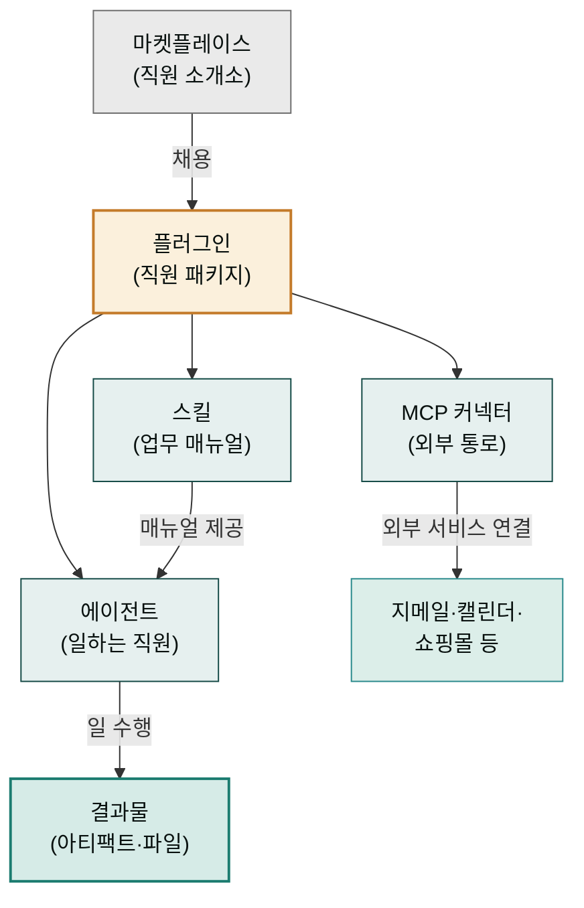

Claude Desktop을 쓰다 보면 스킬, 플러그인, 에이전트, MCP 같은 낯선 단어가 계속 등장합니다. 하나하나는 어렵지 않은데, 설명 없이 만나면 "이게 다 뭐지" 싶어 발걸음이 멈추게 됩니다. 이 문서는 앞으로 이 사이트 전체에서 반복해서 만날 아홉 가지 개념을 한 번에, 일상 비유와 함께 정리해 두는 사전입니다.

전부 외울 필요는 없습니다. 한 번 쭉 읽어 큰 그림만 잡아두고, 나중에 다른 문서를 읽다가 "에이전트가 뭐였더라?" 싶을 때 다시 돌아와 해당 항목만 찾아보면 됩니다. 큰 그림은 이렇습니다 — **회사에 비유하면, 대화는 회의실, Projects는 부서 사무실, 플러그인은 채용한 직원, 스킬은 그 직원의 업무 매뉴얼, MCP는 외부 거래처와 연결된 전화선**입니다.

## 1. 대화(채팅) — 회의실

**대화**는 Claude와 주고받는 말의 한 묶음입니다. 회의실에 들어가 이야기를 나누는 것과 같아서, 같은 대화 안에서는 앞서 한 말을 Claude가 기억하고 이어갑니다. "이메일 초안 써줘" 다음에 "좀 더 정중하게"라고만 말해도 알아듣는 이유입니다.

반대로 새 대화를 시작하면 새 회의실에 들어간 것과 같아서, 이전 대화 내용은 기본적으로 이어지지 않습니다. 그래서 주제가 바뀌면 새 대화를 여는 것이 좋고, 하나의 주제는 한 대화에서 이어가는 것이 좋습니다.

**실제 사용 상황**: 월요일에 "거래처 사과 메일"을 다듬던 대화를 수요일에 다시 열어 "지난번 그 메일, 후속 메일도 써줘"라고 이어가는 경우 — 같은 회의실이라 맥락이 살아 있습니다.

## 2. Projects — 부서 사무실

**Projects**(프로젝트)는 관련된 대화들과 참고 자료(지식)를 한데 묶는 작업 공간입니다. 회의실(대화)이 여러 개 있어도 같은 부서 사무실(프로젝트) 안에 있으면 부서의 공용 캐비닛 — 회사 소개서, 가격표, 어투 가이드 — 을 모두가 공유하는 것과 같습니다. 프로젝트에 올려둔 자료는 그 프로젝트의 모든 대화에서 Claude가 참고합니다.

매번 대화를 시작할 때마다 "우리 회사는 이런 회사고, 제품은 이거고…"를 반복하지 않아도 되는 것이 가장 큰 장점입니다. 한 번 캐비닛에 넣어두면 끝입니다.

**실제 사용 상황**: "뉴스레터 제작"이라는 프로젝트를 만들고 회사 소개서와 지난 뉴스레터 3편을 올려두면, 이후 어떤 대화에서 "이번 호 초안 써줘"라고만 해도 우리 회사 어투에 맞는 초안이 나옵니다. 자세한 사용법은 [Projects 기능](../chat/projects/)을 참고하세요.

## 3. 스킬 — 직원의 업무 매뉴얼

**스킬**(skill)은 특정 업무를 잘 처리하는 방법을 적어둔 문서, 즉 업무 매뉴얼입니다. 신입 직원에게 "보도자료는 이 형식으로, 이 어투로, 이 순서로 써라"라고 매뉴얼을 쥐여주면 결과물이 일정해지는 것처럼, Claude도 스킬이 있으면 해당 업무를 훨씬 정확하고 일관되게 처리합니다.

스킬의 좋은 점은 사용자가 매뉴얼을 펼칠 필요가 없다는 것입니다. "보도자료 써줘"라고 하면 Claude가 자기 서랍에서 알맞은 매뉴얼을 스스로 꺼내 봅니다. 사용자는 매뉴얼의 존재만 알면 되고, 내용을 외울 필요는 없습니다.

**실제 사용 상황**: 발표 슬라이드 제작 스킬이 설치된 상태에서 "3분기 실적 발표 자료 만들어줘"라고 하면, 슬라이드 구성 순서·장당 글자 수·차트 배치 규칙이 매뉴얼대로 적용된 결과물이 나옵니다.

## 4. 플러그인 — 스킬과 에이전트를 묶은 직원 패키지

**플러그인**(plugin)은 스킬(매뉴얼)과 에이전트(일하는 직원), 때로는 MCP 커넥터(외부 연결)까지 한 상자에 담은 패키지입니다. 경력직 직원 한 명을 채용하면 그 사람의 업무 노하우(스킬 여러 개)와 일하는 방식(에이전트), 거래처 연락망(MCP)이 함께 따라오는 것과 같습니다. 그래서 이 사이트에서는 플러그인을 "직원"이라고 부릅니다.

플러그인은 **마켓플레이스**라는 직원 소개소에서 데려옵니다. 문서 담당 직원, 마케터 직원, 쇼핑몰 운영 직원처럼 분야별로 준비되어 있어서, 내 일에 필요한 직원만 골라 채용하면 됩니다. 채용 절차는 [첫 작업](../first-task/)에서 실습합니다.

**실제 사용 상황**: 쇼핑몰을 운영하는 분이 셀러 직원(플러그인)을 채용하면, 상품 상세페이지 작성 스킬·리뷰 답변 스킬과 스마트스토어 연결 통로(MCP)가 한 번에 들어옵니다.

## 5. 에이전트 — 매뉴얼로 일하는 직원

**에이전트**(agent)는 매뉴얼(스킬)을 들고 실제로 일을 수행하는 담당자입니다. 스킬이 "종이에 적힌 방법"이라면 에이전트는 "그 방법대로 손을 움직이는 사람"입니다. 복잡한 일을 시키면 Claude는 혼자 다 하지 않고, 조사 담당·작성 담당·검토 담당 같은 에이전트들에게 일을 나눠 맡기기도 합니다.

사용자 입장에서 에이전트를 직접 부를 일은 많지 않습니다. 팀장(Claude)에게 일을 맡기면 팀장이 알아서 담당자를 배정하는 구조라서, "누가 하는지"보다 "무엇을 원하는지"만 말하면 됩니다.

**실제 사용 상황**: "우리 제품 경쟁사 조사해서 비교표 만들어줘"라고 하면, 조사 에이전트가 자료를 모으고 정리 에이전트가 표로 다듬는 식으로 역할이 나뉘어 진행되는 것을 화면에서 볼 수 있습니다.

## 6. MCP 커넥터 — 외부 서비스로 통하는 표준 통로

**MCP 커넥터**(Model Context Protocol)는 Claude를 외부 서비스 — 지메일, 캘린더, 노션, 쇼핑몰 관리자 등 — 와 연결하는 표준화된 통로입니다. 나라마다 다른 콘센트 모양을 하나로 통일한 "표준 어댑터"에 비유하면 정확합니다. 서비스마다 제각각인 연결 방식을 MCP라는 하나의 규격으로 통일해서, 어떤 서비스든 같은 방식으로 꽂아 쓸 수 있게 합니다.

MCP가 연결되면 Claude는 단순히 "말만 하는" 존재에서 "실제로 그 서비스를 조작하는" 존재가 됩니다. 메일을 읽고, 일정을 잡고, 쇼핑몰 주문을 조회하는 일이 대화창 안에서 이루어집니다. 처음 연결할 때는 해당 서비스에 로그인해서 "Claude가 접근해도 된다"고 허락하는 절차를 거칩니다 — 출입증을 발급해 주는 셈입니다.

**실제 사용 상황**: 캘린더 MCP를 연결한 뒤 "다음 주에 김 부장님과 1시간 회의 가능한 시간 찾아서 잡아줘"라고 하면, Claude가 실제 내 캘린더를 열어 빈 시간을 찾고 일정을 등록합니다.

## 7. 아티팩트 — 결과물 카드

**아티팩트**(artifact)는 Claude가 만들어 주는 결과물을 대화 옆에 별도의 카드로 띄워주는 기능입니다. 대화가 길어지면 중요한 결과물이 말 속에 파묻히기 쉬운데, 아티팩트는 문서·표·웹페이지·그림 같은 산출물을 독립된 화면에 따로 담아줍니다. 회의 중에 논의 내용은 말로 오가더라도, 완성된 기획서는 별도의 서류로 뽑아 건네받는 것과 같습니다.

아티팩트 카드 위에서 바로 수정을 요청할 수 있고, 복사하거나 파일로 내려받을 수도 있습니다. "결과물은 카드로, 논의는 대화로" 분리된다고 기억하면 됩니다.

**실제 사용 상황**: "우리 가게 이벤트 안내 웹페이지 시안 만들어줘"라고 하면 오른쪽에 실제로 동작하는 웹페이지 카드가 뜨고, "배경을 밝게 바꿔줘"라고 하면 그 카드가 그 자리에서 갱신됩니다.

## 8. 파일 업로드 — 자료 건네주기

**파일 업로드**는 내 컴퓨터의 문서·이미지·표를 Claude에게 건네 읽게 하는 기능입니다. 담당자에게 일을 맡길 때 참고 자료를 함께 건네는 것과 같습니다. 입력창 옆의 클립(📎) 모양 버튼을 누르거나, 파일을 대화창으로 끌어다 놓으면 됩니다. PDF, 워드, 엑셀, 이미지 등 대부분의 업무 파일을 읽을 수 있습니다.

업로드한 파일은 그 대화 안에서만 참고됩니다. 여러 대화에서 계속 쓸 자료라면 매번 올리지 말고 Projects의 지식(캐비닛)에 넣어두는 편이 낫습니다 — 이 구분은 [컨텍스트 엔지니어링 기초](../../chat/context-engineering/)에서 자세히 다룹니다.

**실제 사용 상황**: 30쪽짜리 계약서 PDF를 올리고 "우리한테 불리한 조항만 골라 쉽게 설명해줘"라고 요청하는 경우입니다.

## 9. 메모리 — 나를 기억하는 수첩

**메모리**(memory)는 대화가 끝나도 Claude가 나에 대해 기억해 두는 수첩입니다. 단골 카페 직원이 "늘 드시던 걸로요?"라고 묻는 것처럼, "나는 존댓말 보고서체를 선호한다", "우리 회사는 화장품 브랜드다" 같은 정보를 기억해 두면 새 대화에서도 다시 설명할 필요가 없습니다.

메모리는 설정에서 내용을 확인하고 지울 수 있습니다. 기억해 줬으면 하는 것은 "앞으로 기억해줘"라고 말하면 되고, 잊었으면 하는 것은 설정에서 삭제하면 됩니다. 자세한 내용은 [메모리 기능](../../chat/memory/)을 참고하세요.

**실제 사용 상황**: 한 번 "내 보고서는 항상 '개요-본문-결론' 3단 구성으로 해줘"라고 기억시켜 두면, 다음 달에 새 대화에서 보고서를 요청해도 같은 구성으로 나옵니다.

## 네 가지 개념의 관계 한눈에 보기

스킬·에이전트·플러그인·MCP가 어떻게 맞물리는지 그림 하나로 정리합니다. 마켓플레이스(직원 소개소)에서 플러그인(직원 패키지)을 채용하면, 그 안의 에이전트(직원)가 스킬(매뉴얼)대로 일하고, 필요하면 MCP 커넥터(외부 통로)로 바깥 서비스까지 다녀옵니다.

## 다음 단계

개념이 잡혔다면 이제 직접 손을 움직일 차례입니다.

- [첫 작업](../first-task/) — 마켓플레이스에서 첫 직원을 채용하고 첫 요청 던지기
- [프롬프트 작성법](../../chat/prompts/) — Claude에게 더 잘 부탁하는 5원칙
- [컨텍스트 엔지니어링 기초](../../chat/context-engineering/) — Claude의 작업 기억을 관리하는 법
