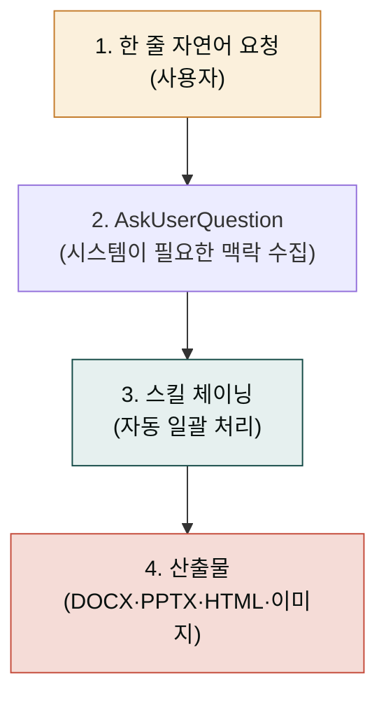
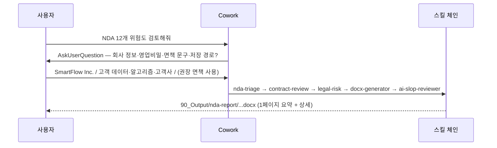
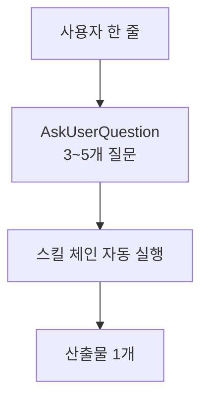
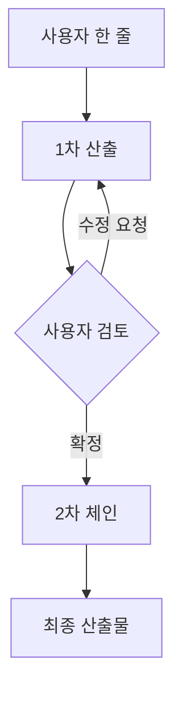
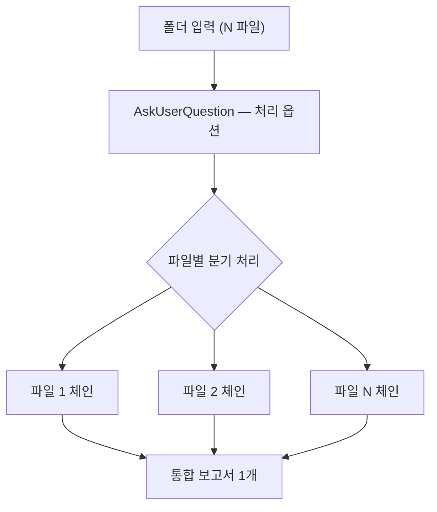
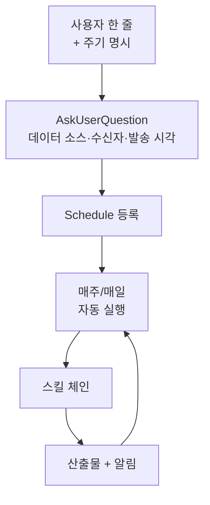
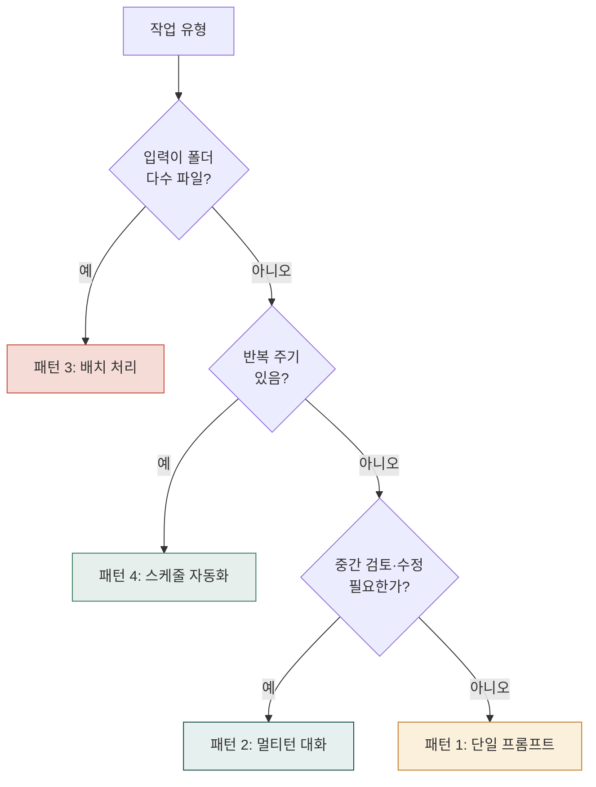

> Cowork-plugins의 모든 사용 사례는 **하나의 공통 골격**을 따릅니다. 사용자가 긴 프롬프트를 매번 작성하는 게 아니라, 짧은 한 줄로 의도만 전달하면 시스템이 필요한 맥락을 물어보고 스킬 체이닝으로 자동 일괄 처리합니다.

## 핵심 원칙 ✦ 짧게 말하세요. 나머지는 시스템이 묻습니다.

### ❌ 잘못된 사용법


사용자가 매번 옵션·요구사항을 일일이 명시하는 것은 **권장 사용법이 아닙니다**. 그러면 시스템이 가진 자동 인터뷰 기능과 스킬 체이닝이 무력화됩니다.



> ./nda_inbox/ 폴더의 NDA PDF 12개를 분류·검토해줘.

  회사 정보:
  - 회사명: SmartFlow Inc.
  - 핵심 영업비밀: 고객 거래 데이터, 알고리즘 가중치, 고객사 명단

  요청:
  1. 각 NDA를 nda-triage로 분류 (상호/일방, 기간, 손해배상 캡, 준거법, 분쟁관할)
  2. contract-review로 조항별 검토, 트랙체인지 형식의 수정 제안
  3. legal-risk로 위험도(상/중/하) 평가 + 우선순위 부여
  4. 종합 위험 보고서를 docx로 만들어줘
     - 1페이지 경영진 요약 (위험도 분포 차트, Top 3 위험 NDA)
     - NDA별 상세 (1건당 1-2페이지)
     - 부록: 표준 NDA 템플릿 비교표
  5. 마지막에 ai-slop-reviewer로 어투 정리

  저장: 90_Output/nda-report/2026-Q2-nda-review.docx
  면책 문구: "본 보고서는 1차 검토 가이드이며 최종 법률자문은 변호사 검토를 거쳐야 합니다"를 자동 삽입


위 형식은 **사용자가 시스템 내부 구조(스킬명·체인 순서·산출 옵션)를 미리 알고 있어야** 가능합니다. 이는 cowork-plugins의 설계 의도와 정반대입니다.

### ✅ 올바른 사용법


> ./nda_inbox/ 폴더의 NDA 12개 위험도 검토해서 한 페이지로 정리해줘


위 한 줄 요청을 받으면 시스템이 자동으로 진행합니다:

---

## 4가지 표준 사용 패턴

### 패턴 1 ✦ 단일 프롬프트 실행 (Single Prompt)

**적용**: 한 번의 자연어 요청으로 끝나는 작업. 가장 흔한 패턴.

**골격**:

**예시 1**: 사업계획서


> AI 영어 회화 앱 사업계획서 만들어줘


시스템이 인터뷰: ① 단계(시드/A/B) ② 조달 목표 ③ 타깃 시장 ④ 형식(PPT/DOCX) ⑤ 저장 경로

체인: `strategy-planner → docx-generator → ai-slop-reviewer`

**예시 2**: 블로그 포스팅


> 네이버 블로그에 '프리랜서 3.3% 원천징수' 글 써줘


시스템이 인터뷰: ① 분량 ② 키워드 ③ 톤(친근/격식) ④ 발행 여부

체인: `blog → ai-slop-reviewer → korean-spell-check → humanize-korean → (선택) WordPress 발행`

---

### 패턴 2 ✦ 멀티턴 대화 (Multi-Turn Dialog)

**적용**: 시스템이 중간 산출물을 보여주고, 사용자가 검토·수정을 거치는 작업. 창의적 콘텐츠·전략에 적합.

**골격**:

**예시**: IR 덱


> 시리즈 A IR 덱 15장 만들고 싶어


시스템: 회사 개요·시장·솔루션·BM·재무·팀·로드맵 7대 슬라이드 **스토리라인 초안 제시** → 사용자 검토


> Slide 4(BM)에 SaaS 매출 모델 추가하고, Slide 7(팀)에 자문단 1장 추가해줘


시스템: 스토리라인 수정 → 사용자 확정 → `pptx-designer → ai-slop-reviewer` 자동 실행

---

### 패턴 3 ✦ 배치 처리 (Batch Processing)

**적용**: 폴더 안의 다수 파일을 일괄 처리. 입력이 N개일 때.

**골격**:

**예시**: NDA 12개 일괄 검토 (앞서 본 ✅ 사례)


> ./nda_inbox/ 폴더 NDA 12개 위험도 검토해줘


시스템 인터뷰: 회사 정보·영업비밀·보고서 형식·면책 문구

체인: 12개 PDF × `nda-triage → contract-review → legal-risk` → 통합 `docx-generator → ai-slop-reviewer`

---

### 패턴 4 ✦ 스케줄 자동화 (Scheduled Automation)

**적용**: 반복적인 정기 업무. 주간 보고서·일일 브리핑 등.

**골격**:

**예시**: 주간 보고서 자동화


> 매주 금요일 오후 4시에 우리 팀 주간보고 만들어줘


시스템 인터뷰: ① 데이터 소스(Notion·Linear·Slack) ② 수신자 ③ 임원/팀 톤 ④ 슬랙 채널 자동 발행 여부

체인: `weekly-report → docx-generator → ai-slop-reviewer → Slack 발송` (매주 자동 반복)

---

## 패턴 선택 가이드

---

## 자주 묻는 질문

### Q1. AskUserQuestion에 답하지 않으면 어떻게 되나요?

시스템이 **합리적 기본값**을 자동 선택합니다 (예: 사업계획서 분량 → 15장, 보고서 톤 → 격식체). 단, **민감 영역**(회사 정보·고객 데이터·법률 면책)은 사용자 명시 확인을 강제합니다.

### Q2. 중간에 멈추고 싶으면?

`/stop` 또는 자연어 "여기까지 멈춰줘" — 현재 단계 산출물까지만 저장하고 체인 중단.

### Q3. 어떤 스킬이 실제로 실행됐는지 보고 싶으면?

대화 화면에 호출된 스킬과 진행 순서가 단계별로 표시됩니다. 처리가 끝나면 최종 산출물과 함께 실행된 스킬 체인을 화면에서 바로 확인할 수 있습니다.

### Q4. 매번 같은 질문에 같은 답을 하는 게 귀찮아요.

**프로젝트 메모리**(프로젝트 폴더의 `./memory/`, 또는 설정의 메모리 영역)에 회사 정보·기본 설정을 한 번 저장하면 시스템이 자동 참조 — 다음부터 묻지 않습니다. [프로젝트·메모리 가이드](../projects-memory/) 참조.

### Q5. 4가지 패턴이 섞일 수 있나요?

예. 예) **패턴 4 + 패턴 3**: 매주 월요일 09:00 ./inbox/ 폴더 영업 메일 일괄 분류 (스케줄 + 배치). 시스템이 자동 조합합니다.

---

## 다음 단계

- **[실전 트랙](../../cookbook/tracks/)** — 역할별(문서·마케팅·이커머스·법무 등) 10개 트랙
- **[쿡북](../../cookbook/)** — 30+ 구체적 시나리오 (한 줄 요청 + 자동 체인)
- **[플러그인 카탈로그](../../plugins/)** — 28 도메인 178 스킬 전체 목록
- **[용어 사전](../glossary/)** — 스킬·플러그인·체인·메모리·MCP 등 개념 30초 정리

---

### Sources

- [modu-ai/cowork-plugins README](https://github.com/modu-ai/cowork-plugins)
- 핵심 사용 패턴 디자인: 자연어 한 줄 입력 → AskUserQuestion 자동 인터뷰 → 스킬 체이닝 통합 처리
