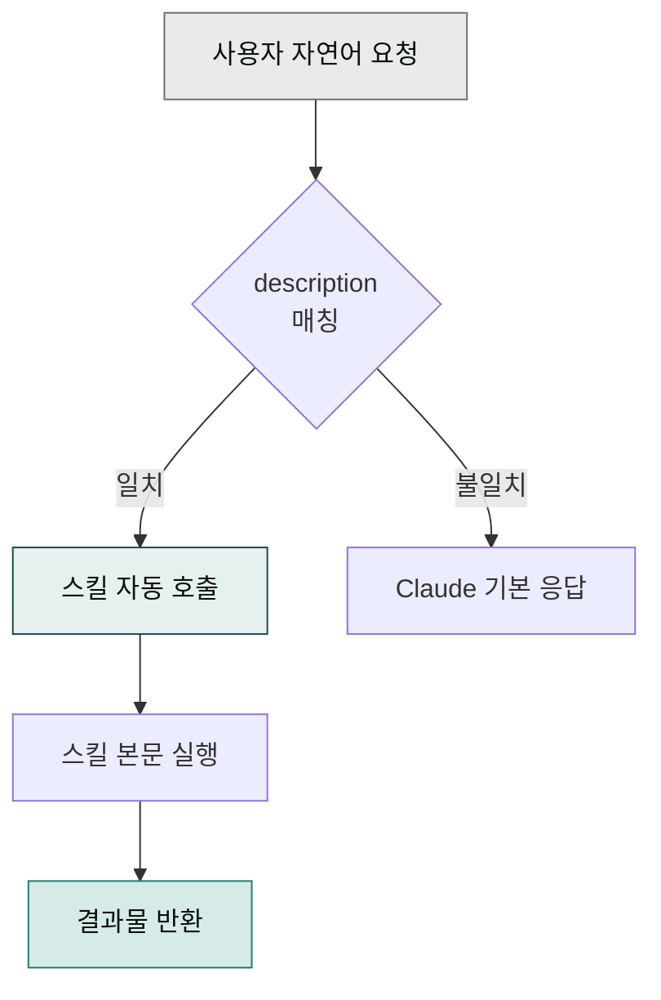
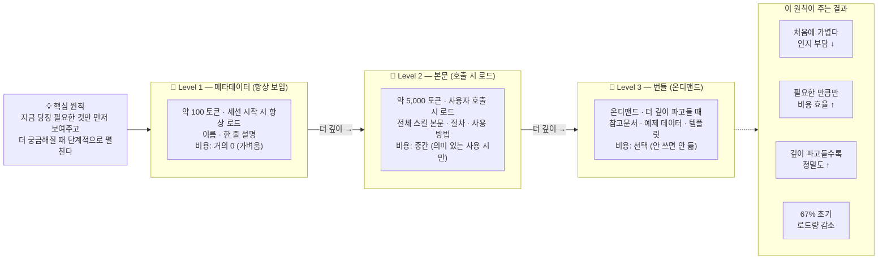

> 스킬(skill)은 "이런 요청이 오면 이렇게 처리해라"라는 절차적 지침 묶음입니다. 프롬프트 엔지니어링을 파일 하나로 저장해둔 것이라고 생각하면 쉽습니다.

## 스킬 트리거 흐름



## 언제 트리거되나

각 스킬의 `description` 필드에 트리거 조건이 쓰여 있습니다. Cowork가 사용자의 요청을 읽고 일치하는 스킬이 있으면 자동으로 호출합니다.

예시:

- "블로그 글 써줘" → `moai-content:blog`
- "계약서 검토해줘" → `moai-legal:contract-review`
- "사업계획서 만들어줘" → `moai-business:strategy-planner`


사용자 입력이 스킬의 트리거 조건과 일치하면 관련 스킬이 자동으로 호출되고 슬래시 명령 자동완성이 나타납니다.

## 스킬의 구조
## 정보를 조금씩 펼치는 원칙 (Progressive Disclosure)

Progressive Disclosure(점진적 공개)는 복잡한 정보를 한 번에 쏟아내지 않고, 사용자가 지금 당장 필요한 만큼만 먼저 보여주고 더 궁금해질 때 추가로 펼쳐주는 설계 방식입니다.

음식점에 비유하면 쉽습니다. 문 앞 메뉴판에는 "오늘의 추천" 한 줄만 보입니다(Level 1). 손님이 그 메뉴를 고르면 점원이 재료·조리법·영양정보를 알려줍니다(Level 2). 여기서 더 "출처가 궁금하다"고 물으면 원산지 증명서와 셰프 레시피 영상까지 열어줍니다(Level 3).

스킬 시스템도 똑같이 동작합니다. 처음에는 스킬 이름과 한 줄 설명만 가볍게 올려두고(약 100 토큰, 여기서 토큰이란 컴퓨터가 한 번에 읽는 텍스트 분량의 단위입니다), 실제로 그 스킬을 부를 때만 전체 본문(약 5,000 토큰)을 불러옵니다. 더 깊이 파고들 참고문서와 템플릿은 필요할 때만 추가로 가져옵니다. 이렇게 하면 처음 진입은 가볍고 빠르지만 깊이 들수록 정밀한 정보가 단계적으로 채워지며 전체를 처음부터 다 읽는 부담을 약 67% 줄여줍니다.



```text
skill-name/
  SKILL.md               # 본체 (YAML frontmatter + 본문)
  references/            # 상세 참고 문서
  scripts/               # (선택) 실행 스크립트
  assets/                # (선택) 이미지·템플릿
```

`SKILL.md`는 다음 구조를 따릅니다.

```yaml
---
name: skill-name
description: >
  [무엇을 하는지] + [언제 쓰는지] + [트리거 키워드]
user-invocable: true
---

(본문: 절차, 규칙, 예시)
```

## 스킬 호출 방식

### 1. 자연어 요청 (권장)

사용자는 그냥 자연어로 요청합니다. Cowork가 맥락을 읽고 적합한 스킬을 자동 호출합니다.


**문서 표기 규약**: 본 문서 전반에서 **사용자가 Cowork에 입력하는 모든 것**(자연어 지시·슬래시 명령·마켓플레이스 URL 등)은 macOS 터미널 스타일 박스 안에 `> ` prefix와 함께 표기합니다.

| 종류 | 문서 표기 | 실제 입력 |
|---|---|---|
| 슬래시 명령 | `> /project init` | `/project init` |
| 자연어 지시 | `> "블로그 글 써줘"` | `블로그 글 써줘` |
| 마켓플레이스 URL | `> modu-ai/cowork-plugins` | `modu-ai/cowork-plugins` |

`>`는 문서에서 "이건 사용자 입력"이라는 시각적 표식이며 **실제 대화창에 입력할 때는 `>`를 빼고 본문만** 입력하면 됩니다.


### 2. 슬래시 호출

특정 스킬을 명시적으로 부르고 싶으면 대화창에 `/`를 입력해 나타나는 목록에서 스킬을 선택합니다. 스킬의 frontmatter에 `user-invocable: true`가 설정된 스킬만 Tab 자동완성과 `/skill-name` 호출을 지원합니다.


> /blog
  /contract-review



자연어 요청이 가장 안정적입니다. 슬래시 호출은 스킬별로 지원 여부가 다르고 호출 가능 목록은 Cowork의 `/` 자동완성에서 직접 확인하는 게 가장 정확합니다.


### 3. 체이닝

여러 스킬을 연결해 파이프라인을 구성합니다. 자세한 설계 방법은 [쿡북 — 스킬 체인 설계](../../cookbook/skill-chaining/)에서 다룹니다.

## 제공된 스킬 활용하기

modu-ai/cowork-plugins 마켓플레이스는 28개 플러그인 안에 177개 스킬을 묶어 제공합니다. 사용자는 스킬을 직접 만들 필요 없이 — 자연어 한 줄로 GOAL을 던지면 시스템이 적합한 스킬을 자동으로 선택·체이닝합니다.

- **카테고리별 스킬 모음**: 콘텐츠·디자인·재무·법무·운영·마케팅·이커머스 등 28개 플러그인 ([플러그인 카탈로그](../../plugins/))
- **체인 예시 12종**: 자주 쓰는 스킬 조합 ([쿡북 — 스킬 체인 설계](../../cookbook/skill-chaining/))
- **트랙별 시나리오**: 본부·업무 영역별 한 줄 요청 → 자동 체인 ([쿡북 트랙](../../cookbook/tracks/))

## 다음 단계

- [플러그인 사용](../plugins/)
- [쿡북 — 스킬 체인 설계](../../cookbook/skill-chaining/)
- [쿡북 — 트랙별 시나리오](../../cookbook/tracks/)

---

### Sources

- [Use Skills in Claude](https://support.claude.com/en/articles/12512180)
- [modu-ai/cowork-plugins 마켓플레이스](https://github.com/modu-ai/cowork-plugins)
