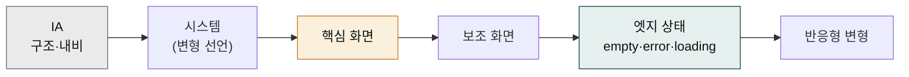

> 이 페이지는 다른 페이지에 분산된 원칙을 한 곳에 모은 **운영 매뉴얼**입니다. 새 프로젝트마다 처음에 한 번 훑으면 흔한 실수를 피할 수 있습니다.

## 10대 원칙 한눈에

| # | 원칙 | 핵심 |
|---|---|---|
| 1 | 디자인 시스템부터 | 30분 셋업으로 결과 품질 한 단계 점프 |
| 2 | 역할을 명시한 프롬프트 | "12년차 IDEO UX 아키텍트" — 분산 30-40% 감소 |
| 3 | AI 슬롭 회피 문구 | 진부한 폰트·보라 그라데이션·천편일률 카드 명시 금지 |
| 4 | 컨텍스트 누적 활용 | IA → 시스템 → 온보딩 → 대시보드 순서 |
| 5 | 실물이 사양서보다 강함 | URL·스크린샷 2장이 "미니멀·모던"보다 정확 |
| 6 | 토큰 비용 의식 | 디자인 시스템 자체 생성은 저렴한 도구에서 |
| 7 | 단계마다 백업 | 핸드오프 전 ZIP·PDF 백업 |
| 8 | 민감 자산 익명화 | 고객 데이터·매출이 박힌 자산은 더미로 치환 |
| 9 | 개발 핸드오프는 짧은 지시 | "이 번들대로 프로덕션 코드, 기존 시스템 토큰 유지" |
| 10 | 인터랙션은 별도 라운드 | 정적 UI 먼저, 마이크로 인터랙션은 그다음 |

## 공식 도입 사례 — 왜 이 원칙들이 작동하는가

Anthropic 공식 출시 공지(2026-04-17)에서 인용된 도입 사례 2건. 두 사례 모두 이 페이지의 원칙 1(디자인 시스템부터)과 원칙 9(짧은 핸드오프 지시)를 정확히 활용한 결과입니다.

> "복잡한 페이지를 다른 도구에서 만들려면 20+ 프롬프트가 필요했지만 Claude Design에서는 2 프롬프트로 충분했습니다. 핸드오프 번들에 디자인 의도를 포함시키니 프로토타입에서 프로덕션까지의 점프가 매끄러웠습니다." — Olivia Xu, Brilliant

> "거친 아이디어를 회의실을 나가기 전에 작동하는 프로토타입으로 만들 수 있었습니다. 이전에는 1주일이 걸렸던 브리프·목업 사이클이 한 번의 대화로 압축됐어요." — Aneesh Kethini, Datadog

원문 출처: [Introducing Claude Design by Anthropic Labs](https://www.anthropic.com/news/claude-design-anthropic-labs).

## 원칙 1 — 디자인 시스템부터

| 셋업 안 함 | 셋업 함 |
|---|---|
| 결과가 학습 데이터 평균값에 수렴 | 결과가 우리 브랜드처럼 보임 |
| "AI 티"가 남 | "사내 디자이너가 만든 듯" |
| 핸드오프 시 컴포넌트 매핑 안 됨 | 코드 컴포넌트로 자동 매핑 |
| 매 프로젝트마다 같은 지시 반복 | 모든 신규 프로젝트가 자동 적용 |

상세 절차는 [디자인 시스템 페이지](../design-system/) 참고. 핵심: **30분 투자로 평생 효과**.

## 원칙 2 — 역할을 명시한 프롬프트

프롬프트 첫 줄에 직업·연차·소속이 구체적인 디자이너 역할을 부여합니다.

```
"12년차 시니어 UX 아키텍트 IDEO 출신, 당신은 이 작업을 다음 관점에서 접근:"
"Dropbox 시니어 UX 라이터, 제품 마이크로카피 전문, 12단어 이내 지시:"
"Tableau 시니어 데이터 시각화 디자이너, 임원용 의사결정 대시보드:"
"Level Access 시니어 접근성 컨설턴트, WCAG 2.1 AA 인증:"
```

10가지 역할 패턴 전체는 [리파인먼트 페이지](../refinement/#역할-부여--결과-분산-30-40-감소)에 정리되어 있습니다.

## 원칙 3 — AI 슬롭 회피 문구

첫 프롬프트에 항상 회피 블록을 포함합니다.

### 짧은 회피 (Opus 4.7 권장)

```
AI 슬롭 회피: 진부한 폰트(Inter·Roboto·Arial)·보라 그라데이션·
일반적 3-카드 그리드 금지. 우리 브랜드의 고유 비주얼로.
```

### 긴 회피 (탐색 단계)

```
다음 진부한 AI 디자인 패턴을 피해 줘:

- 진부한 폰트: Inter, Roboto, Arial, 시스템 기본
- 진부한 색: 흰 배경의 보라색 그라데이션, 네온 보라 다크모드
- 진부한 컴포넌트: 천편일률 3-카드 그리드, 의미 없는 둥근 코너
- 진부한 일러스트: 거대한 도형, 평면 사람 캐릭터
- 진부한 카피: "Reimagine your workflow", "Unleash your potential"

대신: 우리 브랜드 폰트, 응집된 색 팔레트, 의도 있는 강조색,
마이크로 인터랙션, 산업 맥락에 맞는 비주얼.
```

## 원칙 4 — 컨텍스트 누적 활용



각 단계는 앞 단계의 결과를 자연스럽게 상속합니다. 같은 프로젝트 내에서.

## 원칙 5 — 실물이 사양서보다 강함

| 약한 시그널 | 강한 시그널 |
|---|---|
| "미니멀하고 모던한 톤" | linear.app/pricing URL |
| "우리 브랜드는 신뢰감 있게" | 자사 잘 만든 페이지 스크린샷 2장 |
| "B2B SaaS 톤" | stripe.com 캡처 + 자사 마케팅 사이트 |
| "프리미엄 느낌" | apple.com/iphone 캡처 |

업로드 또는 프롬프트에 URL을 직접 포함하세요.

## 원칙 6 — 토큰 비용 의식

Claude Design은 일반 채팅·Claude Code와 공유 풀을 쓰기 때문에 디자인 시스템 자체 생성 같은 고비용 작업은 특히 조심해야 합니다. 토큰을 절약하세요.

| 토큰 비용 낮추는 패턴 | |
|---|---|
| 사전 분석을 Claude Code에서 | 브랜드 자산 → DESIGN.md 합성 후 업로드 |
| 사전 빌트인 시스템에서 시작 | Apple·Linear·Stripe 시스템을 기반으로 우리 브랜드로 커스터마이즈 |
| 작은 자산부터 업로드 | 처음에 10장 PDF·이미지로 시작, 부족하면 추가 |
| 모노레포 전체 연결 금지 | UI 패키지 디렉토리만 |

[Buildfast 가이드](https://www.buildfastwithai.com/blogs/claude-design-anthropic-guide-2026)에서 한 사용자가 "1 디자인 시스템 + 2 원페이저 + 1 덱 + 1 비디오 작업 후 쿼터 도달" 사례를 보고했습니다.

## 원칙 7 — 단계마다 백업

| 시점 | 백업 형식 | 이유 |
|---|---|---|
| 핸드오프 직전 | ZIP archive | 코드 빌드 실패 시 복구 |
| 큰 방향 전환 직전 | "save this version" | 새 방향이 나쁘면 되돌리기 |
| 외부 발송 직전 | PDF | 원본 보존 |
| 분기 종료 | ZIP archive | 아카이브 |

## 원칙 8 — 민감 자산 익명화

업로드된 자산은 Anthropic 엔터프라이즈 보존 정책에 따라 저장됩니다.

| 자산 유형 | 처리 |
|---|---|
| 고객 이름·이메일·전화 | 더미 데이터로 치환 (`홍길동`, `customer@example.com`) |
| 실제 매출·재무 수치 | 비율 또는 더미 (`MRR $X`, `+Y% YoY`) |
| 사내 미공개 로드맵 | 일반화 표현 또는 작업 후 삭제 |
| 의료·금융 규제 데이터 | 업로드 자체 금지 (데이터 거주지 미지원) |
| 외부 파트너 정보 | 파트너사 동의 없이 업로드 금지 |

## 원칙 9 — 핸드오프는 짧은 지시 1개로

```
나쁜 핸드오프 지시:
"이 디자인을 React로 구현하는데, Next.js 13 app router를 쓰고, 상태
관리는 Zustand로 하고, 컴포넌트는 atomic design을 따르고, 폴더 구조
는 features/by-domain으로, TypeScript는 strict 모드로..."

좋은 핸드오프 지시:
"이 번들대로 프로덕션 코드를 작성. 기존 디자인 시스템 토큰 유지.
기존 코드베이스의 React 컴포넌트 라이브러리 활용. 결과를 로컬에서
미리보기 가능하게."
```

세부 사항은 Claude Code가 코드베이스를 읽고 자동 추론합니다. 짧은 지시가 자율성을 줍니다.

## 원칙 10 — 인터랙션은 별도 라운드

```
1라운드: 정적 UI 시안 받음
2라운드: "이 버튼에 hover 시 0.2s 페이드와 그림자 강화"
3라운드: "메인 차트에 드래그로 줌·언줌 인터랙션 추가"
4라운드: "페이지 진입 시 카드들이 위에서 fade-in (stagger 0.05s)"
```

한 번에 정적 UI + 인터랙션을 모두 요청하면 결과가 흐트러집니다.

## 자주 겪는 실수 — 통합 8종

| # | 실수 | 증상 | 복구 |
|---|---|---|---|
| 1 | 디자인 시스템 셋업 건너뜀 | 평균값 디자인, "AI 티" | 30분 셋업 |
| 2 | 모노레포 전체 연결 | ingestion 느림, 시스템 어긋남 | UI 패키지만 재연결 |
| 3 | 한 라운드 여러 변화 요청 | 결과 흐트러짐 | 변화 분리 |
| 4 | 5라운드 넘게 같은 프로젝트 | 점점 나빠짐 | save → 다른 도구 |
| 5 | AI 슬롭 회피 없이 시작 | 진부한 디자인 | 회피 블록 기본 포함 |
| 6 | 인라인 코멘트 사라짐 무시 | 변경 안 됨 | 채팅으로 복붙 |
| 7 | 핸드오프 후 디자인 수정 | 코드와 어긋남 | 핸드오프를 명확한 체크포인트로 |
| 8 | 민감 자산 그대로 업로드 | 정보 노출 | 익명화 또는 더미 |

## 통합 프롬프트 템플릿

새 프로젝트 시작 시 다음을 복사·수정해서 쓰세요.

```
[ROLE]      [구체적 직업·연차·소속]
            예: 12년차 시니어 UX 아키텍트 IDEO 출신.

[GOAL]      [한 문장 목표 — 사용자가 무엇을 X초 안에 할 수 있게]
            예: B2B SaaS 가격 페이지에서 3티어 비교를 10초 안에 의사결정.

[AUDIENCE]  [구체적 사용자 — 직책·산업·맥락]
            예: 20-100명 스타트업의 그로스 리드.

[PAGES]     [필요한 페이지·섹션 목록 + 각 목적]
            예: Hero · 3-tier cards · Compare table · FAQ · Sticky CTA.

[TONE]      [형용사 3-5개]
            예: 신뢰감 있는, 데이터 중심, 미니멀, 약간의 활기.

[REFERENCE] [URL·스크린샷]
            예: linear.app/pricing, stripe.com/pricing 톤.

[CONSTRAINTS] [디바이스·시스템·제외 항목]
            예: 데스크톱 우선, 기존 React 시스템, 결제 정보 입력 X.

[AI SLOP 회피]
            진부한 폰트·보라 그라데이션·천편일률 3-카드 그리드 금지.
            우리 브랜드의 고유 비주얼로.

[OUTPUTS]   [Claude가 만들 산출 목록]
            예: 1) 디자인 시안, 2) 카피 초안, 3) 모바일 반응형 변형.
```

## 보안 체크리스트

```
□ 업로드 전 자산에서 고객 개인정보(이름·이메일·전화) 익명화
□ 매출·재무 실제 수치를 더미·비율로 치환
□ 의료·금융 규제 데이터는 업로드 자체 금지
□ 외부 파트너 정보는 파트너 동의 없이 업로드 금지
□ 채팅 히스토리에 민감 정보가 있으면 멤버 초대 전 정리
□ Edit access는 최소 인원만, 기본은 View-only
□ 발표 직전 PDF·PPTX 폰트 임베드 확인 (한글 폰트 깨짐 방지)
□ 핸드오프 전 ZIP 백업
□ 외부 발송 시 채팅 히스토리 노출 안 됨 — 내보낸 파일만 발송
□ 프로젝트 종료 시 권한 회수
```

## 조직 운영 체크리스트 (Team·Enterprise 관리자)

```
□ Anthropic Labs 토글 활성화 (Organization settings)
□ RBAC 그룹별 단계적 롤아웃 (2-4명 → 디자인팀 → PM → 전사)
□ 디자인 시스템 수정 권한을 디자인 시스템 관리자 1-2명으로 제한
□ 신규 멤버 온보딩 시 안내 자료(이 페이지 + 시작하기) 공유
□ 분기 1회 샘플 프로젝트 5-10개 검토 — 시스템 드리프트 점검
□ 외부 발송 자료(마케팅·규제 인접)는 별도 리뷰 경로 운영
□ 사용량 알림 — 공유 풀 한도 도달 시 사내 공지 (chat·Claude Code와 함께 차감됨)
□ Beta 단계 — Anthropic 업데이트 모니터링 (초기 research preview에서 진전)
```

## 다음 단계

- **다음 페이지**: [요금제와 한도](../pricing-limits/) — 사용량·관리자 절차
- 참고: [디자인 시스템](../design-system/) — 셋업 자체에 시간 투자
- 깊이: [제한 사항과 로드맵](../limitations/) — Beta 단계 현재 상태

---

### Sources

- [Introducing Claude Design by Anthropic Labs](https://www.anthropic.com/news/claude-design-anthropic-labs) — Brilliant·Datadog·Canva 공식 인용
- [10 Advanced Prompts for Claude Design](https://pasqualepillitteri.it/en/news/1486/claude-design-prompts-senior-ux-designer-guide)
- [Claude Design: Complete Guide for Non-Designers (BuildFastWithAI)](https://www.buildfastwithai.com/blogs/claude-design-anthropic-guide-2026)
- [How to Use Claude Design for UX/UI (DesignerUp)](https://designerup.co/blog/how-to-use-claude-design-for-ux-ui/)
- [Claude Design Starter Guide (Claudia + AI)](https://claudiaplusai.substack.com/p/claude-design-starter-guide-and-examples)
- [Using Claude Design for prototypes and UX (Anthropic Tutorial)](https://claude.com/resources/tutorials/using-claude-design-for-prototypes-and-ux)
- [Prompting best practices (Claude API Docs)](https://platform.claude.com/docs/en/build-with-claude/prompt-engineering/claude-prompting-best-practices)
