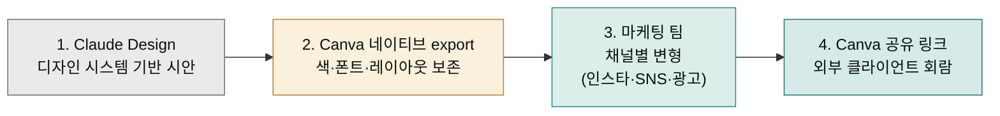
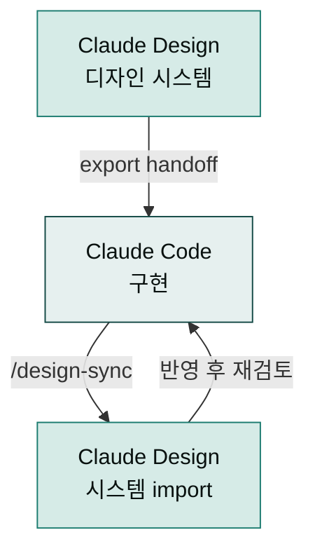
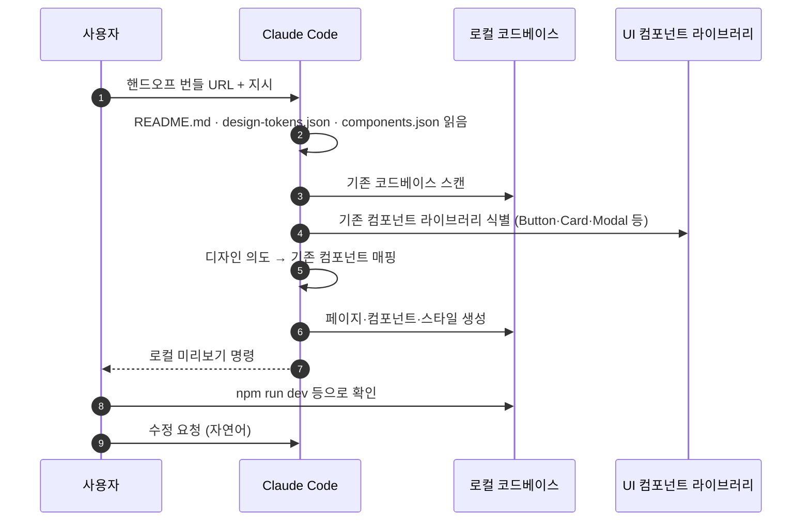
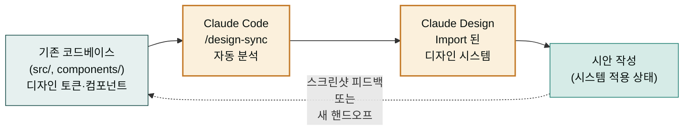

> 시안이 마음에 들면 어디로 내보낼지 결정해야 합니다. 발표용이면 PPTX·PDF, 마케팅 협업이면 Canva, 정적 호스팅이면 HTML, **프로덕션 코드로 갈 거면 Claude Code 핸드오프 번들**. 6가지 형식의 차이와 핸드오프 절차를 정리합니다.

## 출력 형식 6종 — 한눈에 비교

| 형식 | 결과물 | 편집 가능성 | 인터랙티브 보존 | 추천 시점 |
|---|---|---|---|---|
| **조직 URL** | 내부 링크 | Edit 권한 시 가능 | ✓ | 사내 리뷰·승인 회람 |
| **PDF** | 단일 PDF 파일 | 어려움 | ✗ | 외부 발송용 정적 산출물 |
| **PPTX** | PowerPoint 파일 | PowerPoint·Keynote에서 가능 | ✗ (간소화됨) | 발표 직전 최종 손질 |
| **표준 HTML** | 자립 HTML 폴더 | 코드 편집기에서 | ✓ | 단발성 랜딩·이벤트 사이트 |
| **Canva** | Canva 디자인 | Canva에서 풍부하게 | ✗ | 마케팅 팀 후속 편집 |
| **ZIP archive** | 모든 자산 압축 | — | ✓ | 백업·아카이브 |
| **Claude Code 핸드오프** | spec 번들 | Claude Code에서 코드로 | ✓ | 프로덕션 코드 빌드 |

## 형식별 상세

### 조직 URL

가장 빠른 공유 방법. 같은 조직 멤버에게 링크만 보내면 됩니다.

```
장점: 즉시 공유, 인터랙티브 보존, Edit 권한 시 협업
단점: 같은 조직 안에서만, 외부 발송 불가
```


시안이 완성되면 화면 우측의 내보내기 메뉴에서 목적에 맞는 형식을 선택합니다.

[협업·공유 페이지](../collaboration/)에서 권한 모델 참고.

### PDF

외부 발송에 가장 안전한 형식.

```
장점: 어디서나 열림, 폰트 임베드, 정적 보존
단점: 인터랙티브 손실, 수정 어려움
권장 시나리오: 투자자에게 피치덱 발송, 클라이언트 시안 회람
```

내보내기 시 페이지 사이즈·여백을 미리 설정. A4·Letter·16:9 슬라이드 비율 등을 선택.

### PPTX

발표 직전 최종 손질이 필요할 때.

```
장점: PowerPoint·Keynote에서 편집 가능, 발표자 노트 포함
단점: 캔버스 HTML 버전보다 레이아웃이 간소화됨 — 배경 요소가 잘 안 옮겨짐
권장 시나리오: 임원 보고, 외부 미팅, 강의 자료
```


**PPTX는 HTML 캔버스 버전보다 간소화됩니다.** 특히 배경 그라데이션·복잡한 일러스트·인터랙티브 요소는 정적 이미지로 평탄화되거나 누락될 수 있습니다. 정밀한 발표 자료가 필요하면 PDF + HTML 두 형식을 함께 받아 비교하세요.


### 표준 HTML

자립 HTML 폴더로 내보내 정적 호스팅 또는 사내 인트라넷에 게시.

```
장점: 인터랙티브 보존, Vercel·Netlify·S3에 즉시 배포 가능
단점: SEO·라우팅 같은 프레임워크 기능 없음
권장 시나리오: 이벤트 랜딩, 캠페인 마이크로사이트, 사내 가이드
포함 파일: index.html · styles.css · scripts.js · assets/
```

### Canva — 네이티브 통합 (공식 파트너십)

마케팅 팀이 후속 편집·공동 작업해야 할 때. Claude Design 출시 시점부터 **Canva 공식 파트너십**으로 네이티브 내보내기·편집을 지원합니다 (Anthropic ↔ Canva 공식 발표 2026-04-17).

> "Claude Design에서 Canva로 자연스럽게 아이디어와 초안을 가져올 수 있게 협업을 확장하고 있습니다." — Melanie Perkins, Canva CEO ([Anthropic 출시 공지](https://www.anthropic.com/news/claude-design-anthropic-labs))

```
장점: Canva의 풍부한 편집 기능, 협업·버전 관리, 템플릿화 가능,
      네이티브 export로 폰트·색 토큰 보존
단점: Claude Design의 코드 의도가 옅어짐, 자유로운 수정으로 일관성 깨질 위험
권장 시나리오: SNS 캠페인 비주얼, 이벤트 포스터, 멀티 채널 변형,
              마케팅 팀의 후속 일러스트레이션·텍스트 변형
```

#### 마케팅 후속 편집 워크플로우



Canva 전송 후에는 **편집·협업이 가능**합니다. Canva의 자체 공유 링크로 외부 공유도 가능합니다 (Canva 정책 적용). Claude Code 핸드오프(프로덕션 코드 빌드)와는 **다른 경로**로 운영하세요 — 두 경로를 동시에 진행하면 디자인이 두 도구에서 동시에 변형돼 일관성이 깨집니다.

### ZIP archive

전체 백업·아카이브 용도.

```
포함: 모든 디자인 파일, 토큰, 자산, README
용도: 핸드오프 전 백업, 분기별 아카이브, 클라이언트 인도
권장: 핸드오프나 큰 변경 전 한 번 받아 두기
```

### Claude Code 핸드오프 번들 — 핵심

프로덕션 코드로 빌드할 때 사용하는 **가장 강력한 형식**. 별도 섹션에서 상세히 다룹니다.

## Claude Code 양방향 Sync — `/design-sync`

Claude Design과 Claude Code의 디자인 시스템은 **양방향 동기화**를 지원합니다.



### Claude Code에서 디자인 시스템 import (`/design-sync`)

Claude Code 터미널에서 다음을 실행하면 코드베이스의 디자인 시스템(컴포넌트, 토큰, 색상)을 Claude Design으로 import할 수 있습니다.


/design-sync
Claude Design에 현재 코드베이스의 디자인 시스템을 import하시겠습니까?



터미널에서 `/design-sync`를 실행하면 코드베이스의 컴포넌트·토큰·색상이 Claude Design으로 들어와 디자인 시작점이 실제 코드와 일치하게 됩니다.

그 결과:
- 기존 코드의 컴포넌트 라이브러리를 Claude Design에서 검색 가능
- Claude Design에서 새 시안 작성 시 기존 컴포넌트 자동 인식
- 코드와 디자인 시스템이 일관성 있게 유지

**제약**: 자동 양방향 동기화는 아니며 수동으로 import/export를 실행해야 합니다. 큰 디자인 변경이 필요하면 새로운 핸드오프를 권장합니다.

## Claude Code 핸드오프 번들 — 상세

Claude Design이 시안을 만든 같은 시스템(Anthropic)이 핸드오프 번들도 작성합니다. 그래서 **Claude Code가 픽셀에서 의도를 추론할 필요가 없습니다** — 이미 구조화된 spec을 받습니다.

### 번들에 포함되는 것

**공식 규격은 3가지 coarse 항목**입니다 — 디자인 파일(HTML/CSS/JS) + chat + README, 그리고 참조 자산. Anthropic은 디자인을 "code under the hood(HTML/CSS/JS)"로 규정하며, 구조화된 DTCG JSON을 **공식 규격으로 문서화하지 않았습니다**.

```
handoff-bundle/
├── README             ← Claude Code가 가장 먼저 읽는 파일 (공식: 디자인 해석 지침)
├── (디자인 파일)       ← 공식: HTML/CSS/JS "code under the hood"
├── (chat)             ← 공식: 디자인 과정의 결정 맥락
└── (참조 자산)         ← 이미지·SVG·폰트 등
```


**파일명 주의 — 커뮤니티 관찰 vs 공식 규격**: 아래처럼 세분화된 파일명(`design-tokens.json` · `components.json` · `layout-hierarchy.json` · `chat-history.md`)은 **커뮤니티에서 관찰된 전형적 구조이며 Anthropic 공식 규격은 아닙니다**. 실제 번들은 이 이름들과 다를 수 있으므로, 소비 도구는 README를 먼저 읽고 나머지 파일은 선택적(best-effort)으로 처리해야 합니다.

```
design-tokens.json / tokens.json   ← 토큰 (파일명 추론, 선택)
components.json                    ← 컴포넌트 트리 (파일명 추론, 선택)
layout-hierarchy.json              ← 레이아웃·반응형 (파일명 추론, 선택)
chat-history.md                    ← chat 저장 파일명 (추론)
```


### 번들이 일반 Figma 핸드오프와 다른 점

| 항목 | Figma → 개발자 | Claude Design → Claude Code |
|---|---|---|
| 형식 | 픽셀·디자인 도구 표현 | 코드형 산출물(HTML/CSS/JS) + README |
| 의도 전달 | 디자이너가 따로 설명 필요 | 채팅 히스토리에 자동 보존 |
| 컴포넌트 매칭 | 개발자가 수동 매핑 | 기존 코드베이스 컴포넌트 자동 인식 |
| 토큰 | 디자인 도구 토큰 → 코드 토큰 변환 필요 | 처음부터 코드 토큰 사용 |
| 생산자·소비자 | 다른 시스템(Figma · IDE) | 같은 회사 모델(Anthropic) |

## 핸드오프 절차 — 실제 단계

### Claude Code 터미널에서 직접 진입 (`/design`)

Claude Code 터미널에서 다음을 입력하면 Claude Design을 직접 열거나 기존 디자인을 편집할 수 있습니다.


/design
Claude Design 캔버스를 열거나 기존 프로젝트를 불러옵니다.


이는 로컬 Claude Code 세션에서 디자인 도구를 빠르게 전환할 수 있는 편의 기능입니다.


Claude Code 및 Claude Design은 같은 Anthropic 플랫폼에서 양방향으로 핸드오프를 지원합니다.

### 1. 핸드오프 직전 점검

```
□ 시안이 발표 수준 완성도인가 (5라운드 한계 안에서)
□ 의도된 사용자 플로우가 모두 디자인되어 있는가
□ 엣지 상태(empty · error · loading)가 디자인되어 있는가
□ 반응형 변형이 필요한 화면은 디자인되어 있는가
□ 컴포넌트 이름이 코드베이스와 일치하는가
□ 백업 ZIP을 한 번 받아 두었는가
```

### 2. Export → Hand off to Claude Code

캔버스 우상단 **Export** 버튼 → 옵션 중 선택:

| 옵션 | 사용 시점 |
|---|---|
| **Hand off to Claude Code** | 로컬 터미널에서 Claude Code를 쓰는 경우 |
| **Hand off to Claude Code Web** | 브라우저에서 Claude Code Web을 쓰는 경우 |

### 3. 받은 프롬프트를 Claude Code에 붙여넣기

Export 후 Claude Design이 **준비된 프롬프트**를 보여줍니다. 그대로 복사해 Claude Code에 붙여넣습니다.

**전형적인 프롬프트 예시**:

```
이 디자인 핸드오프 번들을 받아서 코드로 구현해 줘.
번들 URL: [자동 생성 URL]
참고:
- README.md 먼저 읽고 의도와 컴포넌트 매핑을 파악
- 기존 코드베이스의 React 컴포넌트 라이브러리를 활용
- design-tokens.json의 토큰을 그대로 사용
- chat-history.md에 디자인 결정의 맥락이 있음
구현 후 로컬에서 미리보기 가능하게 설정.
```

Claude Code Web을 쓰면 위 절차가 한 번의 클릭으로 자동화됩니다.

### 4. Claude Code의 작업



### 5. 핸드오프 이후의 원칙

| 원칙 | 이유 |
|---|---|
| **핸드오프 시점을 명확한 체크포인트로** | 이후 디자인 수정은 코드와 어긋남 |
| **수정은 가급적 코드에서** | Claude Code가 같은 디자인 시스템을 알고 있어 일관성 유지 |
| **큰 디자인 변경이 필요하면 새 핸드오프** | 이전 코드를 일부 유지하면서 새 시안 가져오기 |
| **스크린샷 피드백 루프** | 코드 결과를 캡처해 Claude Design에 다시 입력해 비교·수정 |

## 핸드오프 실패 — 자주 겪는 문제

| 증상 | 원인 | 복구 |
|---|---|---|
| Claude Code가 컴포넌트를 못 찾음 | 코드베이스 연결 없이 디자인했음 | 디자인 시스템에 GitHub repo 추가 → 다시 핸드오프 |
| 컴포넌트 이름이 어긋남 | 디자인에서 임의 이름 사용 | 코드 컴포넌트 이름과 일치시킨 후 다시 핸드오프 |
| 토큰이 어긋남 | 디자인 시스템에 등록된 토큰과 캔버스에서 쓴 값이 다름 | Remix로 시스템 정리 후 다시 디자인 |
| 인터랙티브가 단순화됨 | 디자인 단계의 복잡한 애니메이션이 코드로 안 옮겨감 | Claude Code에 추가 지시: "이 버튼에 hover 시 0.2s 페이드" |
| ZIP 백업 없이 핸드오프 후 실패 | 되돌리기 어려움 | 다음부터는 핸드오프 직전 ZIP 백업 필수 |

## Claude Code 양방향 Sync — `/design-sync`

Claude Code의 `/design-sync` 커맨드를 사용하면 기존 코드베이스의 디자인 시스템을 Claude Design으로 자동 import할 수 있습니다.



### Claude Code 터미널에서 직접 진입 (`/design`)

Claude Code 터미널에서 `/design` 커맨드를 입력하면 claude.ai/design으로 직접 이동합니다.


/design


상황에 따라:
- **로컬 프로젝트에서**: 로컬 디자인 시스템이 있으면 불러옴
- **브라우저 접속**: 새 프로젝트를 시작하거나 기존 프로젝트를 재개
- **앱 통합**: 9개 앱과 연동 (Figma·Webflow·Framer·Vercel·Netlify 등)

### 현재 양방향 제약

`/design-sync`와 `/design` 커맨드로 부분적 양방향 흐름은 지원되지만 완전한 **양방향 자동 동기화** (디자인 변경 ↔ 코드 변경 자동 적용)는 현재 제한적입니다.

## 양방향(디자인 ↔ 코드) — 현재 제약

핸드오프는 **디자인 → 코드** 한 방향이 강합니다. 반대 방향(코드 → 디자인 동기화)은 현재 제한적입니다.

**대안 패턴**:

1. **스크린샷 피드백**: 코드에서 빌드한 결과를 캡처해 Claude Design에 다시 입력
2. **부분 영역 재디자인**: 특정 페이지·섹션만 새 프로젝트로 다시 디자인 → 새 번들로 부분 핸드오프
3. **디자인을 원본으로 유지**: 코드 변경이 클 때마다 디자인을 먼저 수정하고 다시 핸드오프

## 한국 환경 메모

| 영역 | 메모 |
|---|---|
| 한글 폰트 | Pretendard·Noto Sans KR 등이 코드베이스에 있으면 자동 인식 |
| PPTX 한글 | 한글 폰트 임베드 — 발표 PC에 폰트 없을 때 깨짐 방지 위해 PPTX에 폰트 임베드 |
| Canva 한글 | Canva에서 한글 폰트 옵션 제한적 — 폰트 통일성을 위해 PDF 권장 |
| Pretty Print URL | 표준 HTML 호스팅 시 한글 URL은 인코딩 — 별도 alias 권장 |

## 다음 단계

- **다음 페이지**: [역할별 사용 사례](../use-cases/) — 핸드오프가 실제 워크플로우에서 어떻게 쓰이는지
- 참고: [디자인 시스템](../design-system/) — 핸드오프 품질은 시스템 셋업이 좌우
- 깊이: [베스트 프랙티스](../best-practices/) — 핸드오프 직전 체크리스트

---

### Sources

- [Using Claude Design for prototypes and UX (Anthropic Tutorial)](https://claude.com/resources/tutorials/using-claude-design-for-prototypes-and-ux)
- [Introducing Claude Design by Anthropic Labs](https://www.anthropic.com/news/claude-design-anthropic-labs)
- [Get started with Claude Design (Anthropic Help)](https://support.claude.com/en/articles/14604416-get-started-with-claude-design)
- [Claude Design to Claude Code: AI Design Handoff (ClaudeFast)](https://claudefa.st/blog/guide/mechanics/claude-design-handoff)
- [Claude Design handoff example (GitHub)](https://github.com/az9713/claude-design-handoff)
- [Claude Design Starter Guide (Claudia + AI)](https://claudiaplusai.substack.com/p/claude-design-starter-guide-and-examples)
