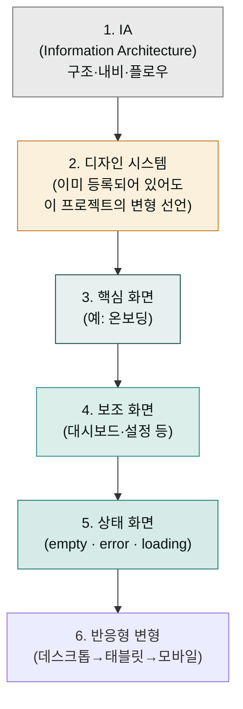

> 첫 시안은 보통 70% 정도의 완성도로 나옵니다. 나머지 30%를 채우는 것이 리파인먼트입니다. 다섯 번째 라운드부터 효용 체감이 시작되므로 그 안에 끝내는 효율적 패턴을 익히는 것이 핵심입니다.

## 4가지 조작 — 언제 어떤 도구를 쓰나

| 조작 | 사용 시점 | 비유 | 효율 |
|---|---|---|---|
| **자연어 수정** | 전체 방향 전환 · 구조 변경 | 디자이너에게 말로 부탁 | 큰 변화에 강함 |
| **인라인 코멘트** | 특정 요소를 콕 집어 수정 | Figma 코멘트 | 정밀 수정에 강함 |
| **직접 텍스트 편집** | 카피·라벨을 바로 손봄 | 워드 편집 | 카피 수정에 가장 빠름 |
| **조정 노브 (sliders)** | 간격·색·레이아웃을 live tweak | InDesign 패널 | 시각 미세조정 |

조정 결과는 **현재 화면에만 적용** 또는 **모든 화면에 일괄 적용** 중 선택. 일관성을 위해 일괄 적용을 권장합니다.


**인라인 코멘트가 사라지는 경우가 있습니다.** Claude가 처리하기 전에 코멘트가 가끔 사라지는 버그가 보고됩니다. 우회: 코멘트 내용을 채팅에 복사·붙여넣기하면 동일하게 작동합니다.


## 자연어 수정 — 좋은 지시 vs 나쁜 지시

| 나쁜 지시 | 좋은 지시 | 차이 |
|---|---|---|
| "더 좋게" | "Hero 섹션의 헤드라인을 한 줄로 줄이고 강조 색을 더 진하게" | 구체성 |
| "디자인 다시" | "이 페이지 전체 톤을 차분하게 — 간격 넓게, 보조색 채도 낮춤, Hero 일러스트 제거" | 변경 범위 + 변경 항목 |
| "예쁘게" | "현재 노이즈가 많음. 카드 3개의 그림자를 빼고 보더만 남기고, 텍스트 사이즈 14→16px" | 진단 + 조치 |
| "다른 방향" | "save this version. 이제 완전히 다른 방향: 더 대범하고, 큰 타이포, 단일 강조색" | 백업 + 새 방향 명시 |

## 인라인 코멘트 — 정밀 수정 패턴

특정 요소(버튼·카드·이미지)에 마우스 호버 → 코멘트 아이콘 클릭 → 텍스트 입력.

**효과적 코멘트 예시**:

```
[버튼에 코멘트]
이 CTA를 보더만 있는 secondary 스타일에서 채워진 primary 스타일로
바꿔 줘. 그리고 라벨을 "Get started" → "지금 시작" 으로.

[카드에 코멘트]
이 카드의 그림자가 너무 무겁다. 그림자 빼고 보더 1px로.
호버 시에만 살짝 그림자.

[이미지에 코멘트]
이 일러스트를 더 추상적인 패턴으로 — 사람 형상 대신 도형 구성.
```

## 직접 텍스트 편집

캔버스 위 텍스트를 더블클릭하면 인플레이스 편집이 됩니다. 카피 단순 수정은 채팅이나 코멘트보다 직접 편집이 가장 빠릅니다.

**언제 직접 편집**: 오타 수정, 단어 교체, 한 문장 다듬기
**언제 채팅**: 카피 전체를 재작성, 톤 변경, 다국어 변환

## 조정 노브 — 미세 조정

화면 우측 또는 컨텍스추얼 패널에 노출되는 슬라이더로 다음을 즉시 조정합니다.

- **간격(spacing)**: padding · margin · gap 일괄
- **색(color)**: 강조색 변형, 채도·명도
- **레이아웃(layout)**: 그리드 컬럼, 카드 너비
- **모서리(radius)**: 코너 반경
- **그림자(elevation)**: 그림자 강도

노브는 **즉시 시각 피드백**을 줍니다. 5초 안에 다양한 조합을 시도해 보고 마음에 드는 값에서 멈추면 됩니다.


시안의 세부 요소를 미세 조정할 때 우측 패널의 슬라이더를 사용하면 실시간으로 변화를 확인할 수 있습니다.

## 컨텍스트 누적 — 한 프로젝트 내에서

같은 프로젝트 내에서는 Claude가 **이전 결과를 자연스럽게 상속**합니다. 권장 순서:



**핵심**: 각 단계는 앞 단계의 결과를 활용합니다. "온보딩 디자인했던 이 스타일 그대로 설정 페이지에" 같은 짧은 지시로 일관성이 유지됩니다.

## AI 슬롭 회피 프롬프트 — 첫 프롬프트에 항상 포함

학습 데이터의 평균값에서 벗어나려면 **명시적으로 회피 패턴을 선언**하는 것이 효과적입니다. Claude Opus 4.7부터는 이 회피 지시가 짧아도 잘 작동합니다.

### 기본 회피 블록

```
다음 진부한 AI 디자인 패턴을 피해 줘:

- 진부한 폰트: Inter, Roboto, Arial, 시스템 기본
- 진부한 색: 흰 배경의 보라색 그라데이션, 다크 모드의 네온 보라
- 진부한 컴포넌트: 천편일률 3-카드 그리드, 의미 없는 둥근 코너
- 진부한 일러스트: 거대한 도형, 평면적 사람 캐릭터
- 진부한 카피: "Reimagine your workflow", "Unleash your potential"

대신:
- 우리 브랜드 폰트
- 응집된 색 팔레트와 의도 있는 강조색
- 마이크로 인터랙션이 있는 컴포넌트
- 우리 산업 맥락에 맞는 비주얼
```

### 짧은 회피 블록 (Opus 4.7 권장)

```
AI 슬롭 회피: 진부한 폰트(Inter·Roboto·Arial)·보라 그라데이션·
일반적 3-카드 그리드 금지. 우리 브랜드의 고유 비주얼로.
```

## 역할 부여 — 결과 분산 30-40% 감소

프롬프트 첫 줄에 **직업·연차·소속이 구체적인 디자이너 역할**을 부여하면 결과 일관성이 크게 올라갑니다.

### 효과적인 역할 부여 예시

```
"12년차 시니어 UX 아키텍트 IDEO 출신, 당신은 이 작업을 다음 관점에서 접근:"
"닐슨 노먼 그룹 시니어 UX 리서처, 사용성 휴리스틱 평가 전문:"
"Figma 시니어 디자인 시스템 엔지니어, 1M+ 사용자 컴포넌트 경험:"
"Dropbox 시니어 UX 라이터, 제품 마이크로카피 전문, 12단어 이내 지시:"
"Intercom 시니어 프로덕트 디자이너, 활성화 온보딩 전문, 10분 AHA 모먼트:"
"Baymard Institute 시니어 UX 컨설턴트, 하이퍼 휴리스틱 감사:"
"Tableau 시니어 데이터 시각화 디자이너, 임원용 의사결정 대시보드:"
"Level Access 시니어 접근성 컨설턴트, WCAG 2.1 AA 인증:"
"CXL Institute 시니어 컨버전 옵티마이저, 폼 디자인 전문:"
"Google Ventures 시니어 UX 리서처, 디자인 스프린트 전문:"
```

10가지 역할 패턴은 [pasqualepillitteri.it 가이드](https://pasqualepillitteri.it/en/news/1486/claude-design-prompts-senior-ux-designer-guide)에 정리되어 있습니다.

### 통합 프롬프트 구조

```
[ROLE]      12년차 시니어 UX 아키텍트 IDEO 출신.
[GOAL]      이 작업의 목표: B2B SaaS 가격 페이지에서 3티어 비교를
            최대 10초 안에 의사결정 가능하게.
[CONSTRAINTS] 네비 깊이 2단계 이하. 시맨틱 색 팔레트만 사용 — 장식용 X.
[OUTPUTS]   1) 콘텐츠 인벤토리, 2) 3티어 카드 시안, 3) 비교표,
            4) 의사결정 지원 마이크로카피.
[CONTEXT]   제품: 20-100명 스타트업의 마케팅 자동화 SaaS.
            사용자 주요 액션: "팀 플랜으로 14일 무료 시작".
            시장 제약: 경쟁사가 30-day 트라이얼을 기본 — 우리는 14-day.
```

이 구조는 [10가지 시니어 UX 프롬프트 가이드](https://pasqualepillitteri.it/en/news/1486/claude-design-prompts-senior-ux-designer-guide)의 공통 패턴입니다.

## 한 번에 하나씩 — Single Variable 원칙

여러 변화를 한 번에 요청하면 결과가 흐트러집니다.

**나쁜 패턴**:
```
전체 톤을 미니멀로 바꿔주고, 그리드도 4컬럼으로 바꾸고,
카피도 다듬어주고, CTA도 더 강조해 줘.
```

**좋은 패턴**:
```
1라운드: "전체 톤을 미니멀로 — 색 채도 낮춤, 간격 시원하게"
        → 확인
2라운드: "그리드를 3→4컬럼으로 변경"
        → 확인
3라운드: "Hero 카피를 한 줄로 줄임: 'X를 자동화하세요'"
        → 확인
4라운드: "CTA 버튼을 strong primary로, 라벨 '지금 시작'"
```

각 라운드마다 결과를 검증할 수 있어 어디서 어긋났는지 추적이 됩니다.

## 5라운드 한계와 다음 단계

리파인먼트는 **다섯 번째 라운드부터 효용 체감**이 시작됩니다. 그 시점에서는:

1. **save this version** 명령으로 현재 결과를 저장
2. Canva·HTML·Code로 내보내 **다른 도구에서 마감**
3. 그래도 부족하면 **새 프로젝트로 완전히 다시 시작** — 그동안 배운 것을 첫 프롬프트에 반영

## 자주 겪는 실수 — 리파인먼트 측면

| 실수 | 증상 | 복구 |
|---|---|---|
| 한 라운드에 여러 변화 요청 | 결과가 흐트러져 어디서 잘못됐는지 모름 | 변화를 하나씩 분리 |
| AI 슬롭 회피 없이 첫 프롬프트 | 진부한 디자인 | 짧은 회피 블록을 기본 템플릿에 포함 |
| 5라운드 넘게 같은 프로젝트에서 다듬기 | 점점 나빠짐 | save → 다른 도구 또는 새 프로젝트 |
| 코멘트 사라짐 무시 | 변경 적용 안 됨 | 채팅으로 복사·붙여넣기 |
| 의미 없는 "예쁘게" "다른 방향" | 결과가 임의로 변함 | 진단(현재 문제) + 조치(원하는 결과)로 분리 |

## 다음 단계

- **다음 페이지**: [협업과 공유](../collaboration/) — 다듬은 시안을 팀과 함께 보는 방법
- 참고: [디자인 시스템](../design-system/) — 시스템 자체를 손볼 때(Remix)
- 깊이: [베스트 프랙티스](../best-practices/) — 프롬프트 패턴·역할 부여 등

---

### Sources

- [10 Advanced Prompts for Claude Design](https://pasqualepillitteri.it/en/news/1486/claude-design-prompts-senior-ux-designer-guide)
- [Claude Design Starter Guide (Claudia + AI)](https://claudiaplusai.substack.com/p/claude-design-starter-guide-and-examples)
- [How to Use Claude Design for UX/UI (DesignerUp)](https://designerup.co/blog/how-to-use-claude-design-for-ux-ui/)
- [Using Claude Design for prototypes and UX (Anthropic Tutorial)](https://claude.com/resources/tutorials/using-claude-design-for-prototypes-and-ux)
- [Prompting best practices (Claude API Docs)](https://platform.claude.com/docs/en/build-with-claude/prompt-engineering/claude-prompting-best-practices)
