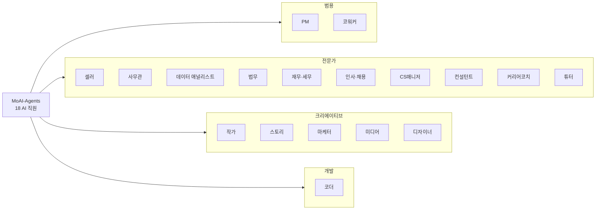

회사에서 일을 나눠 맡기듯, Claude에게도 "직원"을 붙여줄 수 있습니다. 여기서 말하는 **AI 직원**이란 특정 직무에 필요한 스킬(반복 업무를 잘 하도록 미리 정리해 둔 작업 설명서)과 에이전트(실제로 일을 수행하고 검수하는 실행 단위), 그리고 필요하면 MCP(클로드가 외부 서비스와 연결되는 표준 통로)까지 한 묶음으로 포장한 플러그인입니다. 설치하면 그 직무의 전문가 한 명이 팀에 합류하는 것과 비슷합니다.

한 명의 만능 비서에게 모든 일을 맡기면 지시가 길어지고 결과가 들쭉날쭉해지기 쉽습니다. 반면 직무별 직원을 두면 "마케터에게 카드뉴스", "법무 담당에게 계약 검토"처럼 자연어 한마디로 일이 올바른 스킬에 매칭됩니다. 마치 작은 회사에서 총무·마케팅·법무를 각각 담당자에게 맡기는 것과 같은 구조입니다. 대부분의 직원에는 산출물을 만드는 실행 직원(worker)과 결과를 의심하며 검사하는 검수 직원(auditor)이 함께 들어 있어, 혼자 일하고 혼자 확인하는 것보다 결과가 안정적입니다.

모두의 코워크 마켓플레이스 v6.2.0에는 총 **18명의 AI 직원**이 있습니다. 크게 네 축으로 나뉩니다: 프로젝트를 여는 **범용** 축(PM·코워커), 특정 직무를 파고드는 **전문가** 축(셀러·사무관·데이터 애널리스트·법무·재무·인사·CS·컨설턴트·커리어·튜터), 만드는 일을 돕는 **크리에이티브** 축(작가·스토리·마케터·미디어·디자이너), 그리고 소프트웨어를 만드는 **개발** 축(코더)입니다.

## 18명의 직원 한눈에 보기

| 직원 | 분류 | 무엇을 해 주나 | 스킬 |
|---|---|---|---|
| [PM](pm/) | 프로젝트 허브 | 프로젝트 초기화와 직원 배치 라우팅 | 2 |
| [코워커](coworker/) | 범용 실무 | 브랜드·제안서·보고·협상 등 비즈니스 코어 + 라이프스타일 | 32 |
| [작가](writer/) | 창작·출판 | 출판 기획·집필, 한국어 인문화 윤문·맞춤법 | 10 |
| [스토리 크리에이터](story/) | 창작·IP | 웹툰·웹소설·시나리오·콘티·캐릭터 시트 (Higgsfield) | 13 |
| [마케터](marketer/) | 마케팅 | 캠페인·콘텐츠·광고·미디어 생성 | 19 |
| [미디어 크리에이터](media/) | 미디어 생성 | 이미지·영상·오디오 생성 (Higgsfield·ElevenLabs 등) | 10 |
| [셀러](seller/) | 이커머스 | 스마트스토어·아임웹·카페24 운영 실무 | 29 |
| [사무관](officer/) | 문서·오피스 | 한국형 오피스 문서(HWPX·DOCX·XLSX)·HTML 리포트 | 13 |
| [데이터 애널리스트](analyst/) | 데이터·분석 | 공공데이터·KOSIS·DART 조회·데이터 시각화 | 11 |
| [법무 담당](lawyer/) | 전문직 | 계약 검토·컴플라이언스·법령/판례 리서치 | 9 |
| [재무·세무 담당](accountant/) | 전문직 | 재무제표·결산·세금·가계 재무 | 11 |
| [인사·채용 담당](recruiter/) | 전문직 | 채용 공고·이력서 스크리닝·오퍼레터 | 6 |
| [CS매니저](cs/) | 고객지원 | 티켓 분류·응답 초안·VOC 분석 | 6 |
| [컨설턴트](consultant/) | 경영 자문 | 사업계획서·시장 분석·정부 지원사업 | 6 |
| [커리어코치](career/) | 커리어 | 이력서 첨삭·면접 준비·이직 전략 | 5 |
| [튜터](tutor/) | 전문직 | 커리큘럼·평가 문항·논문 리서치 | 11 |
| [디자이너](designer/) | 디자인 | Claude Design 연동·토큰·브랜드 시스템 | 13 |
| [코더](coder/) | 개발·무설치 | MoAI-ADK 개발 방법론 무설치 실행 | 29 |

어디서부터 시작할지 모르겠다면 [PM](pm/) 페이지부터 읽어보세요. 프로젝트 성격에 맞는 직원 조합을 잡아 주는 것이 PM의 역할입니다. 설치 방법과 마켓플레이스 등록은 [플러그인 가이드](/plugins/)에서 다룹니다.
