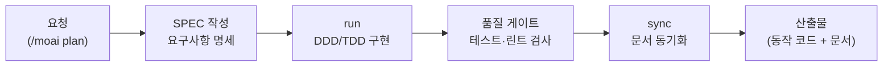

"코드를 짜 달라"는 요청과 "소프트웨어를 만들어 달라"는 요청은 다릅니다. 전자는 한 번의 답변으로 끝나지만 후자에는 요구사항 정리, 테스트, 품질 검사, 문서화라는 공정이 필요합니다. 코더는 이 공정 전체를 가진 직원입니다. 집을 지을 때 목수 한 명이 아니라 설계도(SPEC)·시공(run)·준공 검사(sync)를 갖춘 시공팀을 부르는 것과 같습니다.

핵심은 MoAI-ADK 개발 방법론의 **무설치 실행**입니다. moai CLI를 따로 설치하지 않아도 Claude Code나 Claude Desktop에서 `/moai` 명령으로 SPEC 기반 개발(plan — 요구사항 명세, run — DDD/TDD 구현, sync — 문서 동기화)을 그대로 쓸 수 있습니다. TDD(테스트를 먼저 쓰고 통과시키는 개발 방식)와 DDD, 품질 게이트, 백엔드·프론트엔드·데이터베이스·보안 참조 지식까지 29종 스킬이 들어 있어, 비개발자도 자연어로 개발 워크플로우를 시작할 수 있습니다.

이 페이지는 요약입니다. 코더의 실제 사용법은 [Code 가이드](/guide/code/)에서, 심화 개발 문서(SPEC 워크플로우·에이전트 구조·품질 프레임워크 전체)는 [adk.mo.ai.kr/ko](https://adk.mo.ai.kr/ko)에서 다룹니다.

## 스킬 카탈로그

방법론(moai-workflow-\*), 도메인 지식(moai-domain-\*), 참조 패턴(moai-ref-\*) 계열 29종의 전체 목록입니다.



## 에이전트

코더에는 **code-investigator**(읽기 전용 조사 에이전트)가 포함되어 코드베이스의 의존성·공개 API·영향 범위를 조사해 구조화 보고를 올립니다. 구현하는 손과 조사하는 눈을 분리해, 수정이 미치는 범위를 먼저 파악한 뒤 코드를 고치게 하는 구조입니다.



## 대표 시나리오 3선

**1. 기능 하나를 SPEC부터.** "회원 가입 기능 만들어줘"라고 하면 `/moai plan`이 요구사항을 SPEC 문서로 정리해 확인받고, `/moai run`이 TDD로 구현하며, `/moai sync`가 문서를 맞춰 줍니다. 무엇이 만들어질지 코드 작성 전에 합의된다는 점이 핵심입니다.

**2. 레거시 코드 안전 리팩토링.** "이 오래된 코드 정리하고 싶은데 망가질까 봐 무서워"라고 요청하면 DDD 워크플로우(`moai-workflow-ddd`)가 현재 동작을 테스트로 고정한 뒤 동작을 보존하며 구조만 개선합니다.

**3. 배포 전 품질 점검.** "커밋 전에 품질 검사 돌려줘"라고 하면 품질 게이트가 린트·포맷·타입 검사·테스트를 병렬로 실행해 통과 여부를 보고합니다.

**잘 안 될 때** — `/moai` 명령이 인식되지 않으면 플러그인 설치 상태부터 확인하세요([플러그인 가이드](/plugins/)). 워크플로우 자체가 낯설다면 [Code 가이드](/guide/code/)의 입문 문서를 먼저 읽고, 심화 내용은 [adk.mo.ai.kr/ko](https://adk.mo.ai.kr/ko)를 참조하시면 됩니다.

## MCP 연동

- **context7** — 라이브러리·프레임워크의 최신 공식 문서를 조회하는 문서 검색 통로. 학습 시점 이후 바뀐 API도 최신 문서 기준으로 구현하게 해 줍니다. 별도 자격증명 없이 동작합니다.
