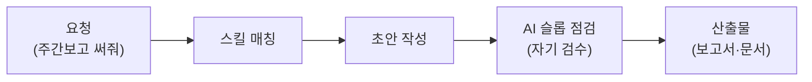

혼자 일하는 사업자에게 가장 아쉬운 존재는 화려한 전문가가 아니라, 옆자리에서 궂은 실무를 같이 쳐내 주는 든든한 동료입니다. 코워커는 바로 그 "옆자리 동료" 포지션의 직원입니다. 주간보고를 써야 하는데 한 주가 기억나지 않을 때, 제안서 마감이 코앞일 때, 까다로운 동료와의 대화를 준비해야 할 때 — 특정 직무로 분류하기 애매한 비즈니스 실무 전반을 받아 줍니다.

브랜드 아이덴티티 정리, B2B 제안서, 임원용 1페이지 요약, 회의 진행 설계, 1:1 협상 준비, SOP(표준 운영 절차 — 반복 업무를 누구나 따라 할 수 있게 적은 매뉴얼) 문서화까지 25종의 스킬을 갖추고 있습니다. 작가·마케터·법무처럼 전문 영역이 뚜렷한 일은 각 전문가 직원에게 분리되었고, 코워커는 그 사이를 잇는 범용 코어를 담당합니다. DART(전자공시시스템) MCP(클로드가 외부 서비스와 연결되는 표준 통로) 연동으로 기업 공시 데이터도 참조할 수 있습니다.

스킬 이름을 외울 필요는 없습니다. "주간보고 써줘", "회의 아젠다 짜줘"처럼 평소 말투로 요청하면 매칭되는 스킬이 자동으로 호출됩니다.

## 스킬 카탈로그

비즈니스 문서(business-\*)와 범용 도구(general-\*)로 구성됩니다. 전체 목록은 아래 표에서 확인하세요.



## 에이전트

모두의 클로드 직원 다수는 산출물을 만드는 실행 직원(worker)과 결과를 의심하며 검사하는 검수 직원(auditor)을 분리해 둡니다. 코워커는 범용 코어 특성상 별도 에이전트 없이 스킬 단위로 동작하며, 품질 점검은 `general-ai-slop-reviewer` 같은 후처리 스킬이 맡습니다.



## 대표 시나리오 3선

**1. 주간업무보고 10분 컷.** 금요일 오후, "이번 주 한 일 정리해서 주간보고 만들어줘. 톤은 격식체로"라고 요청합니다. `business-productivity-weekly-report` 스킬이 성과·진행 중 업무·이슈·다음 주 계획 틀로 초안을 만들어 줍니다.

**2. B2B 제안서 초안.** "이 RFP 보고 제안서 본문 써줘"라고 하면 `business-proposal-writer`가 12섹션 표준 목차(표지부터 가격·리스크·부록까지)로 컴플라이언스를 지킨 초안을 뽑아 줍니다. 사람이 할 일은 회사 고유 정보와 가격 검토입니다.

**3. 어려운 대화 준비.** "자꾸 일을 떠넘기는 동료가 있는데 내일 면담에서 어떻게 말하지?"라고 물으면 `business-conflict-handler`와 `business-negotiation-1on1`이 감정과 사안을 분리한 대화 설계를 제안합니다.

**잘 안 될 때** — 결과물이 너무 "AI 티"가 나면 "AI 티 나는 부분 고쳐줘"라고 이어서 요청하세요. `general-ai-slop-reviewer`가 기계적 패턴을 잡아 자연스럽게 다듬습니다.

## MCP 연동

- **dart** — 금융감독원 전자공시(DART)에서 기업 공시·재무 정보를 조회합니다. 공개 데이터 기반이라 별도 자격증명 없이도 기본 조회가 가능하지만, API 키 설정이 필요한 구성이라면 발급받은 키를 환경변수로 넣어 주세요.
