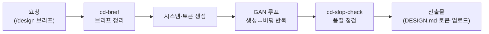

"디자인 감각이 없어서요"라는 말 뒤에는 대개 감각의 문제가 아니라 체계의 부재가 있습니다. 색은 어떤 기준으로 고르고, 버튼 모서리는 왜 그 값이어야 하는지 — 좋은 디자인은 규칙의 집합이고, 그 규칙을 문서로 만든 것이 디자인 시스템입니다. 디자이너 직원은 이 규칙을 세우고 지키게 하는 직원입니다. 인테리어로 치면 벽지 한 장을 골라 주는 사람이 아니라, 집 전체의 컬러·자재·조명 기준표를 만들어 어떤 방을 꾸며도 톤이 맞게 해 주는 설계사입니다.

스킬 13종의 중심에는 두 축이 있습니다. 하나는 **Claude Design 연동**(cd-\*) — 브리프 작성부터 프롬프트 빌드, 결과물 업로드, 슬롭 체크(AI 특유의 어색한 디자인 패턴 점검)까지 Claude의 디자인 도구와 오가는 파이프라인입니다. 다른 하나는 **토큰 파이프라인** — 디자인 토큰(색·글꼴·간격 같은 디자인 값을 변수로 정리한 것)을 DTCG 표준↔CSS↔shadcn 3계층으로 변환해, 디자인 결정이 코드까지 일관되게 흐르게 합니다. 여기에 GAN 품질 루프(생성과 비평을 반복해 완성도를 끌어올리는 반복 개선 방식)가 얹힙니다.

`/design`으로 브리프부터 시작하고 `/upload`로 Claude Design 업로드까지 이어지는 명령형 진입점을 제공합니다.

## 스킬 카탈로그

cd-\*(Claude Design 연동)와 design-\*/moai-\*(시스템·토큰·워크플로우) 계열의 전체 목록입니다.



## 에이전트

디자이너는 별도의 worker/auditor 에이전트 대신 **GAN 품질 루프 스킬**(moai-workflow-gan-loop)이 검수 역할을 겸합니다. 생성한 시안을 비평자 관점으로 다시 뜯어보고 고치는 반복이 스킬 파이프라인 안에 내장되어 있는 구조입니다.



## 대표 시나리오 3선

**1. 브랜드 디자인 시스템 만들기.** "우리 브랜드 컬러랑 폰트 기준 잡아줘"라고 하면 `moai-domain-brand-design`과 `cd-system-prep`이 브랜드 시스템 문서(DESIGN.md)를 만들어, 이후 어떤 산출물이든 같은 톤을 유지하게 합니다.

**2. 디자인 토큰을 코드로.** "이 디자인 토큰을 우리 웹사이트 CSS로 변환해줘"라고 요청하면 `design-tokens-transformer`가 DTCG 표준 토큰을 CSS 변수와 shadcn 테마로 변환합니다. 디자이너와 개발자 사이의 수작업 전달이 사라집니다.

**3. Claude Design 왕복 작업.** `/design`으로 브리프를 정리해 Claude Design에서 시안을 만들고, 결과를 `cd-handoff-reader`로 읽어 와 `cd-slop-check`로 어색한 부분을 점검한 뒤 `/upload`로 다시 올리는 왕복 루프를 돕습니다.



**잘 안 될 때** — 시안 톤이 계속 흔들리면 브리프를 건너뛰고 바로 생성부터 시작했을 가능성이 큽니다. `cd-brief`로 타깃·톤·금지 요소를 먼저 못 박은 뒤 생성 단계로 넘어가세요.
