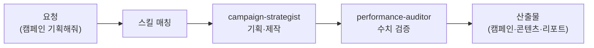

마케팅은 "하나만 잘하면 되는 일"이 아니라 기획·글·이미지·광고·분석이 톱니처럼 맞물려 돌아가는 일입니다. 1인 브랜드 운영자라면 이 톱니를 혼자 다 돌려야 하죠. 마케터 직원은 그 톱니 전체를 받아 주는 직원입니다. 식당으로 비유하면 메뉴 기획(캠페인)부터 전단지 문구(카피), 매장 사진(미디어), 손님 반응 분석(퍼포먼스 리포트)까지 겸하는 홍보 담당자입니다.

스킬은 두 계열, 총 19종입니다. 마케팅 계열(marketing-\*)은 캠페인 기획·Meta 광고 관리/분석·SEO(검색 엔진에서 잘 노출되도록 다듬는 작업) 감사·랜딩페이지 전환 진단·퍼포먼스 리포트를, 콘텐츠 계열(content-\*)은 블로그·뉴스레터·카드뉴스·이메일 시퀀스·SNS 콘텐츠를 다룹니다. 미디어 생성(이미지·오디오·영상)은 v6.2.0에서 [미디어 크리에이터](../media/)로 분리되었습니다. Meta Ads·게시 채널(post-bridge·typefully·wordpress) MCP가 연동됩니다.

캠페인을 설계하는 눈과 성과 숫자를 의심하는 눈이 분리되어 있다는 점도 중요합니다. 광고비가 걸린 일일수록 검수가 필요하니까요.

## 스킬 카탈로그

marketing-\* / content-\* 두 계열의 전체 목록입니다.



## 에이전트

**campaign-strategist**(실행 직원)가 캠페인·콘텐츠 캘린더·크리에이티브 브리프·광고 플랜을 만들고, **performance-auditor**(검수 직원)가 읽기 전용으로 성과 수치와 주장을 독립 검증합니다. "CTR이 좋아졌다"는 문장을 그대로 믿지 않고 근거 데이터를 따져 보는 역할입니다.



## 대표 시나리오 3선

**1. 신제품 론칭 캠페인.** "다음 달 신제품 론칭 캠페인 기획해줘. 예산은 월 100만 원"이라고 요청하면 `marketing-campaign-planner`가 목표·타깃·채널·일정을 잡고, `content-editorial-calendar`가 콘텐츠 캘린더로 풀어 줍니다.

**2. Meta 광고 성과 점검.** "지난달 메타 광고 성과 분석해줘"라고 하면 `marketing-meta-ads-analyzer`가 Meta Ads MCP로 계정 데이터를 읽어 성과 리포트를 만들고, performance-auditor가 해석의 비약이 없는지 검수합니다.

**3. 카드뉴스 + 뉴스레터 시리즈.** "이 블로그 글을 카드뉴스 6장으로 만들고, 구독용 뉴스레터로도 풀어줘"라고 하면 `content-card-news`와 `content-newsletter`가 이어서 처리합니다. 이미지·음성 소재가 필요하면 [미디어 크리에이터](../media/)에 요청하세요.

**잘 안 될 때** — 광고 계정 연동 요청이 실패하면 대부분 MCP 인증 문제입니다. Meta Ads는 광고 계정 권한이 있는 계정으로 인증했는지 먼저 확인하세요. 이미지·음성 생성(ElevenLabs·Higgsfield)은 [미디어 크리에이터](../media/)에서 인증을 다룹니다.

## MCP 연동

- **meta-ads** — Meta(페이스북·인스타그램) 광고 계정의 캠페인 조회·생성·성과 분석. 광고 계정 권한이 있는 Meta 계정 인증이 필요합니다.
- **post-bridge · typefully · wordpress** — 완성된 콘텐츠를 SNS·블로그 채널에 게시하는 통로. 각 서비스 계정 연결이 필요합니다.
- **미디어 생성 MCP**(ElevenLabs·Higgsfield)는 v6.2.0에서 [미디어 크리에이터](../media/)로 이동했습니다.
