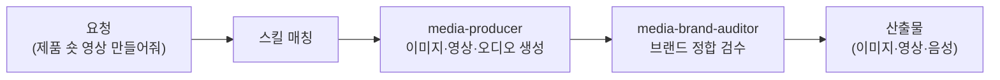

콘텐츠에 이미지·영상·음성이 들어가면 퀄리티가 확 달라집니다. 하지만 생성 도구마다 프롬프트 문법이 다르고, 계정도 따로입니다. 미디어 크리에이터는 이 멀티모달 생성을 한 직원 안에 모아 둔 역할입니다. 스튜디오의 크리에이티브 디렉터처럼, 무엇을 만들지 정하고 알맞은 도구를 골라 호출합니다.

스킬은 10종입니다. Higgsfield 계열(media-higgsfield-*)은 이미지·영상 생성을, 오디오 계열(media-audio-gen)은 ElevenLabs 음성 생성을, 프롬프트 빌더 계열(media-gpt-image-2 / media-gemini-3 / media-midjourney-v8 / media-codex-image)은 각 모델에 맞춘 완성 프롬프트를 만들어 줍니다. v6.2.0에서 마케터로부터 미디어 생성 도메인이 분리되어 신설되었습니다. Higgsfield·ElevenLabs MCP가 연동됩니다.

브랜드 톤과 시각 일관성이 중요한 작업인 만큼, 산출물이 브랜드에 맞는지 검수하는 직원이 붙어 있습니다.

## 스킬 카탈로그

media-* 계열 생성 스킬의 전체 목록입니다.



## 에이전트

**media-producer**(실행 직원)가 이미지·영상·오디오를 생성하고, **media-brand-auditor**(검수 직원)가 산출물이 브랜드 톤·일관성 기준에 맞는지 검수합니다.



## 대표 시나리오 3선

**1. Higgsfield 시네마틱 숏.** "이 제품 15초 시네마틱 숏으로 만들어줘"라고 하면 `media-higgsfield-video`가 Higgsfield MCP로 영상을 생성합니다. 사전에 예상 크레딧을 고지합니다.

**2. 이미지 프롬프트 빌드.** "이 캠페인 키비주얼을 GPT-image와 Midjourney용 프롬프트로 뽑아줘"라고 하면 `media-gpt-image-2-prompt`·`media-midjourney-v8-prompt`가 각 모델에 맞춘 완성 프롬프트를 제공합니다.

**3. 음성 광고 제작.** "20초 음성 광고 스크립트 음성으로 만들어줘"라고 하면 `media-audio-gen`이 ElevenLabs로 음성을 생성합니다.

**잘 안 될 때** — Higgsfield 생성 실패 시 프롬프트 온리 폴백으로 전환합니다. OAuth 인증은 [Higgsfield MCP 설정](/plugins/higgsfield-setup/)을 참고하세요.

## MCP 연동

- **higgsfield** — 이미지·영상 생성. Higgsfield OAuth 인증이 필요합니다 ([설정 가이드](/plugins/higgsfield-setup/)).
- **ElevenLabs** — 텍스트 음성 변환·보이스 클로닝. ElevenLabs API 키가 필요합니다.
