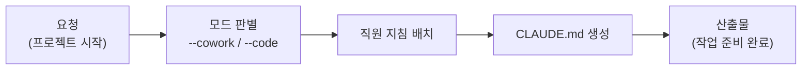

새 프로젝트를 시작할 때 가장 어려운 것은 일 자체가 아니라 "무엇부터 세팅해야 하지?"라는 질문입니다. PM은 바로 그 질문을 대신 받아 주는 직원입니다. 이사 갈 때 짐을 직접 나르기 전에 이사 업체 팀장이 먼저 와서 "어느 방 짐부터, 어떤 순서로"를 잡아 주는 것처럼, PM은 프로젝트 폴더에 어떤 직원(플러그인)의 지침을 깔고 어떤 워크플로우를 쓸지 먼저 정리해 줍니다.

PM은 두 가지 모드로 일합니다. `--cowork` 모드는 개발을 제외한 모든 협업 프로젝트용으로, 전 직원 지침 설정과 `.claude/agents/` 커스텀 에이전트, CLAUDE.md(클로드가 프로젝트마다 읽는 지침 파일) 워크플로우까지 생성하고 스스로 개선해 나갑니다. `--code` 모드는 코더의 개발 환경 셋업을 담당합니다. 비개발자도 자연어 한마디로 프로젝트를 시작할 수 있게 하는 것이 존재 이유입니다.

스킬은 단 하나(`project`)뿐이지만, 이 하나가 나머지 14명의 직원을 배치하는 관문 역할을 합니다. 그래서 팀의 "허브"라고 부릅니다.

## 스킬 카탈로그

PM의 스킬 목록은 아래와 같습니다. 스킬 이름을 몰라도 됩니다 — "프로젝트 시작하고 싶어"라고 말하면 자동으로 매칭됩니다.



## 에이전트

PM은 라우팅 허브이므로 별도의 실행 직원(worker)·검수 직원(auditor) 에이전트를 두지 않습니다. 실제 작업은 배치된 각 직원 플러그인의 에이전트가 수행합니다. 다른 직원 페이지에서 worker/auditor 구조를 확인해 보세요.



## 대표 시나리오 3선

**1. 비개발자의 첫 프로젝트.** 온라인 강의를 준비하는 강사가 "강의 준비 프로젝트 시작하고 싶어"라고 말합니다. PM이 `--cowork` 모드로 폴더에 튜터·마케터 지침과 워크플로우를 깔아 주고, 이후에는 "커리큘럼 짜줘" 같은 요청이 바로 튜터에게 연결됩니다.

**2. 여러 직원을 함께 쓰는 세팅.** 쇼핑몰 운영자가 "셀러랑 CS랑 마케터 같이 쓸 거야"라고 요청하면, PM이 세 직원의 역할 분담이 담긴 CLAUDE.md를 생성해 요청이 서로 엉키지 않게 정리합니다.

**3. 개발 환경 부트스트랩.** "코딩 프로젝트 셋업해줘"라고 하면 `--code` 모드로 코더의 개발 방법론(SPEC plan/run/sync) 환경을 구성합니다.

설치가 잘 됐는지 확인하려면 Claude Code에서 `/project`를 입력했을 때 명령이 인식되는지 보면 됩니다.



**잘 안 될 때** — `/project`가 인식되지 않으면 마켓플레이스 등록(`/plugin marketplace add`)과 플러그인 설치가 끝났는지 먼저 확인하세요. 설치 절차는 [플러그인 가이드](/plugins/)에 있습니다.
