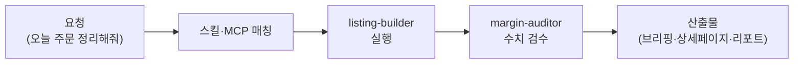

온라인 쇼핑몰 운영자의 하루는 잘게 쪼개져 있습니다. 아침에 주문·문의 확인, 낮에는 상세페이지와 광고, 저녁에는 정산과 재고. 어느 하나 어렵지는 않은데 전부 합치면 하루가 사라지죠. 셀러 직원은 이 쪼개진 하루를 대신 받아 주는 매장 매니저입니다. 오프라인 가게의 "믿고 맡기는 부점장"이 온라인으로 온 셈입니다.

가장 큰 특징은 실제 판매 채널과의 직접 연동입니다. 네이버 스마트스토어·아임웹·카페24 세 플랫폼의 MCP(클로드가 외부 서비스와 연결되는 표준 통로) 서버가 포함되어 있어, 말로 요청하면 실제 주문 조회·상품 수정·문의 답변까지 이어집니다. 여기에 상세페이지 기획/카피, 쿠팡 광고 최적화, 마진 계산, 시즌 캘린더, 재구매 타이밍 설계 같은 커머스 실무 스킬 29종이 얹혀 있습니다. 고객 문의 응대·VOC 분석은 [CS매니저](../cs/)로 분리되어 있으니 함께 쓰면 좋습니다.

주문·상품처럼 돈이 오가는 데이터를 다루는 만큼, 수치를 의심하는 검수 직원이 따로 붙어 있습니다.

## 스킬 카탈로그

commerce-\* 계열 29종의 전체 목록입니다.



## 에이전트

**listing-builder**(실행 직원)가 상세페이지·마켓플레이스 리스팅·스토어 운영 작업을 수행하고, **margin-auditor**(검수 직원)가 읽기 전용으로 리스팅과 마진 계산을 독립 검증합니다. "이 가격이면 남는 장사인가"를 만든 사람이 아닌 다른 눈이 다시 계산하는 구조입니다.



## 대표 시나리오 3선

**1. 아침 브리핑.** "오늘 매장 상황 브리핑해줘"라고 하면 `commerce-morning-brief`가 스마트스토어 MCP로 신규 주문·문의·배송 지연을 모아 아침 회의 자료처럼 정리해 줍니다.

**2. 상세페이지 리뉴얼.** "이 제품 상세페이지 다시 기획해줘"라고 요청하면 `commerce-detail-page-planner` → `commerce-detail-page-copy` → `commerce-detail-page-image` 순서로 구조·카피·이미지 기획이 나오고, `commerce-marketing-compliance-kr`이 한국 광고 표시 규정 위반 소지를 점검합니다.

**3. 쿠팡 광고 최적화.** "쿠팡 광고 수익률이 안 나와"라고 하면 `commerce-coupang-ad-optimizer`가 키워드·입찰 구조를 진단하고, `commerce-margin-calculator`가 광고비 포함 실마진을 다시 계산해 줍니다.

**잘 안 될 때** — 채널 연동 오류의 대부분은 자격증명 문제입니다. 스마트스토어는 `smartstore_test_connection` 도구로 인증부터 확인하고, 아임웹·카페24는 API 키/OAuth 앱 설정이 유효한지 점검하세요.

## MCP 연동

- **moai-smartstore** — 네이버 커머스 API. 상품·주문·문의·정산·통계 조회와 처리. 환경변수(NAVER_COMMERCE_CLIENT_ID/SECRET/ACCOUNT_ID)에 커머스API센터에서 발급한 자격증명이 필요합니다.
- **moai-imweb** — 아임웹 OPEN API v3. 주문·상품·회원·프로모션·결제 등 8개 카테고리. 아임웹 관리자에서 발급한 OAuth 자격증명이 필요합니다.
- **moai-cafe24** — 카페24 Admin API + Analytics. 상품·주문·고객·프로모션·통계 등 쇼핑몰 운영 전반. 카페24 개발자센터 앱 자격증명이 필요합니다.

자격증명은 채팅에 직접 붙여 넣지 말고 환경변수나 설정 파일로 관리하세요. 채팅에 노출된 키는 반드시 재발급(rotate)하는 것이 안전합니다.
