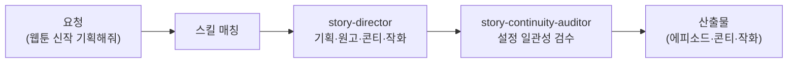

한 명의 창작자가 기획·원고·콘티·캐릭터·표지를 다 하는 건 현실적으로 벅찹니다. 스토리 크리에이터는 웹툰·웹소설·영상 시나리오 창작의 파이프라인을 한 직원 안에 모아 둔 역할입니다. 출판사의 편집장 겸 기획자처럼, 장르와 단계에 맞춰 다음 작업을 이어갑니다.

스킬은 13종입니다. 기획 계열(story-synopsis·story-screenplay·story-webtoon-planner·story-project)은 줄거리·시나리오·에피소드 설계를, 생성 계열(story-webtoon-art·story-conti·story-ad-conti·story-character-sheet·story-cover-art·story-previz)은 Higgsfield MCP로 작화·콘티·캐릭터 시트·표지·프리비즈를 만듭니다. IP 사업화는 story-ip-pitch가 다룹니다. v6.2.0에서 작가(출판)로부터 스토리/IP 도메인이 분리되어 신설되었습니다. Higgsfield MCP가 연동됩니다.

장편일수록 설정 충돌이 문제인 만큼, 연재를 관통하는 설정(캐릭터·시점·사건) 일관성을 검수하는 직원이 붙어 있습니다.

## 스킬 카탈로그

story-* 계열 창작 스킬의 전체 목록입니다.



## 에이전트

**story-director**(실행 직원)가 장르 파이프라인을 설계하고 기획·원고·콘티·작화를 이끌고, **story-continuity-auditor**(검수 직원)가 캐릭터·시점·사건의 설정 일관성을 검수합니다.



## 대표 시나리오 3선

**1. 웹툰 에피소드 생성.** "로맨스 웹툰 1화 기획하고 콘티까지 만들어줘"라고 하면 `story-webtoon-planner`·`story-synopsis`로 에피소드를 설계하고 `story-conti`·`story-webtoon-art`로 콘티와 작화를 생성합니다.

**2. 캐릭터 시트 + 시네마틱 프리비즈.** "주인공 캐릭터 시트랑 30초 티저 프리비즈 만들어줘"라고 하면 `story-character-sheet`와 `story-previz`가 Higgsfield MCP로 일관된 캐릭터 작화와 프리비즈를 만듭니다.

**3. 웹소설 연재.** "이 설정으로 웹소설 3회분 원고 써줘"라고 하면 `story-webnovel-writer`가 연재 원고를 작성합니다.

**잘 안 될 때** — 작화·프리비즈 생성 실패 시 프롬프트 온리 폴백으로 전환합니다. Higgsfield OAuth는 [설정 가이드](/plugins/higgsfield-setup/)를 참고하세요.

## MCP 연동

- **higgsfield** — 캐릭터 작화·콘티·표지·시네마틱 프리비즈 생성. Higgsfield OAuth 인증이 필요합니다 ([설정 가이드](/plugins/higgsfield-setup/)).
