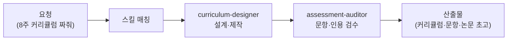

가르치는 일의 뒤편에는 보이지 않는 노동이 산더미입니다. 커리큘럼 짜기, 강의 자료 만들기, 시험 문항 출제, 수강생 후속 관리. 연구자라면 여기에 논문 검색과 초고 작성이 얹히죠. 튜터는 이 교육·연구의 뒤편 노동을 받아 주는 직원입니다. 학교로 치면 수업 준비를 함께하는 교육 조교이자, 연구실의 성실한 랩 어시스턴트입니다.

스킬 11종은 두 갈래입니다. 교육 설계 쪽은 커리큘럼 설계, 학습 자료 제작, 평가 문항(퀴즈·시험) 출제, 강좌 운영 매뉴얼, 수강 후 후속 시퀀스(수료 후 이어지는 안내 메일 흐름)를, 연구 쪽은 논문 검색, 논문 작성, 연구 보조, 연구비 신청서(grant) 작성을 다룹니다. 강사·교육 기획자뿐 아니라 배우는 쪽(학습 프로젝트 설계)도 지원해서, "이 주제를 3개월 안에 독학하고 싶어" 같은 요청도 받습니다.

교육 자료의 오류와 잘못된 인용은 배우는 사람에게 그대로 전염되기 때문에, 문항과 인용을 따로 검사하는 검수 직원이 붙습니다.

## 스킬 카탈로그

education-\* 계열 11종의 전체 목록입니다.



## 에이전트

**curriculum-designer**(실행 직원)가 커리큘럼·학습 자료·평가 문항을 설계하고, **assessment-auditor**(검수 직원)가 문항의 정답 오류, 난이도 배분, 학술 인용의 실재 여부를 독립 검증합니다. 특히 논문 인용은 "그럴듯한 가짜 출처"가 섞이기 쉬운 영역이라 이 검수 단계가 중요합니다.



## 대표 시나리오 3선

**1. 강좌 개설 준비.** "직장인 대상 엑셀 입문 8주 과정 만들어줘"라고 하면 `education-curriculum-designer`가 주차별 목표와 실습을 설계하고, `education-learning-material`이 자료를, `education-course-operations-manual`이 운영 매뉴얼을 만들어 줍니다.

**2. 시험 문항 출제.** "이 강의 자료로 중간 평가 20문항 출제해줘. 난이도 섞어서"라고 요청하면 `education-assessment-creator`가 문항과 해설을 만들고, assessment-auditor가 정답 오류와 중의적 표현을 걸러 냅니다.

**3. 논문 리서치와 초고.** "이 주제 관련 최근 연구 찾아서 선행연구 정리해줘"라고 하면 `education-paper-search`가 문헌을 찾고 `education-research-assistant`·`education-paper-writer`가 선행연구 정리와 초고 작성을 돕습니다.

**잘 안 될 때** — 커리큘럼이 너무 일반적으로 나오면 수강생 정보를 구체화하세요. "왕초보인지 중급인지, 주당 몇 시간 쓸 수 있는지, 최종 목표가 무엇인지" 세 가지만 알려 줘도 결과가 확 달라집니다. 논문 인용은 사용 전 원문 존재 여부를 반드시 직접 확인하세요.
