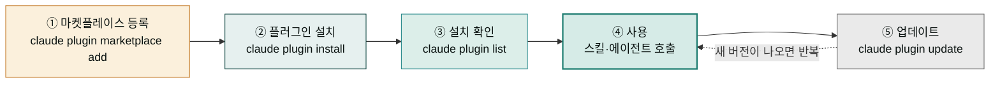

플러그인은 Claude에게 새로운 직무 능력을 붙여 주는 확장 꾸러미입니다. 스마트폰에 앱을 설치하면 없던 기능이 생기듯, Claude Code나 Claude Desktop에 플러그인을 설치하면 마케팅 캠페인 기획, 쇼핑몰 주문 관리, 계약서 검토 같은 전문 업무를 바로 시킬 수 있게 됩니다. 그리고 이런 플러그인을 받아오는 곳이 **마켓플레이스**입니다 — 앱스토어가 앱을 모아 두는 곳이라면, 마켓플레이스는 플러그인을 모아 두는 곳이라고 생각하면 정확합니다.

`모두의 코워크`가 운영하는 마켓플레이스(`modu-ai/moai-cowork`)에는 **18명의 AI 직원**이 올라와 있습니다. 실무 범용 코워커부터 작가·스토리 크리에이터, 마케터·미디어 크리에이터, 셀러, 사무관·데이터 애널리스트, 법무·재무세무·인사채용 담당, CS 매니저, 컨설턴트, 커리어 코치, 튜터, 디자이너, 개발 방법론(moai), 그리고 프로젝트 허브(PM)까지 — 각 플러그인이 한 명의 전문 직원처럼 자기 분야의 스킬과 에이전트, 필요하면 외부 서비스 연동(MCP)까지 갖추고 있습니다. 전부 설치할 필요는 없습니다. 회사에서 필요한 직무만 채용하듯, 필요한 직원만 골라 설치하면 됩니다.

이 섹션은 그 직원들을 **"어떻게 설치하고 부리나"**를 다루는 운용 매뉴얼입니다. 각 직원이 **"무엇을 하나"** — 어떤 스킬을 갖고 있고 어떤 일을 맡기면 좋은지 — 는 [에이전트 팀 소개](/moai-agents/) 섹션이 직원별 페이지로 안내합니다. 두 섹션을 오가며 읽으면 "누구를 뽑을지"와 "어떻게 부릴지"가 모두 잡힙니다.

## 플러그인 생애주기 한눈에 보기

플러그인 운용은 다섯 단계의 순환입니다. 마켓플레이스를 한 번 등록해 두면, 이후에는 설치 → 확인 → 사용 → 업데이트를 반복하게 됩니다.

## 이 섹션의 구성

| 순서 | 페이지 | 다루는 질문 |
|------|--------|------------|
| 1 | [설치와 관리](install/) | 마켓플레이스 등록부터 설치·확인·업데이트·제거까지, 터미널에서 무엇을 치는가? |
| 2 | [전문가 에이전트 이해](agents/) | 일하는 직원(worker)과 검수하는 직원(auditor)은 왜 나뉘어 있고, 어떻게 직접 호출하는가? |
| 3 | [팀 구성 패턴](teams/) | 직원 하나로 시작해서 여러 직원을 조합하는 실전 시나리오는 어떻게 짜는가? |

> 미디어 크리에이터·스토리 크리에이터의 생성형 스킬(이미지·영상)을 쓸 분은 [Higgsfield MCP 설정](higgsfield-setup/)에서 OAuth 인증(1회)을 먼저 확인하세요.

## 18-직원 패밀리 개요

마켓플레이스 `moai-cowork`(v6.2.0)에 등록된 18개 플러그인입니다. 이름이 곧 직무입니다.

| 플러그인 | 직무 | 한 줄 소개 |
|----------|------|-----------|
| `moai-coworker` | 🧑‍💼 코워커 | 브랜드·제안서·보고·협상 등 비즈니스 범용 실무 + 라이프스타일 |
| `moai-writer` | ✍️ 작가 | 출판 기획·집필·제안서, 한국어 인문화 윤문·맞춤법 검수 |
| `moai-story` | 📖 스토리 크리에이터 | 웹툰·웹소설·시나리오·콘티·캐릭터 시트 (Higgsfield 연동) |
| `moai-marketer` | 📣 마케터 | 캠페인 기획·퍼포먼스 분석·콘텐츠·광고 (Meta Ads·ElevenLabs) |
| `moai-media` | 🎬 미디어 크리에이터 | 이미지·영상·오디오 생성 (Higgsfield·ElevenLabs·GPT-image·Gemini·Midjourney) |
| `moai-seller` | 🛒 셀러 | 스마트스토어·아임웹·카페24 운영(MCP)·상세페이지·CRM |
| `moai-officer` | 📄 사무관 | HWPX·DOCX·XLSX·PPTX·PDF 한국형 오피스 문서·HTML 리포트 |
| `moai-analyst` | 📊 데이터 애널리스트 | 공공데이터·KOSIS·DART 조회, 데이터 시각화 (MCP 연동) |
| `moai-lawyer` | ⚖️ 법무 담당 | 계약 검토·컴플라이언스·법령/판례 리서치 (국가법령정보 연동) |
| `moai-accountant` | 💰 재무·세무 담당 | 재무제표 분석·결산·세금 절약·가계 예산 |
| `moai-recruiter` | 🤝 인사·채용 담당 | 채용 공고·이력서 스크리닝·오퍼레터·성과평가 (고용주 편) |
| `moai-cs` | 🎧 CS매니저 | 티켓 분류·응답 초안·VOC 분석·지식베이스 |
| `moai-consultant` | 💼 컨설턴트 | 사업계획서·시장 분석·정부 지원사업 매칭·상권분석 |
| `moai-career` | 🧭 커리어코치 | 이력서·포트폴리오 첨삭, 면접 준비, 이직 전략 (구직자 편) |
| `moai-tutor` | 🎓 튜터 | 커리큘럼 설계·평가 문항·논문 검색/작성 |
| `moai-designer` | 🎨 디자이너 | Claude Design 연동, 토큰 파이프라인, 브랜드 시스템 |
| `moai` | 💻 코더 | SPEC plan→run→sync 개발 사이클 무설치 플러그인 |
| `moai-pm` | 🚀 PM | `/project` 명령으로 프로젝트 단위 셋업·직원 배치 |

각 직원의 스킬 목록과 활용 예시는 [에이전트 팀 소개](/moai-agents/)의 직원별 페이지에서 확인하세요.

## 예전 페이지를 찾아오셨다면

이 섹션은 과거 "플러그인 카탈로그"(chat / cowork / design / code 4-카테고리 시절)를 대체합니다. `moai-cowork` 단일 통합 플러그인(171스킬)은 v6.0.0에서 전문가 플러그인으로 분화되었고, v6.2.0에서 스토리·미디어·데이터 애널리스트가 추가되어 18종 패밀리로 자리 잡았으며, 예전 하위 페이지 URL(`/plugins/cowork/` 등)은 모두 이 페이지로 리다이렉트됩니다. 옛 문서에서 보던 스킬들은 이름이 바뀌지 않은 채 담당 직원 플러그인으로 이사했다고 생각하면 됩니다.

## 다음 단계

- **처음이라면** → [설치와 관리](install/)에서 마켓플레이스 등록부터 따라 하세요.
- **설치는 끝났고 부리는 법이 궁금하다면** → [전문가 에이전트 이해](agents/)로 가세요.
- **여러 직원을 묶어 프로젝트를 돌리고 싶다면** → [팀 구성 패턴](teams/)을 읽으세요.
- **누구를 뽑을지 고민 중이라면** → [에이전트 팀 소개](/moai-agents/)에서 직원별 소개를 먼저 보세요.

---

### Sources

- 마켓플레이스 진실 원본: [`/.claude-plugin/marketplace.json`](https://github.com/modu-ai/moai-cowork/blob/main/.claude-plugin/marketplace.json) (18 plugins, v6.2.0)
- Claude Code 플러그인 공식 문서: <https://code.claude.com/docs/en/plugins>
