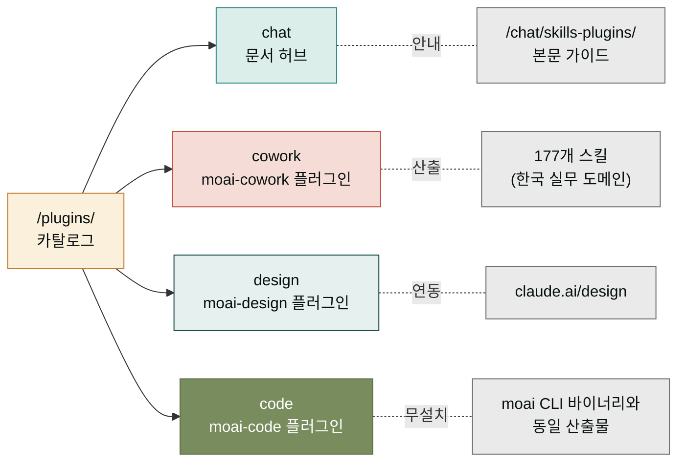

## 4개 카테고리로 정리된 플러그인 세계

이 페이지는 `모두의 클로드` 사이트가 다루는 **네 개의 플러그인 카테고리**를 한눈에 보여주는 카탈로그입니다. 과거(2026년 6월 이전)에는 28개의 개별 플러그인이 늘어선 목록이었으나, [SPEC-MOC-PLUGIN-REMEDIATION-001](https://github.com/modu-ai)을 거치며 실제 마켓플레이스(`.claude-plugin/marketplace.json`)에 존재하는 3개의 빌드 플러그인(moai-cowork, moai-design, moai-code) 기준으로 정리되었고, Chat 사용자를 안내하는 문서 허브(chat)가 넷째 카테고리로 추가되었습니다. 이 정리는 SPEC-MOC-SITE-IA-001의 정보구조(IA) 개편 결과입니다.

네 카테고리는 `모두의 클로드` 사이트의 제품 축과 일대일로 대응됩니다. Chat은 데스크탑·웹 채팅 환경, Cowork는 한국 실무 자동화, Design은 Claude Design과의 연동, Code는 Claude Code 기반의 개발 방법론입니다. 사용자가 어느 제품에서 왔는지에 따라 자연스럽게 해당 카테고리로 안내되도록 배치되어 있습니다.

## 왜 4개인가 — 제품 축과 플러그인 카테고리의 일대일 대응

플러그인 카테고리 개수가 4개인 이유는 사이트가 다루는 Claude 제품 라인이 4개이기 때문입니다. 세 개는 빌드된 설치형 플러그인이고, 한 개(chat)는 빌드된 플러그인은 아니지만 Chat 사용자가 자주 묻는 "스킬·플러그인 어떻게 쓰나요?" 질문을 받아 `/chat/skills-plugins/` 본문으로 안내하는 문서 허브입니다. Chat은 별도의 Chat 전용 빌드 플러그인 없이도 스킬 체계를 통해 확장되도록 설계되었기 때문에, 이 넷째 카테고리는 빌드 플러그인이 아닌 **안내 관문** 역할을 합니다.

### chat — 문서 허브 (빌드 플러그인 아님)

Chat(데스크탑·웹)에서 스킬과 플러그인을 어떻게 켜고 쓰는지 안내하는 허브. Chat 전용 설치형 플러그인은 없지만, 스킬 체계와 cowork 플러그인을 통해 확장됩니다. → [`/plugins/chat/`](/plugins/chat/)

### cowork — moai-cowork 플러그인 (한국 실무 177스킬)

사업·이커머스·마케팅·콘텐츠·법률·재무·HR·교육·디자인·미디어·오피스 도메인의 스킬 177개를 하나로 묶은 통합 플러그인. 한국 실무 패턴에 특화. 버전 3.0.0. → [`/plugins/cowork/`](/plugins/cowork/)

### design — moai-design 플러그인 (에이전틱 디자인)

Claude Design과 짝을 이루는 디자인 플러그인. 브리프 작성, 브랜드 컨텍스트 주입, DTCG 토큰 생성, GAN 품질 루프를 11개 스킬로 묶음. 버전 0.1.0. → [`/plugins/design/`](/plugins/design/)

### code — moai-code 플러그인 (무설치 개발 방법론)

moai CLI 바이너리 없이 Claude Code 안에서 SPEC plan → run → sync 개발 사이클을 그대로 쓸 수 있게 만든 무설치 플러그인. 13개 명령, 7개 에이전트, 28개 스킬. 마켓플레이스 이름 `moai`, 버전 3.0.0. → [`/plugins/code/`](/plugins/code/)

## 구 28-플러그인 목록에서 단일 통합으로

이전 문서에서 "28종 플러그인"으로 소개되던 구조는 2026년 6월 REMEDIATION 작업을 통해 단일 `moai-cowork` 플러그인(버전 3.0.0)으로 통합되었습니다. 따라서 `/plugins/moai-business/`, `/plugins/moai-marketing/` 같은 예전 URL은 이제 `/plugins/cowork/`로 리다이렉트됩니다. 이전 URL을 북마크해 둔 분들도 새 카테고리 페이지로 자연스럽게 도착할 수 있도록, 모든 예전 경로에는 별칭(alias) 리다이렉트가 걸려 있습니다.

## 다음 단계

- **처음 Chat을 쓰는 분** → [`/plugins/chat/`](/plugins/chat/) → [`/chat/skills-plugins/`](/chat/skills-plugins/)
- **한국 실무 자동화가 필요한 분** → [`/plugins/cowork/`](/plugins/cowork/)
- **Claude Design과 작업하는 분** → [`/plugins/design/`](/plugins/design/)
- **Claude Code로 개발하는 분** → [`/plugins/code/`](/plugins/code/) → [`/cli/`](/cli/)

---

### Sources

- 마켓플레이스 진실 원본 (3플러그인): [`/.claude-plugin/marketplace.json`](https://github.com/modu-ai/claude.mo.ai.kr/blob/main/.claude-plugin/marketplace.json) (moai-cowork, moai, design)
- REMEDIATION 결정 (28 → 단일 통합): SPEC-MOC-PLUGIN-REMEDIATION-001 (`status: implemented`)
- 카테고리별 상세 페이지 — [`/plugins/chat/`](/plugins/chat/) · [`/plugins/cowork/`](/plugins/cowork/) · [`/plugins/design/`](/plugins/design/) · [`/plugins/code/`](/plugins/code/)
- IA 개편 원본: SPEC-MOC-SITE-IA-001 (이 페이지가 속한 SPEC)
