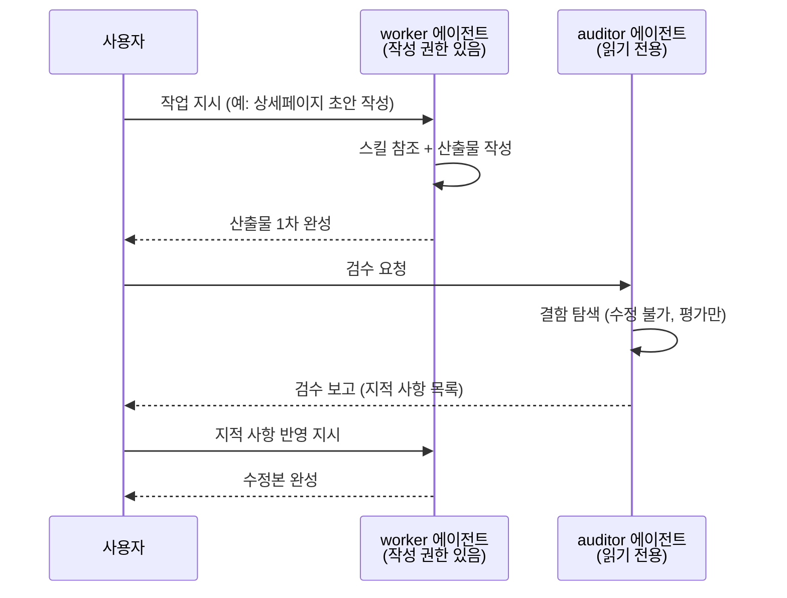

플러그인을 설치하면 스킬(업무 지식 문서)만 오는 것이 아니라 **에이전트**도 함께 옵니다. 에이전트는 Claude 안에서 특정 역할을 맡아 독립적으로 일하는 "분신"이라고 생각하면 됩니다. 여러분이 마케터 플러그인에게 캠페인 기획을 맡기면, 본체 Claude가 직접 다 하는 게 아니라 캠페인 기획을 전담하는 에이전트를 불러 일을 시키고 결과만 받아 오는 식입니다.

모두의 코워크 플러그인 패밀리의 에이전트에는 한 가지 중요한 설계 원칙이 있습니다. **일하는 직원(worker)과 검수하는 직원(auditor)이 분리**되어 있다는 점입니다. 회사에서 작성자와 결재자를 한 사람이 겸하지 않듯, 산출물을 만드는 에이전트와 그 품질을 평가하는 에이전트를 따로 두었습니다. 자기가 만든 결과물을 자기가 채점하면 후하게 주기 마련이라, 검수자는 처음부터 "결함을 찾는 눈"으로만 일하도록 만들어진 별도의 에이전트입니다.

이 분리는 말로만이 아니라 **도구 권한**으로 강제됩니다. worker 에이전트는 파일을 쓰고 고치는 도구(Write·Edit)를 갖지만 auditor 에이전트는 읽기·검색 도구만 갖는 경우가 대부분입니다. 검수자가 산출물을 몰래 고쳐서 "통과"시키는 일이 구조적으로 불가능하도록 권한 자체를 좁혀 둔 것입니다.

## 품질 루프 — worker와 auditor가 주고받는 흐름



이 루프를 한두 바퀴 돌리면 "그럴듯해 보이는 초안"이 "지적을 견딘 결과물"로 바뀝니다. 검수를 반드시 돌려야 하는 것은 아니지만 외부에 나가는 산출물(제안서, 광고 소재, 계약서 검토 의견 등)이라면 auditor 한 바퀴를 강하게 권합니다.

## 에이전트 직접 호출하는 법

평소에는 에이전트를 의식할 필요가 없습니다. 하지만 특정 에이전트를 지목해 부르고 싶을 때는 정해진 문형이 있습니다.

> **"OO 서브에이전트를 사용해서 ~해줘"**

예를 들면 이렇게 씁니다.

```text
캠페인 전략 worker 서브에이전트를 사용해서 신제품 런칭 캠페인 초안을 만들어줘.
```

```text
방금 만든 상세페이지를 auditor 서브에이전트를 사용해서 검수해줘.
```

각 플러그인이 어떤 이름의 worker·auditor 에이전트를 데리고 있는지는 [에이전트 팀 소개](/moai-agents/)의 직원별 페이지에 에이전트 카드로 정리되어 있습니다. 터미널에서는 `claude plugin details <이름>@moai-cowork` 출력의 에이전트 목록으로도 확인할 수 있습니다.

## 스킬 자동 매칭 vs 에이전트 명시 호출

플러그인을 부리는 방식은 두 가지이고, 상황에 따라 골라 쓰면 됩니다.

| 구분 | 스킬 자동 매칭 | 에이전트 명시 호출 |
|------|---------------|------------------|
| 쓰는 법 | 그냥 자연어로 일을 시킨다 | "OO 서브에이전트를 사용해서 ~" 문형 |
| 동작 | Claude가 요청 내용을 보고 알맞은 스킬·에이전트를 스스로 고름 | 지목한 에이전트가 반드시 그 일을 맡음 |
| 적합한 상황 | 일상 업무 대부분 — 무엇이 필요한지 Claude가 잘 고르는 경우 | 검수를 확실히 auditor에게 맡기고 싶을 때, 특정 전문 에이전트의 관점이 필요할 때 |

기본은 자동 매칭입니다. "스마트스토어 이번 주 주문 정리해줘"라고만 해도 셀러 플러그인의 스킬이 알아서 붙습니다. 명시 호출은 **품질 게이트를 확실히 걸고 싶은 순간**을 위한 수동 기어라고 생각하세요.

## 다음 단계

에이전트 한 명을 부리는 법을 익혔다면, 이제 여러 직원을 조합해 프로젝트를 굴리는 [팀 구성 패턴](../teams/)으로 넘어가세요. 각 직원의 에이전트 카드와 스킬 목록은 [에이전트 팀 소개](/moai-agents/)에서 확인할 수 있습니다.

---

### Sources

- Claude Code 서브에이전트 공식 문서: <https://code.claude.com/docs/en/sub-agents>
- 직원별 에이전트 카드: [`/moai-agents/`](/moai-agents/) (생성 데이터: `www/data/agent_teams.json`)
